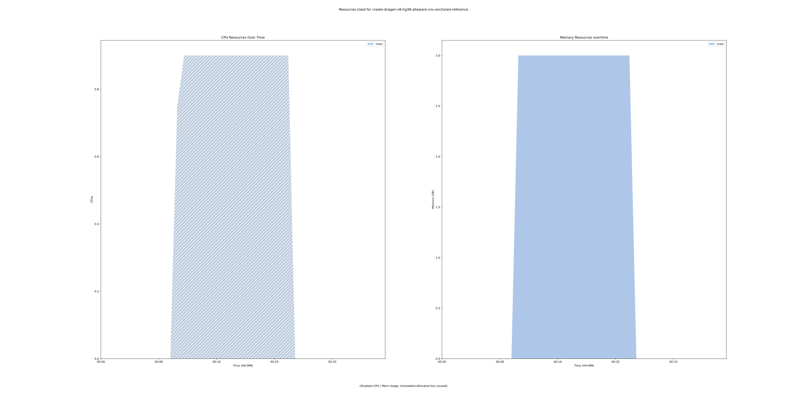
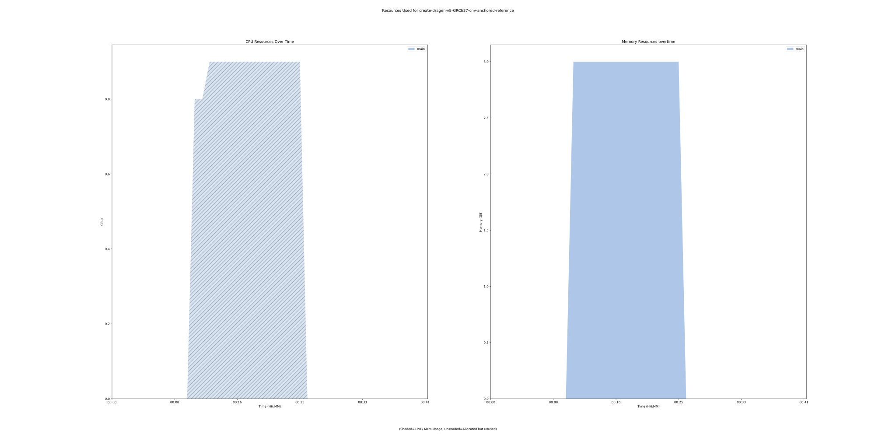

custom-create-umccr-dragen-refdata-tarball-from-illumina-tar 1.0.0 tool
=======================================================================

## Table of Contents
  
- [Overview](#custom-create-umccr-dragen-refdata-tarball-from-illumina-tar-v100-overview)  
- [Links](#related-links)  
- [Inputs](#custom-create-umccr-dragen-refdata-tarball-from-illumina-tar-v100-inputs)  
- [Outputs](#custom-create-umccr-dragen-refdata-tarball-from-illumina-tar-v100-outputs)  
- [ICA](#ica)  


## custom-create-umccr-dragen-refdata-tarball-from-illumina-tar v(1.0.0) Overview


  
> ID: custom-create-umccr-dragen-refdata-tarball-from-illumina-tar--1.0.0  
> md5sum: 3ff6cb9796c2b49fcb5ccacb4dba0db4

### custom-create-umccr-dragen-refdata-tarball-from-illumina-tar v(1.0.0) documentation
  
The Illumina Reference tarballs for the reference genome are currently tarbombs
(multiple files and directories exist in the top directory), rather than a single directory that matches the nameroot of the directory.
We also need to make sure that the reference name in the directory exists for Variant Interpreter to know which reference was used.

### Categories
  


## Related Links
  
- [CWL File Path](../../../../../../tools/custom-create-umccr-dragen-refdata-tarball-from-illumina-tar/1.0.0/custom-create-umccr-dragen-refdata-tarball-from-illumina-tar__1.0.0.cwl)  

  


## custom-create-umccr-dragen-refdata-tarball-from-illumina-tar v(1.0.0) Inputs

### output directory


  
> ID: output_directory
  
**Optional:** `False`  
**Type:** `string`  
**Docs:**  
The name of the output directory


### reference tar


  
> ID: reference_tar
  
**Optional:** `False`  
**Type:** `File`  
**Docs:**  
The reference tar ball

  


## custom-create-umccr-dragen-refdata-tarball-from-illumina-tar v(1.0.0) Outputs

### output compressed reference tar


  
> ID: custom-create-umccr-dragen-refdata-tarball-from-illumina-tar--1.0.0/output_compressed_reference_tar  

  
**Optional:** `False`  
**Output Type:** `File`  
**Docs:**  
The output compressed reference tar (that's not a tarbomb).
  

  


## ICA

### ToC
  
- [development_workflows](#project-development_workflows)  
- [production_workflows](#project-production_workflows)  


### Project: development_workflows


> wfl id: wfl.2e690932bedc4204b2bcb697bb249207  

  
**workflow name:** custom-create-umccr-dragen-refdata-tarball-from-illumina-tar_dev-wf  
**wfl version name:** 1.0.0  


#### Run Instances

##### ToC
  
- [Run wfr.3bf2bc688d0d442489cadfcdb2bf9842](#run-wfr3bf2bc688d0d442489cadfcdb2bf9842)  
- [Run wfr.f0f2f6f602e54d3ebcbc1837d1fc7074](#run-wfrf0f2f6f602e54d3ebcbc1837d1fc7074)  


##### Run wfr.3bf2bc688d0d442489cadfcdb2bf9842


  
> Run Name: create-dragen-v8-hg38-altaware-cnv-anchored-reference  

  
**Start Time:** 2021-08-31 09:16:38 UTC  
**Duration:** 2021-08-31 09:55:40 UTC  
**End Time:** 0 days 00:39:01  


###### Reproduce Run


```bash

# Run the submission template to create the workflow input json and launch script            
cwl-ica copy-tool-submission-template --ica-workflow-run-instance-id wfr.3bf2bc688d0d442489cadfcdb2bf9842

# Edit the input json file (optional)
# vim wfr.3bf2bc688d0d442489cadfcdb2bf9842.template.json 

# Run the launch script
bash wfr.3bf2bc688d0d442489cadfcdb2bf9842.launch.sh
                                    
```  


###### Run Inputs


```
{
    "output_directory": "hg38-v8-altaware-cnv-anchored",
    "reference_tar": {
        "class": "File",
        "location": "https://s3.amazonaws.com/use1-prd-seq-hub-appdata/Edico_v8/hg38_altaware-cnv-anchored.v8.tar"
    }
}
```  


###### Run Engine Parameters


```
{
    "workDirectory": "gds://wfr.3bf2bc688d0d442489cadfcdb2bf9842/create-dragen-v8-hg38-altaware-cnv-anchored-reference",
    "outputDirectory": "gds://development/reference-data/dragen_hash_tables/v8/hg38/altaware-cnv-anchored/",
    "tmpOutputDirectory": "gds://wfr.3bf2bc688d0d442489cadfcdb2bf9842/create-dragen-v8-hg38-altaware-cnv-anchored-reference/steps",
    "logDirectory": "gds://wfr.3bf2bc688d0d442489cadfcdb2bf9842/create-dragen-v8-hg38-altaware-cnv-anchored-reference/logs",
    "maxScatter": 32,
    "outputSetting": "move",
    "copyOutputInstanceType": "StandardHiCpu",
    "copyOutputInstanceSize": "Medium",
    "defaultInputMode": "'Download'",
    "inputModeOverrides": {},
    "tesUseInputManifest": "'auto'",
    "cwltool": "3.0.20201203173111",
    "engine": "1.17.0-202107161017-stratus-master"
}
```  


###### Run Outputs


```
{
    "output_compressed_reference_tar": {
        "location": "gds://development/reference-data/dragen_hash_tables/v8/hg38/altaware-cnv-anchored/hg38-v8-altaware-cnv-anchored.tar.gz",
        "basename": "hg38-v8-altaware-cnv-anchored.tar.gz",
        "nameroot": "hg38-v8-altaware-cnv-anchored.tar",
        "nameext": ".gz",
        "class": "File",
        "size": 7664401964,
        "http://commonwl.org/cwltool#generation": 0
    },
    "output_dir_gds_session_id": null,
    "output_dir_gds_folder_id": null
}
```  


###### Run Resources Usage
  

  
[](https://github.com/umccr/cwl-ica/raw/main/.github/catalogue/images/runs/tools/custom-create-umccr-dragen-refdata-tarball-from-illumina-tar/1.0.0/create-dragen-v8-hg38-altaware-cnv-anchored-reference__wfr.3bf2bc688d0d442489cadfcdb2bf9842.svg)  


##### Run wfr.f0f2f6f602e54d3ebcbc1837d1fc7074


  
> Run Name: create-dragen-v8-GRCh37-cnv-anchored-reference  

  
**Start Time:** 2021-09-01 02:07:19 UTC  
**Duration:** 2021-09-01 02:48:08 UTC  
**End Time:** 0 days 00:40:49  


###### Reproduce Run


```bash

# Run the submission template to create the workflow input json and launch script            
cwl-ica copy-tool-submission-template --ica-workflow-run-instance-id wfr.f0f2f6f602e54d3ebcbc1837d1fc7074

# Edit the input json file (optional)
# vim wfr.f0f2f6f602e54d3ebcbc1837d1fc7074.template.json 

# Run the launch script
bash wfr.f0f2f6f602e54d3ebcbc1837d1fc7074.launch.sh
                                    
```  


###### Run Inputs


```
{
    "output_directory": "GRCh37-v8-cnv-anchored",
    "reference_tar": {
        "class": "File",
        "location": "https://s3.amazonaws.com/use1-prd-seq-hub-appdata/Edico_v8/GRCh37-cnv-anchored.v8.tar"
    }
}
```  


###### Run Engine Parameters


```
{
    "workDirectory": "gds://wfr.f0f2f6f602e54d3ebcbc1837d1fc7074/create-dragen-v8-GRCh37-cnv-anchored-reference",
    "outputDirectory": "gds://development/reference-data/dragen_hash_tables/v8/GRCh37/GRCh37-cnv-anchored/",
    "tmpOutputDirectory": "gds://wfr.f0f2f6f602e54d3ebcbc1837d1fc7074/create-dragen-v8-GRCh37-cnv-anchored-reference/steps",
    "logDirectory": "gds://wfr.f0f2f6f602e54d3ebcbc1837d1fc7074/create-dragen-v8-GRCh37-cnv-anchored-reference/logs",
    "maxScatter": 32,
    "outputSetting": "move",
    "copyOutputInstanceType": "StandardHiCpu",
    "copyOutputInstanceSize": "Medium",
    "defaultInputMode": "'Download'",
    "inputModeOverrides": {},
    "tesUseInputManifest": "'auto'",
    "cwltool": "3.0.20201203173111",
    "engine": "1.17.0-202107161017-stratus-master"
}
```  


###### Run Outputs


```
{
    "output_compressed_reference_tar": {
        "location": "gds://development/reference-data/dragen_hash_tables/v8/GRCh37/GRCh37-cnv-anchored/GRCh37-v8-cnv-anchored.tar.gz",
        "basename": "GRCh37-v8-cnv-anchored.tar.gz",
        "nameroot": "GRCh37-v8-cnv-anchored.tar",
        "nameext": ".gz",
        "class": "File",
        "size": 7016023117,
        "http://commonwl.org/cwltool#generation": 0
    },
    "output_dir_gds_session_id": null,
    "output_dir_gds_folder_id": null
}
```  


###### Run Resources Usage
  

  
[](https://github.com/umccr/cwl-ica/raw/main/.github/catalogue/images/runs/tools/custom-create-umccr-dragen-refdata-tarball-from-illumina-tar/1.0.0/create-dragen-v8-GRCh37-cnv-anchored-reference__wfr.f0f2f6f602e54d3ebcbc1837d1fc7074.svg)  


### Project: production_workflows


> wfl id: wfl.925c7ba0199a4ad6bb5341a3cffd191d  

  
**workflow name:** custom-create-umccr-dragen-refdata-tarball-from-illumina-tar_prod-wf  
**wfl version name:** 1.0.0--cdc27e9  

  

