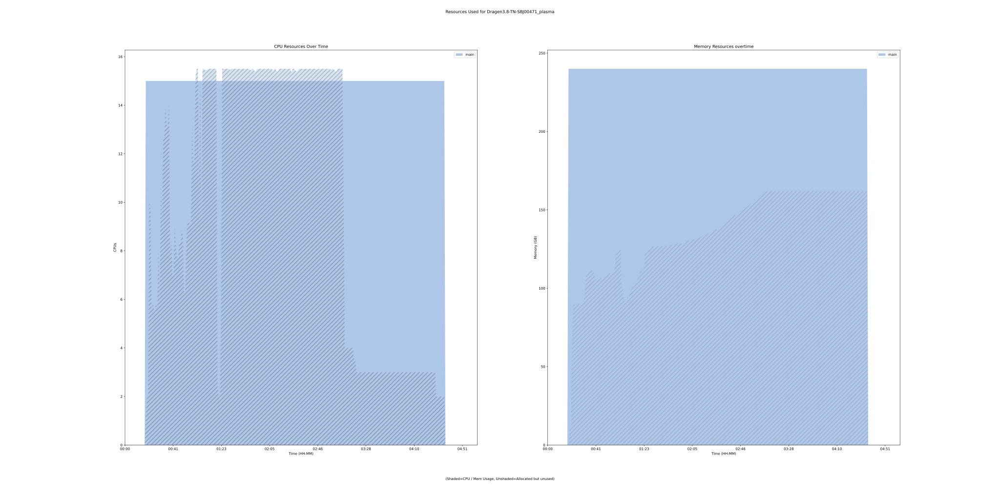
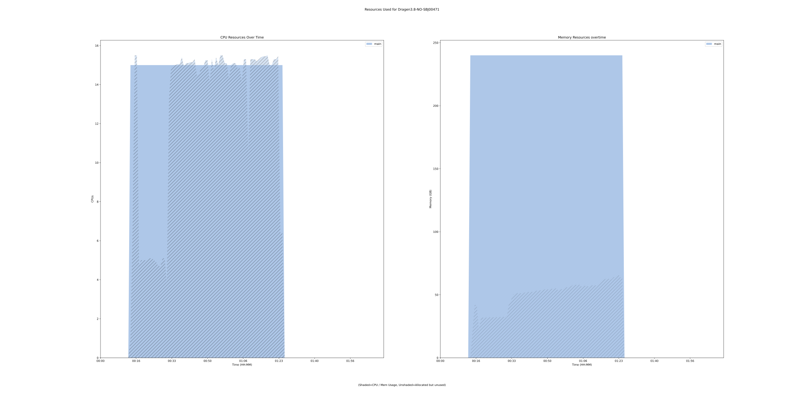
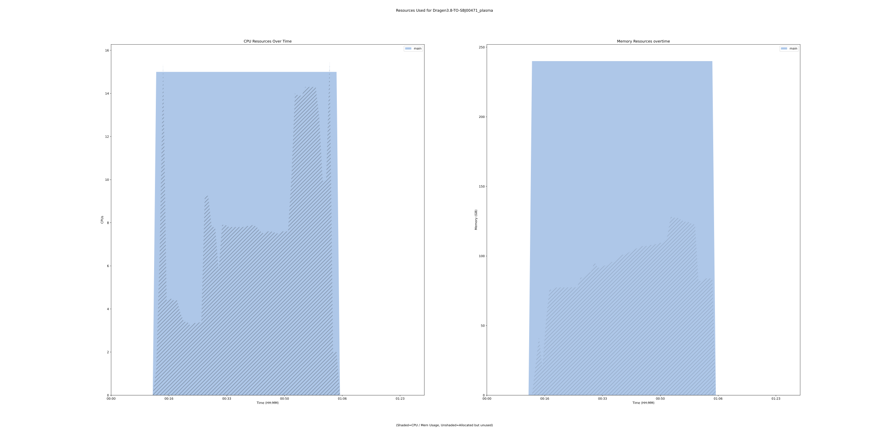

dragen-umi 3.8.4 tool
=====================

## Table of Contents
  
- [Overview](#dragen-umi-v384-overview)  
- [Links](#related-links)  
- [Inputs](#dragen-umi-v384-inputs)  
- [Outputs](#dragen-umi-v384-outputs)  
- [ICA](#ica)  


## dragen-umi v(3.8.4) Overview


  
> ID: dragen-umi--3.8.4  
> md5sum: dc23d9caf62b8c59f7210bf6262658c4

### dragen-umi v(3.8.4) documentation
  
DRAGEN can process data from whole genome and hybrid-capture assays with unique molecular identifiers (UMI).
This workflow can take forward, reverse and UMI tumor fastqs as inputs and perform the analysis in tumor-only mode.
In additon, BAM from tumor and normal samples can be used as an input to perform analysis in tumor-normal mode. 
More information on the documentation can be found [here](https://support-docs.illumina.com/SW/DRAGEN_v38/Content/SW/DRAGEN/UMIs_fDG.htm)

### Categories
  


## Related Links
  
- [CWL File Path](../../../../../../tools/dragen-umi/3.8.4/dragen-umi__3.8.4.cwl)  

  


## dragen-umi v(3.8.4) Inputs

### normal bam


  
> ID: bam_input
  
**Optional:** `True`  
**Type:** `File`  
**Docs:**  
Path to normal bam


### bin memory


  
> ID: bin_memory
  
**Optional:** `True`  
**Type:** `long`  
**Docs:**  
bin memory


### cnv normal b allele vcf


  
> ID: cnv_normal_b_allele_vcf
  
**Optional:** `True`  
**Type:** `File`  
**Docs:**  
Specify a matched normal SNV VCF.


### cnv normal cnv vcf


  
> ID: cnv_normal_cnv_vcf
  
**Optional:** `True`  
**Type:** `boolean`  
**Docs:**  
Specify germline CNVs from the matched normal sample.


### cnv population b allele vcf


  
> ID: cnv_population_b_allele_vcf
  
**Optional:** `True`  
**Type:** `File`  
**Docs:**  
Specify a population SNP catalog.


### cnv somatic enable het calling


  
> ID: cnv_somatic_enable_het_calling
  
**Optional:** `True`  
**Type:** `boolean`  
**Docs:**  
Enable HET-calling mode for heterogeneous segments.


### cnv use somatic vc vaf


  
> ID: cnv_use_somatic_vc_vaf
  
**Optional:** `True`  
**Type:** `boolean`  
**Docs:**  
Use the variant allele frequencies (VAFs) from the somatic SNVs to help select 
the tumor model for the sample. 


### dbsnp annotation


  
> ID: dbsnp_annotation
  
**Optional:** `True`  
**Type:** `File`  
**Docs:**  
In Germline, Tumor-Normal somatic, or Tumor-Only somatic modes,
DRAGEN can look up variant calls in a dbSNP database and add annotations for any matches that it finds there.
To enable the dbSNP database search, set the --dbsnp option to the full path to the dbSNP database
VCF or .vcf.gz file, which must be sorted in reference order.


### enable cnv calling


  
> ID: enable_cnv
  
**Optional:** `True`  
**Type:** `boolean`  
**Docs:**  
Enable CNV processing in the DRAGEN Host Software.


### enable duplicate marking


  
> ID: enable_duplicate_marking
  
**Optional:** `True`  
**Type:** `boolean`  
**Docs:**  
Enable the flagging of duplicate output
alignment records.


### enable map align output


  
> ID: enable_map_align
  
**Optional:** `True`  
**Type:** `boolean`  
**Docs:**  
Enables saving the output from the
map/align stage. Default is true when only
running map/align. Default is false if
running the variant caller.


### enable map align output


  
> ID: enable_map_align_output
  
**Optional:** `True`  
**Type:** `boolean`  
**Docs:**  
Enables saving the output from the
map/align stage. Default is true when only
running map/align. Default is false if
running the variant caller.


### enable sort


  
> ID: enable_sort
  
**Optional:** `True`  
**Type:** `boolean`  
**Docs:**  
The map/align system produces a BAM file sorted by 
reference sequence and position by default. 


### enable sv


  
> ID: enable_sv
  
**Optional:** `True`  
**Type:** `boolean`  
**Docs:**  
Enable/disable structural variant
caller. Default is false.


### fastq file1


  
> ID: fastq_file1
  
**Optional:** `True`  
**Type:** `File`  
**Docs:**  
FASTQ file to send to card (may be gzipped)


### fastq file2


  
> ID: fastq_file2
  
**Optional:** `True`  
**Type:** `File`  
**Docs:**  
Second FASTQ file with paired-end reads (may be gzipped - R3 fastq file)


### license instance id location


  
> ID: lic_instance_id_location
  
**Optional:** `True`  
**Type:** `['File', 'string']`  
**Docs:**  
You may wish to place your own in.
Optional value, default set to /opt/instance-identity
which is a path inside the dragen container


### min map quality


  
> ID: min_map_quality
  
**Optional:** `True`  
**Type:** `int`  
**Docs:**  
Filter reads with low mapping quanlity


### output directory


  
> ID: output_directory
  
**Optional:** `False`  
**Type:** `string`  
**Docs:**  
The directory where all output files are placed.


### output file prefix


  
> ID: output_file_prefix
  
**Optional:** `False`  
**Type:** `string`  
**Docs:**  
The prefix given to all output files.


### reference tar


  
> ID: reference_tar
  
**Optional:** `False`  
**Type:** `File`  
**Docs:**  
Path to ref data tarball.


### rgid


  
> ID: rgid
  
**Optional:** `True`  
**Type:** `string`  
**Docs:**  
The read group ID of the normal sample


### rgid tumor


  
> ID: rgid_tumor
  
**Optional:** `True`  
**Type:** `string`  
**Docs:**  
The read group ID of the tumor sample


### rgsm tumor


  
> ID: rgsm
  
**Optional:** `True`  
**Type:** `string`  
**Docs:**  
The sample name of the normal sample


### rgsm tumor


  
> ID: rgsm_tumor
  
**Optional:** `True`  
**Type:** `string`  
**Docs:**  
The sample name of the tumor sample


### sample sex


  
> ID: sample_sex
  
**Optional:** `True`  
**Type:** `[ male | female ]`  
**Docs:**  
Specifies the sex of a sample


### tumor bam


  
> ID: tumor_bam_input
  
**Optional:** `True`  
**Type:** `File`  
**Docs:**  
Path to tumor bam


### tumor fastq1


  
> ID: tumor_fastq1
  
**Optional:** `True`  
**Type:** `File`  
**Docs:**  
FASTQ file of tumor reads for somatic mode


### tumor fastq2


  
> ID: tumor_fastq2
  
**Optional:** `True`  
**Type:** `File`  
**Docs:**  
Second FASTQ file of tumor reads for somatic mode


### umi correction scheme


  
> ID: umi_correction_scheme
  
**Optional:** `True`  
**Type:** `[ lookup | random | none | positional ]`  
**Docs:**  
Describes the methodology to use for correcting sequencing errors in UMIs.


### umi correction table


  
> ID: umi_correction_table
  
**Optional:** `True`  
**Type:** `File`  
**Docs:**  
Enter the path to a customized correction table.


### umi emit multiplicity


  
> ID: umi_emit_multiplicity
  
**Optional:** `True`  
**Type:** `[ both | duplex | simplex ]`  
**Docs:**  
Set the consensus sequence type to output.
Default value is "both" that outputs both simplex and duplex sequences.


### umi enable


  
> ID: umi_enable
  
**Optional:** `True`  
**Type:** `boolean`  
**Docs:**  
To enable read collapsing, set the --umi-enable option to true. 
If using the --umi-library-type option, --umi-enable is not required.


### umi fastq


  
> ID: umi_fastq
  
**Optional:** `True`  
**Type:** `File`  
**Docs:**  
Path to R2 fastq file (UMI). Made optional to be able to use this 
file for normal samples as well (without UMIs)


### umi fuzzy window size


  
> ID: umi_fuzzy_window_size
  
**Optional:** `True`  
**Type:** `int`  
**Docs:**  
Collapses reads with matching UMIs and alignment positions up to the distance specified.


### umi library type


  
> ID: umi_library_type
  
**Optional:** `True`  
**Type:** `string`  
**Docs:**  
Value should be 'random-simplex' for our use case. 
Set the batch option for different UMIs correction


### umi metrics interval file


  
> ID: umi_metrics_interval_file
  
**Optional:** `True`  
**Type:** `File`  
**Docs:**  
Valid target BED file


### umi min spporting reads


  
> ID: umi_min_supporting_reads
  
**Optional:** `True`  
**Type:** `int`  
**Docs:**  
The number of matching UMI inputs reads required 
to generate a consensus read.


### umi nonrandom whitelist


  
> ID: umi_nonrandom_whitelist
  
**Optional:** `True`  
**Type:** `File`  
**Docs:**  
Provides the path to a file containing valid nonrandom UMIs sequences. Enter one path per line.


### umi source


  
> ID: umi_source
  
**Optional:** `True`  
**Type:** `string`  
**Docs:**  
Value should be 'fastq' if UMI info is in separate fastq file


### vc af call threshold


  
> ID: vc_af_call_threshold
  
**Optional:** `True`  
**Type:** `float`  
**Docs:**  
Set the allele frequency call threshold to emit a call in the VCF if the AF filter is enabled.
The default is 0.01.


### vc af filter threshold


  
> ID: vc_af_filter_threshold
  
**Optional:** `True`  
**Type:** `float`  
**Docs:**  
Set the allele frequency filter threshold to mark emitted VCF calls as filtered if the AF filter is
enabled.
The default is 0.05.


### vc callability normal thresh


  
> ID: vc_callability_normal_thresh
  
**Optional:** `True`  
**Type:** `int`  
**Docs:**  
The --vc-callability-normal-thresh option specifies the callability threshold for normal samples.
The somatic callable regions report includes all regions with normal coverage above the normal threshold.


### vc callability tumor thresh


  
> ID: vc_callability_tumor_thresh
  
**Optional:** `True`  
**Type:** `int`  
**Docs:**  
The --vc-callability-tumor-thresh option specifies the callability threshold for tumor samples. The
somatic callable regions report includes all regions with tumor coverage above the tumor threshold.


### vc decoy contigs


  
> ID: vc_decoy_contigs
  
**Optional:** `True`  
**Type:** `string`  
**Docs:**  
The --vc-decoy-contigs option specifies a comma-separated list of contigs to skip during variant calling.
This option can be set in the configuration file.


### vc enable af filter


  
> ID: vc_enable_af_filter
  
**Optional:** `True`  
**Type:** `boolean`  
**Docs:**  
Enables the allele frequency filter. The default value is false. When set to true, the VCF excludes variants
with allele frequencies below the AF call threshold or variants with an allele frequency below the AF filter
threshold and tagged with low AF filter tag. The default AF call threshold is 1% and the default AF filter
threshold is 5%.
To change the threshold values, use the following command line options:
  --vc-af-callthreshold and --vc-af-filter-threshold.


### vc enable baf


  
> ID: vc_enable_baf
  
**Optional:** `True`  
**Type:** `boolean`  
**Docs:**  
Enable or disable B-allele frequency output. Enabled by default.


### vc enable decoy contigs


  
> ID: vc_enable_decoy_contigs
  
**Optional:** `True`  
**Type:** `boolean`  
**Docs:**  
If --vc-enable-decoy-contigs is set to true, variant calls on the decoy contigs are enabled.
The default value is false.


### vc enable gatk acceleration


  
> ID: vc_enable_gatk_acceleration
  
**Optional:** `True`  
**Type:** `boolean`  
**Docs:**  
If is set to true, the variant caller runs in GATK mode
(concordant with GATK 3.7 in germline mode and GATK 4.0 in somatic mode).


### vc enable liquid tumor mode


  
> ID: vc_enable_liquid_tumor_mode
  
**Optional:** `True`  
**Type:** `boolean`  
**Docs:**  
In a tumor-normal analysis, DRAGEN accounts for tumor-in-normal (TiN) contamination by running liquid
tumor mode. Liquid tumor mode is disabled by default. When liquid tumor mode is enabled, DRAGEN is
able to call variants in the presence of TiN contamination up to a specified maximum tolerance level.
vc-enable-liquid-tumor-mode enables liquid tumor mode with a default maximum contamination
TiN tolerance of 0.15. If using the default maximum contamination TiN tolerance, somatic variants are
expected to be observed in the normal sample with allele frequencies up to 15% of the corresponding
allele in the tumor sample.


### vc enable non homoref normal filter


  
> ID: vc_enable_non_homref_normal_filter
  
**Optional:** `True`  
**Type:** `boolean`  
**Docs:**  
Enables the non-homref normal filter. The default value is true. When set to true, the VCF filters out
variants if the normal sample genotype is not a homozygous reference.


### vc enable phasing


  
> ID: vc_enable_phasing
  
**Optional:** `True`  
**Type:** `boolean`  
**Docs:**  
The –vc-enable-phasing option enables variants to be phased when possible. The default value is true.


### vc enable roh


  
> ID: vc_enable_roh
  
**Optional:** `True`  
**Type:** `boolean`  
**Docs:**  
Enable or disable the ROH caller by setting this option to true or false. Enabled by default for human autosomes only.


### vc enable triallelic filter


  
> ID: vc_enable_triallelic_filter
  
**Optional:** `True`  
**Type:** `boolean`  
**Docs:**  
Enables the multiallelic filter. The default is true.


### vc enable umi liquid


  
> ID: vc_enable_umi_liquid
  
**Optional:** `True`  
**Type:** `boolean`  
**Docs:**  
Enables liquid tumor UMI settings. The default value is false.


### vc enable umi solid


  
> ID: vc_enable_umi_solid
  
**Optional:** `True`  
**Type:** `boolean`  
**Docs:**  
Enables solid tumor UMI settings. The default value is false.


### vc enable vcf output


  
> ID: vc_enable_vcf_output
  
**Optional:** `True`  
**Type:** `boolean`  
**Docs:**  
The –vc-enable-vcf-output option enables VCF file output during a gVCF run. The default value is false.


### vc hotspot log10 prior boost


  
> ID: vc_hotspot_log10_prior_boost
  
**Optional:** `True`  
**Type:** `int`  
**Docs:**  
The size of the hotspot adjustment can be controlled via vc-hotspotlog10-prior-boost,
which has a default value of 4 (log10 scale) corresponding to an increase of 40 phred.


### vc max reads per active region


  
> ID: vc_max_reads_per_active_region
  
**Optional:** `True`  
**Type:** `int`  
**Docs:**  
specifies the maximum number of reads covering a given active region.
Default is 10000 for the somatic workflow


### vc max reads per raw region


  
> ID: vc_max_reads_per_raw_region
  
**Optional:** `True`  
**Type:** `int`  
**Docs:**  
specifies the maximum number of reads covering a given raw region.
Default is 30000 for the somatic workflow


### vc min tumor read qual


  
> ID: vc_min_tumor_read_qual
  
**Optional:** `True`  
**Type:** `int`  
**Docs:**  
The --vc-min-tumor-read-qual option specifies the minimum read quality (MAPQ) to be considered for
variant calling. The default value is 3 for tumor-normal analysis or 20 for tumor-only analysis.


### vc remove all soft clips


  
> ID: vc_remove_all_soft_clips
  
**Optional:** `True`  
**Type:** `boolean`  
**Docs:**  
If is set to true, the variant caller does not use soft clips of reads to determine variants.


### vc roh blacklist bed


  
> ID: vc_roh_blacklist_bed
  
**Optional:** `True`  
**Type:** `File`  
**Docs:**  
If provided, the ROH caller ignores variants that are contained in any region in the blacklist BED file.
DRAGEN distributes blacklist files for all popular human genomes and automatically selects a blacklist to
match the genome in use, unless this option is used explicitly select a file.


### vc somatic hotspots


  
> ID: vc_somatic_hotspots
  
**Optional:** `True`  
**Type:** `File`  
**Docs:**  
The somatic hotspots option allows an input VCF to specify the positions where the risk for somatic
mutations are assumed to be significantly elevated. DRAGEN genotyping priors are boosted for all
postions specified in the VCF, so it is possible to call a variant at one of these sites with fewer supporting
reads. The cosmic database in VCF format can be used as one source of prior information to boost
sensitivity for known somatic mutations.


### vc sq call threshold


  
> ID: vc_sq_call_threshold
  
**Optional:** `True`  
**Type:** `float`  
**Docs:**  
Emits calls in the VCF. The default is 3.
If the value for vc-sq-filter-threshold is lower than vc-sq-callthreshold,
the filter threshold value is used instead of the call threshold value


### vc sq filter threshold


  
> ID: vc_sq_filter_threshold
  
**Optional:** `True`  
**Type:** `float`  
**Docs:**  
Marks emitted VCF calls as filtered.
The default is 17.5 for tumor-normal and 6.5 for tumor-only.


### vc target bed


  
> ID: vc_target_bed
  
**Optional:** `True`  
**Type:** `File`  
**Docs:**  
This is an optional command line input that restricts processing of the small variant caller,
target bed related coverage, and callability metrics to regions specified in a BED file.


### vc target bed padding


  
> ID: vc_target_bed_padding
  
**Optional:** `True`  
**Type:** `int`  
**Docs:**  
This is an optional command line input that can be used to pad all of the target
BED regions with the specified value.
For example, if a BED region is 1:1000-2000 and a padding value of 100 is used,
it is equivalent to using a BED region of 1:900-2100 and a padding value of 0.

Any padding added to --vc-target-bed-padding is used by the small variant caller
and by the target bed coverage/callability reports. The default padding is 0.


### vc target coverage


  
> ID: vc_target_coverage
  
**Optional:** `True`  
**Type:** `int`  
**Docs:**  
The --vc-target-coverage option specifies the target coverage for down-sampling.
The default value is 500 for germline mode and 50 for somatic mode.


### vc tin contam tolerance


  
> ID: vc_tin_contam_tolerance
  
**Optional:** `True`  
**Type:** `float`  
**Docs:**  
--vc-tin-contam-tolerance enables liquid tumor mode and allows you to
 set the maximum contamination TiN tolerance. The maximum contamination TiN tolerance must be
 greater than zero. For example, vc-tin-contam-tolerance=-0.1.

  


## dragen-umi v(3.8.4) Outputs

### dragen UMI analysis output


  
> ID: dragen-umi--3.8.4/dragen_umi_output_directory  

  
**Optional:** `False`  
**Output Type:** `Directory`  
**Docs:**  
Output directory containing all outputs of the dragen UMI run  

  


## ICA

### ToC
  
- [development_workflows](#project-development_workflows)  


### Project: development_workflows


> wfl id: wfl.834780d221224322aa6fbe8e5bf15f35  

  
**workflow name:** dragen-umi_dev-wf  
**wfl version name:** 3.8.4  


#### Run Instances

##### ToC
  
- [Run wfr.affca1fb24e34cbca115844c3f9f6c57](#run-wfraffca1fb24e34cbca115844c3f9f6c57)  
- [Run wfr.96ea5cf11b2843c9b9b7a88070b48e3e](#run-wfr96ea5cf11b2843c9b9b7a88070b48e3e)  
- [Run wfr.d068fc090a204a08823974db7b255f88](#run-wfrd068fc090a204a08823974db7b255f88)  


##### Run wfr.affca1fb24e34cbca115844c3f9f6c57


  
> Run Name: Dragen3.8-TN-SBJ00471_plasma  

  
**Start Time:** 2021-10-04 11:46:57 UTC  
**Duration:** 2021-10-04 16:37:31 UTC  
**End Time:** 0 days 04:50:33  


###### Reproduce Run


```bash

# Run the submission template to create the workflow input json and launch script            
cwl-ica copy-tool-submission-template --ica-workflow-run-instance-id wfr.affca1fb24e34cbca115844c3f9f6c57

# Edit the input json file (optional)
# vim wfr.affca1fb24e34cbca115844c3f9f6c57.template.json 

# Run the launch script
bash wfr.affca1fb24e34cbca115844c3f9f6c57.launch.sh
                                    
```  


###### Run Inputs


```
{
    "bam_input": {
        "class": "File",
        "location": "gds://umccr-research/ctDNA/SBJ00471_plasma_UMI/results-NO-3.8/SBJ00471-NO-3.8/SBJ00471-NO-3.8.bam"
    },
    "cnv_normal_b_allele_vcf": {
        "class": "File",
        "location": "gds://umccr-research/ctDNA/SBJ00471_plasma_UMI/results-NO-3.8/SBJ00471-NO-3.8/SBJ00471-NO-3.8.hard-filtered.vcf.gz"
    },
    "enable_cnv": true,
    "enable_map_align": false,
    "enable_sv": true,
    "output_directory": "SBJ00471-TN",
    "output_file_prefix": "SBJ00471-TN",
    "reference_tar": {
        "class": "File",
        "location": "gds://development/reference-data/dragen_hash_tables/v8/hg38/altaware-cnv-anchored/hg38-v8-altaware-cnv-anchored.tar.gz"
    },
    "tumor_bam_input": {
        "class": "File",
        "location": "gds://umccr-research/ctDNA/SBJ00471_plasma_UMI/results-TO-3.8/SBJ00471-UMI-3.8/SBJ00471-UMI-3.8_tumor.bam"
    }
}
```  


###### Run Engine Parameters


```
{
    "workDirectory": "gds://wfr.affca1fb24e34cbca115844c3f9f6c57/Dragen3.8-TN-SBJ00471_plasma",
    "outputDirectory": "gds://umccr-research/ctDNA/SBJ00471_plasma_UMI/results-TN-3.8",
    "tmpOutputDirectory": "gds://wfr.affca1fb24e34cbca115844c3f9f6c57/Dragen3.8-TN-SBJ00471_plasma/steps",
    "logDirectory": "gds://wfr.affca1fb24e34cbca115844c3f9f6c57/Dragen3.8-TN-SBJ00471_plasma/logs",
    "maxScatter": 32,
    "outputSetting": "move",
    "copyOutputInstanceType": "StandardHiCpu",
    "copyOutputInstanceSize": "Medium",
    "defaultInputMode": "'Download'",
    "inputModeOverrides": {},
    "tesUseInputManifest": "'auto'",
    "cwltool": "3.0.20201203173111",
    "engine": "1.17.0-202107161017-stratus-master"
}
```  


###### Run Outputs


```
{
    "dragen_umi_output_directory": {
        "location": "gds://umccr-research/ctDNA/SBJ00471_plasma_UMI/results-TN-3.8/SBJ00471-TN",
        "basename": "SBJ00471-TN",
        "nameroot": "",
        "nameext": "",
        "class": "Directory",
        "size": null
    },
    "output_dir_gds_session_id": null,
    "output_dir_gds_folder_id": null
}
```  


###### Run Resources Usage
  

  
[](https://github.com/umccr/cwl-ica/raw/main/.github/catalogue/images/runs/tools/dragen-umi/3.8.4/Dragen3.8-TN-SBJ00471_plasma__wfr.affca1fb24e34cbca115844c3f9f6c57.svg)  


##### Run wfr.96ea5cf11b2843c9b9b7a88070b48e3e


  
> Run Name: Dragen3.8-NO-SBJ00471  

  
**Start Time:** 2021-10-04 05:24:35 UTC  
**Duration:** 2021-10-04 07:31:05 UTC  
**End Time:** 0 days 02:06:30  


###### Reproduce Run


```bash

# Run the submission template to create the workflow input json and launch script            
cwl-ica copy-tool-submission-template --ica-workflow-run-instance-id wfr.96ea5cf11b2843c9b9b7a88070b48e3e

# Edit the input json file (optional)
# vim wfr.96ea5cf11b2843c9b9b7a88070b48e3e.template.json 

# Run the launch script
bash wfr.96ea5cf11b2843c9b9b7a88070b48e3e.launch.sh
                                    
```  


###### Run Inputs


```
{
    "enable_cnv": false,
    "enable_map_align_output": true,
    "enable_sv": false,
    "fastq_file1": {
        "class": "File",
        "location": "gds://umccr-research/ctDNA/SBJ00471_plasma_UMI/SBJ00471_CCR170105_L1800127_R2_001.fastq.gz"
    },
    "fastq_file2": {
        "class": "File",
        "location": "gds://umccr-research/ctDNA/SBJ00471_plasma_UMI/SBJ00471_CCR170105_L1800127_R1_001.fastq.gz"
    },
    "output_directory": "SBJ00471-NO-3.8",
    "output_file_prefix": "SBJ00471-NO-3.8",
    "reference_tar": {
        "class": "File",
        "location": "gds://development/reference-data/dragen_hash_tables/v8/hg38/altaware-cnv-anchored/hg38-v8-altaware-cnv-anchored.tar.gz"
    },
    "rgid": "SBJ00471-NO",
    "rgsm": "SBJ00471-NO"
}
```  


###### Run Engine Parameters


```
{
    "workDirectory": "gds://wfr.96ea5cf11b2843c9b9b7a88070b48e3e/Dragen3.8-NO-SBJ00471",
    "outputDirectory": "gds://umccr-research/ctDNA/SBJ00471_plasma_UMI/results-NO-3.8",
    "tmpOutputDirectory": "gds://wfr.96ea5cf11b2843c9b9b7a88070b48e3e/Dragen3.8-NO-SBJ00471/steps",
    "logDirectory": "gds://wfr.96ea5cf11b2843c9b9b7a88070b48e3e/Dragen3.8-NO-SBJ00471/logs",
    "maxScatter": 32,
    "outputSetting": "move",
    "copyOutputInstanceType": "StandardHiCpu",
    "copyOutputInstanceSize": "Medium",
    "defaultInputMode": "'Download'",
    "inputModeOverrides": {},
    "tesUseInputManifest": "'auto'",
    "cwltool": "3.0.20201203173111",
    "engine": "1.17.0-202107161017-stratus-master"
}
```  


###### Run Outputs


```
{
    "dragen_umi_output_directory": {
        "location": "gds://umccr-research/ctDNA/SBJ00471_plasma_UMI/results-NO-3.8/SBJ00471-NO-3.8",
        "basename": "SBJ00471-NO-3.8",
        "nameroot": "",
        "nameext": "",
        "class": "Directory",
        "size": null
    },
    "output_dir_gds_session_id": null,
    "output_dir_gds_folder_id": null
}
```  


###### Run Resources Usage
  

  
[](https://github.com/umccr/cwl-ica/raw/main/.github/catalogue/images/runs/tools/dragen-umi/3.8.4/Dragen3.8-NO-SBJ00471__wfr.96ea5cf11b2843c9b9b7a88070b48e3e.svg)  


##### Run wfr.d068fc090a204a08823974db7b255f88


  
> Run Name: Dragen3.8-TO-SBJ00471_plasma  

  
**Start Time:** 2021-10-04 05:22:38 UTC  
**Duration:** 2021-10-04 06:48:38 UTC  
**End Time:** 0 days 01:26:00  


###### Reproduce Run


```bash

# Run the submission template to create the workflow input json and launch script            
cwl-ica copy-tool-submission-template --ica-workflow-run-instance-id wfr.d068fc090a204a08823974db7b255f88

# Edit the input json file (optional)
# vim wfr.d068fc090a204a08823974db7b255f88.template.json 

# Run the launch script
bash wfr.d068fc090a204a08823974db7b255f88.launch.sh
                                    
```  


###### Run Inputs


```
{
    "enable_cnv": false,
    "enable_map_align_output": true,
    "enable_sv": true,
    "output_directory": "SBJ00471-UMI-3.8",
    "output_file_prefix": "SBJ00471-UMI-3.8",
    "reference_tar": {
        "class": "File",
        "location": "gds://development/reference-data/dragen_hash_tables/v8/hg38/altaware-cnv-anchored/hg38-v8-altaware-cnv-anchored.tar.gz"
    },
    "rgid_tumor": "SBJ00471-UMI",
    "rgsm_tumor": "SBJ00471-UMI",
    "tumor_fastq1": {
        "class": "File",
        "location": "gds://umccr-research/ctDNA/SBJ00471_plasma_UMI/SBJ00471_PRJ190704_L2000392_R1_001.fastq.gz"
    },
    "tumor_fastq2": {
        "class": "File",
        "location": "gds://umccr-research/ctDNA/SBJ00471_plasma_UMI/SBJ00471_PRJ190704_L2000392_R3_001.fastq.gz"
    },
    "umi_fastq": {
        "class": "File",
        "location": "gds://umccr-research/ctDNA/SBJ00471_plasma_UMI/SBJ00471_PRJ190704_L2000392_R2_001.fastq.gz"
    },
    "umi_library_type": "random-simplex",
    "umi_min_supporting_reads": 2,
    "umi_source": "fastq"
}
```  


###### Run Engine Parameters


```
{
    "workDirectory": "gds://wfr.d068fc090a204a08823974db7b255f88/Dragen3.8-TO-SBJ00471_plasma",
    "outputDirectory": "gds://umccr-research/ctDNA/SBJ00471_plasma_UMI/results-TO-3.8",
    "tmpOutputDirectory": "gds://wfr.d068fc090a204a08823974db7b255f88/Dragen3.8-TO-SBJ00471_plasma/steps",
    "logDirectory": "gds://wfr.d068fc090a204a08823974db7b255f88/Dragen3.8-TO-SBJ00471_plasma/logs",
    "maxScatter": 32,
    "outputSetting": "move",
    "copyOutputInstanceType": "StandardHiCpu",
    "copyOutputInstanceSize": "Medium",
    "defaultInputMode": "'Download'",
    "inputModeOverrides": {},
    "tesUseInputManifest": "'auto'",
    "cwltool": "3.0.20201203173111",
    "engine": "1.17.0-202107161017-stratus-master"
}
```  


###### Run Outputs


```
{
    "dragen_umi_output_directory": {
        "location": "gds://umccr-research/ctDNA/SBJ00471_plasma_UMI/results-TO-3.8/SBJ00471-UMI-3.8",
        "basename": "SBJ00471-UMI-3.8",
        "nameroot": "",
        "nameext": "",
        "class": "Directory",
        "size": null
    },
    "output_dir_gds_session_id": null,
    "output_dir_gds_folder_id": null
}
```  


###### Run Resources Usage
  

  
[](https://github.com/umccr/cwl-ica/raw/main/.github/catalogue/images/runs/tools/dragen-umi/3.8.4/Dragen3.8-TO-SBJ00471_plasma__wfr.d068fc090a204a08823974db7b255f88.svg)  

  

