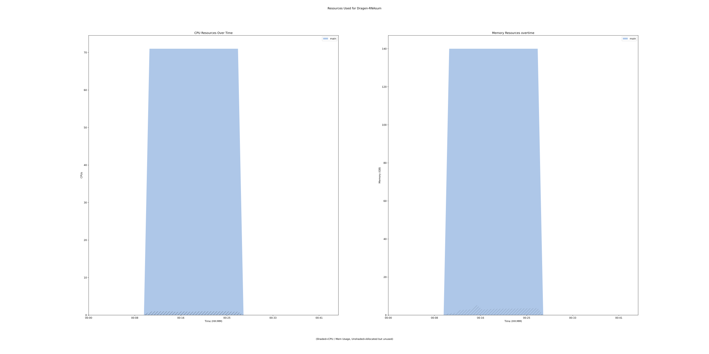

rnasum 0.4.1 tool
=================

## Table of Contents
  
- [Overview](#rnasum-v041-overview)  
- [Links](#related-links)  
- [Inputs](#rnasum-v041-inputs)  
- [Outputs](#rnasum-v041-outputs)  
- [ICA](#ica)  


## rnasum v(0.4.1) Overview


  
> ID: rnasum--0.4.1  
> md5sum: 6ae4f94ffa8fe82fdefb3221d87ac842

### rnasum v(0.4.1) documentation
  
RNA-seq reporting workflow designed to post-process, summarise and visualise an output from bcbio-nextgen RNA-seq or Dragen RNA pipelines. 
Its main application is to complement genome-based findings from umccrise pipeline and to provide additional evidence for detected alterations.

### Categories
  


## Related Links
  
- [CWL File Path](../../../../../../tools/rnasum/0.4.1/rnasum__0.4.1.cwl)  

  


## rnasum v(0.4.1) Inputs

### batch rm


  
> ID: batch_rm
  
**Optional:** `True`  
**Type:** `boolean`  
**Docs:**  
Remove batch-associated effects between datasets


### bcbio transcriptome directory


  
> ID: bcbio_transcriptome_directory
  
**Optional:** `True`  
**Type:** `Directory`  
**Docs:**  
Location of the results from bcbio RNA-seq pipeline


### clinical id


  
> ID: clinical_id
  
**Optional:** `True`  
**Type:** `string`  
**Docs:**  
ID required to match sample with the subject clinical information (specified in flag --clinical_info).


### clinical info


  
> ID: clinical_info
  
**Optional:** `True`  
**Type:** `File`  
**Docs:**  
xslx file with clinical information.


### cn gain


  
> ID: cn_gain
  
**Optional:** `True`  
**Type:** `int`  
**Docs:**  
CN threshold value to classify genes within gained regions.


### cn loss


  
> ID: cn_loss
  
**Optional:** `True`  
**Type:** `int`  
**Docs:**  
CN threshold value to classify genes within lost regions.


### dataset


  
> ID: dataset
  
**Optional:** `False`  
**Type:** `string`  
**Docs:**  
Reference dataset selection from https://github.com/umccr/RNAsum/blob/master/TCGA_projects_summary.md


### dataset name incl


  
> ID: dataset_name_incl
  
**Optional:** `True`  
**Type:** `boolean`  
**Docs:**  
Include dataset in the report and sample name.


### dragen transcriptome directory


  
> ID: dragen_transcriptome_directory
  
**Optional:** `True`  
**Type:** `Directory`  
**Docs:**  
Location of the results from Dragen RNA-seq pipeline


### drugs


  
> ID: drugs
  
**Optional:** `True`  
**Type:** `boolean`  
**Docs:**  
Include drug matching section in the report.


### filter


  
> ID: filter
  
**Optional:** `True`  
**Type:** `boolean`  
**Docs:**  
Filtering out low expressed genes


### grch version


  
> ID: grch_version
  
**Optional:** `True`  
**Type:** `int`  
**Docs:**  
Human reference genome version used for genes annotation.


### hide code btn


  
> ID: hide_code_btn
  
**Optional:** `True`  
**Type:** `boolean`  
**Docs:**  
Hide the "Code" button allowing to show/hide code chunks in the final HTML report.


### immunogram


  
> ID: immunogram
  
**Optional:** `True`  
**Type:** `boolean`  
**Docs:**  
Include drug matching section in the report.


### log


  
> ID: log
  
**Optional:** `True`  
**Type:** `boolean`  
**Docs:**  
Log (base 2) transform data before normalisation


### norm


  
> ID: norm
  
**Optional:** `True`  
**Type:** `string`  
**Docs:**  
Normalisation method


### pcgr splice vars


  
> ID: pcgr_splice_vars
  
**Optional:** `True`  
**Type:** `boolean`  
**Docs:**  
Include non-coding splice region variants reported in PCGR.


### pcgr tier


  
> ID: pcgr_tier
  
**Optional:** `True`  
**Type:** `int`  
**Docs:**  
Tier threshold for reporting variants reported in PCGR.


### project


  
> ID: project
  
**Optional:** `True`  
**Type:** `string`  
**Docs:**  
Project name. This information is for annotation purposes only


### reference data directory


  
> ID: ref_data_directory
  
**Optional:** `False`  
**Type:** `Directory`  
**Docs:**  
Location of the reference and annotation files


### report dir


  
> ID: report_directory
  
**Optional:** `False`  
**Type:** `string`  
**Docs:**  
Desired location for the report


### sample name


  
> ID: sample_name
  
**Optional:** `False`  
**Type:** `string`  
**Docs:**  
Desired sample name to be presented in the report


### sample source


  
> ID: sample_source
  
**Optional:** `True`  
**Type:** `string`  
**Docs:**  
Source of investigated sample (e.g. fresh frozen tissue, organoid).
This information is for annotation purposes only


### save tables


  
> ID: save_tables
  
**Optional:** `True`  
**Type:** `boolean`  
**Docs:**  
save tables


### scaling


  
> ID: scaling
  
**Optional:** `True`  
**Type:** `string`  
**Docs:**  
Apply "gene-wise" (default) or "group-wise" data scaling


### subject id


  
> ID: subject_id
  
**Optional:** `True`  
**Type:** `string`  
**Docs:**  
Subject ID. If umccrise output is specified (flag --umccrise) then Subject ID 
is extracted from there and used to overwrite this argument.


### top genes


  
> ID: top_genes
  
**Optional:** `True`  
**Type:** `int`  
**Docs:**  
The number of top ranked genes to be presented.


### transform


  
> ID: transform
  
**Optional:** `True`  
**Type:** `string`  
**Docs:**  
Transformation method to be used when converting read counts


### umccrise directory


  
> ID: umccrise_directory
  
**Optional:** `True`  
**Type:** `Directory`  
**Docs:**  
The umccrise output directory

  


## rnasum v(0.4.1) Outputs

### rnasum html


  
> ID: rnasum--0.4.1/rnasum_html  

  
**Optional:** `False`  
**Output Type:** `File`  
**Docs:**  
The HTML report output of RNAsum
  


### RNAsum output directory


  
> ID: rnasum--0.4.1/rnasum_output_directory  

  
**Optional:** `False`  
**Output Type:** `Directory`  
**Docs:**  
Output directory containing all outputs of the RNAsum run  

  


## ICA

### ToC
  
- [development_workflows](#project-development_workflows)  
- [production_workflows](#project-production_workflows)  


### Project: development_workflows


> wfl id: wfl.a94ae5ef8bc24b58b642cc8e42df70a4  

  
**workflow name:** rnasum_dev-wf  
**wfl version name:** 0.4.1  


#### Run Instances

##### ToC
  
- [Run wfr.dce6425b60044757a78bb545c627c58a](#run-wfrdce6425b60044757a78bb545c627c58a)  


##### Run wfr.dce6425b60044757a78bb545c627c58a


  
> Run Name: Dragen-RNAsum  

  
**Start Time:** 2021-12-16 01:03:18 UTC  
**Duration:** 2021-12-16 01:46:37 UTC  
**End Time:** 0 days 00:43:19  


###### Reproduce Run


```bash

# Run the submission template to create the workflow input json and launch script            
cwl-ica copy-tool-submission-template --ica-workflow-run-instance-id wfr.dce6425b60044757a78bb545c627c58a

# Edit the input json file (optional)
# vim wfr.dce6425b60044757a78bb545c627c58a.template.json 

# Run the launch script
bash wfr.dce6425b60044757a78bb545c627c58a.launch.sh
                                    
```  


###### Run Inputs


```
{
    "dataset": "PAAD",
    "dragen_transcriptome_directory": {
        "class": "Directory",
        "location": "gds://stratus-sehrish2/data/wts/rnasum/final/SBJ00238_MDX190231_L1901028"
    },
    "ref_data_directory": {
        "class": "Directory",
        "location": "gds://stratus-sehrish2/data/wts/rnasum/ref-data"
    },
    "report_directory": "SBJ00238",
    "sample_name": "SBJ00238_MDX190231_L1901028",
    "save_tables": false,
    "umccrise_directory": {
        "class": "Directory",
        "location": "gds://stratus-sehrish2/data/wts/rnasum/umccrised/SBJ00238__SBJ00238_MDX190230_L1901041"
    }
}
```  


###### Run Engine Parameters


```
{
    "workDirectory": "gds://wfr.dce6425b60044757a78bb545c627c58a/Dragen-RNAsum",
    "outputDirectory": "gds://stratus-sehrish2/data/wts/rnasum/reports",
    "tmpOutputDirectory": "gds://wfr.dce6425b60044757a78bb545c627c58a/Dragen-RNAsum/steps",
    "logDirectory": "gds://wfr.dce6425b60044757a78bb545c627c58a/Dragen-RNAsum/logs",
    "maxScatter": 32,
    "outputSetting": "move",
    "copyOutputInstanceType": "StandardHiCpu",
    "copyOutputInstanceSize": "Medium",
    "defaultInputMode": "'Download'",
    "inputModeOverrides": {},
    "tesUseInputManifest": "'auto'",
    "cwltool": "3.0.20201203173111",
    "engine": "1.18.0-202109141250-stratus-master"
}
```  


###### Run Outputs


```
{
    "rnasum_html": {
        "location": "gds://stratus-sehrish2/data/wts/rnasum/reports/SBJ00238/SBJ00238_MDX190231_L1901028.RNAseq_report.html",
        "basename": "SBJ00238_MDX190231_L1901028.RNAseq_report.html",
        "nameroot": "SBJ00238_MDX190231_L1901028.RNAseq_report",
        "nameext": ".html",
        "class": "File",
        "size": 34065802,
        "http://commonwl.org/cwltool#generation": 0
    },
    "rnasum_output_directory": {
        "location": "gds://stratus-sehrish2/data/wts/rnasum/reports/SBJ00238",
        "basename": "SBJ00238",
        "nameroot": "",
        "nameext": "",
        "class": "Directory",
        "size": null
    },
    "output_dir_gds_session_id": null,
    "output_dir_gds_folder_id": null
}
```  


###### Run Resources Usage
  

  
[](https://github.com/umccr/cwl-ica/raw/main/.github/catalogue/images/runs/tools/rnasum/0.4.1/Dragen-RNAsum__wfr.dce6425b60044757a78bb545c627c58a.svg)  


### Project: production_workflows


> wfl id: wfl.87e07ae6b46645a181e04813de535216  

  
**workflow name:** rnasum_prod-wf  
**wfl version name:** 0.4.1--170cae7  

  

