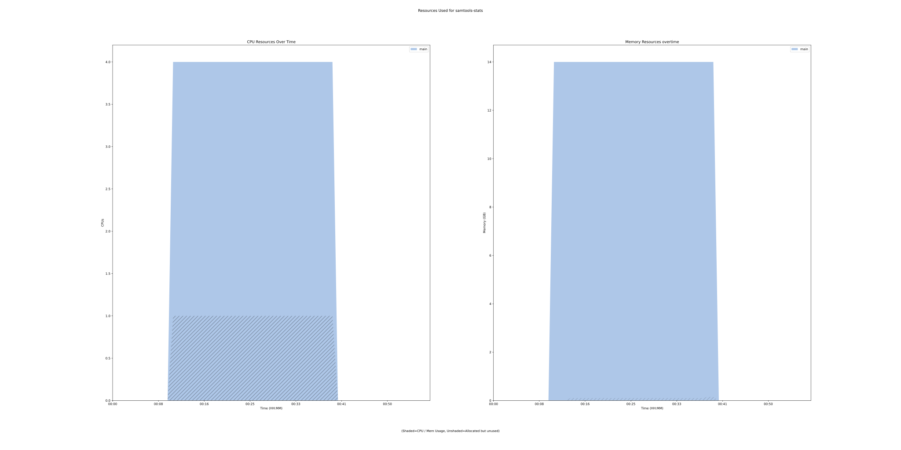

samtools-stats 1.13.0 tool
==========================

## Table of Contents
  
- [Overview](#samtools-stats-v1130-overview)  
- [Links](#related-links)  
- [Inputs](#samtools-stats-v1130-inputs)  
- [Outputs](#samtools-stats-v1130-outputs)  
- [ICA](#ica)  


## samtools-stats v(1.13.0) Overview


  
> ID: samtools-stats--1.13.0  
> md5sum: e83bda8efb0b051ef9695ebe7ab45136

### samtools-stats v(1.13.0) documentation
  
samtools stats collects statistics from BAM files and outputs in a text format. 
The output can be visualized graphically using plot-bamstats.

### Categories
  


## Related Links
  
- [CWL File Path](../../../../../../tools/samtools-stats/1.13.0/samtools-stats__1.13.0.cwl)  


### Used By
  
- [ghif-qc 1.0.0](../../../workflows/ghif-qc/1.0.0/ghif-qc__1.0.0.md)  
- [ghif-qc 1.0.1](../../../workflows/ghif-qc/1.0.1/ghif-qc__1.0.1.md)  

  


## samtools-stats v(1.13.0) Inputs

### GC depth


  
> ID: GC_depth
  
**Optional:** `True`  
**Type:** `float`  
**Docs:**  
the size of GC-depth bins (decreasing bin size increases memory requirement) [2e4]


### cov threshold


  
> ID: cov_threshold
  
**Optional:** `True`  
**Type:** `int`  
**Docs:**  
Only bases with coverage above this value will be included in the target percentage computation [0]


### coverage


  
> ID: coverage
  
**Optional:** `True`  
**Type:** `int[]`  
**Docs:**  
Set coverage distribution to the specified range (MIN, MAX, STEP all given as integers) [1,1000,1]


### filtering flag


  
> ID: filtering_flag
  
**Optional:** `True`  
**Type:** `int`  
**Docs:**  
iltering flag, 0 for unset. See also `samtools flags` [0]


### id


  
> ID: id
  
**Optional:** `True`  
**Type:** `string`  
**Docs:**  
Include only listed read group or sample name []


### input BAM


  
> ID: input_bam
  
**Optional:** `False`  
**Type:** `File`  
**Docs:**  
The BAM file to gather statistics from


### insert size


  
> ID: insert_size
  
**Optional:** `True`  
**Type:** `int`  
**Docs:**  
Maximum insert size [8000]


### most inserts


  
> ID: most_inserts
  
**Optional:** `True`  
**Type:** `float`  
**Docs:**  
Report only the main part of inserts [0.99]


### output filename


  
> ID: output_filename
  
**Optional:** `False`  
**Type:** `string`  
**Docs:**  
Redirects stdout


### read length


  
> ID: read_length
  
**Optional:** `True`  
**Type:** `int`  
**Docs:**  
Include in the statistics only reads with the given read length [-1]


### ref seq


  
> ID: ref_seq
  
**Optional:** `True`  
**Type:** `File`  
**Docs:**  
Reference sequence (required for GC-depth and mismatches-per-cycle calculation). []


### remove dups


  
> ID: remove_dups
  
**Optional:** `True`  
**Type:** `boolean`  
**Docs:**  
Exclude from statistics reads marked as duplicates


### remove overlaps


  
> ID: remove_overlaps
  
**Optional:** `True`  
**Type:** `boolean`  
**Docs:**  
Remove overlaps of paired-end reads from coverage and base count computations.


### required flag


  
> ID: required_flag
  
**Optional:** `True`  
**Type:** `int`  
**Docs:**  
Required flag, 0 for unset. See also `samtools flags` [0]


### sparse


  
> ID: sparse
  
**Optional:** `True`  
**Type:** `boolean`  
**Docs:**  
Suppress outputting IS rows where there are no insertions.


### split


  
> ID: split
  
**Optional:** `True`  
**Type:** `string`  
**Docs:**  
In addition to the complete statistics, also output categorised statistics based on the tagged field TAG 
(e.g., use --split RG to split into read groups).


### split prefix


  
> ID: split_prefix
  
**Optional:** `True`  
**Type:** `string`  
**Docs:**  
A path or string prefix to prepend to filenames output when creating categorised 
statistics files with -S/--split. [input filename]


### target regions


  
> ID: target_regions
  
**Optional:** `True`  
**Type:** `File`  
**Docs:**  
Do stats in these regions only. Tab-delimited file chr,from,to, 1-based, inclusive. []


### threads


  
> ID: threads
  
**Optional:** `True`  
**Type:** `int`  
**Docs:**  
Number of input/output compression threads to use in addition to main thread [0].


### trim quality


  
> ID: trim_quality
  
**Optional:** `True`  
**Type:** `int`  
**Docs:**  
The BWA trimming parameter [0]

  


## samtools-stats v(1.13.0) Outputs

### output file


  
> ID: samtools-stats--1.13.0/output_file  

  
**Optional:** `False`  
**Output Type:** `File`  
**Docs:**  
Output file, of varying format depending on the command run
  

  


## ICA

### ToC
  
- [development_workflows](#project-development_workflows)  


### Project: development_workflows


> wfl id: wfl.620ed24f36114e548ba60fe142712eb7  

  
**workflow name:** samtools-stats_dev-wf  
**wfl version name:** 1.13.0  


#### Run Instances

##### ToC
  
- [Run wfr.32ff48e48bce4d4e8d70efe6fbf92040](#run-wfr32ff48e48bce4d4e8d70efe6fbf92040)  


##### Run wfr.32ff48e48bce4d4e8d70efe6fbf92040


  
> Run Name: samtools-stats  

  
**Start Time:** 2022-01-10 00:09:06 UTC  
**Duration:** 2022-01-10 01:04:22 UTC  
**End Time:** 0 days 00:55:15  


###### Reproduce Run


```bash

# Run the submission template to create the workflow input json and launch script            
cwl-ica copy-tool-submission-template --ica-workflow-run-instance-id wfr.32ff48e48bce4d4e8d70efe6fbf92040

# Edit the input json file (optional)
# vim wfr.32ff48e48bce4d4e8d70efe6fbf92040.template.json 

# Run the launch script
bash wfr.32ff48e48bce4d4e8d70efe6fbf92040.launch.sh
                                    
```  


###### Run Inputs


```
{
    "cov_threshold": 20,
    "input_bam": {
        "class": "File",
        "location": "gds://umccr-temp-data-dev/helen/GHIF_QC/NA12878.bam"
    },
    "output_filename": "NA12878-test",
    "ref_seq": {
        "class": "File",
        "location": "gds://umccr-temp-data-dev/helen/GHIF_QC/hg38_alt_aware_nohla.fa"
    },
    "remove_dups": true,
    "remove_overlaps": true,
    "target_regions": {
        "class": "File",
        "location": "gds://umccr-temp-data-dev/helen/GHIF_QC/Targets_Homo_sapiens_assembly38_autosomes.txt"
    }
}
```  


###### Run Engine Parameters


```
{
    "workDirectory": "gds://wfr.32ff48e48bce4d4e8d70efe6fbf92040/samtools-stats",
    "outputDirectory": "gds://wfr.32ff48e48bce4d4e8d70efe6fbf92040/samtools-stats/outputs",
    "tmpOutputDirectory": "gds://wfr.32ff48e48bce4d4e8d70efe6fbf92040/samtools-stats/steps",
    "logDirectory": "gds://wfr.32ff48e48bce4d4e8d70efe6fbf92040/samtools-stats/logs",
    "maxScatter": 32,
    "outputSetting": "move",
    "copyOutputInstanceType": "StandardHiCpu",
    "copyOutputInstanceSize": "Medium",
    "defaultInputMode": "'Download'",
    "inputModeOverrides": {},
    "tesUseInputManifest": "'auto'",
    "cwltool": "3.0.20201203173111",
    "engine": "1.18.0-202109141250-stratus-master"
}
```  


###### Run Outputs


```
{
    "output_file": {
        "location": "gds://wfr.32ff48e48bce4d4e8d70efe6fbf92040/samtools-stats/outputs/NA12878-test.txt",
        "basename": "NA12878-test.txt",
        "nameroot": "NA12878-test",
        "nameext": ".txt",
        "class": "File",
        "size": 130609,
        "http://commonwl.org/cwltool#generation": 0
    },
    "output_dir_gds_session_id": "ssn.839f2a581b2743fb8f9bae1c592de4d3",
    "output_dir_gds_folder_id": "fol.014f7a70d73845220e6508d9d142e3c5"
}
```  


###### Run Resources Usage
  

  
[](https://github.com/umccr/cwl-ica/raw/main/.github/catalogue/images/runs/tools/samtools-stats/1.13.0/samtools-stats__wfr.32ff48e48bce4d4e8d70efe6fbf92040.svg)  

  

