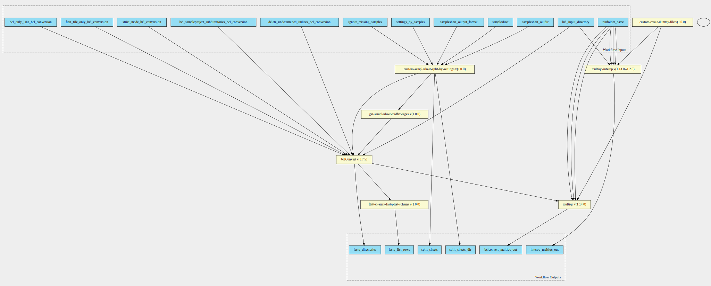

bcl-conversion 3.7.5 workflow
=============================

## Table of Contents
  
- [Overview](#bcl-conversion-v375-overview)  
- [Visual](#visual-workflow-overview)  
- [Links](#related-links)  
- [Inputs](#bcl-conversion-v375-inputs)  
- [Steps](#bcl-conversion-v375-steps)  
- [Outputs](#bcl-conversion-v375-outputs)  
- [ICA](#ica)  


## bcl-conversion v(3.7.5) Overview


  
> ID: bcl-conversion--3.7.5  
> md5sum: b2706702f99a6b3d934b4e667f7a4eb7

### bcl-conversion v(3.7.5) documentation
  
Runs bcl-convert v3.7.5 with multiqc output of the bcl input directory

### Categories
  


## Visual Workflow Overview
  
[](https://github.com/umccr/cwl-ica/raw/beta-release/.github/catalogue/images/workflows/bcl-conversion/3.7.5/bcl-conversion__3.7.5.svg)
## Related Links
  
- [CWL File Path](../../../../../../workflows/bcl-conversion/3.7.5/bcl-conversion__3.7.5.cwl)  


### Uses
  
- [bclConvert 3.7.5](../../../tools/bclConvert/3.7.5/bclConvert__3.7.5.md)  
- [multiqc 1.11.0](../../../tools/multiqc/1.11.0/multiqc__1.11.0.md)  
- [custom-touch-file 1.0.0 :construction:](../../../tools/custom-touch-file/1.0.0/custom-touch-file__1.0.0.md)  
- [flatten-array-fastq-list 1.0.0](../../../expressions/flatten-array-fastq-list/1.0.0/flatten-array-fastq-list__1.0.0.md)  
- [get-samplesheet-midfix-regex 1.0.0](../../../expressions/get-samplesheet-midfix-regex/1.0.0/get-samplesheet-midfix-regex__1.0.0.md)  
- [multiqc-interop 1.2.1](../../../tools/multiqc-interop/1.2.1/multiqc-interop__1.2.1.md)  
- [custom-samplesheet-split-by-settings 1.0.0](../../../tools/custom-samplesheet-split-by-settings/1.0.0/custom-samplesheet-split-by-settings__1.0.0.md)  

  


## bcl-conversion v(3.7.5) Inputs

### bcl input directory


  
> ID: bcl_input_directory
  
**Optional:** `False`  
**Type:** `Directory`  
**Docs:**  
Path to the bcl files


### bcl only lane


  
> ID: bcl_only_lane_bcl_conversion
  
**Optional:** `True`  
**Type:** `int`  
**Docs:**  
Convert only the specified lane number. The value must
be less than or equal to the number of lanes specified in the
RunInfo.xml. Must be a single integer value.


### bcl sampleproject subdirectories


  
> ID: bcl_sampleproject_subdirectories_bcl_conversion
  
**Optional:** `True`  
**Type:** `boolean`  
**Docs:**  
true — Allows creation of Sample_Project subdirectories
as specified in the sample sheet. This option must be set to true for
the Sample_Project column in the data section to be used.


### delete undetermined indices


  
> ID: delete_undetermined_indices_bcl_conversion
  
**Optional:** `True`  
**Type:** `boolean`  
**Docs:**  
Delete undetermined indices on completion of the run


### first tile only


  
> ID: first_tile_only_bcl_conversion
  
**Optional:** `True`  
**Type:** `boolean`  
**Docs:**  
true — Only process the first tile of the first swath of the
  top surface of each lane specified in the sample sheet.
false — Process all tiles in each lane, as specified in the sample
  sheet.


### ignore missing samples


  
> ID: ignore_missing_samples
  
**Optional:** `True`  
**Type:** `boolean`  
**Docs:**  
Remove the samples not present in the override cycles record


### runfolder name


  
> ID: runfolder_name
  
**Optional:** `False`  
**Type:** `string`  
**Docs:**  
Required - used in naming run specific folder, reports and headings


### sample sheet


  
> ID: samplesheet
  
**Optional:** `False`  
**Type:** `File`  
**Docs:**  
The path to the full samplesheet


### samplesheet outdir


  
> ID: samplesheet_outdir
  
**Optional:** `True`  
**Type:** `string`  
**Docs:**  
Output directory of the samplesheets split by settings


### set samplesheet output format


  
> ID: samplesheet_output_format
  
**Optional:** `True`  
**Type:** `<cwl_utils.parser_v1_1.InputEnumSchema object at 0x7f386d70bac0>`  
**Docs:**  
Convert headers to v2 samplesheet format


### settings by samples


  
> ID: settings_by_samples
  
**Optional:** `True`  
**Type:** `settings-by-samples[]`  
**Docs:**  
List of settings by samples


### strict mode bcl conversion


  
> ID: strict_mode_bcl_conversion
  
**Optional:** `True`  
**Type:** `boolean`  
**Docs:**  
true — Abort the program if any filter, locs, bcl, or bci lane
files are missing or corrupt.
false — Continue processing if any filter, locs, bcl, or bci lane files
are missing. Return a warning message for each missing or corrupt
file.

  


## bcl-conversion v(3.7.5) Steps

### bcl convert


  
> ID: bcl-conversion--3.7.5/bcl_convert_step
  
**Step Type:** tool  
**Docs:**
  
BCLConvert is then scattered across each of the samplesheets.

#### Links
  
[CWL File Path](../../../../../../tools/bclConvert/3.7.5/bclConvert__3.7.5.cwl)  
[CWL File Help Page](../../../tools/bclConvert/3.7.5/bclConvert__3.7.5.md)  


### bclconvert qc step


  
> ID: bcl-conversion--3.7.5/bclconvert_qc_step
  
**Step Type:** tool  
**Docs:**
  
The bclconvert qc step - from scatter this takes in an array of dirs

#### Links
  
[CWL File Path](../../../../../../tools/multiqc/1.11.0/multiqc__1.11.0.cwl)  
[CWL File Help Page](../../../tools/multiqc/1.11.0/multiqc__1.11.0.md)  


### create dummy file


  
> ID: bcl-conversion--3.7.5/create_dummy_file_step
  
**Step Type:** tool  
**Docs:**
  
Intermediate step for letting multiqc-interop be placed in stream mode

#### Links
  
[CWL File Path](../../../../../../tools/custom-touch-file/1.0.0/custom-touch-file__1.0.0.cwl)  
[CWL File Help Page :construction:](../../../tools/custom-touch-file/1.0.0/custom-touch-file__1.0.0.md)  


### flatten fastq list rows array


  
> ID: bcl-conversion--3.7.5/flatten_fastq_list_rows_array
  
**Step Type:** expression  
**Docs:**
  
fastq list rows is an array and bcl convert is from a directory output.
This scatters the arrays to a single array

#### Links
  
[CWL File Path](../../../../../../expressions/flatten-array-fastq-list/1.0.0/flatten-array-fastq-list__1.0.0.cwl)  
[CWL File Help Page](../../../expressions/flatten-array-fastq-list/1.0.0/flatten-array-fastq-list__1.0.0.md)  


### get batch directories


  
> ID: bcl-conversion--3.7.5/get_batch_dirs
  
**Step Type:** expression  
**Docs:**
  
Get the directory names of each of the directories we wish to scatter over

#### Links
  
[CWL File Path](../../../../../../expressions/get-samplesheet-midfix-regex/1.0.0/get-samplesheet-midfix-regex__1.0.0.cwl)  
[CWL File Help Page](../../../expressions/get-samplesheet-midfix-regex/1.0.0/get-samplesheet-midfix-regex__1.0.0.md)  


### interop qc step


  
> ID: bcl-conversion--3.7.5/interop_qc_step
  
**Step Type:** tool  
**Docs:**
  
Run the multiqc by first also generating the interop files for use

#### Links
  
[CWL File Path](../../../../../../tools/multiqc-interop/1.2.1/multiqc-interop__1.2.1.cwl)  
[CWL File Help Page](../../../tools/multiqc-interop/1.2.1/multiqc-interop__1.2.1.md)  


### Split samplesheet by settings step


  
> ID: bcl-conversion--3.7.5/samplesheet_split_by_settings_step
  
**Step Type:** tool  
**Docs:**
  
Samplesheet is split by the different input types.
These are generally a difference in override cycles parameters or adapter trimming settings
This then scatters multiple bclconvert workflows split by sample id

#### Links
  
[CWL File Path](../../../../../../tools/custom-samplesheet-split-by-settings/1.0.0/custom-samplesheet-split-by-settings__1.0.0.cwl)  
[CWL File Help Page](../../../tools/custom-samplesheet-split-by-settings/1.0.0/custom-samplesheet-split-by-settings__1.0.0.md)  


## bcl-conversion v(3.7.5) Outputs

### bclconvert multiqc


  
> ID: bcl-conversion--3.7.5/bclconvert_multiqc_out  

  
**Optional:** `False`  
**Output Type:** `Directory`  
**Docs:**  
multiqc directory output that contains bclconvert multiqc data
  


### Output fastq directores


  
> ID: bcl-conversion--3.7.5/fastq_directories  

  
**Optional:** `False`  
**Output Type:** `Directory[]`  
**Docs:**  
The outputs from the bclconvert-step
  


### rows of fastq list csv file


  
> ID: bcl-conversion--3.7.5/fastq_list_rows  

  
**Optional:** `False`  
**Output Type:** `fastq-list-row[]`  
**Docs:**  
Contains the fastq list row schema for each of the output fastq files
  


### interop multiqc


  
> ID: bcl-conversion--3.7.5/interop_multiqc_out  

  
**Optional:** `False`  
**Output Type:** `Directory`  
**Docs:**  
multiqc directory output that contains interop data
  


### split samplesheets


  
> ID: bcl-conversion--3.7.5/split_sheets  

  
**Optional:** `False`  
**Output Type:** `File[]`  
**Docs:**  
List of samplesheets split by override cycles
  


### split sheets dir


  
> ID: bcl-conversion--3.7.5/split_sheets_dir  

  
**Optional:** `False`  
**Output Type:** `Directory`  
**Docs:**  
The directory containing the samplesheets used for each bcl convert
  

  


## ICA

### ToC
  
- [development_workflows](#project-development_workflows)  
- [production_workflows](#project-production_workflows)  


### Project: development_workflows


> wfl id: wfl.59e481580c6243b6b237ca2b08fa1270  

  
**workflow name:** bcl-conversion_dev-wf  
**wfl version name:** 3.7.5  


#### Run Instances

##### Run wfr.d9ddc8eb7d544d32bdbe285fd45a4365


  
> Run Name: umccr__automated__bcl_convert__210708_A00130_0166_AH7KTJDSX2__r.E92UIDDiCUKQS5joVDO6Gg__1626253458  

  
**Start Time:** 2021-07-14 09:04:23 UTC  
**Duration:** 2021-07-14 14:44:02 UTC  
**End Time:** 0 days 05:39:38  


###### Run Inputs


```
{
    "bcl_input_directory": {
        "class": "Directory",
        "location": "gds://bssh.acddbfda498038ed99fa94fe79523959/Runs/210708_A00130_0166_AH7KTJDSX2_r.E92UIDDiCUKQS5joVDO6Gg"
    },
    "samplesheet": {
        "class": "File",
        "location": "gds://bssh.acddbfda498038ed99fa94fe79523959/Runs/210708_A00130_0166_AH7KTJDSX2_r.E92UIDDiCUKQS5joVDO6Gg/SampleSheet.csv"
    },
    "settings_by_samples": [
        {
            "batch_name": "10X_10X-ATAC",
            "samples": [
                "PRJ210646_LPRJ210646",
                "PRJ210648_LPRJ210648",
                "PRJ210647_LPRJ210647",
                "PRJ210645_LPRJ210645"
            ],
            "settings": {
                "create_fastq_for_index_reads": true,
                "minimum_trimmed_read_length": 8,
                "mask_short_reads": 8,
                "override_cycles": "Y28N123;I10;I10;Y91N60"
            }
        },
        {
            "batch_name": "WGS_TsqNano",
            "samples": [
                "PRJ210455_L2100613_topup",
                "MDX210149_L2100744",
                "MDX210173_L2100742",
                "MDX210100_L2100741",
                "MDX210178_L2100747",
                "PTC_Tsqn210707_L2100754",
                "PRJ210463_L2100621_topup",
                "PRJ210680_L2100752",
                "MDX210148_L2100743",
                "MDX210176_L2100746",
                "MDX210175_L2100745",
                "PRJ210452_L2100610_topup",
                "NTC_Tsqn210707_L2100755",
                "PRJ210456_L2100614_topup",
                "PRJ210678_L2100751",
                "PRJ210681_L2100753",
                "MDX210179_L2100748"
            ],
            "settings": {
                "adapter_read_1": "AGATCGGAAGAGCACACGTCTGAACTCCAGTCA",
                "adapter_read_2": "AGATCGGAAGAGCGTCGTGTAGGGAAAGAGTGT",
                "override_cycles": "Y151;I8N2;I8N2;Y151"
            }
        },
        {
            "batch_name": "WTS_NebRNA",
            "samples": [
                "MDX210177_L2100732",
                "PRJ210679_L2100734",
                "PRJ210682_L2100735",
                "PTC_NebRNA210706_L2100736",
                "MDX210186_L2100733",
                "MDX210180_L2100737",
                "MDX210174_L2100739",
                "MDX210183_L2100738",
                "NTC_NebRNA210706_L2100740"
            ],
            "settings": {
                "adapter_read_1": "AGATCGGAAGAGCACACGTCTGAACTCCAGTCA",
                "adapter_read_2": "AGATCGGAAGAGCGTCGTGTAGGGAAAGAGTGT",
                "override_cycles": "Y151;I8N2;I8N2;Y151"
            }
        }
    ],
    "samplesheet_outdir": "samplesheets-by-assay-type",
    "ignore_missing_samples": true,
    "samplesheet_output_format": "v2",
    "bcl_sampleproject_subdirectories_bcl_conversion": true,
    "strict_mode_bcl_conversion": true,
    "delete_undetermined_indices_bcl_conversion": true,
    "runfolder_name": "210708_A00130_0166_AH7KTJDSX2"
}
```  


###### Run Engine Parameters


```
{
    "workDirectory": "gds://wfr.d9ddc8eb7d544d32bdbe285fd45a4365/umccr__automated__bcl_convert__210708_A00130_0166_AH7KTJDSX2__r.E92UIDDiCUKQS5joVDO6Gg__1626253458",
    "outputDirectory": "gds://umccr-fastq-data-dev/210708_A00130_0166_AH7KTJDSX2",
    "tmpOutputDirectory": "gds://wfr.d9ddc8eb7d544d32bdbe285fd45a4365/umccr__automated__bcl_convert__210708_A00130_0166_AH7KTJDSX2__r.E92UIDDiCUKQS5joVDO6Gg__1626253458/steps",
    "logDirectory": "gds://wfr.d9ddc8eb7d544d32bdbe285fd45a4365/umccr__automated__bcl_convert__210708_A00130_0166_AH7KTJDSX2__r.E92UIDDiCUKQS5joVDO6Gg__1626253458/logs",
    "maxScatter": 32,
    "outputSetting": "move",
    "copyOutputInstanceType": "StandardHiCpu",
    "copyOutputInstanceSize": "Medium",
    "defaultInputMode": "'Download'",
    "inputModeOverrides": {},
    "tesUseInputManifest": "'auto'",
    "cwltool": "3.0.20201203173111",
    "samplesheet": {
        "class": "File",
        "location": "PLACEHOLDER"
    },
    "samplesheet_outdir": "samplesheets-by-assay-type",
    "runfolder_name": "PLACEHOLDER",
    "engine": "1.16.0-202106091735-develop",
    "ignore_missing_samples": true,
    "settings_by_samples": [],
    "delete_undetermined_indices_bcl_conversion": true,
    "bcl_input_directory": {
        "class": "Directory",
        "location": "PLACEHOLDER"
    },
    "bcl_sampleproject_subdirectories_bcl_conversion": true,
    "samplesheet_output_format": "v2",
    "strict_mode_bcl_conversion": true
}
```  


###### Run Outputs


```
{
    "bclconvert_multiqc_out": {
        "location": "gds://umccr-fastq-data-dev/210708_A00130_0166_AH7KTJDSX2/210708_A00130_0166_AH7KTJDSX2_bclconvert_multiqc",
        "basename": "210708_A00130_0166_AH7KTJDSX2_bclconvert_multiqc",
        "nameroot": "",
        "nameext": "",
        "class": "Directory",
        "size": null
    },
    "fastq_directories": [
        {
            "location": "gds://umccr-fastq-data-dev/210708_A00130_0166_AH7KTJDSX2/10X_10X-ATAC",
            "basename": "10X_10X-ATAC",
            "nameroot": "",
            "nameext": "",
            "class": "Directory",
            "size": null
        },
        {
            "location": "gds://umccr-fastq-data-dev/210708_A00130_0166_AH7KTJDSX2/WGS_TsqNano",
            "basename": "WGS_TsqNano",
            "nameroot": "",
            "nameext": "",
            "class": "Directory",
            "size": null
        },
        {
            "location": "gds://umccr-fastq-data-dev/210708_A00130_0166_AH7KTJDSX2/WTS_NebRNA",
            "basename": "WTS_NebRNA",
            "nameroot": "",
            "nameext": "",
            "class": "Directory",
            "size": null
        }
    ],
    "fastq_list_rows": [
        {
            "rgid": "ACAATGTGAA.TAACGGTACG.1",
            "rglb": "UnknownLibrary",
            "rgsm": "PRJ210645_LPRJ210645",
            "lane": 1,
            "read_1": {
                "class": "File",
                "basename": "PRJ210645_LPRJ210645_S1_L001_R1_001.fastq.gz",
                "location": "gds://umccr-fastq-data-dev/210708_A00130_0166_AH7KTJDSX2/10X_10X-ATAC/CWells/PRJ210645_LPRJ210645_S1_L001_R1_001.fastq.gz",
                "nameroot": "PRJ210645_LPRJ210645_S1_L001_R1_001.fastq",
                "nameext": ".gz",
                "http://commonwl.org/cwltool#generation": 0,
                "size": 8777013979
            },
            "read_2": {
                "class": "File",
                "basename": "PRJ210645_LPRJ210645_S1_L001_R2_001.fastq.gz",
                "location": "gds://umccr-fastq-data-dev/210708_A00130_0166_AH7KTJDSX2/10X_10X-ATAC/CWells/PRJ210645_LPRJ210645_S1_L001_R2_001.fastq.gz",
                "nameroot": "PRJ210645_LPRJ210645_S1_L001_R2_001.fastq",
                "nameext": ".gz",
                "http://commonwl.org/cwltool#generation": 0,
                "size": 18616963571
            }
        },
        {
            "rgid": "TAGCATAGTG.GACAGAGCCG.1",
            "rglb": "UnknownLibrary",
            "rgsm": "PRJ210646_LPRJ210646",
            "lane": 1,
            "read_1": {
                "class": "File",
                "basename": "PRJ210646_LPRJ210646_S2_L001_R1_001.fastq.gz",
                "location": "gds://umccr-fastq-data-dev/210708_A00130_0166_AH7KTJDSX2/10X_10X-ATAC/CWells/PRJ210646_LPRJ210646_S2_L001_R1_001.fastq.gz",
                "nameroot": "PRJ210646_LPRJ210646_S2_L001_R1_001.fastq",
                "nameext": ".gz",
                "http://commonwl.org/cwltool#generation": 0,
                "size": 2798546038
            },
            "read_2": {
                "class": "File",
                "basename": "PRJ210646_LPRJ210646_S2_L001_R2_001.fastq.gz",
                "location": "gds://umccr-fastq-data-dev/210708_A00130_0166_AH7KTJDSX2/10X_10X-ATAC/CWells/PRJ210646_LPRJ210646_S2_L001_R2_001.fastq.gz",
                "nameroot": "PRJ210646_LPRJ210646_S2_L001_R2_001.fastq",
                "nameext": ".gz",
                "http://commonwl.org/cwltool#generation": 0,
                "size": 6066857382
            }
        },
        {
            "rgid": "CCCGTTCTCG.CCAATCCGTC.1",
            "rglb": "UnknownLibrary",
            "rgsm": "PRJ210647_LPRJ210647",
            "lane": 1,
            "read_1": {
                "class": "File",
                "basename": "PRJ210647_LPRJ210647_S3_L001_R1_001.fastq.gz",
                "location": "gds://umccr-fastq-data-dev/210708_A00130_0166_AH7KTJDSX2/10X_10X-ATAC/CWells/PRJ210647_LPRJ210647_S3_L001_R1_001.fastq.gz",
                "nameroot": "PRJ210647_LPRJ210647_S3_L001_R1_001.fastq",
                "nameext": ".gz",
                "http://commonwl.org/cwltool#generation": 0,
                "size": 1660650122
            },
            "read_2": {
                "class": "File",
                "basename": "PRJ210647_LPRJ210647_S3_L001_R2_001.fastq.gz",
                "location": "gds://umccr-fastq-data-dev/210708_A00130_0166_AH7KTJDSX2/10X_10X-ATAC/CWells/PRJ210647_LPRJ210647_S3_L001_R2_001.fastq.gz",
                "nameroot": "PRJ210647_LPRJ210647_S3_L001_R2_001.fastq",
                "nameext": ".gz",
                "http://commonwl.org/cwltool#generation": 0,
                "size": 3586272691
            }
        },
        {
            "rgid": "AGTTTCCTGG.CTGTGTGGCA.1",
            "rglb": "UnknownLibrary",
            "rgsm": "PRJ210648_LPRJ210648",
            "lane": 1,
            "read_1": {
                "class": "File",
                "basename": "PRJ210648_LPRJ210648_S4_L001_R1_001.fastq.gz",
                "location": "gds://umccr-fastq-data-dev/210708_A00130_0166_AH7KTJDSX2/10X_10X-ATAC/CWells/PRJ210648_LPRJ210648_S4_L001_R1_001.fastq.gz",
                "nameroot": "PRJ210648_LPRJ210648_S4_L001_R1_001.fastq",
                "nameext": ".gz",
                "http://commonwl.org/cwltool#generation": 0,
                "size": 1373328700
            },
            "read_2": {
                "class": "File",
                "basename": "PRJ210648_LPRJ210648_S4_L001_R2_001.fastq.gz",
                "location": "gds://umccr-fastq-data-dev/210708_A00130_0166_AH7KTJDSX2/10X_10X-ATAC/CWells/PRJ210648_LPRJ210648_S4_L001_R2_001.fastq.gz",
                "nameroot": "PRJ210648_LPRJ210648_S4_L001_R2_001.fastq",
                "nameext": ".gz",
                "http://commonwl.org/cwltool#generation": 0,
                "size": 2972563732
            }
        },
        {
            "rgid": "ATGGCATG.GGTACCTT.1",
            "rglb": "UnknownLibrary",
            "rgsm": "MDX210175_L2100745",
            "lane": 1,
            "read_1": {
                "class": "File",
                "basename": "MDX210175_L2100745_S5_L001_R1_001.fastq.gz",
                "location": "gds://umccr-fastq-data-dev/210708_A00130_0166_AH7KTJDSX2/WGS_TsqNano/VCCC/MDX210175_L2100745_S5_L001_R1_001.fastq.gz",
                "nameroot": "MDX210175_L2100745_S5_L001_R1_001.fastq",
                "nameext": ".gz",
                "http://commonwl.org/cwltool#generation": 0,
                "size": 62623862869
            },
            "read_2": {
                "class": "File",
                "basename": "MDX210175_L2100745_S5_L001_R2_001.fastq.gz",
                "location": "gds://umccr-fastq-data-dev/210708_A00130_0166_AH7KTJDSX2/WGS_TsqNano/VCCC/MDX210175_L2100745_S5_L001_R2_001.fastq.gz",
                "nameroot": "MDX210175_L2100745_S5_L001_R2_001.fastq",
                "nameext": ".gz",
                "http://commonwl.org/cwltool#generation": 0,
                "size": 70727181041
            }
        },
        {
            "rgid": "GCAATGCA.AACGTTCC.1",
            "rglb": "UnknownLibrary",
            "rgsm": "MDX210176_L2100746",
            "lane": 1,
            "read_1": {
                "class": "File",
                "basename": "MDX210176_L2100746_S6_L001_R1_001.fastq.gz",
                "location": "gds://umccr-fastq-data-dev/210708_A00130_0166_AH7KTJDSX2/WGS_TsqNano/VCCC/MDX210176_L2100746_S6_L001_R1_001.fastq.gz",
                "nameroot": "MDX210176_L2100746_S6_L001_R1_001.fastq",
                "nameext": ".gz",
                "http://commonwl.org/cwltool#generation": 0,
                "size": 85630740149
            },
            "read_2": {
                "class": "File",
                "basename": "MDX210176_L2100746_S6_L001_R2_001.fastq.gz",
                "location": "gds://umccr-fastq-data-dev/210708_A00130_0166_AH7KTJDSX2/WGS_TsqNano/VCCC/MDX210176_L2100746_S6_L001_R2_001.fastq.gz",
                "nameroot": "MDX210176_L2100746_S6_L001_R2_001.fastq",
                "nameext": ".gz",
                "http://commonwl.org/cwltool#generation": 0,
                "size": 94974045453
            }
        },
        {
            "rgid": "TGGTGGCA.TTACAGGA.1",
            "rglb": "UnknownLibrary",
            "rgsm": "PTC_Tsqn210707_L2100754",
            "lane": 1,
            "read_1": {
                "class": "File",
                "basename": "PTC_Tsqn210707_L2100754_S12_L001_R1_001.fastq.gz",
                "location": "gds://umccr-fastq-data-dev/210708_A00130_0166_AH7KTJDSX2/WGS_TsqNano/UMCCR/PTC_Tsqn210707_L2100754_S12_L001_R1_001.fastq.gz",
                "nameroot": "PTC_Tsqn210707_L2100754_S12_L001_R1_001.fastq",
                "nameext": ".gz",
                "http://commonwl.org/cwltool#generation": 0,
                "size": 10197864788
            },
            "read_2": {
                "class": "File",
                "basename": "PTC_Tsqn210707_L2100754_S12_L001_R2_001.fastq.gz",
                "location": "gds://umccr-fastq-data-dev/210708_A00130_0166_AH7KTJDSX2/WGS_TsqNano/UMCCR/PTC_Tsqn210707_L2100754_S12_L001_R2_001.fastq.gz",
                "nameroot": "PTC_Tsqn210707_L2100754_S12_L001_R2_001.fastq",
                "nameext": ".gz",
                "http://commonwl.org/cwltool#generation": 0,
                "size": 11396340908
            }
        },
        {
            "rgid": "GAATGAGA.AATGCCTC.1",
            "rglb": "UnknownLibrary",
            "rgsm": "NTC_Tsqn210707_L2100755",
            "lane": 1,
            "read_1": {
                "class": "File",
                "basename": "NTC_Tsqn210707_L2100755_S13_L001_R1_001.fastq.gz",
                "location": "gds://umccr-fastq-data-dev/210708_A00130_0166_AH7KTJDSX2/WGS_TsqNano/UMCCR/NTC_Tsqn210707_L2100755_S13_L001_R1_001.fastq.gz",
                "nameroot": "NTC_Tsqn210707_L2100755_S13_L001_R1_001.fastq",
                "nameext": ".gz",
                "http://commonwl.org/cwltool#generation": 0,
                "size": 39226
            },
            "read_2": {
                "class": "File",
                "basename": "NTC_Tsqn210707_L2100755_S13_L001_R2_001.fastq.gz",
                "location": "gds://umccr-fastq-data-dev/210708_A00130_0166_AH7KTJDSX2/WGS_TsqNano/UMCCR/NTC_Tsqn210707_L2100755_S13_L001_R2_001.fastq.gz",
                "nameroot": "NTC_Tsqn210707_L2100755_S13_L001_R2_001.fastq",
                "nameext": ".gz",
                "http://commonwl.org/cwltool#generation": 0,
                "size": 44934
            }
        },
        {
            "rgid": "ATATGGAT.TAATACAG.2",
            "rglb": "UnknownLibrary",
            "rgsm": "MDX210100_L2100741",
            "lane": 2,
            "read_1": {
                "class": "File",
                "basename": "MDX210100_L2100741_S1_L002_R1_001.fastq.gz",
                "location": "gds://umccr-fastq-data-dev/210708_A00130_0166_AH7KTJDSX2/WGS_TsqNano/Grimmond/MDX210100_L2100741_S1_L002_R1_001.fastq.gz",
                "nameroot": "MDX210100_L2100741_S1_L002_R1_001.fastq",
                "nameext": ".gz",
                "http://commonwl.org/cwltool#generation": 0,
                "size": 44496591896
            },
            "read_2": {
                "class": "File",
                "basename": "MDX210100_L2100741_S1_L002_R2_001.fastq.gz",
                "location": "gds://umccr-fastq-data-dev/210708_A00130_0166_AH7KTJDSX2/WGS_TsqNano/Grimmond/MDX210100_L2100741_S1_L002_R2_001.fastq.gz",
                "nameroot": "MDX210100_L2100741_S1_L002_R2_001.fastq",
                "nameext": ".gz",
                "http://commonwl.org/cwltool#generation": 0,
                "size": 48969641027
            }
        },
        {
            "rgid": "AAGATACT.ATGTAAGT.2",
            "rglb": "UnknownLibrary",
            "rgsm": "MDX210148_L2100743",
            "lane": 2,
            "read_1": {
                "class": "File",
                "basename": "MDX210148_L2100743_S3_L002_R1_001.fastq.gz",
                "location": "gds://umccr-fastq-data-dev/210708_A00130_0166_AH7KTJDSX2/WGS_TsqNano/OPrall/MDX210148_L2100743_S3_L002_R1_001.fastq.gz",
                "nameroot": "MDX210148_L2100743_S3_L002_R1_001.fastq",
                "nameext": ".gz",
                "http://commonwl.org/cwltool#generation": 0,
                "size": 43896326484
            },
            "read_2": {
                "class": "File",
                "basename": "MDX210148_L2100743_S3_L002_R2_001.fastq.gz",
                "location": "gds://umccr-fastq-data-dev/210708_A00130_0166_AH7KTJDSX2/WGS_TsqNano/OPrall/MDX210148_L2100743_S3_L002_R2_001.fastq.gz",
                "nameroot": "MDX210148_L2100743_S3_L002_R2_001.fastq",
                "nameext": ".gz",
                "http://commonwl.org/cwltool#generation": 0,
                "size": 47497913854
            }
        },
        {
            "rgid": "GTTCCAAT.GCAGAATT.2",
            "rglb": "UnknownLibrary",
            "rgsm": "MDX210178_L2100747",
            "lane": 2,
            "read_1": {
                "class": "File",
                "basename": "MDX210178_L2100747_S7_L002_R1_001.fastq.gz",
                "location": "gds://umccr-fastq-data-dev/210708_A00130_0166_AH7KTJDSX2/WGS_TsqNano/CMitchell/MDX210178_L2100747_S7_L002_R1_001.fastq.gz",
                "nameroot": "MDX210178_L2100747_S7_L002_R1_001.fastq",
                "nameext": ".gz",
                "http://commonwl.org/cwltool#generation": 0,
                "size": 48833413773
            },
            "read_2": {
                "class": "File",
                "basename": "MDX210178_L2100747_S7_L002_R2_001.fastq.gz",
                "location": "gds://umccr-fastq-data-dev/210708_A00130_0166_AH7KTJDSX2/WGS_TsqNano/CMitchell/MDX210178_L2100747_S7_L002_R2_001.fastq.gz",
                "nameroot": "MDX210178_L2100747_S7_L002_R2_001.fastq",
                "nameext": ".gz",
                "http://commonwl.org/cwltool#generation": 0,
                "size": 53065689455
            }
        },
        {
            "rgid": "ACCTTGGC.ATGAGGCC.2",
            "rglb": "UnknownLibrary",
            "rgsm": "MDX210179_L2100748",
            "lane": 2,
            "read_1": {
                "class": "File",
                "basename": "MDX210179_L2100748_S8_L002_R1_001.fastq.gz",
                "location": "gds://umccr-fastq-data-dev/210708_A00130_0166_AH7KTJDSX2/WGS_TsqNano/CMitchell/MDX210179_L2100748_S8_L002_R1_001.fastq.gz",
                "nameroot": "MDX210179_L2100748_S8_L002_R1_001.fastq",
                "nameext": ".gz",
                "http://commonwl.org/cwltool#generation": 0,
                "size": 115857096772
            },
            "read_2": {
                "class": "File",
                "basename": "MDX210179_L2100748_S8_L002_R2_001.fastq.gz",
                "location": "gds://umccr-fastq-data-dev/210708_A00130_0166_AH7KTJDSX2/WGS_TsqNano/CMitchell/MDX210179_L2100748_S8_L002_R2_001.fastq.gz",
                "nameroot": "MDX210179_L2100748_S8_L002_R2_001.fastq",
                "nameext": ".gz",
                "http://commonwl.org/cwltool#generation": 0,
                "size": 124148092819
            }
        },
        {
            "rgid": "GCGCAAGC.CGGCGTGA.3",
            "rglb": "UnknownLibrary",
            "rgsm": "MDX210173_L2100742",
            "lane": 3,
            "read_1": {
                "class": "File",
                "basename": "MDX210173_L2100742_S2_L003_R1_001.fastq.gz",
                "location": "gds://umccr-fastq-data-dev/210708_A00130_0166_AH7KTJDSX2/WGS_TsqNano/Grimmond/MDX210173_L2100742_S2_L003_R1_001.fastq.gz",
                "nameroot": "MDX210173_L2100742_S2_L003_R1_001.fastq",
                "nameext": ".gz",
                "http://commonwl.org/cwltool#generation": 0,
                "size": 133154160412
            },
            "read_2": {
                "class": "File",
                "basename": "MDX210173_L2100742_S2_L003_R2_001.fastq.gz",
                "location": "gds://umccr-fastq-data-dev/210708_A00130_0166_AH7KTJDSX2/WGS_TsqNano/Grimmond/MDX210173_L2100742_S2_L003_R2_001.fastq.gz",
                "nameroot": "MDX210173_L2100742_S2_L003_R2_001.fastq",
                "nameext": ".gz",
                "http://commonwl.org/cwltool#generation": 0,
                "size": 140868415384
            }
        },
        {
            "rgid": "GGAGCGTC.GCACGGAC.3",
            "rglb": "UnknownLibrary",
            "rgsm": "MDX210149_L2100744",
            "lane": 3,
            "read_1": {
                "class": "File",
                "basename": "MDX210149_L2100744_S4_L003_R1_001.fastq.gz",
                "location": "gds://umccr-fastq-data-dev/210708_A00130_0166_AH7KTJDSX2/WGS_TsqNano/OPrall/MDX210149_L2100744_S4_L003_R1_001.fastq.gz",
                "nameroot": "MDX210149_L2100744_S4_L003_R1_001.fastq",
                "nameext": ".gz",
                "http://commonwl.org/cwltool#generation": 0,
                "size": 110364997808
            },
            "read_2": {
                "class": "File",
                "basename": "MDX210149_L2100744_S4_L003_R2_001.fastq.gz",
                "location": "gds://umccr-fastq-data-dev/210708_A00130_0166_AH7KTJDSX2/WGS_TsqNano/OPrall/MDX210149_L2100744_S4_L003_R2_001.fastq.gz",
                "nameroot": "MDX210149_L2100744_S4_L003_R2_001.fastq",
                "nameext": ".gz",
                "http://commonwl.org/cwltool#generation": 0,
                "size": 114933014592
            }
        },
        {
            "rgid": "AACAGGTT.CTTGGTAT.4",
            "rglb": "UnknownLibrary",
            "rgsm": "PRJ210678_L2100751",
            "lane": 4,
            "read_1": {
                "class": "File",
                "basename": "PRJ210678_L2100751_S9_L004_R1_001.fastq.gz",
                "location": "gds://umccr-fastq-data-dev/210708_A00130_0166_AH7KTJDSX2/WGS_TsqNano/Tothill/PRJ210678_L2100751_S9_L004_R1_001.fastq.gz",
                "nameroot": "PRJ210678_L2100751_S9_L004_R1_001.fastq",
                "nameext": ".gz",
                "http://commonwl.org/cwltool#generation": 0,
                "size": 98730965482
            },
            "read_2": {
                "class": "File",
                "basename": "PRJ210678_L2100751_S9_L004_R2_001.fastq.gz",
                "location": "gds://umccr-fastq-data-dev/210708_A00130_0166_AH7KTJDSX2/WGS_TsqNano/Tothill/PRJ210678_L2100751_S9_L004_R2_001.fastq.gz",
                "nameroot": "PRJ210678_L2100751_S9_L004_R2_001.fastq",
                "nameext": ".gz",
                "http://commonwl.org/cwltool#generation": 0,
                "size": 107084730250
            }
        },
        {
            "rgid": "GGTGAACC.TCCAACGC.4",
            "rglb": "UnknownLibrary",
            "rgsm": "PRJ210680_L2100752",
            "lane": 4,
            "read_1": {
                "class": "File",
                "basename": "PRJ210680_L2100752_S10_L004_R1_001.fastq.gz",
                "location": "gds://umccr-fastq-data-dev/210708_A00130_0166_AH7KTJDSX2/WGS_TsqNano/Tothill/PRJ210680_L2100752_S10_L004_R1_001.fastq.gz",
                "nameroot": "PRJ210680_L2100752_S10_L004_R1_001.fastq",
                "nameext": ".gz",
                "http://commonwl.org/cwltool#generation": 0,
                "size": 30021332365
            },
            "read_2": {
                "class": "File",
                "basename": "PRJ210680_L2100752_S10_L004_R2_001.fastq.gz",
                "location": "gds://umccr-fastq-data-dev/210708_A00130_0166_AH7KTJDSX2/WGS_TsqNano/Tothill/PRJ210680_L2100752_S10_L004_R2_001.fastq.gz",
                "nameroot": "PRJ210680_L2100752_S10_L004_R2_001.fastq",
                "nameext": ".gz",
                "http://commonwl.org/cwltool#generation": 0,
                "size": 32290017310
            }
        },
        {
            "rgid": "CAACAATG.CCGTGAAG.4",
            "rglb": "UnknownLibrary",
            "rgsm": "PRJ210681_L2100753",
            "lane": 4,
            "read_1": {
                "class": "File",
                "basename": "PRJ210681_L2100753_S11_L004_R1_001.fastq.gz",
                "location": "gds://umccr-fastq-data-dev/210708_A00130_0166_AH7KTJDSX2/WGS_TsqNano/Tothill/PRJ210681_L2100753_S11_L004_R1_001.fastq.gz",
                "nameroot": "PRJ210681_L2100753_S11_L004_R1_001.fastq",
                "nameext": ".gz",
                "http://commonwl.org/cwltool#generation": 0,
                "size": 85804179178
            },
            "read_2": {
                "class": "File",
                "basename": "PRJ210681_L2100753_S11_L004_R2_001.fastq.gz",
                "location": "gds://umccr-fastq-data-dev/210708_A00130_0166_AH7KTJDSX2/WGS_TsqNano/Tothill/PRJ210681_L2100753_S11_L004_R2_001.fastq.gz",
                "nameroot": "PRJ210681_L2100753_S11_L004_R2_001.fastq",
                "nameext": ".gz",
                "http://commonwl.org/cwltool#generation": 0,
                "size": 92465221410
            }
        },
        {
            "rgid": "GATTCTGC.CTCTCGTC.4",
            "rglb": "UnknownLibrary",
            "rgsm": "PRJ210452_L2100610_topup",
            "lane": 4,
            "read_1": {
                "class": "File",
                "basename": "PRJ210452_L2100610_topup_S14_L004_R1_001.fastq.gz",
                "location": "gds://umccr-fastq-data-dev/210708_A00130_0166_AH7KTJDSX2/WGS_TsqNano/Bedoui/PRJ210452_L2100610_topup_S14_L004_R1_001.fastq.gz",
                "nameroot": "PRJ210452_L2100610_topup_S14_L004_R1_001.fastq",
                "nameext": ".gz",
                "http://commonwl.org/cwltool#generation": 0,
                "size": 12706356679
            },
            "read_2": {
                "class": "File",
                "basename": "PRJ210452_L2100610_topup_S14_L004_R2_001.fastq.gz",
                "location": "gds://umccr-fastq-data-dev/210708_A00130_0166_AH7KTJDSX2/WGS_TsqNano/Bedoui/PRJ210452_L2100610_topup_S14_L004_R2_001.fastq.gz",
                "nameroot": "PRJ210452_L2100610_topup_S14_L004_R2_001.fastq",
                "nameext": ".gz",
                "http://commonwl.org/cwltool#generation": 0,
                "size": 13224666312
            }
        },
        {
            "rgid": "TAAGTGGT.GGCTTAAG.4",
            "rglb": "UnknownLibrary",
            "rgsm": "PRJ210455_L2100613_topup",
            "lane": 4,
            "read_1": {
                "class": "File",
                "basename": "PRJ210455_L2100613_topup_S15_L004_R1_001.fastq.gz",
                "location": "gds://umccr-fastq-data-dev/210708_A00130_0166_AH7KTJDSX2/WGS_TsqNano/Bedoui/PRJ210455_L2100613_topup_S15_L004_R1_001.fastq.gz",
                "nameroot": "PRJ210455_L2100613_topup_S15_L004_R1_001.fastq",
                "nameext": ".gz",
                "http://commonwl.org/cwltool#generation": 0,
                "size": 15071684099
            },
            "read_2": {
                "class": "File",
                "basename": "PRJ210455_L2100613_topup_S15_L004_R2_001.fastq.gz",
                "location": "gds://umccr-fastq-data-dev/210708_A00130_0166_AH7KTJDSX2/WGS_TsqNano/Bedoui/PRJ210455_L2100613_topup_S15_L004_R2_001.fastq.gz",
                "nameroot": "PRJ210455_L2100613_topup_S15_L004_R2_001.fastq",
                "nameext": ".gz",
                "http://commonwl.org/cwltool#generation": 0,
                "size": 16245238869
            }
        },
        {
            "rgid": "CGGACAAC.AATCCGGA.4",
            "rglb": "UnknownLibrary",
            "rgsm": "PRJ210456_L2100614_topup",
            "lane": 4,
            "read_1": {
                "class": "File",
                "basename": "PRJ210456_L2100614_topup_S16_L004_R1_001.fastq.gz",
                "location": "gds://umccr-fastq-data-dev/210708_A00130_0166_AH7KTJDSX2/WGS_TsqNano/Bedoui/PRJ210456_L2100614_topup_S16_L004_R1_001.fastq.gz",
                "nameroot": "PRJ210456_L2100614_topup_S16_L004_R1_001.fastq",
                "nameext": ".gz",
                "http://commonwl.org/cwltool#generation": 0,
                "size": 5980774127
            },
            "read_2": {
                "class": "File",
                "basename": "PRJ210456_L2100614_topup_S16_L004_R2_001.fastq.gz",
                "location": "gds://umccr-fastq-data-dev/210708_A00130_0166_AH7KTJDSX2/WGS_TsqNano/Bedoui/PRJ210456_L2100614_topup_S16_L004_R2_001.fastq.gz",
                "nameroot": "PRJ210456_L2100614_topup_S16_L004_R2_001.fastq",
                "nameext": ".gz",
                "http://commonwl.org/cwltool#generation": 0,
                "size": 6239184829
            }
        },
        {
            "rgid": "TTGCCTAG.TAAGTGGT.4",
            "rglb": "UnknownLibrary",
            "rgsm": "PRJ210463_L2100621_topup",
            "lane": 4,
            "read_1": {
                "class": "File",
                "basename": "PRJ210463_L2100621_topup_S17_L004_R1_001.fastq.gz",
                "location": "gds://umccr-fastq-data-dev/210708_A00130_0166_AH7KTJDSX2/WGS_TsqNano/Bedoui/PRJ210463_L2100621_topup_S17_L004_R1_001.fastq.gz",
                "nameroot": "PRJ210463_L2100621_topup_S17_L004_R1_001.fastq",
                "nameext": ".gz",
                "http://commonwl.org/cwltool#generation": 0,
                "size": 7047257924
            },
            "read_2": {
                "class": "File",
                "basename": "PRJ210463_L2100621_topup_S17_L004_R2_001.fastq.gz",
                "location": "gds://umccr-fastq-data-dev/210708_A00130_0166_AH7KTJDSX2/WGS_TsqNano/Bedoui/PRJ210463_L2100621_topup_S17_L004_R2_001.fastq.gz",
                "nameroot": "PRJ210463_L2100621_topup_S17_L004_R2_001.fastq",
                "nameext": ".gz",
                "http://commonwl.org/cwltool#generation": 0,
                "size": 7513656893
            }
        },
        {
            "rgid": "AACCCGCC.GAGGATTT.1",
            "rglb": "UnknownLibrary",
            "rgsm": "MDX210177_L2100732",
            "lane": 1,
            "read_1": {
                "class": "File",
                "basename": "MDX210177_L2100732_S1_L001_R1_001.fastq.gz",
                "location": "gds://umccr-fastq-data-dev/210708_A00130_0166_AH7KTJDSX2/WTS_NebRNA/VCCC/MDX210177_L2100732_S1_L001_R1_001.fastq.gz",
                "nameroot": "MDX210177_L2100732_S1_L001_R1_001.fastq",
                "nameext": ".gz",
                "http://commonwl.org/cwltool#generation": 0,
                "size": 8711802967
            },
            "read_2": {
                "class": "File",
                "basename": "MDX210177_L2100732_S1_L001_R2_001.fastq.gz",
                "location": "gds://umccr-fastq-data-dev/210708_A00130_0166_AH7KTJDSX2/WTS_NebRNA/VCCC/MDX210177_L2100732_S1_L001_R2_001.fastq.gz",
                "nameroot": "MDX210177_L2100732_S1_L001_R2_001.fastq",
                "nameext": ".gz",
                "http://commonwl.org/cwltool#generation": 0,
                "size": 8832884648
            }
        },
        {
            "rgid": "CGAACGTG.CATCTGTA.1",
            "rglb": "UnknownLibrary",
            "rgsm": "MDX210186_L2100733",
            "lane": 1,
            "read_1": {
                "class": "File",
                "basename": "MDX210186_L2100733_S2_L001_R1_001.fastq.gz",
                "location": "gds://umccr-fastq-data-dev/210708_A00130_0166_AH7KTJDSX2/WTS_NebRNA/VCCC/MDX210186_L2100733_S2_L001_R1_001.fastq.gz",
                "nameroot": "MDX210186_L2100733_S2_L001_R1_001.fastq",
                "nameext": ".gz",
                "http://commonwl.org/cwltool#generation": 0,
                "size": 5418120973
            },
            "read_2": {
                "class": "File",
                "basename": "MDX210186_L2100733_S2_L001_R2_001.fastq.gz",
                "location": "gds://umccr-fastq-data-dev/210708_A00130_0166_AH7KTJDSX2/WTS_NebRNA/VCCC/MDX210186_L2100733_S2_L001_R2_001.fastq.gz",
                "nameroot": "MDX210186_L2100733_S2_L001_R2_001.fastq",
                "nameext": ".gz",
                "http://commonwl.org/cwltool#generation": 0,
                "size": 5389827211
            }
        },
        {
            "rgid": "CCGTAGAA.TGCGCTTA.1",
            "rglb": "UnknownLibrary",
            "rgsm": "PRJ210679_L2100734",
            "lane": 1,
            "read_1": {
                "class": "File",
                "basename": "PRJ210679_L2100734_S3_L001_R1_001.fastq.gz",
                "location": "gds://umccr-fastq-data-dev/210708_A00130_0166_AH7KTJDSX2/WTS_NebRNA/Tothill/PRJ210679_L2100734_S3_L001_R1_001.fastq.gz",
                "nameroot": "PRJ210679_L2100734_S3_L001_R1_001.fastq",
                "nameext": ".gz",
                "http://commonwl.org/cwltool#generation": 0,
                "size": 6033754731
            },
            "read_2": {
                "class": "File",
                "basename": "PRJ210679_L2100734_S3_L001_R2_001.fastq.gz",
                "location": "gds://umccr-fastq-data-dev/210708_A00130_0166_AH7KTJDSX2/WTS_NebRNA/Tothill/PRJ210679_L2100734_S3_L001_R2_001.fastq.gz",
                "nameroot": "PRJ210679_L2100734_S3_L001_R2_001.fastq",
                "nameext": ".gz",
                "http://commonwl.org/cwltool#generation": 0,
                "size": 6059703908
            }
        },
        {
            "rgid": "CATCTACT.TTCCGTTG.1",
            "rglb": "UnknownLibrary",
            "rgsm": "PRJ210682_L2100735",
            "lane": 1,
            "read_1": {
                "class": "File",
                "basename": "PRJ210682_L2100735_S4_L001_R1_001.fastq.gz",
                "location": "gds://umccr-fastq-data-dev/210708_A00130_0166_AH7KTJDSX2/WTS_NebRNA/Tothill/PRJ210682_L2100735_S4_L001_R1_001.fastq.gz",
                "nameroot": "PRJ210682_L2100735_S4_L001_R1_001.fastq",
                "nameext": ".gz",
                "http://commonwl.org/cwltool#generation": 0,
                "size": 6627889494
            },
            "read_2": {
                "class": "File",
                "basename": "PRJ210682_L2100735_S4_L001_R2_001.fastq.gz",
                "location": "gds://umccr-fastq-data-dev/210708_A00130_0166_AH7KTJDSX2/WTS_NebRNA/Tothill/PRJ210682_L2100735_S4_L001_R2_001.fastq.gz",
                "nameroot": "PRJ210682_L2100735_S4_L001_R2_001.fastq",
                "nameext": ".gz",
                "http://commonwl.org/cwltool#generation": 0,
                "size": 6715062270
            }
        },
        {
            "rgid": "CACTGTAG.AGTCGCTT.1",
            "rglb": "UnknownLibrary",
            "rgsm": "PTC_NebRNA210706_L2100736",
            "lane": 1,
            "read_1": {
                "class": "File",
                "basename": "PTC_NebRNA210706_L2100736_S5_L001_R1_001.fastq.gz",
                "location": "gds://umccr-fastq-data-dev/210708_A00130_0166_AH7KTJDSX2/WTS_NebRNA/UMCCR/PTC_NebRNA210706_L2100736_S5_L001_R1_001.fastq.gz",
                "nameroot": "PTC_NebRNA210706_L2100736_S5_L001_R1_001.fastq",
                "nameext": ".gz",
                "http://commonwl.org/cwltool#generation": 0,
                "size": 1011387911
            },
            "read_2": {
                "class": "File",
                "basename": "PTC_NebRNA210706_L2100736_S5_L001_R2_001.fastq.gz",
                "location": "gds://umccr-fastq-data-dev/210708_A00130_0166_AH7KTJDSX2/WTS_NebRNA/UMCCR/PTC_NebRNA210706_L2100736_S5_L001_R2_001.fastq.gz",
                "nameroot": "PTC_NebRNA210706_L2100736_S5_L001_R2_001.fastq",
                "nameext": ".gz",
                "http://commonwl.org/cwltool#generation": 0,
                "size": 1012081960
            }
        },
        {
            "rgid": "GTGCACGA.GCCTATCA.1",
            "rglb": "UnknownLibrary",
            "rgsm": "MDX210180_L2100737",
            "lane": 1,
            "read_1": {
                "class": "File",
                "basename": "MDX210180_L2100737_S6_L001_R1_001.fastq.gz",
                "location": "gds://umccr-fastq-data-dev/210708_A00130_0166_AH7KTJDSX2/WTS_NebRNA/CMitchell/MDX210180_L2100737_S6_L001_R1_001.fastq.gz",
                "nameroot": "MDX210180_L2100737_S6_L001_R1_001.fastq",
                "nameext": ".gz",
                "http://commonwl.org/cwltool#generation": 0,
                "size": 5668172366
            },
            "read_2": {
                "class": "File",
                "basename": "MDX210180_L2100737_S6_L001_R2_001.fastq.gz",
                "location": "gds://umccr-fastq-data-dev/210708_A00130_0166_AH7KTJDSX2/WTS_NebRNA/CMitchell/MDX210180_L2100737_S6_L001_R2_001.fastq.gz",
                "nameroot": "MDX210180_L2100737_S6_L001_R2_001.fastq",
                "nameext": ".gz",
                "http://commonwl.org/cwltool#generation": 0,
                "size": 5644633763
            }
        },
        {
            "rgid": "ATGTTCCT.GGCGCTGA.1",
            "rglb": "UnknownLibrary",
            "rgsm": "MDX210183_L2100738",
            "lane": 1,
            "read_1": {
                "class": "File",
                "basename": "MDX210183_L2100738_S7_L001_R1_001.fastq.gz",
                "location": "gds://umccr-fastq-data-dev/210708_A00130_0166_AH7KTJDSX2/WTS_NebRNA/Grimmond/MDX210183_L2100738_S7_L001_R1_001.fastq.gz",
                "nameroot": "MDX210183_L2100738_S7_L001_R1_001.fastq",
                "nameext": ".gz",
                "http://commonwl.org/cwltool#generation": 0,
                "size": 6763474203
            },
            "read_2": {
                "class": "File",
                "basename": "MDX210183_L2100738_S7_L001_R2_001.fastq.gz",
                "location": "gds://umccr-fastq-data-dev/210708_A00130_0166_AH7KTJDSX2/WTS_NebRNA/Grimmond/MDX210183_L2100738_S7_L001_R2_001.fastq.gz",
                "nameroot": "MDX210183_L2100738_S7_L001_R2_001.fastq",
                "nameext": ".gz",
                "http://commonwl.org/cwltool#generation": 0,
                "size": 6813644778
            }
        },
        {
            "rgid": "CATTATGG.ATGTGACT.1",
            "rglb": "UnknownLibrary",
            "rgsm": "MDX210174_L2100739",
            "lane": 1,
            "read_1": {
                "class": "File",
                "basename": "MDX210174_L2100739_S8_L001_R1_001.fastq.gz",
                "location": "gds://umccr-fastq-data-dev/210708_A00130_0166_AH7KTJDSX2/WTS_NebRNA/Grimmond/MDX210174_L2100739_S8_L001_R1_001.fastq.gz",
                "nameroot": "MDX210174_L2100739_S8_L001_R1_001.fastq",
                "nameext": ".gz",
                "http://commonwl.org/cwltool#generation": 0,
                "size": 4971413402
            },
            "read_2": {
                "class": "File",
                "basename": "MDX210174_L2100739_S8_L001_R2_001.fastq.gz",
                "location": "gds://umccr-fastq-data-dev/210708_A00130_0166_AH7KTJDSX2/WTS_NebRNA/Grimmond/MDX210174_L2100739_S8_L001_R2_001.fastq.gz",
                "nameroot": "MDX210174_L2100739_S8_L001_R2_001.fastq",
                "nameext": ".gz",
                "http://commonwl.org/cwltool#generation": 0,
                "size": 5031150316
            }
        },
        {
            "rgid": "TCTTGTTT.GTGAAAGG.1",
            "rglb": "UnknownLibrary",
            "rgsm": "NTC_NebRNA210706_L2100740",
            "lane": 1,
            "read_1": {
                "class": "File",
                "basename": "NTC_NebRNA210706_L2100740_S9_L001_R1_001.fastq.gz",
                "location": "gds://umccr-fastq-data-dev/210708_A00130_0166_AH7KTJDSX2/WTS_NebRNA/UMCCR/NTC_NebRNA210706_L2100740_S9_L001_R1_001.fastq.gz",
                "nameroot": "NTC_NebRNA210706_L2100740_S9_L001_R1_001.fastq",
                "nameext": ".gz",
                "http://commonwl.org/cwltool#generation": 0,
                "size": 4858309
            },
            "read_2": {
                "class": "File",
                "basename": "NTC_NebRNA210706_L2100740_S9_L001_R2_001.fastq.gz",
                "location": "gds://umccr-fastq-data-dev/210708_A00130_0166_AH7KTJDSX2/WTS_NebRNA/UMCCR/NTC_NebRNA210706_L2100740_S9_L001_R2_001.fastq.gz",
                "nameroot": "NTC_NebRNA210706_L2100740_S9_L001_R2_001.fastq",
                "nameext": ".gz",
                "http://commonwl.org/cwltool#generation": 0,
                "size": 9154075
            }
        }
    ],
    "interop_multiqc_out": {
        "location": "gds://umccr-fastq-data-dev/210708_A00130_0166_AH7KTJDSX2/210708_A00130_0166_AH7KTJDSX2_interop_multiqc",
        "basename": "210708_A00130_0166_AH7KTJDSX2_interop_multiqc",
        "nameroot": "",
        "nameext": "",
        "class": "Directory",
        "size": null
    },
    "split_sheets": [
        {
            "location": "gds://umccr-fastq-data-dev/210708_A00130_0166_AH7KTJDSX2/samplesheets-by-assay-type/SampleSheet.10X_10X-ATAC.csv",
            "basename": "SampleSheet.10X_10X-ATAC.csv",
            "nameroot": "SampleSheet.10X_10X-ATAC",
            "nameext": ".csv",
            "class": "File",
            "size": 853,
            "http://commonwl.org/cwltool#generation": 0
        },
        {
            "location": "gds://umccr-fastq-data-dev/210708_A00130_0166_AH7KTJDSX2/samplesheets-by-assay-type/SampleSheet.WGS_TsqNano.csv",
            "basename": "SampleSheet.WGS_TsqNano.csv",
            "nameroot": "SampleSheet.WGS_TsqNano",
            "nameext": ".csv",
            "class": "File",
            "size": 1394,
            "http://commonwl.org/cwltool#generation": 0
        },
        {
            "location": "gds://umccr-fastq-data-dev/210708_A00130_0166_AH7KTJDSX2/samplesheets-by-assay-type/SampleSheet.WTS_NebRNA.csv",
            "basename": "SampleSheet.WTS_NebRNA.csv",
            "nameroot": "SampleSheet.WTS_NebRNA",
            "nameext": ".csv",
            "class": "File",
            "size": 1002,
            "http://commonwl.org/cwltool#generation": 0
        }
    ],
    "split_sheets_dir": {
        "location": "gds://umccr-fastq-data-dev/210708_A00130_0166_AH7KTJDSX2/samplesheets-by-assay-type",
        "basename": "samplesheets-by-assay-type",
        "nameroot": "",
        "nameext": "",
        "class": "Directory",
        "size": null
    },
    "output_dir_gds_session_id": null,
    "output_dir_gds_folder_id": null
}
```  


###### Run Resources Usage
  

  
[](https://github.com/umccr/cwl-ica/raw/beta-release/.github/catalogue/images/runs/workflows/bcl-conversion/3.7.5/umccr__automated__bcl_convert__210708_A00130_0166_AH7KTJDSX2__r.E92UIDDiCUKQS5joVDO6Gg__1626253458__wfr.d9ddc8eb7d544d32bdbe285fd45a4365.svg)  


### Project: production_workflows


> wfl id: wfl.f257ca35ced94e648fdda1173144c476  

  
**workflow name:** bcl-conversion_prod-wf  
**wfl version name:** 3.7.5--e868619  

  

