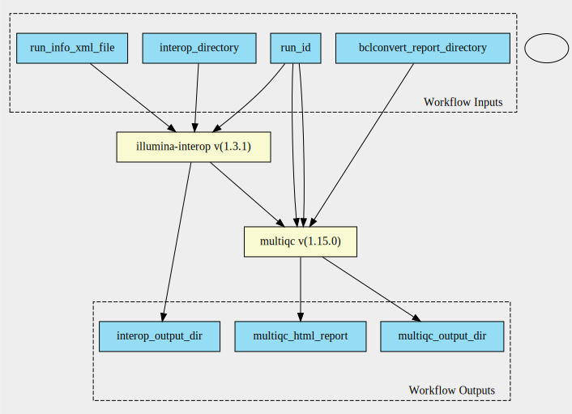

bclconvert-interop-qc 1.3.1--1.19 workflow
==========================================

## Table of Contents
  
- [Overview](#bclconvert-interop-qc-v131--119-overview)  
- [Visual](#visual-workflow-overview)  
- [Links](#related-links)  
- [Inputs](#bclconvert-interop-qc-v131--119-inputs)  
- [Steps](#bclconvert-interop-qc-v131--119-steps)  
- [Outputs](#bclconvert-interop-qc-v131--119-outputs)  
- [ICA](#ica)  

## bclconvert-interop-qc v(1.3.1--1.19) Overview

  
> ID: bclconvert-interop-qc--1.3.1--1.19  
> md5sum: 46af2d9553d8182ec65eaf0db5362890

### bclconvert-interop-qc v(1.3.1--1.19) documentation
  
Documentation for bclconvert-interop-qc v1.3.1--1.19
This workflow has been designed for BCLConvert 4.2.4 outputs. 
The InterOp directory is expected to contain the IndexMetricsOut.bin file, otherwise the
index summary will not be generated.  

### Categories
  

## Visual Workflow Overview
  

## Related Links
  
- [CWL File Path](../../../../../../workflows/bclconvert-interop-qc/1.3.1--1.19/bclconvert-interop-qc__1.3.1--1.19.cwl)  

### Uses
  
- [illumina-interop 1.3.1 :construction:](../../../tools/illumina-interop/1.3.1/illumina-interop__1.3.1.md)  
- [multiqc 1.19.0](../../../tools/multiqc/1.19.0/multiqc__1.19.0.md)  

  

## bclconvert-interop-qc v(1.3.1--1.19) Inputs

### BCLConvert Report Directory

  
> ID: bclconvert_report_directory
  
**Optional:** `False`  
**Type:** `Directory`  
**Docs:**  
The output directory from a BCLConvert run named 'Reports'

### Interop Directory

  
> ID: interop_directory
  
**Optional:** `False`  
**Type:** `Directory`  
**Docs:**  
The interop directory

### Run ID

  
> ID: run_id
  
**Optional:** `False`  
**Type:** `string`  
**Docs:**  
The run ID

### Run Info XML File

  
> ID: run_info_xml_file
  
**Optional:** `False`  
**Type:** `File`  
**Docs:**  
The RunInfo.xml file from the run folder

  

## bclconvert-interop-qc v(1.3.1--1.19) Steps

### Generate InterOp QC

  
> ID: bclconvert-interop-qc--1.3.1--1.19/generate_interop_qc_step
  
**Step Type:** tool  
**Docs:**
  
Generate the interop files by mounting the interop directory underneath a directory named by the run id specified.
along with the run info xml file.

#### Links
  
[CWL File Path](../../../../../../tools/illumina-interop/1.3.1/illumina-interop__1.3.1.cwl)  
[CWL File Help Page :construction:](../../../tools/illumina-interop/1.3.1/illumina-interop__1.3.1.md)  

### Run Multiqc

  
> ID: bclconvert-interop-qc--1.3.1--1.19/run_multiqc_step
  
**Step Type:** tool  
**Docs:**
  
Run MultiQC on the input reports directory along with the generated index summary files

#### Links
  
[CWL File Path](../../../../../../tools/multiqc/1.19.0/multiqc__1.19.0.cwl)  
[CWL File Help Page](../../../tools/multiqc/1.19.0/multiqc__1.19.0.md)  

## bclconvert-interop-qc v(1.3.1--1.19) Outputs

### interop out dir

  
> ID: bclconvert-interop-qc--1.3.1--1.19/interop_output_dir  

  
**Optional:** `False`  
**Output Type:** `Directory`  
**Docs:**  
Directory containing the inteop summary csvs
  

### multiqc html report

  
> ID: bclconvert-interop-qc--1.3.1--1.19/multiqc_html_report  

  
**Optional:** `False`  
**Output Type:** `File`  
**Docs:**  
The HTML report generated by the multiqc step
  

### multiqc output dir

  
> ID: bclconvert-interop-qc--1.3.1--1.19/multiqc_output_dir  

  
**Optional:** `False`  
**Output Type:** `Directory`  
**Docs:**  
Directory containing the multiqc data
  

  

