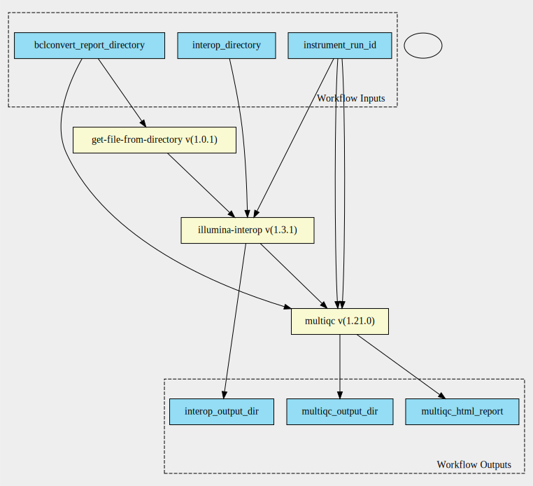

bclconvert-interop-qc 1.3.1--1.21 workflow
==========================================

## Table of Contents
  
- [Overview](#bclconvert-interop-qc-v131--121-overview)  
- [Visual](#visual-workflow-overview)  
- [Links](#related-links)  
- [Inputs](#bclconvert-interop-qc-v131--121-inputs)  
- [Steps](#bclconvert-interop-qc-v131--121-steps)  
- [Outputs](#bclconvert-interop-qc-v131--121-outputs)  
- [ICA](#ica)  

## bclconvert-interop-qc v(1.3.1--1.21) Overview

  
> ID: bclconvert-interop-qc--1.3.1--1.21  
> md5sum: ac758f18a4438440d8c1cae45eb5ffb1

### bclconvert-interop-qc v(1.3.1--1.21) documentation
  
Documentation for bclconvert-interop-qc v1.3.1--1.21
This workflow has been designed for BCLConvert 4.2.7 outputs from the Nextflow autolaunch pipeline. 
The InterOp directory is expected to contain the IndexMetricsOut.bin file, otherwise the
index summary will not be generated.
It is assumed that the Reports directory will contain the RunInfo.xml file

### Categories
  

## Visual Workflow Overview
  

## Related Links
  
- [CWL File Path](../../../../../../workflows/bclconvert-interop-qc/1.3.1--1.21/bclconvert-interop-qc__1.3.1--1.21.cwl)  

### Uses
  
- [illumina-interop 1.3.1 :construction:](../../../tools/illumina-interop/1.3.1/illumina-interop__1.3.1.md)  
- [get-file-from-directory 1.0.1 :construction:](../../../expressions/get-file-from-directory/1.0.1/get-file-from-directory__1.0.1.md)  
- [multiqc 1.21.0](../../../tools/multiqc/1.21.0/multiqc__1.21.0.md)  

  

## bclconvert-interop-qc v(1.3.1--1.21) Inputs

### BCLConvert Report Directory

  
> ID: bclconvert_report_directory
  
**Optional:** `False`  
**Type:** `Directory`  
**Docs:**  
The output directory from a BCLConvert run named 'Reports'

### Instrument Run ID

  
> ID: instrument_run_id
  
**Optional:** `False`  
**Type:** `string`  
**Docs:**  
The instrument run ID

### Interop Directory

  
> ID: interop_directory
  
**Optional:** `False`  
**Type:** `Directory`  
**Docs:**  
The interop directory

  

## bclconvert-interop-qc v(1.3.1--1.21) Steps

### Generate InterOp QC

  
> ID: bclconvert-interop-qc--1.3.1--1.21/generate_interop_qc_step
  
**Step Type:** tool  
**Docs:**
  
Generate the interop files by mounting the interop directory underneath a directory named by the run id specified.
along with the run info xml file.

#### Links
  
[CWL File Path](../../../../../../tools/illumina-interop/1.3.1/illumina-interop__1.3.1.cwl)  
[CWL File Help Page :construction:](../../../tools/illumina-interop/1.3.1/illumina-interop__1.3.1.md)  

### Get RunInfo.xml file from Reports Dir

  
> ID: bclconvert-interop-qc--1.3.1--1.21/get_run_info_xml_file_from_reports_dir
  
**Step Type:** expression  
**Docs:**
  
Get the RunInfo.xml file from the Reports Directory

#### Links
  
[CWL File Path](../../../../../../expressions/get-file-from-directory/1.0.1/get-file-from-directory__1.0.1.cwl)  
[CWL File Help Page :construction:](../../../expressions/get-file-from-directory/1.0.1/get-file-from-directory__1.0.1.md)  

### Run Multiqc

  
> ID: bclconvert-interop-qc--1.3.1--1.21/run_multiqc_step
  
**Step Type:** tool  
**Docs:**
  
Run MultiQC on the input reports directory along with the generated index summary files

#### Links
  
[CWL File Path](../../../../../../tools/multiqc/1.21.0/multiqc__1.21.0.cwl)  
[CWL File Help Page](../../../tools/multiqc/1.21.0/multiqc__1.21.0.md)  

## bclconvert-interop-qc v(1.3.1--1.21) Outputs

### interop out dir

  
> ID: bclconvert-interop-qc--1.3.1--1.21/interop_output_dir  

  
**Optional:** `False`  
**Output Type:** `Directory`  
**Docs:**  
Directory containing the inteop summary csvs
  

### multiqc html report

  
> ID: bclconvert-interop-qc--1.3.1--1.21/multiqc_html_report  

  
**Optional:** `False`  
**Output Type:** `File`  
**Docs:**  
The HTML report generated by the multiqc step
  

### multiqc output dir

  
> ID: bclconvert-interop-qc--1.3.1--1.21/multiqc_output_dir  

  
**Optional:** `False`  
**Output Type:** `Directory`  
**Docs:**  
Directory containing the multiqc data
  

  

