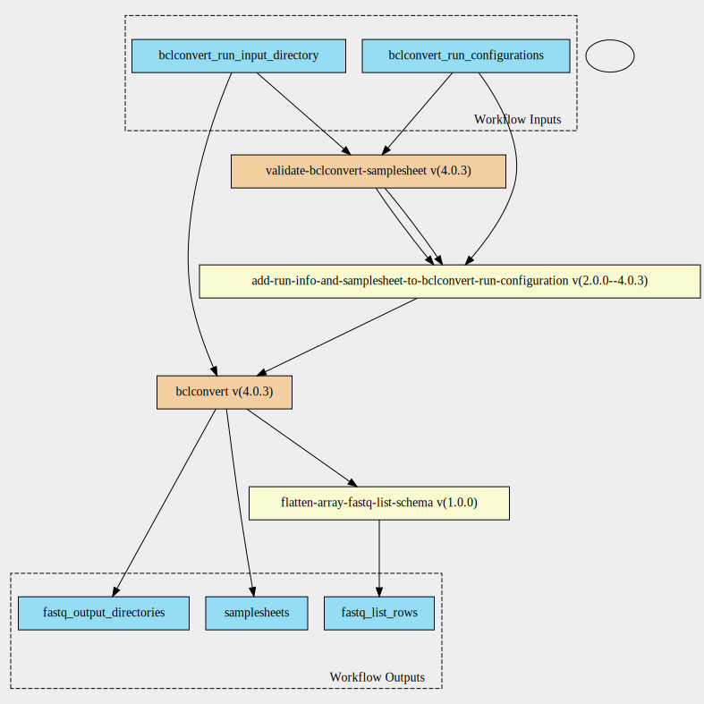

bclconvert-scatter 4.0.3 workflow
=================================

## Table of Contents
  
- [Overview](#bclconvert-scatter-v403-overview)  
- [Visual](#visual-workflow-overview)  
- [Links](#related-links)  
- [Inputs](#bclconvert-scatter-v403-inputs)  
- [Steps](#bclconvert-scatter-v403-steps)  
- [Outputs](#bclconvert-scatter-v403-outputs)  
- [ICA](#ica)  

## bclconvert-scatter v(4.0.3) Overview

  
> ID: bclconvert-scatter--4.0.3  
> md5sum: 401f2a0ab2af0d12a3b42f39573c44d5

### bclconvert-scatter v(4.0.3) documentation
  
Documentation for bclconvert-scatter v4.0.3

### Categories
  

## Visual Workflow Overview
  

## Related Links
  
- [CWL File Path](../../../../../../workflows/bclconvert-scatter/4.0.3/bclconvert-scatter__4.0.3.cwl)  

### Uses
  
- [validate-bclconvert-samplesheet 4.0.3](../../validate-bclconvert-samplesheet/4.0.3/validate-bclconvert-samplesheet__4.0.3.md)  
- [bclconvert 4.0.3](../../bclconvert/4.0.3/bclconvert__4.0.3.md)  
- [flatten-array-fastq-list 1.0.0](../../../expressions/flatten-array-fastq-list/1.0.0/flatten-array-fastq-list__1.0.0.md)  
- [add-run-info-and-samplesheet-to-bclconvert-run-configuration 2.0.0--4.0.3 :construction:](../../../expressions/add-run-info-and-samplesheet-to-bclconvert-run-configuration/2.0.0--4.0.3/add-run-info-and-samplesheet-to-bclconvert-run-configuration__2.0.0--4.0.3.md)  

### Used By
  
- [bclconvert-with-qc-pipeline 4.0.3](../../bclconvert-with-qc-pipeline/4.0.3/bclconvert-with-qc-pipeline__4.0.3.md)  

  

## bclconvert-scatter v(4.0.3) Inputs

### bclconvert run configurations

  
> ID: bclconvert_run_configurations
  
**Optional:** `False`  
**Type:** `bclconvert-run-configuration[]`  
**Docs:**  
The BCLConvert run configuration jsons

### bclconvert run input directory

  
> ID: bclconvert_run_input_directory
  
**Optional:** `False`  
**Type:** `Directory`  
**Docs:**  
The input directory for BCLConvert

  

## bclconvert-scatter v(4.0.3) Steps

### bcl convert samplesheet check step

  
> ID: bclconvert-scatter--4.0.3/bcl_convert_samplesheet_check_scatter_step
  
**Step Type:** workflow  
**Docs:**
  
Run BCLConvert with the --bcl-validate-sample-sheet-only parameter set to true

#### Links
  
[CWL File Path](../../../../../../workflows/validate-bclconvert-samplesheet/4.0.3/validate-bclconvert-samplesheet__4.0.3.cwl)  
[CWL File Help Page](../../validate-bclconvert-samplesheet/4.0.3/validate-bclconvert-samplesheet__4.0.3.md)
#### Subworkflow overview
  
  

### bcl convert samplesheet check step

  
> ID: bclconvert-scatter--4.0.3/bcl_convert_scatter_step
  
**Step Type:** workflow  
**Docs:**
  
Run BCLConvert with the --bcl-validate-sample-sheet-only parameter set to true

#### Links
  
[CWL File Path](../../../../../../workflows/bclconvert/4.0.3/bclconvert__4.0.3.cwl)  
[CWL File Help Page](../../bclconvert/4.0.3/bclconvert__4.0.3.md)
#### Subworkflow overview
  
  

### flatten fastq list rows array

  
> ID: bclconvert-scatter--4.0.3/flatten_fastq_list_rows_array_step
  
**Step Type:** expression  
**Docs:**
  
fastq list rows is an array and bcl convert is from a directory output.
This scatters the arrays to a single array

#### Links
  
[CWL File Path](../../../../../../expressions/flatten-array-fastq-list/1.0.0/flatten-array-fastq-list__1.0.0.cwl)  
[CWL File Help Page](../../../expressions/flatten-array-fastq-list/1.0.0/flatten-array-fastq-list__1.0.0.md)  

### get bclconvert run configuration object step

  
> ID: bclconvert-scatter--4.0.3/get_bcl_convert_run_configuration_object_step
  
**Step Type:** expression  
**Docs:**
  
Get bcl convert run configuration object step for samplesheet validation.  
This means that the bcl_validate_sample_sheet_only is set to true and we
have the run_info and samplesheet parameters set

#### Links
  
[CWL File Path](../../../../../../expressions/add-run-info-and-samplesheet-to-bclconvert-run-configuration/2.0.0--4.0.3/add-run-info-and-samplesheet-to-bclconvert-run-configuration__2.0.0--4.0.3.cwl)  
[CWL File Help Page :construction:](../../../expressions/add-run-info-and-samplesheet-to-bclconvert-run-configuration/2.0.0--4.0.3/add-run-info-and-samplesheet-to-bclconvert-run-configuration__2.0.0--4.0.3.md)  

## bclconvert-scatter v(4.0.3) Outputs

### fastq list rows

  
> ID: bclconvert-scatter--4.0.3/fastq_list_rows  

  
**Optional:** `False`  
**Output Type:** `fastq-list-row[]`  
**Docs:**  
Directories to fastq list rows
  

### fastq output directories

  
> ID: bclconvert-scatter--4.0.3/fastq_output_directories  

  
**Optional:** `False`  
**Output Type:** `.[]`  
**Docs:**  
Directories to output fastq files
  

### samplesheets

  
> ID: bclconvert-scatter--4.0.3/samplesheets  

  
**Optional:** `False`  
**Output Type:** `.[]`  
**Docs:**  
List of samplesheets used to convert
  

  

## ICA

### ToC
  
- [development_workflows](#project-development_workflows)  

### Project: development_workflows

> wfl id: wfl.a700c620e75546098d2414d076a26c13  

  
**workflow name:** bclconvert-scatter_dev-wf  
**wfl version name:** 4.0.3  

  

