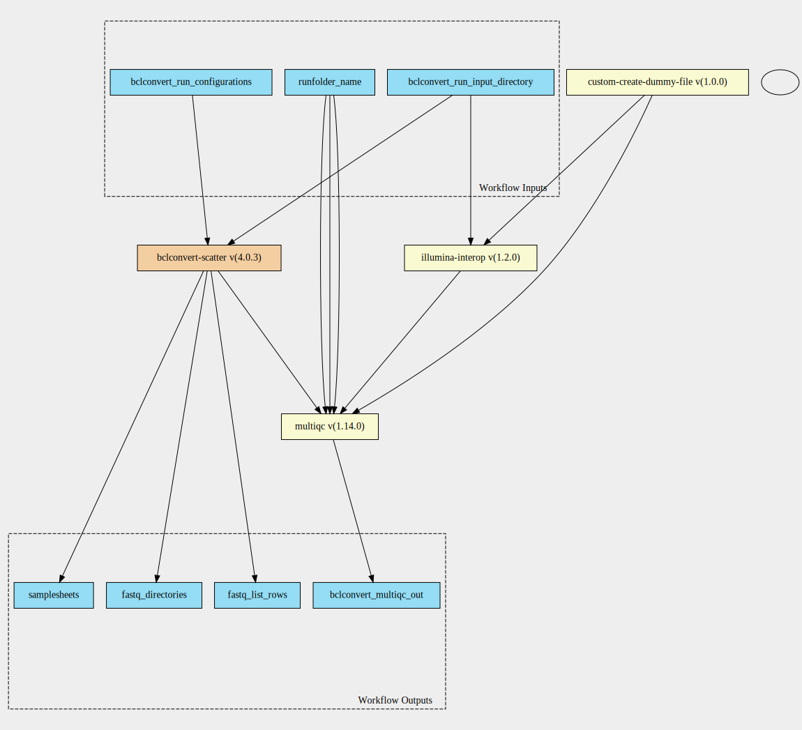

bclconvert-with-qc-pipeline 4.0.3 workflow
==========================================

## Table of Contents
  
- [Overview](#bclconvert-with-qc-pipeline-v403-overview)  
- [Visual](#visual-workflow-overview)  
- [Links](#related-links)  
- [Inputs](#bclconvert-with-qc-pipeline-v403-inputs)  
- [Steps](#bclconvert-with-qc-pipeline-v403-steps)  
- [Outputs](#bclconvert-with-qc-pipeline-v403-outputs)  
- [ICA](#ica)  

## bclconvert-with-qc-pipeline v(4.0.3) Overview

  
> ID: bclconvert-with-qc-pipeline--4.0.3  
> md5sum: 8feb3e4778e1a302d40101e938806e5f

### bclconvert-with-qc-pipeline v(4.0.3) documentation
  
Documentation for bclconvert-with-qc-pipeline v4.0.3

### Categories
  

## Visual Workflow Overview
  

## Related Links
  
- [CWL File Path](../../../../../../workflows/bclconvert-with-qc-pipeline/4.0.3/bclconvert-with-qc-pipeline__4.0.3.cwl)  

### Uses
  
- [multiqc 1.14.0](../../../tools/multiqc/1.14.0/multiqc__1.14.0.md)  
- [custom-touch-file 1.0.0 :construction:](../../../tools/custom-touch-file/1.0.0/custom-touch-file__1.0.0.md)  
- [illumina-interop 1.2.0](../../../tools/illumina-interop/1.2.0/illumina-interop__1.2.0.md)  
- [bclconvert-scatter 4.0.3](../../bclconvert-scatter/4.0.3/bclconvert-scatter__4.0.3.md)  

  

## bclconvert-with-qc-pipeline v(4.0.3) Inputs

### bclconvert run configurations

  
> ID: bclconvert_run_configurations
  
**Optional:** `False`  
**Type:** `bclconvert-run-configuration[]`  
**Docs:**  
The BCLConvert run configuration jsons

### bclconvert run input directory

  
> ID: bclconvert_run_input_directory
  
**Optional:** `False`  
**Type:** `Directory`  
**Docs:**  
The input directory for BCLConvert

### runfolder name

  
> ID: runfolder_name
  
**Optional:** `False`  
**Type:** `string`  
**Docs:**  
Name to use in multiqc outputs

  

## bclconvert-with-qc-pipeline v(4.0.3) Steps

### bclconvert qc step

  
> ID: bclconvert-with-qc-pipeline--4.0.3/bclconvert_qc_step
  
**Step Type:** tool  
**Docs:**
  
The bclconvert qc step - from scatter this takes in an array of dirs

#### Links
  
[CWL File Path](../../../../../../tools/multiqc/1.14.0/multiqc__1.14.0.cwl)  
[CWL File Help Page](../../../tools/multiqc/1.14.0/multiqc__1.14.0.md)  

### create dummy file

  
> ID: bclconvert-with-qc-pipeline--4.0.3/create_dummy_file_step
  
**Step Type:** tool  
**Docs:**
  
Intermediate step for letting multiqc-interop be placed in stream mode

#### Links
  
[CWL File Path](../../../../../../tools/custom-touch-file/1.0.0/custom-touch-file__1.0.0.cwl)  
[CWL File Help Page :construction:](../../../tools/custom-touch-file/1.0.0/custom-touch-file__1.0.0.md)  

### interop qc step

  
> ID: bclconvert-with-qc-pipeline--4.0.3/interop_qc_step
  
**Step Type:** tool  
**Docs:**
  
Run illumina interop on the run

#### Links
  
[CWL File Path](../../../../../../tools/illumina-interop/1.2.0/illumina-interop__1.2.0.cwl)  
[CWL File Help Page](../../../tools/illumina-interop/1.2.0/illumina-interop__1.2.0.md)  

### run bclconvert step

  
> ID: bclconvert-with-qc-pipeline--4.0.3/run_bclconvert_step
  
**Step Type:** workflow  
**Docs:**
  
Runs the bcl convert configurations through the validation check and then through BCLConvert

#### Links
  
[CWL File Path](../../../../../../workflows/bclconvert-scatter/4.0.3/bclconvert-scatter__4.0.3.cwl)  
[CWL File Help Page](../../bclconvert-scatter/4.0.3/bclconvert-scatter__4.0.3.md)
#### Subworkflow overview
  
  

## bclconvert-with-qc-pipeline v(4.0.3) Outputs

### bclconvert multiqc out

  
> ID: bclconvert-with-qc-pipeline--4.0.3/bclconvert_multiqc_out  

  
**Optional:** `False`  
**Output Type:** `Directory`  
**Docs:**  
bclconvert multiqc out
  

### fastq directories

  
> ID: bclconvert-with-qc-pipeline--4.0.3/fastq_directories  

  
**Optional:** `False`  
**Output Type:** `.[]`  
**Docs:**  
Array of directories pointing to the fastq locations
  

### fastq list rows

  
> ID: bclconvert-with-qc-pipeline--4.0.3/fastq_list_rows  

  
**Optional:** `False`  
**Output Type:** `fastq-list-row[]`  
**Docs:**  
Array of fastq list rows
  

### samplesheets

  
> ID: bclconvert-with-qc-pipeline--4.0.3/samplesheets  

  
**Optional:** `False`  
**Output Type:** `.[]`  
**Docs:**  
Array of file locations pointing to the samplesheets
  

  

## ICA

### ToC
  
- [development_workflows](#project-development_workflows)  

### Project: development_workflows

> wfl id: wfl.7944b3f69a264b298952de606beac5f5  

  
**workflow name:** bclconvert-with-qc-pipeline_dev-wf  
**wfl version name:** 4.0.3  

  

