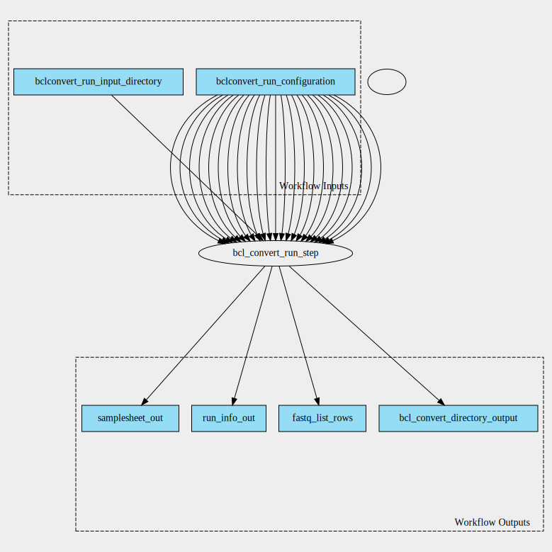

bclconvert 4.0.3 workflow
=========================

## Table of Contents
  
- [Overview](#bclconvert-v403-overview)  
- [Visual](#visual-workflow-overview)  
- [Links](#related-links)  
- [Inputs](#bclconvert-v403-inputs)  
- [Steps](#bclconvert-v403-steps)  
- [Outputs](#bclconvert-v403-outputs)  
- [ICA](#ica)  

## bclconvert v(4.0.3) Overview

  
> ID: bclconvert--4.0.3  
> md5sum: 1f154095e5fa1e1d428973999c8acf98

### bclconvert v(4.0.3) documentation
  
Documentation for bclconvert v4.0.3

### Categories
  

## Visual Workflow Overview
  

## Related Links
  
- [CWL File Path](../../../../../../workflows/bclconvert/4.0.3/bclconvert__4.0.3.cwl)  

### Uses
  
- [bcl-convert 4.0.3](../../../tools/bcl-convert/4.0.3/bcl-convert__4.0.3.md)  

### Used By
  
- [bclconvert-scatter 4.0.3](../../bclconvert-scatter/4.0.3/bclconvert-scatter__4.0.3.md)  

  

## bclconvert v(4.0.3) Inputs

### bclconvert run configuration

  
> ID: bclconvert_run_configuration
  
**Optional:** `False`  
**Type:** `file:///home/runner/work/cwl-ica/cwl-ica/schemas/bclconvert-run-configuration/2.0.0--4.0.3/bclconvert-run-configuration__2.0.0--4.0.3.yaml#bclconvert-run-configuration`  
**Docs:**  
The BCLConvert run configuration jsons

### bclconvert run input directory

  
> ID: bclconvert_run_input_directory
  
**Optional:** `False`  
**Type:** `Directory`  
**Docs:**  
The input directory for BCLConvert

  

## bclconvert v(4.0.3) Steps

### bcl convert samplesheet run step

  
> ID: bclconvert--4.0.3/bcl_convert_run_step
  
**Step Type:** tool  
**Docs:**
  
Run BCLConvert - but set run requirements based on whether the bcl_validate_sample_sheet_only parameter is set to true or not

#### Links
  
[CWL File Path](../../../../../../tools/bcl-convert/4.0.3/bcl-convert__4.0.3.cwl)  
[CWL File Help Page](../../../tools/bcl-convert/4.0.3/bcl-convert__4.0.3.md)  

## bclconvert v(4.0.3) Outputs

### bcl convert directory output

  
> ID: bclconvert--4.0.3/bcl_convert_directory_output  

  
**Optional:** `False`  
**Output Type:** `Directory`  
**Docs:**  
Directories to output fastq files
  

### fastq list rows

  
> ID: bclconvert--4.0.3/fastq_list_rows  

  
**Optional:** `True`  
**Output Type:** `fastq-list-row[]`  
**Docs:**  
Directories to fastq list rows
Optional output since this workflow may be used as a validation workflow
  

### run info out

  
> ID: bclconvert--4.0.3/run_info_out  

  
**Optional:** `False`  
**Output Type:** `File`  
**Docs:**  
The run info file used by the workflow
  

### samplesheet out

  
> ID: bclconvert--4.0.3/samplesheet_out  

  
**Optional:** `False`  
**Output Type:** `File`  
**Docs:**  
The samplesheet file used by the workflow
  

  

## ICA

### ToC
  
- [development_workflows](#project-development_workflows)  

### Project: development_workflows

> wfl id: wfl.030c65841edd4b8093a5106e9a100a0d  

  
**workflow name:** bclconvert_dev-wf  
**wfl version name:** 4.0.3  

  

