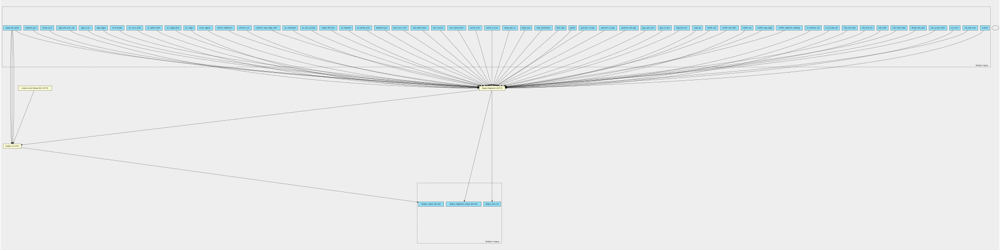

dragen-alignment-pipeline 4.0.3 workflow
========================================

## Table of Contents
  
- [Overview](#dragen-alignment-pipeline-v403-overview)  
- [Visual](#visual-workflow-overview)  
- [Links](#related-links)  
- [Inputs](#dragen-alignment-pipeline-v403-inputs)  
- [Steps](#dragen-alignment-pipeline-v403-steps)  
- [Outputs](#dragen-alignment-pipeline-v403-outputs)  
- [ICA](#ica)  

## dragen-alignment-pipeline v(4.0.3) Overview

  
> ID: dragen-alignment-pipeline--4.0.3  
> md5sum: 191c9e0900e31d74a4434b130b7a2a92

### dragen-alignment-pipeline v(4.0.3) documentation
  
Documentation for dragen-alignment-pipeline v4.0.3

### Categories
  
- alignment  
- dragen  

## Visual Workflow Overview
  

## Related Links
  
- [CWL File Path](../../../../../../workflows/dragen-alignment-pipeline/4.0.3/dragen-alignment-pipeline__4.0.3.cwl)  

### Uses
  
- [custom-touch-file 1.0.0 :construction:](../../../tools/custom-touch-file/1.0.0/custom-touch-file__1.0.0.md)  
- [multiqc 1.14.0](../../../tools/multiqc/1.14.0/multiqc__1.14.0.md)  
- [dragen-alignment 4.0.3](../../../tools/dragen-alignment/4.0.3/dragen-alignment__4.0.3.md)  

  

## dragen-alignment-pipeline v(4.0.3) Inputs

### aln min score

  
> ID: aln_min_score
  
**Optional:** `True`  
**Type:** `int`  
**Docs:**  
(signed) Minimum alignment score to report; baseline for MAPQ.

When using local alignments (global = 0), aln-min-score is computed by the host software as "22 * match-score".

When using global alignments (global = 1), aln-min-score is set to -1000000.

Host software computation may be overridden by setting aln-min-score in configuration file.

Range: −2,147,483,648 to 2,147,483,647

### alt aware

  
> ID: alt_aware
  
**Optional:** `True`  
**Type:** `boolean`  
**Docs:**  
Enables special processing for alt contigs, if alt liftover was used in hash table.
Enabled by default if reference was built with liftover.

### ann sj max indel

  
> ID: ann_sj_max_indel
  
**Optional:** `True`  
**Type:** `int`  
**Docs:**  
Maximum indel length to expect near an annotated splice junction.
Range: 0 - 63

### dedup min qual

  
> ID: dedup_min_qual
  
**Optional:** `True`  
**Type:** `int`  
**Docs:**  
Minimum base quality for calculating read quality metric for deduplication.
Range: 0-63

### edit chain limit

  
> ID: edit_chain_limit
  
**Optional:** `True`  
**Type:** `int`  
**Docs:**  
For edit-mode 1 or 2: Maximum seed chain length in a read to qualify for seed editing.
Range: > 0

### edit mode

  
> ID: edit_mode
  
**Optional:** `True`  
**Type:** `[ 0 | 1 | 2 | 3  ]`  
**Docs:**  
0 = No edits, 1 = Chain len test, 2 = Paired chain len test, 3 = Edit all std seeds.

### edit read len

  
> ID: edit_read_len
  
**Optional:** `True`  
**Type:** `int`  
**Docs:**  
For edit-mode 1 or 2: Read length in which to try edit-seed-num edited seeds.
Range: > 0

### edit seed num

  
> ID: edit_seed_num
  
**Optional:** `True`  
**Type:** `int`  
**Docs:**  
For edit-mode 1 or 2: Requested number of seeds per read to allow editing on.
Range: > 0

### en alt hap aln

  
> ID: en_alt_hap_aln
  
**Optional:** `True`  
**Type:** `boolean`  
**Docs:**  
Allows chimeric alignments to be output, as supplementary.

### en chimeric aln

  
> ID: en_chimeric_aln
  
**Optional:** `True`  
**Type:** `boolean`  
**Docs:**  
Allows chimeric alignments to be output, as supplementary.

### enable duplicate marking

  
> ID: enable_duplicate_marking
  
**Optional:** `True`  
**Type:** `boolean`  
**Docs:**  
Enable the flagging of duplicate output alignment records.

### enable map align

  
> ID: enable_map_align
  
**Optional:** `True`  
**Type:** `boolean`  
**Docs:**  
Enable use of BAM input files for mapper/aligner.

### enable rna

  
> ID: enable_rna
  
**Optional:** `True`  
**Type:** `boolean`  
**Docs:**  
Enable rna specific settings

### enable rrna filtering

  
> ID: enable_rrna_filter
  
**Optional:** `True`  
**Type:** `boolean`  
**Docs:**  
Use the DRAGEN RNA pipeline to filter rRNA reads during alignment. The default value is false.

### enable sort

  
> ID: enable_sort
  
**Optional:** `True`  
**Type:** `boolean`  
**Docs:**  
Enable sorting after mapping/alignment.

### fastq list

  
> ID: fastq_list
  
**Optional:** `True`  
**Type:** `File`  
**Docs:**  
CSV file that contains a list of FASTQ files for normal sample
to process (read_1 and read_2 attributes must be presigned urls for each column)

### Row of fastq lists

  
> ID: fastq_list_rows
  
**Optional:** `True`  
**Type:** `fastq-list-row[]`  
**Docs:**  
The row of fastq lists.
Each row has the following attributes:
  * RGID
  * RGLB
  * RGSM
  * Lane
  * Read1File
  * Read2File (optional)

### gap ext pen

  
> ID: gap_ext_pen
  
**Optional:** `True`  
**Type:** `int`  
**Docs:**  
Score penalty for gap extension.

### gap open pen

  
> ID: gap_open_pen
  
**Optional:** `True`  
**Type:** `int`  
**Docs:**  
Score penalty for opening a gap (insertion or deletion).

### generate md tags

  
> ID: generate_md_tags
  
**Optional:** `True`  
**Type:** `boolean`  
**Docs:**  
Whether to generate MD tags with alignment output records. Default is false.

### generate sa tags

  
> ID: generate_sa_tags
  
**Optional:** `True`  
**Type:** `boolean`  
**Docs:**  
Whether to generate SA:Z tags for records that have chimeric/supplemental alignments.

### generate zs tags

  
> ID: generate_zs_tags
  
**Optional:** `True`  
**Type:** `boolean`  
**Docs:**  
Whether to generate ZS tags for alignment output records. Default is false.

### global

  
> ID: global
  
**Optional:** `True`  
**Type:** `boolean`  
**Docs:**  
If alignment is global (Needleman-Wunsch) rather than local (Smith-Waterman).

### hard clips

  
> ID: hard_clips
  
**Optional:** `True`  
**Type:** `int`  
**Docs:**  
Flags for hard clipping: [0] primary, [1] supplementary, [2] secondary.
The hard-clips option is used as a field of 3 bits, with values ranging from 0 to 7.
The bits specify alignments, as follows:
  * Bit 0—primary alignments
  * Bit 1—supplementary alignments
  * Bit 2—secondary alignments
Each bit determines whether local alignments of that type are reported with hard clipping (1)
or soft clipping (0).
The default is 6, meaning primary alignments use soft clipping and supplementary and
secondary alignments use hard clipping.

### map orientations

  
> ID: map_orientations
  
**Optional:** `True`  
**Type:** `[ 0 | 1 | 2  ]`  
**Docs:**  
Constrain orientations to accept forward-only, reverse-complement only, or any alignments.

### mapq max

  
> ID: mapq_max
  
**Optional:** `True`  
**Type:** `int`  
**Docs:**  
Ceiling on reported MAPQ. Max 255

### mapq strict js

  
> ID: mapq_strict_js
  
**Optional:** `True`  
**Type:** `boolean`  
**Docs:**  
Specific to RNA. When set to 0, a higher MAPQ value is returned, expressing confidence that the alignment is at least partially correct. When set to 1, a lower MAPQ value is returned, expressing the splice junction ambiguity.

### match n score

  
> ID: match_n_score
  
**Optional:** `True`  
**Type:** `int`  
**Docs:**  
(signed) Score increment for matching a reference 'N' nucleotide IUB code.
Range: -16 to 15

### match score

  
> ID: match_score
  
**Optional:** `True`  
**Type:** `float`  
**Docs:**  
Score increment for matching reference nucleotide.
When global = 0, match-score > 0; When global = 1, match-score >= 0

### max intron bases

  
> ID: max_intron_bases
  
**Optional:** `True`  
**Type:** `int`  
**Docs:**  
Maximum intron length reported.

### max rescues

  
> ID: max_rescues
  
**Optional:** `True`  
**Type:** `int`  
**Docs:**  
Maximum rescue alignments per read pair. Default is 10

### min intron bases

  
> ID: min_intron_bases
  
**Optional:** `True`  
**Type:** `int`  
**Docs:**  
Minimum reference deletion length reported as an intron.

### min score coeff

  
> ID: min_score_coeff
  
**Optional:** `True`  
**Type:** `float`  
**Docs:**  
Adjustment to aln-min-score per read base.
Range: -64 to 63.999

### mismatch pen

  
> ID: mismatch_pen
  
**Optional:** `True`  
**Type:** `int`  
**Docs:**  
Score penalty for a mismatch.

### no unclip score

  
> ID: no_unclip_score
  
**Optional:** `True`  
**Type:** `boolean`  
**Docs:**  
When no-unclip-score is set to 1, any unclipped bonus (unclip-score) contributing to an alignment is removed from the alignment score before further processing.

### no unpaired

  
> ID: no_unpaired
  
**Optional:** `True`  
**Type:** `boolean`  
**Docs:**  
If only properly paired alignments should be reported for paired reads.

### output directory

  
> ID: output_directory
  
**Optional:** `False`  
**Type:** `string`  
**Docs:**  
The directory where all output files are placed

### output file prefix

  
> ID: output_file_prefix
  
**Optional:** `False`  
**Type:** `string`  
**Docs:**  
The prefix given to all output files

### pe max penalty

  
> ID: pe_max_penalty
  
**Optional:** `True`  
**Type:** `int`  
**Docs:**  
Maximum pairing score penalty, for unpaired or distant ends.
Range: 0-255

### pe orientation

  
> ID: pe_orientation
  
**Optional:** `True`  
**Type:** `[ 0 | 1 | 2  ]`  
**Docs:**  
Expected paired-end orientation: 0=FR, 1=RF, 2=FF.

### preserve map align order

  
> ID: preserve_map_align_order
  
**Optional:** `True`  
**Type:** `boolean`  
**Docs:**  
Produce output file that preserves original order of reads in the input file.

### reference tar

  
> ID: reference_tar
  
**Optional:** `False`  
**Type:** `File`  
**Docs:**  
Path to ref data tarball

### remove duplicates

  
> ID: remove_duplicates
  
**Optional:** `True`  
**Type:** `boolean`  
**Docs:**  
If true, remove duplicate alignment records instead of just flagging them.

### rescue sigmas

  
> ID: rescue_sigmas
  
**Optional:** `True`  
**Type:** `float`  
**Docs:**  
Deviations from the mean read length used for rescue scan radius. Default is 2.5.

### sec aligns

  
> ID: sec_aligns
  
**Optional:** `True`  
**Type:** `int`  
**Docs:**  
Maximum secondary (suboptimal) alignments to report per read.
Range: 0 - 30

### sec aligns hard

  
> ID: sec_aligns_hard
  
**Optional:** `True`  
**Type:** `boolean`  
**Docs:**  
Set to force unmapped when not all secondary alignments can be output.

### sec phred delta

  
> ID: sec_phred_delta
  
**Optional:** `True`  
**Type:** `int`  
**Docs:**  
Only secondary alignments with likelihood within this Phred of the primary are reported.
Range: 0 - 255

### sec score delta

  
> ID: sec_score_delta
  
**Optional:** `True`  
**Type:** `float`  
**Docs:**  
Secondary aligns allowed with pair score no more than this far below primary.

### seed density

  
> ID: seed_density
  
**Optional:** `True`  
**Type:** `float`  
**Docs:**  
Requested density of seeds from reads queried in the hash table
Range: 0 - 1

### supp aligns

  
> ID: supp_aligns
  
**Optional:** `True`  
**Type:** `int`  
**Docs:**  
Maximum supplementary (chimeric) alignments to report per read.

### supp as sec

  
> ID: supp_as_sec
  
**Optional:** `True`  
**Type:** `boolean`  
**Docs:**  
If supplementary alignments should be reported with secondary flag.

### supp min score adj

  
> ID: supp_min_score_adj
  
**Optional:** `True`  
**Type:** `float`  
**Docs:**  
Amount to increase minimum alignment score for supplementary alignments.
This score is computed by host software as "8 * match-score" for DNA, and is default 0 for RNA.

### unclip score

  
> ID: unclip_score
  
**Optional:** `True`  
**Type:** `int`  
**Docs:**  
Score bonus for reaching each edge of the read.
Range: 0 - 127

### unpaired pen

  
> ID: unpaired_pen
  
**Optional:** `True`  
**Type:** `int`  
**Docs:**  
Penalty for unpaired alignments in Phred scale.
Range: 0 - 255

### verbose

  
> ID: verbose
  
**Optional:** `True`  
**Type:** `boolean`  
**Docs:**  
Enable verbose output from DRAGEN.

  

## dragen-alignment-pipeline v(4.0.3) Steps

### Create dummy file

  
> ID: dragen-alignment-pipeline--4.0.3/create_dummy_file_step
  
**Step Type:** tool  
**Docs:**
  
Intermediate step for letting multiqc-interop be placed in stream mode

#### Links
  
[CWL File Path](../../../../../../tools/custom-touch-file/1.0.0/custom-touch-file__1.0.0.cwl)  
[CWL File Help Page :construction:](../../../tools/custom-touch-file/1.0.0/custom-touch-file__1.0.0.md)  

### dragen qc step

  
> ID: dragen-alignment-pipeline--4.0.3/dragen_qc_step
  
**Step Type:** tool  
**Docs:**
  
The dragen qc step - this takes in an array of dirs

#### Links
  
[CWL File Path](../../../../../../tools/multiqc/1.14.0/multiqc__1.14.0.cwl)  
[CWL File Help Page](../../../tools/multiqc/1.14.0/multiqc__1.14.0.md)  

### run dragen alignment step

  
> ID: dragen-alignment-pipeline--4.0.3/run_dragen_alignment_step
  
**Step Type:** tool  
**Docs:**
  
Runs the alignment step on a dragen fpga
Takes in a fastq list and corresponding mount paths from the predefined mount paths
All other options available at the top of the workflow

#### Links
  
[CWL File Path](../../../../../../tools/dragen-alignment/4.0.3/dragen-alignment__4.0.3.cwl)  
[CWL File Help Page](../../../tools/dragen-alignment/4.0.3/dragen-alignment__4.0.3.md)  

## dragen-alignment-pipeline v(4.0.3) Outputs

### dragen alignment output directory

  
> ID: dragen-alignment-pipeline--4.0.3/dragen_alignment_output_directory  

  
**Optional:** `False`  
**Output Type:** `Directory`  
**Docs:**  
The output directory containing all alignment output files and qc metrics
  

### dragen bam out

  
> ID: dragen-alignment-pipeline--4.0.3/dragen_bam_out  

  
**Optional:** `False`  
**Output Type:** `File`  
**Docs:**  
The output alignment file
  

### dragen QC report out

  
> ID: dragen-alignment-pipeline--4.0.3/multiqc_output_directory  

  
**Optional:** `False`  
**Output Type:** `Directory`  
**Docs:**  
The dragen multiQC output
  

  

## ICA

### ToC
  
- [development_workflows](#project-development_workflows)  

### Project: development_workflows

> wfl id: wfl.a3e19e590ed34a0fa0518718cb8a36cf  

  
**workflow name:** dragen-alignment-pipeline_dev-wf  
**wfl version name:** 4.0.3  

  

