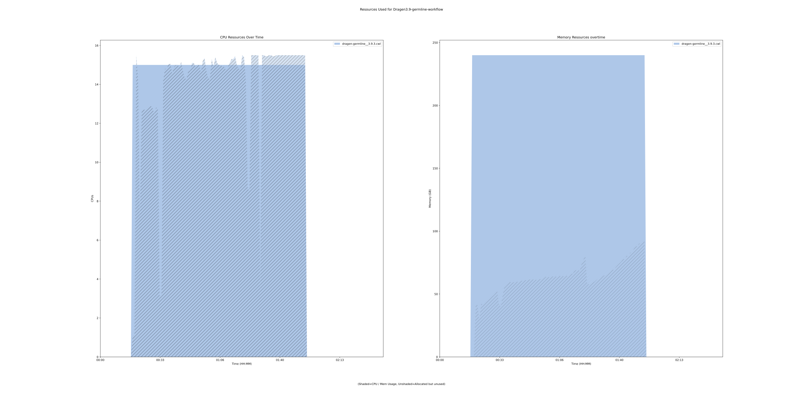
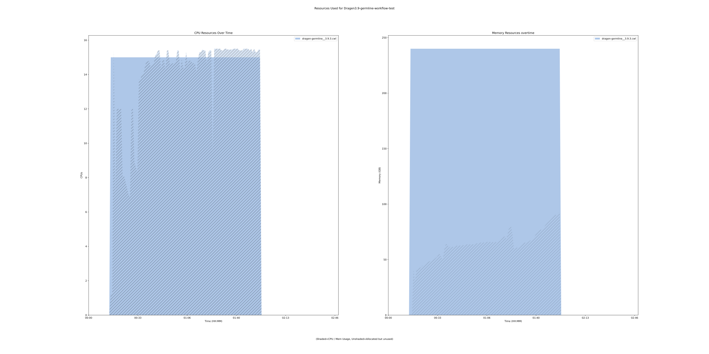

dragen-germline-pipeline 3.9.3 workflow
=======================================

## Table of Contents
  
- [Overview](#dragen-germline-pipeline-v393-overview)  
- [Visual](#visual-workflow-overview)  
- [Links](#related-links)  
- [Inputs](#dragen-germline-pipeline-v393-inputs)  
- [Steps](#dragen-germline-pipeline-v393-steps)  
- [Outputs](#dragen-germline-pipeline-v393-outputs)  
- [ICA](#ica)  


## dragen-germline-pipeline v(3.9.3) Overview


  
> ID: dragen-germline-pipeline--3.9.3  
> md5sum: 8b017ba4dae2cb1137b80644b47f566e

### dragen-germline-pipeline v(3.9.3) documentation
  
Workflow takes in dragen param along with object store version of a fastq_list.csv equivalent.
See the fastq_list_row schema definitions for more information.
More information on the documentation can be found [here](https://support-docs.illumina.com/SW/DRAGEN_v39/Content/SW/FrontPages/DRAGEN.htm)

### Categories
  
- dragen  


## Visual Workflow Overview
  
[](https://github.com/umccr/cwl-ica/raw/main/.github/catalogue/images/workflows/dragen-germline-pipeline/3.9.3/dragen-germline-pipeline__3.9.3.svg)
## Related Links
  
- [CWL File Path](../../../../../../workflows/dragen-germline-pipeline/3.9.3/dragen-germline-pipeline__3.9.3.cwl)  


### Uses
  
- [custom-touch-file 1.0.0 :construction:](../../../tools/custom-touch-file/1.0.0/custom-touch-file__1.0.0.md)  
- [multiqc 1.14.0](../../../tools/multiqc/1.14.0/multiqc__1.14.0.md)  
- [dragen-germline 3.9.3](../../../tools/dragen-germline/3.9.3/dragen-germline__3.9.3.md)  


### Used By
  
- [umccrise-with-dragen-germline-pipeline 2.0.0--3.9.3](../../umccrise-with-dragen-germline-pipeline/2.0.0--3.9.3/umccrise-with-dragen-germline-pipeline__2.0.0--3.9.3.md)  
- [umccrise-with-dragen-germline-pipeline 2.0.1--3.9.3](../../umccrise-with-dragen-germline-pipeline/2.0.1--3.9.3/umccrise-with-dragen-germline-pipeline__2.0.1--3.9.3.md)  
- [umccrise-with-dragen-germline-pipeline 2.0.2--3.9.3](../../umccrise-with-dragen-germline-pipeline/2.0.2--3.9.3/umccrise-with-dragen-germline-pipeline__2.0.2--3.9.3.md)  
- [umccrise-with-dragen-germline-pipeline 2.1.0--3.9.3](../../umccrise-with-dragen-germline-pipeline/2.1.0--3.9.3/umccrise-with-dragen-germline-pipeline__2.1.0--3.9.3.md)  
- [umccrise-with-dragen-germline-pipeline 2.1.1--3.9.3](../../umccrise-with-dragen-germline-pipeline/2.1.1--3.9.3/umccrise-with-dragen-germline-pipeline__2.1.1--3.9.3.md)  
- [umccrise-with-dragen-germline-pipeline 2.2.0--3.9.3](../../umccrise-with-dragen-germline-pipeline/2.2.0--3.9.3/umccrise-with-dragen-germline-pipeline__2.2.0--3.9.3.md)  
- [umccrise-with-dragen-germline-pipeline 2.2.1--3.9.3](../../umccrise-with-dragen-germline-pipeline/2.2.1--3.9.3/umccrise-with-dragen-germline-pipeline__2.2.1--3.9.3.md)  

  


## dragen-germline-pipeline v(3.9.3) Inputs

### cnv enable self normalization


  
> ID: cnv_enable_self_normalization
  
**Optional:** `True`  
**Type:** `boolean`  
**Docs:**  
Enable CNV self normalization.
Self Normalization requires that the DRAGEN hash table be generated with the enable-cnv=true option.


### dbsnp annotation


  
> ID: dbsnp_annotation
  
**Optional:** `True`  
**Type:** `File`  
**Docs:**  
In Germline, Tumor-Normal somatic, or Tumor-Only somatic modes,
DRAGEN can look up variant calls in a dbSNP database and add annotations for any matches that it finds there.
To enable the dbSNP database search, set the --dbsnp option to the full path to the dbSNP database
VCF or .vcf.gz file, which must be sorted in reference order.


### deduplicate minimum quality


  
> ID: dedup_min_qual
  
**Optional:** `True`  
**Type:** `int`  
**Docs:**  
Specifies the Phred quality score below which a base should be excluded from the quality score
calculation used for choosing among duplicate reads.


### enable cnv calling


  
> ID: enable_cnv
  
**Optional:** `True`  
**Type:** `boolean`  
**Docs:**  
Enable CNV processing in the DRAGEN Host Software.


### enable duplicate marking


  
> ID: enable_duplicate_marking
  
**Optional:** `False`  
**Type:** `boolean`  
**Docs:**  
Enable the flagging of duplicate output
alignment records.


### enable hla


  
> ID: enable_hla
  
**Optional:** `True`  
**Type:** `boolean`  
**Docs:**  
Enable HLA typing by setting --enable-hla flag to true


### enable map align output


  
> ID: enable_map_align_output
  
**Optional:** `False`  
**Type:** `boolean`  
**Docs:**  
Enables saving the output from the
map/align stage. Default is true when only
running map/align. Default is false if
running the variant caller.


### enable sv


  
> ID: enable_sv
  
**Optional:** `True`  
**Type:** `boolean`  
**Docs:**  
Enable/disable structural variant
caller. Default is false.


### fastq list


  
> ID: fastq_list
  
**Optional:** `True`  
**Type:** `File`  
**Docs:**  
CSV file that contains a list of FASTQ files for normal sample
to process (read_1 and read_2 attributes must be presigned urls for each column)


### Row of fastq lists


  
> ID: fastq_list_rows
  
**Optional:** `True`  
**Type:** `fastq-list-row[]`  
**Docs:**  
The row of fastq lists.
Each row has the following attributes:
  * RGID
  * RGLB
  * RGSM
  * Lane
  * Read1File
  * Read2File (optional)


### hla allele frequency file


  
> ID: hla_allele_frequency_file
  
**Optional:** `True`  
**Type:** `File`  
**Docs:**  
Use the population-level HLA allele frequency file to break ties if one or more HLA allele produces the same or similar results.
The input HLA allele frequency file must be in CSV format and contain the HLA alleles and the occurrence frequency in population.
If --hla-allele-frequency-file is not specified, DRAGEN automatically uses hla_classI_allele_frequency.csv from /opt/edico/config/.
Population-level allele frequencies can be obtained from the Allele Frequency Net database.


### hla bed file


  
> ID: hla_bed_file
  
**Optional:** `True`  
**Type:** `File`  
**Docs:**  
Use the HLA region BED input file to specify the region to extract HLA reads from.
DRAGEN HLA Caller parses the input file for regions within the BED file, and then
extracts reads accordingly to align with the HLA allele reference.


### hla min reads


  
> ID: hla_min_reads
  
**Optional:** `True`  
**Type:** `int`  
**Docs:**  
Set the minimum number of reads to align to HLA alleles to ensure sufficient coverage and perform HLA typing.
The default value is 1000 and suggested for WES samples. If using samples with less coverage, you can use a
lower threshold value.


### hla reference file


  
> ID: hla_reference_file
  
**Optional:** `True`  
**Type:** `File`  
**Docs:**  
Use the HLA allele reference file to specify the reference alleles to align against.
The input HLA reference file must be in FASTA format and contain the protein sequence separated into exons.
If --hla-reference-file is not specified, DRAGEN uses hla_classI_ref_freq.fasta from /opt/edico/config/.
The reference HLA sequences are obtained from the IMGT/HLA database.


### hla tiebreaker threshold


  
> ID: hla_tiebreaker_threshold
  
**Optional:** `True`  
**Type:** `float`  
**Docs:**  
If more than one allele has a similar number of reads aligned and there is not a clear indicator for the best allele,
the alleles are considered as ties. The HLA Caller places the tied alleles into a candidate set for tie breaking based
on the population allele frequency. If an allele has more than the specified fraction of reads aligned (normalized to
the top hit), then the allele is included into the candidate set for tie breaking. The default value is 0.97.


### hla zygosity threshold


  
> ID: hla_zygosity_threshold
  
**Optional:** `True`  
**Type:** `float`  
**Docs:**  
If the minor allele at a given locus has fewer reads mapped than a fraction of the read count of the major allele,
then the HLA Caller infers homozygosity for the given HLA-I gene. You can use this option to specify the fraction value.
The default value is 0.15.


### license instance id location


  
> ID: lic_instance_id_location
  
**Optional:** `True`  
**Type:** `['File', 'string']`  
**Docs:**  
You may wish to place your own in.
Optional value, default set to /opt/instance-identity
which is a path inside the dragen container


### output directory


  
> ID: output_directory
  
**Optional:** `False`  
**Type:** `string`  
**Docs:**  
The directory where all output files are placed


### output file prefix


  
> ID: output_file_prefix
  
**Optional:** `False`  
**Type:** `string`  
**Docs:**  
The prefix given to all output files


### qc coverage ignore overlaps


  
> ID: qc_coverage_ignore_overlaps
  
**Optional:** `True`  
**Type:** `boolean`  
**Docs:**  
Set to true to resolve all of the alignments for each fragment and avoid double-counting any
overlapping bases. This might result in marginally longer run times.
This option also requires setting --enable-map-align=true.


### qc coverage region 1


  
> ID: qc_coverage_region_1
  
**Optional:** `True`  
**Type:** `File`  
**Docs:**  
Generates coverage region report using bed file 1.


### qc coverage region 2


  
> ID: qc_coverage_region_2
  
**Optional:** `True`  
**Type:** `File`  
**Docs:**  
Generates coverage region report using bed file 2.


### qc coverage region 3


  
> ID: qc_coverage_region_3
  
**Optional:** `True`  
**Type:** `File`  
**Docs:**  
Generates coverage region report using bed file 3.


### reference tar


  
> ID: reference_tar
  
**Optional:** `False`  
**Type:** `File`  
**Docs:**  
Path to ref data tarball


### sample sex


  
> ID: sample_sex
  
**Optional:** `True`  
**Type:** `[ male | female  ]`  
**Docs:**  
Specifies the sex of a sample


### sv call regions bed


  
> ID: sv_call_regions_bed
  
**Optional:** `True`  
**Type:** `File`  
**Docs:**  
Specifies a BED file containing the set of regions to call.


### sv discovery


  
> ID: sv_discovery
  
**Optional:** `True`  
**Type:** `boolean`  
**Docs:**  
Enable SV discovery. This flag can be set to false only when --sv-forcegt-vcf is used.
When set to false, SV discovery is disabled and only the forced genotyping input variants
are processed. The default is true.


### sv enable liquid tumor mode


  
> ID: sv_enable_liquid_tumor_mode
  
**Optional:** `True`  
**Type:** `boolean`  
**Docs:**  
Enable liquid tumor mode.


### sv exome


  
> ID: sv_exome
  
**Optional:** `True`  
**Type:** `boolean`  
**Docs:**  
Set to true to configure the variant caller for targeted sequencing inputs,
which includes disabling high depth filters.
In integrated mode, the default is to autodetect targeted sequencing input,
and in standalone mode the default is false.


### sv forcegt vcf


  
> ID: sv_forcegt_vcf
  
**Optional:** `True`  
**Type:** `File`  
**Docs:**  
Specify a VCF of structural variants for forced genotyping. The variants are scored and emitted
in the output VCF even if not found in the sample data.
The variants are merged with any additional variants discovered directly from the sample data.


### sv output contigs


  
> ID: sv_output_contigs
  
**Optional:** `True`  
**Type:** `boolean`  
**Docs:**  
Set to true to have assembled contig sequences output in a VCF file. The default is false.


### sv region


  
> ID: sv_region
  
**Optional:** `True`  
**Type:** `string`  
**Docs:**  
Limit the analysis to a specified region of the genome for debugging purposes.
This option can be specified multiple times to build a list of regions.
The value must be in the format “chr:startPos-endPos”..


### sv use overlap pair evidence


  
> ID: sv_se_overlap_pair_evidence
  
**Optional:** `True`  
**Type:** `boolean`  
**Docs:**  
Allow overlapping read pairs to be considered as evidence.
By default, DRAGEN uses autodetect on the fraction of overlapping read pairs if <20%.


### sv tin contam tolerance


  
> ID: sv_tin_contam_tolerance
  
**Optional:** `True`  
**Type:** `float`  
**Docs:**  
Set the Tumor-in-Normal (TiN) contamination tolerance level.
You can enter any value between 0–1. The default maximum TiN contamination tolerance is 0.15.


### vc decoy contigs


  
> ID: vc_decoy_contigs
  
**Optional:** `True`  
**Type:** `string`  
**Docs:**  
The --vc-decoy-contigs option specifies a comma-separated list of contigs to skip during variant calling.
This option can be set in the configuration file.


### vc enable baf


  
> ID: vc_enable_baf
  
**Optional:** `True`  
**Type:** `boolean`  
**Docs:**  
Enable or disable B-allele frequency output. Enabled by default.


### vc enable decoy contigs


  
> ID: vc_enable_decoy_contigs
  
**Optional:** `True`  
**Type:** `boolean`  
**Docs:**  
If --vc-enable-decoy-contigs is set to true, variant calls on the decoy contigs are enabled.
The default value is false.


### vc enable gatk acceleration


  
> ID: vc_enable_gatk_acceleration
  
**Optional:** `True`  
**Type:** `boolean`  
**Docs:**  
If is set to true, the variant caller runs in GATK mode
(concordant with GATK 3.7 in germline mode and GATK 4.0 in somatic mode).


### vc enable phasing


  
> ID: vc_enable_phasing
  
**Optional:** `True`  
**Type:** `boolean`  
**Docs:**  
The –vc-enable-phasing option enables variants to be phased when possible. The default value is true.


### vc enable roh


  
> ID: vc_enable_roh
  
**Optional:** `True`  
**Type:** `boolean`  
**Docs:**  
Enable or disable the ROH caller by setting this option to true or false. Enabled by default for human autosomes only.


### vc enable vcf output


  
> ID: vc_enable_vcf_output
  
**Optional:** `True`  
**Type:** `boolean`  
**Docs:**  
The –vc-enable-vcf-output option enables VCF file output during a gVCF run. The default value is false.


### vc hard fitler


  
> ID: vc_hard_filter
  
**Optional:** `True`  
**Type:** `string`  
**Docs:**  
DRAGEN provides post-VCF variant filtering based on annotations present in the VCF records.
However, due to the nature of DRAGEN’s algorithms, which incorporate the hypothesis of correlated errors
from within the core of variant caller, the pipeline has improved capabilities in distinguishing
the true variants from noise, and therefore the dependency on post-VCF filtering is substantially reduced.
For this reason, the default post-VCF filtering in DRAGEN is very simple


### vc max reads per active region


  
> ID: vc_max_reads_per_active_region
  
**Optional:** `True`  
**Type:** `int`  
**Docs:**  
specifies the maximum number of reads covering a given active region.
Default is 10000 for the germline workflow


### vc max reads per raw region


  
> ID: vc_max_reads_per_raw_region
  
**Optional:** `True`  
**Type:** `int`  
**Docs:**  
specifies the maximum number of reads covering a given raw region.
Default is 30000 for the germline workflow


### vc remove all soft clips


  
> ID: vc_remove_all_soft_clips
  
**Optional:** `True`  
**Type:** `boolean`  
**Docs:**  
If is set to true, the variant caller does not use soft clips of reads to determine variants.


### vc roh blacklist bed


  
> ID: vc_roh_blacklist_bed
  
**Optional:** `True`  
**Type:** `File`  
**Docs:**  
If provided, the ROH caller ignores variants that are contained in any region in the blacklist BED file.
DRAGEN distributes blacklist files for all popular human genomes and automatically selects a blacklist to
match the genome in use, unless this option is used explicitly select a file.


### vc target bed


  
> ID: vc_target_bed
  
**Optional:** `True`  
**Type:** `File`  
**Docs:**  
This is an optional command line input that restricts processing of the small variant caller,
target bed related coverage, and callability metrics to regions specified in a BED file.


### vc target bed padding


  
> ID: vc_target_bed_padding
  
**Optional:** `True`  
**Type:** `int`  
**Docs:**  
This is an optional command line input that can be used to pad all of the target
BED regions with the specified value.
For example, if a BED region is 1:1000-2000 and a padding value of 100 is used,
it is equivalent to using a BED region of 1:900-2100 and a padding value of 0.
Any padding added to --vc-target-bed-padding is used by the small variant caller
and by the target bed coverage/callability reports. The default padding is 0.


### vc target coverage


  
> ID: vc_target_coverage
  
**Optional:** `True`  
**Type:** `int`  
**Docs:**  
The --vc-target-coverage option specifies the target coverage for down-sampling.
The default value is 500 for germline mode and 50 for somatic mode.

  


## dragen-germline-pipeline v(3.9.3) Steps

### Create dummy file


  
> ID: dragen-germline-pipeline--3.9.3/create_dummy_file_step
  
**Step Type:** tool  
**Docs:**
  
Intermediate step for letting multiqc-interop be placed in stream mode

#### Links
  
[CWL File Path](../../../../../../tools/custom-touch-file/1.0.0/custom-touch-file__1.0.0.cwl)  
[CWL File Help Page :construction:](../../../tools/custom-touch-file/1.0.0/custom-touch-file__1.0.0.md)  


### dragen qc step


  
> ID: dragen-germline-pipeline--3.9.3/dragen_qc_step
  
**Step Type:** tool  
**Docs:**
  
The dragen qc step - this takes in an array of dirs

#### Links
  
[CWL File Path](../../../../../../tools/multiqc/1.14.0/multiqc__1.14.0.cwl)  
[CWL File Help Page](../../../tools/multiqc/1.14.0/multiqc__1.14.0.md)  


### run dragen germline step


  
> ID: dragen-germline-pipeline--3.9.3/run_dragen_germline_step
  
**Step Type:** tool  
**Docs:**
  
Runs the dragen germline workflow on the FPGA.
Takes in either a fastq list as a file or a fastq_list_rows schema object

#### Links
  
[CWL File Path](../../../../../../tools/dragen-germline/3.9.3/dragen-germline__3.9.3.cwl)  
[CWL File Help Page](../../../tools/dragen-germline/3.9.3/dragen-germline__3.9.3.md)  


## dragen-germline-pipeline v(3.9.3) Outputs

### dragen bam out


  
> ID: dragen-germline-pipeline--3.9.3/dragen_bam_out  

  
**Optional:** `True`  
**Output Type:** `File`  
**Docs:**  
The output bam file, exists only if --enable-map-align-output is set to true
  


### dragen germline output directory


  
> ID: dragen-germline-pipeline--3.9.3/dragen_germline_output_directory  

  
**Optional:** `False`  
**Output Type:** `Directory`  
**Docs:**  
The output directory containing all germline output files
  


### dragen vcf out


  
> ID: dragen-germline-pipeline--3.9.3/dragen_vcf_out  

  
**Optional:** `True`  
**Output Type:** `File`  
**Docs:**  
The output germline vcf file
  


### multiqc output directory


  
> ID: dragen-germline-pipeline--3.9.3/multiqc_output_directory  

  
**Optional:** `False`  
**Output Type:** `Directory`  
**Docs:**  
The output directory for multiqc
  

  


## ICA

### ToC
  
- [development_workflows](#project-development_workflows)  


### Project: development_workflows


> wfl id: wfl.c5b3bd16ef014a338d489b6829d685c6  

  
**workflow name:** dragen-germline-pipeline_dev-wf  
**wfl version name:** 3.9.3  


#### Run Instances

##### ToC
  
- [Run wfr.d058e5f7be4b4683a9b1a59b8f67f91b](#run-wfrd058e5f7be4b4683a9b1a59b8f67f91b)  
- [Run wfr.4759b2ccf6234141b06d5aab5b932dbb](#run-wfr4759b2ccf6234141b06d5aab5b932dbb)  


##### Run wfr.d058e5f7be4b4683a9b1a59b8f67f91b


  
> Run Name: Dragen3.9-germline-workflow  

  
**Start Time:** 2021-10-06 08:12:35 UTC  
**Duration:** 2021-10-06 10:42:49 UTC  
**End Time:** 0 days 02:30:13  


###### Reproduce Run


```bash

# Run the submission template to create the workflow input json and launch script            
cwl-ica copy-workflow-submission-template --ica-workflow-run-instance-id wfr.d058e5f7be4b4683a9b1a59b8f67f91b

# Edit the input json file (optional)
# vim wfr.d058e5f7be4b4683a9b1a59b8f67f91b.template.json 

# Run the launch script
bash wfr.d058e5f7be4b4683a9b1a59b8f67f91b.launch.sh
                                    
```  


###### Run Inputs


```
{
    "cnv_enable_self_normalization": true,
    "enable_cnv": true,
    "enable_duplicate_marking": true,
    "enable_map_align_output": true,
    "enable_sv": true,
    "fastq_list_rows": [
        {
            "lane": 2,
            "read_1": {
                "class": "File",
                "location": "gds://umccr-fastq-data-dev/210708_A00130_0166_AH7KTJDSX2/WGS_TsqNano/CMitchell/MDX210178_L2100747_S7_L002_R1_001.fastq.gz"
            },
            "read_2": {
                "class": "File",
                "location": "gds://umccr-fastq-data-dev/210708_A00130_0166_AH7KTJDSX2/WGS_TsqNano/CMitchell/MDX210178_L2100747_S7_L002_R2_001.fastq.gz"
            },
            "rgid": "GTTCCAAT.GCAGAATT.2.210708_A00130_0166_AH7KTJDSX2.MDX210178_L2100747",
            "rglb": "L2100747",
            "rgsm": "MDX210178"
        }
    ],
    "output_directory": "SBJ00913",
    "output_file_prefix": "MDX210179",
    "reference_tar": {
        "class": "File",
        "location": "gds://development/reference-data/dragen_hash_tables/v8/hg38/altaware-cnv-anchored/hg38-v8-altaware-cnv-anchored.tar.gz"
    }
}
```  


###### Run Engine Parameters


```
{
    "workDirectory": "gds://wfr.d058e5f7be4b4683a9b1a59b8f67f91b/Dragen3.9-germline-workflow",
    "outputDirectory": "gds://wfr.d058e5f7be4b4683a9b1a59b8f67f91b/Dragen3.9-germline-workflow/outputs",
    "tmpOutputDirectory": "gds://wfr.d058e5f7be4b4683a9b1a59b8f67f91b/Dragen3.9-germline-workflow/steps",
    "logDirectory": "gds://wfr.d058e5f7be4b4683a9b1a59b8f67f91b/Dragen3.9-germline-workflow/logs",
    "maxScatter": 32,
    "outputSetting": "move",
    "copyOutputInstanceType": "StandardHiCpu",
    "copyOutputInstanceSize": "Medium",
    "defaultInputMode": "'Download'",
    "inputModeOverrides": {},
    "tesUseInputManifest": "'auto'",
    "cwltool": "3.0.20201203173111",
    "engine": "1.18.0-202109141250-stratus-master"
}
```  


###### Run Outputs


```
{
    "dragen_bam_out": {
        "location": "gds://wfr.d058e5f7be4b4683a9b1a59b8f67f91b/Dragen3.9-germline-workflow/outputs/SBJ00913/MDX210179.bam",
        "basename": "MDX210179.bam",
        "nameroot": "MDX210179",
        "nameext": ".bam",
        "class": "File",
        "size": 85852344956,
        "secondaryFiles": [
            {
                "basename": "MDX210179.bam.bai",
                "location": "gds://wfr.d058e5f7be4b4683a9b1a59b8f67f91b/Dragen3.9-germline-workflow/outputs/SBJ00913/MDX210179.bam.bai",
                "class": "File",
                "nameroot": "MDX210179.bam",
                "nameext": ".bai",
                "http://commonwl.org/cwltool#generation": 0
            }
        ],
        "http://commonwl.org/cwltool#generation": 0
    },
    "dragen_germline_output_directory": {
        "location": "gds://wfr.d058e5f7be4b4683a9b1a59b8f67f91b/Dragen3.9-germline-workflow/outputs/SBJ00913",
        "basename": "SBJ00913",
        "nameroot": "",
        "nameext": "",
        "class": "Directory",
        "size": null
    },
    "dragen_vcf_out": {
        "location": "gds://wfr.d058e5f7be4b4683a9b1a59b8f67f91b/Dragen3.9-germline-workflow/outputs/SBJ00913/MDX210179.vcf.gz",
        "basename": "MDX210179.vcf.gz",
        "nameroot": "MDX210179.vcf",
        "nameext": ".gz",
        "class": "File",
        "size": 455747275,
        "secondaryFiles": [
            {
                "basename": "MDX210179.vcf.gz.tbi",
                "location": "gds://wfr.d058e5f7be4b4683a9b1a59b8f67f91b/Dragen3.9-germline-workflow/outputs/SBJ00913/MDX210179.vcf.gz.tbi",
                "class": "File",
                "nameroot": "MDX210179.vcf.gz",
                "nameext": ".tbi",
                "http://commonwl.org/cwltool#generation": 0
            }
        ],
        "http://commonwl.org/cwltool#generation": 0
    },
    "multiqc_output_directory": {
        "location": "gds://wfr.d058e5f7be4b4683a9b1a59b8f67f91b/Dragen3.9-germline-workflow/outputs/MDX210179_dragen_germline_multiqc",
        "basename": "MDX210179_dragen_germline_multiqc",
        "nameroot": "",
        "nameext": "",
        "class": "Directory",
        "size": null
    },
    "output_dir_gds_session_id": "ssn.78795d482b4441e9a1ce3ccfa40fddfc",
    "output_dir_gds_folder_id": "fol.7bd3410d25a842e06a8108d983aee6d8"
}
```  


###### Run Resources Usage
  

  
[](https://github.com/umccr/cwl-ica/raw/main/.github/catalogue/images/runs/workflows/dragen-germline-pipeline/3.9.3/Dragen3.9-germline-workflow__wfr.d058e5f7be4b4683a9b1a59b8f67f91b.svg)  


##### Run wfr.4759b2ccf6234141b06d5aab5b932dbb


  
> Run Name: Dragen3.9-germline-workflow-test  

  
**Start Time:** 2021-11-18 00:07:32 UTC  
**Duration:** 2021-11-18 02:48:52 UTC  
**End Time:** 0 days 02:41:20  


###### Reproduce Run


```bash

# Run the submission template to create the workflow input json and launch script            
cwl-ica copy-workflow-submission-template --ica-workflow-run-instance-id wfr.4759b2ccf6234141b06d5aab5b932dbb

# Edit the input json file (optional)
# vim wfr.4759b2ccf6234141b06d5aab5b932dbb.template.json 

# Run the launch script
bash wfr.4759b2ccf6234141b06d5aab5b932dbb.launch.sh
                                    
```  


###### Run Inputs


```
{
    "cnv_enable_self_normalization": true,
    "enable_cnv": true,
    "enable_duplicate_marking": true,
    "enable_map_align_output": true,
    "enable_sv": true,
    "fastq_list_rows": [
        {
            "lane": 2,
            "read_1": {
                "class": "File",
                "location": "gds://umccr-fastq-data-dev/210708_A00130_0166_AH7KTJDSX2/WGS_TsqNano/CMitchell/MDX210178_L2100747_S7_L002_R1_001.fastq.gz"
            },
            "read_2": {
                "class": "File",
                "location": "gds://umccr-fastq-data-dev/210708_A00130_0166_AH7KTJDSX2/WGS_TsqNano/CMitchell/MDX210178_L2100747_S7_L002_R2_001.fastq.gz"
            },
            "rgid": "GTTCCAAT.GCAGAATT.2.210708_A00130_0166_AH7KTJDSX2.MDX210178_L2100747",
            "rglb": "L2100747",
            "rgsm": "MDX210178"
        }
    ],
    "output_directory": "SBJ00913",
    "output_file_prefix": "MDX210179",
    "reference_tar": {
        "class": "File",
        "location": "gds://development/reference-data/dragen_hash_tables/v8/hg38/altaware-cnv-anchored/hg38-v8-altaware-cnv-anchored.tar.gz"
    }
}
```  


###### Run Engine Parameters


```
{
    "workDirectory": "gds://wfr.4759b2ccf6234141b06d5aab5b932dbb/Dragen3.9-germline-workflow-test",
    "outputDirectory": "gds://wfr.4759b2ccf6234141b06d5aab5b932dbb/Dragen3.9-germline-workflow-test/outputs",
    "tmpOutputDirectory": "gds://wfr.4759b2ccf6234141b06d5aab5b932dbb/Dragen3.9-germline-workflow-test/steps",
    "logDirectory": "gds://wfr.4759b2ccf6234141b06d5aab5b932dbb/Dragen3.9-germline-workflow-test/logs",
    "maxScatter": 32,
    "outputSetting": "move",
    "copyOutputInstanceType": "StandardHiCpu",
    "copyOutputInstanceSize": "Medium",
    "defaultInputMode": "'Download'",
    "inputModeOverrides": {},
    "tesUseInputManifest": "'auto'",
    "cwltool": "3.0.20201203173111",
    "engine": "1.18.0-202109141250-stratus-master"
}
```  


###### Run Outputs


```
{
    "dragen_bam_out": {
        "location": "gds://wfr.4759b2ccf6234141b06d5aab5b932dbb/Dragen3.9-germline-workflow-test/outputs/SBJ00913/MDX210179.bam",
        "basename": "MDX210179.bam",
        "nameroot": "MDX210179",
        "nameext": ".bam",
        "class": "File",
        "size": 85852344955,
        "secondaryFiles": [
            {
                "basename": "MDX210179.bam.bai",
                "location": "gds://wfr.4759b2ccf6234141b06d5aab5b932dbb/Dragen3.9-germline-workflow-test/outputs/SBJ00913/MDX210179.bam.bai",
                "class": "File",
                "nameroot": "MDX210179.bam",
                "nameext": ".bai",
                "http://commonwl.org/cwltool#generation": 0
            }
        ],
        "http://commonwl.org/cwltool#generation": 0
    },
    "dragen_germline_output_directory": {
        "location": "gds://wfr.4759b2ccf6234141b06d5aab5b932dbb/Dragen3.9-germline-workflow-test/outputs/SBJ00913",
        "basename": "SBJ00913",
        "nameroot": "",
        "nameext": "",
        "class": "Directory",
        "size": null
    },
    "dragen_vcf_out": {
        "location": "gds://wfr.4759b2ccf6234141b06d5aab5b932dbb/Dragen3.9-germline-workflow-test/outputs/SBJ00913/MDX210179.vcf.gz",
        "basename": "MDX210179.vcf.gz",
        "nameroot": "MDX210179.vcf",
        "nameext": ".gz",
        "class": "File",
        "size": 455747273,
        "secondaryFiles": [
            {
                "basename": "MDX210179.vcf.gz.tbi",
                "location": "gds://wfr.4759b2ccf6234141b06d5aab5b932dbb/Dragen3.9-germline-workflow-test/outputs/SBJ00913/MDX210179.vcf.gz.tbi",
                "class": "File",
                "nameroot": "MDX210179.vcf.gz",
                "nameext": ".tbi",
                "http://commonwl.org/cwltool#generation": 0
            }
        ],
        "http://commonwl.org/cwltool#generation": 0
    },
    "multiqc_output_directory": {
        "location": "gds://wfr.4759b2ccf6234141b06d5aab5b932dbb/Dragen3.9-germline-workflow-test/outputs/MDX210179_dragen_germline_multiqc",
        "basename": "MDX210179_dragen_germline_multiqc",
        "nameroot": "",
        "nameext": "",
        "class": "Directory",
        "size": null
    },
    "output_dir_gds_session_id": "ssn.dcc6e2424ee44326a2d41ff8deef3223",
    "output_dir_gds_folder_id": "fol.507fb46dc3b149d6b7e308d9aa22e22e"
}
```  


###### Run Resources Usage
  

  
[](https://github.com/umccr/cwl-ica/raw/main/.github/catalogue/images/runs/workflows/dragen-germline-pipeline/3.9.3/Dragen3.9-germline-workflow-test__wfr.4759b2ccf6234141b06d5aab5b932dbb.svg)  

  

