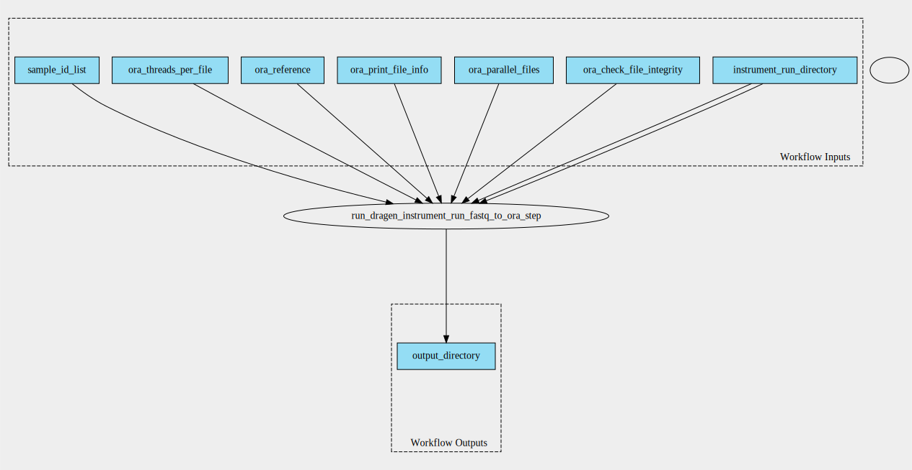

dragen-instrument-run-fastq-to-ora-pipeline 4.2.4 workflow
==========================================================

## Table of Contents
  
- [Overview](#dragen-instrument-run-fastq-to-ora-v424-overview)  
- [Visual](#visual-workflow-overview)  
- [Links](#related-links)  
- [Inputs](#dragen-instrument-run-fastq-to-ora-v424-inputs)  
- [Steps](#dragen-instrument-run-fastq-to-ora-v424-steps)  
- [Outputs](#dragen-instrument-run-fastq-to-ora-v424-outputs)  
- [ICA](#ica)  

## dragen-instrument-run-fastq-to-ora v(4.2.4) Overview

  
> ID: dragen-instrument-run-fastq-to-ora--4.2.4  
> md5sum: 9d3fba4b82426f5c8b653ed2a957a2cc

### dragen-instrument-run-fastq-to-ora v(4.2.4) documentation
  
This tool can be used for archiving purposes by first compressing fastqs prior to transfer to a long-term storage location.

### Categories
  

## Visual Workflow Overview
  

## Related Links
  
- [CWL File Path](../../../../../../workflows/dragen-instrument-run-fastq-to-ora-pipeline/4.2.4/dragen-instrument-run-fastq-to-ora-pipeline__4.2.4.cwl)  

### Uses
  
- [dragen-instrument-run-fastq-to-ora 4.2.4](../../../tools/dragen-instrument-run-fastq-to-ora/4.2.4/dragen-instrument-run-fastq-to-ora__4.2.4.md)  

  

## dragen-instrument-run-fastq-to-ora v(4.2.4) Inputs

### instrument run directory

  
> ID: instrument_run_directory
  
**Optional:** `False`  
**Type:** `Directory`  
**Docs:**  
The directory containing the instrument run. Expected to be in the BCLConvert 4.2.7 output format, with the following structure:
  Reports/
  InterOp/
  Logs/
  Samples/
  Samples/Lane_1/
  Samples/Lane_1/Sample_ID/
  Samples/Lane_1/Sample_ID/Sample_ID_S1_L001_R1_001.fastq.gz
  Samples/Lane_1/Sample_ID/Sample_ID_S1_L001_R2_001.fastq.gz
  etc...

### ora reference

  
> ID: ora_reference
  
**Optional:** `False`  
**Type:** `File`  
**Docs:**  
The reference tar to use for the ORA compression

### sample id list

  
> ID: sample_id_list
  
**Optional:** `True`  
**Type:** `.[]`  
**Docs:**  
Optional list of samples to process.  
Samples NOT in this list are NOT compressed AND NOT transferred to the final output directory!

  

## dragen-instrument-run-fastq-to-ora v(4.2.4) Steps

### Run Dragen Instrument Run Fastq to ORA

  
> ID: dragen-instrument-run-fastq-to-ora--4.2.4/run_dragen_instrument_run_fastq_to_ora_step
  
**Step Type:** tool  
**Docs:**
  
Run the dragen instrument run fastq to ora tool

#### Links
  
[CWL File Path](../../../../../../tools/dragen-instrument-run-fastq-to-ora/4.2.4/dragen-instrument-run-fastq-to-ora__4.2.4.cwl)  
[CWL File Help Page](../../../tools/dragen-instrument-run-fastq-to-ora/4.2.4/dragen-instrument-run-fastq-to-ora__4.2.4.md)  

## dragen-instrument-run-fastq-to-ora v(4.2.4) Outputs

### output directory

  
> ID: dragen-instrument-run-fastq-to-ora--4.2.4/output_directory  

  
**Optional:** `False`  
**Output Type:** `Directory`  
**Docs:**  
The output directory of the instrument run with fastqs converted to oras
  

  

