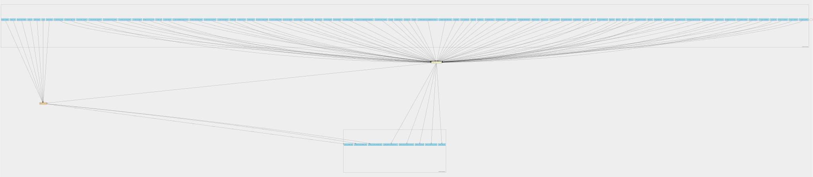
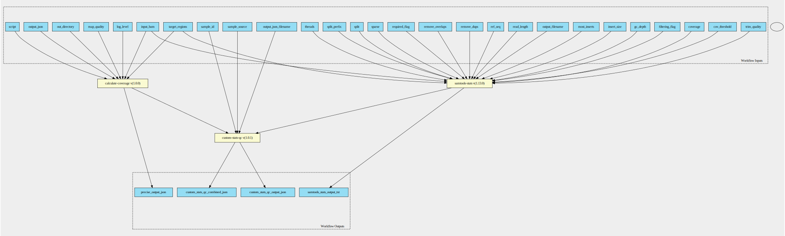
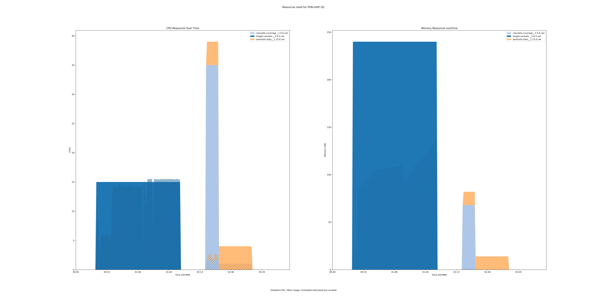

dragen-pon-qc 3.9.3 workflow
============================

## Table of Contents
  
- [Overview](#dragen-pon-qc-v393-overview)  
- [Visual](#visual-workflow-overview)  
- [Links](#related-links)  
- [Inputs](#dragen-pon-qc-v393-inputs)  
- [Steps](#dragen-pon-qc-v393-steps)  
- [Outputs](#dragen-pon-qc-v393-outputs)  
- [ICA](#ica)  


## dragen-pon-qc v(3.9.3) Overview


  
> ID: dragen-pon-qc--3.9.3  
> md5sum: 1c53df6e90298eb1c7fd234df3e35a58

### dragen-pon-qc v(3.9.3) documentation
  
Documentation for dragen-pon-qc v3.9.3.
This workflow calls Dragen somatic tool with normal samples for creating
PoN. Additionally it performs QC on the output through GHIF-QC workflow.

### Categories
  


## Visual Workflow Overview
  
[](https://github.com/umccr/cwl-ica/raw/main/.github/catalogue/images/workflows/dragen-pon-qc/3.9.3/dragen-pon-qc__3.9.3.svg)
## Related Links
  
- [CWL File Path](../../../../../../workflows/dragen-pon-qc/3.9.3/dragen-pon-qc__3.9.3.cwl)  


### Uses
  
- [ghif-qc 1.0.1](../../ghif-qc/1.0.1/ghif-qc__1.0.1.md)  
- [dragen-somatic 3.9.3](../../../tools/dragen-somatic/3.9.3/dragen-somatic__3.9.3.md)  

  


## dragen-pon-qc v(3.9.3) Inputs

### cnv normal b allele vcf


  
> ID: cnv_normal_b_allele_vcf
  
**Optional:** `True`  
**Type:** `File`  
**Docs:**  
Specify a matched normal SNV VCF.


### cnv normal cnv vcf


  
> ID: cnv_normal_cnv_vcf
  
**Optional:** `True`  
**Type:** `boolean`  
**Docs:**  
Specify germline CNVs from the matched normal sample.


### cnv population b allele vcf


  
> ID: cnv_population_b_allele_vcf
  
**Optional:** `True`  
**Type:** `File`  
**Docs:**  
Specify a population SNP catalog.


### cnv somatic enable het calling


  
> ID: cnv_somatic_enable_het_calling
  
**Optional:** `True`  
**Type:** `boolean`  
**Docs:**  
Enable HET-calling mode for heterogeneous segments.


### cnv use somatic vc baf


  
> ID: cnv_use_somatic_vc_baf
  
**Optional:** `True`  
**Type:** `boolean`  
**Docs:**  
If running in tumor-normal mode with the SNV caller enabled, use this option
to specify the germline heterozygous sites.


### cnv use somatic vc vaf


  
> ID: cnv_use_somatic_vc_vaf
  
**Optional:** `True`  
**Type:** `boolean`  
**Docs:**  
Use the variant allele frequencies (VAFs) from the somatic SNVs to help select
the tumor model for the sample.


### cov threshold


  
> ID: cov_threshold
  
**Optional:** `True`  
**Type:** `int`  
**Docs:**  
Only bases with coverage above this value will be included in the target percentage computation [0]


### coverage


  
> ID: coverage
  
**Optional:** `True`  
**Type:** `int[]`  
**Docs:**  
Set coverage distribution to the specified range (MIN, MAX, STEP all given as integers) [1,1000,1]


### dbsnp annotation


  
> ID: dbsnp_annotation
  
**Optional:** `True`  
**Type:** `File`  
**Docs:**  
In Germline, Tumor-Normal somatic, or Tumor-Only somatic modes,
DRAGEN can look up variant calls in a dbSNP database and add annotations for any matches that it finds there.
To enable the dbSNP database search, set the --dbsnp option to the full path to the dbSNP database
VCF or .vcf.gz file, which must be sorted in reference order.


### enable cnv calling


  
> ID: enable_cnv
  
**Optional:** `True`  
**Type:** `boolean`  
**Docs:**  
Enable CNV processing in the DRAGEN Host Software.


### enable duplicate marking


  
> ID: enable_duplicate_marking
  
**Optional:** `True`  
**Type:** `boolean`  
**Docs:**  
Enable the flagging of duplicate output
alignment records.


### enable hla


  
> ID: enable_hla
  
**Optional:** `True`  
**Type:** `boolean`  
**Docs:**  
Enable HLA typing by setting --enable-hla flag to true


### enable hrd


  
> ID: enable_hrd
  
**Optional:** `True`  
**Type:** `boolean`  
**Docs:**  
Set to true to enable HRD scoring to quantify genomic instability.
Requires somatic CNV calls.


### enable sv


  
> ID: enable_sv
  
**Optional:** `True`  
**Type:** `boolean`  
**Docs:**  
Enable/disable structural variant
caller. Default is false.


### enable tmb


  
> ID: enable_tmb
  
**Optional:** `True`  
**Type:** `boolean`  
**Docs:**  
Enables TMB. If set, the small variant caller, Illumina Annotation Engine,
and the related callability report are enabled.


### filtering flag


  
> ID: filtering_flag
  
**Optional:** `True`  
**Type:** `int`  
**Docs:**  
iltering flag, 0 for unset. See also `samtools flags` [0]


### GC depth


  
> ID: gc_depth
  
**Optional:** `True`  
**Type:** `float`  
**Docs:**  
the size of GC-depth bins (decreasing bin size increases memory requirement) [2e4]


### hla allele frequency file


  
> ID: hla_allele_frequency_file
  
**Optional:** `True`  
**Type:** `File`  
**Docs:**  
Use the population-level HLA allele frequency file to break ties if one or more HLA allele produces the same or similar results.
The input HLA allele frequency file must be in CSV format and contain the HLA alleles and the occurrence frequency in population.
If --hla-allele-frequency-file is not specified, DRAGEN automatically uses hla_classI_allele_frequency.csv from /opt/edico/config/.
Population-level allele frequencies can be obtained from the Allele Frequency Net database.


### hla bed file


  
> ID: hla_bed_file
  
**Optional:** `True`  
**Type:** `File`  
**Docs:**  
Use the HLA region BED input file to specify the region to extract HLA reads from.
DRAGEN HLA Caller parses the input file for regions within the BED file, and then
extracts reads accordingly to align with the HLA allele reference.


### hla min reads


  
> ID: hla_min_reads
  
**Optional:** `True`  
**Type:** `int`  
**Docs:**  
Set the minimum number of reads to align to HLA alleles to ensure sufficient coverage and perform HLA typing.
The default value is 1000 and suggested for WES samples. If using samples with less coverage, you can use a
lower threshold value.


### hla reference file


  
> ID: hla_reference_file
  
**Optional:** `True`  
**Type:** `File`  
**Docs:**  
Use the HLA allele reference file to specify the reference alleles to align against.
The input HLA reference file must be in FASTA format and contain the protein sequence separated into exons.
If --hla-reference-file is not specified, DRAGEN uses hla_classI_ref_freq.fasta from /opt/edico/config/.
The reference HLA sequences are obtained from the IMGT/HLA database.


### hla tiebreaker threshold


  
> ID: hla_tiebreaker_threshold
  
**Optional:** `True`  
**Type:** `float`  
**Docs:**  
If more than one allele has a similar number of reads aligned and there is not a clear indicator for the best allele,
the alleles are considered as ties. The HLA Caller places the tied alleles into a candidate set for tie breaking based
on the population allele frequency. If an allele has more than the specified fraction of reads aligned (normalized to
the top hit), then the allele is included into the candidate set for tie breaking. The default value is 0.97.


### hla zygosity threshold


  
> ID: hla_zygosity_threshold
  
**Optional:** `True`  
**Type:** `float`  
**Docs:**  
If the minor allele at a given locus has fewer reads mapped than a fraction of the read count of the major allele,
then the HLA Caller infers homozygosity for the given HLA-I gene. You can use this option to specify the fraction value.
The default value is 0.15.


### id


  
> ID: id
  
**Optional:** `True`  
**Type:** `string`  
**Docs:**  
Include only listed read group or sample name []


### insert size


  
> ID: insert_size
  
**Optional:** `True`  
**Type:** `int`  
**Docs:**  
Maximum insert size [8000]


### license instance id location


  
> ID: lic_instance_id_location
  
**Optional:** `True`  
**Type:** `['File', 'string']`  
**Docs:**  
You may wish to place your own in.
Optional value, default set to /opt/instance-identity
which is a path inside the dragen container


### log level


  
> ID: log_level
  
**Optional:** `True`  
**Type:** `string`  
**Docs:**  
Set logging level to INFO (default), WARNING or DEBUG.


### map quality


  
> ID: map_quality
  
**Optional:** `True`  
**Type:** `int`  
**Docs:**  
Mapping quality threshold. Default: 20.


### most inserts


  
> ID: most_inserts
  
**Optional:** `True`  
**Type:** `float`  
**Docs:**  
Report only the main part of inserts [0.99]


### out directory


  
> ID: out_directory
  
**Optional:** `True`  
**Type:** `Directory`  
**Docs:**  
Path to scratch directory. Default: ./


### output directory


  
> ID: output_directory
  
**Optional:** `False`  
**Type:** `string`  
**Docs:**  
Required - The output directory.


### output file prefix


  
> ID: output_file_prefix
  
**Optional:** `False`  
**Type:** `string`  
**Docs:**  
Required - the output file prefix


### output filename


  
> ID: output_filename
  
**Optional:** `True`  
**Type:** `string`  
**Docs:**  
Redirects stdout


### output json


  
> ID: output_json
  
**Optional:** `True`  
**Type:** `string`  
**Docs:**  
output file


### output filename


  
> ID: output_json_filename
  
**Optional:** `True`  
**Type:** `string`  
**Docs:**  
output file


### qc coverage ignore overlaps


  
> ID: qc_coverage_ignore_overlaps
  
**Optional:** `True`  
**Type:** `boolean`  
**Docs:**  
Set to true to resolve all of the alignments for each fragment and avoid double-counting any
overlapping bases. This might result in marginally longer run times.
This option also requires setting --enable-map-align=true.


### qc coverage region 1


  
> ID: qc_coverage_region_1
  
**Optional:** `True`  
**Type:** `File`  
**Docs:**  
Generates coverage region report using bed file 1.


### qc coverage region 2


  
> ID: qc_coverage_region_2
  
**Optional:** `True`  
**Type:** `File`  
**Docs:**  
Generates coverage region report using bed file 2.


### qc coverage region 3


  
> ID: qc_coverage_region_3
  
**Optional:** `True`  
**Type:** `File`  
**Docs:**  
Generates coverage region report using bed file 3.


### read length


  
> ID: read_length
  
**Optional:** `True`  
**Type:** `int`  
**Docs:**  
Include in the statistics only reads with the given read length [-1]


### ref seq


  
> ID: ref_seq
  
**Optional:** `True`  
**Type:** `File`  
**Docs:**  
Reference sequence (required for GC-depth and mismatches-per-cycle calculation). []


### reference tar


  
> ID: reference_tar
  
**Optional:** `False`  
**Type:** `File`  
**Docs:**  
Path to ref data tarball


### remove dups


  
> ID: remove_dups
  
**Optional:** `True`  
**Type:** `boolean`  
**Docs:**  
Exclude from statistics reads marked as duplicates


### remove overlaps


  
> ID: remove_overlaps
  
**Optional:** `True`  
**Type:** `boolean`  
**Docs:**  
Remove overlaps of paired-end reads from coverage and base count computations.


### required flag


  
> ID: required_flag
  
**Optional:** `True`  
**Type:** `int`  
**Docs:**  
Required flag, 0 for unset. See also `samtools flags` [0]


### sample id


  
> ID: sample_id
  
**Optional:** `False`  
**Type:** `string`  
**Docs:**  
Sample identity


### sample sex


  
> ID: sample_sex
  
**Optional:** `True`  
**Type:** `[ male | female ]`  
**Docs:**  
Specifies the sex of a sample


### sample source


  
> ID: sample_source
  
**Optional:** `False`  
**Type:** `string`  
**Docs:**  
Sample original source


### script


  
> ID: script
  
**Optional:** `False`  
**Type:** `File`  
**Docs:**  
Path to PRECISE python script on GitHub


### sparse


  
> ID: sparse
  
**Optional:** `True`  
**Type:** `boolean`  
**Docs:**  
Suppress outputting IS rows where there are no insertions.


### split


  
> ID: split
  
**Optional:** `True`  
**Type:** `string`  
**Docs:**  
In addition to the complete statistics, also output categorised statistics based on the tagged field TAG 
(e.g., use --split RG to split into read groups).


### split prefix


  
> ID: split_prefix
  
**Optional:** `True`  
**Type:** `string`  
**Docs:**  
A path or string prefix to prepend to filenames output when creating categorised 
statistics files with -S/--split. [input filename]


### sv call regions bed


  
> ID: sv_call_regions_bed
  
**Optional:** `True`  
**Type:** `File`  
**Docs:**  
Specifies a BED file containing the set of regions to call.


### sv discovery


  
> ID: sv_discovery
  
**Optional:** `True`  
**Type:** `boolean`  
**Docs:**  
Enable SV discovery. This flag can be set to false only when --sv-forcegt-vcf is used.
When set to false, SV discovery is disabled and only the forced genotyping input variants
are processed. The default is true.


### sv enable liquid tumor mode


  
> ID: sv_enable_liquid_tumor_mode
  
**Optional:** `True`  
**Type:** `boolean`  
**Docs:**  
Enable liquid tumor mode.


### sv enable somatic ins tandup hotspot regions


  
> ID: sv_enable_somatic_ins_tandup_hotspot_regions
  
**Optional:** `True`  
**Type:** `boolean`  
**Docs:**  
Enable or disable the ITD hotspot region input. The default is true in somatic variant analysis.


### sv exome


  
> ID: sv_exome
  
**Optional:** `True`  
**Type:** `boolean`  
**Docs:**  
Set to true to configure the variant caller for targeted sequencing inputs,
which includes disabling high depth filters.
In integrated mode, the default is to autodetect targeted sequencing input,
and in standalone mode the default is false.


### sv forcegt vcf


  
> ID: sv_forcegt_vcf
  
**Optional:** `True`  
**Type:** `File`  
**Docs:**  
Specify a VCF of structural variants for forced genotyping. The variants are scored and emitted
in the output VCF even if not found in the sample data.
The variants are merged with any additional variants discovered directly from the sample data.


### sv output contigs


  
> ID: sv_output_contigs
  
**Optional:** `True`  
**Type:** `boolean`  
**Docs:**  
Set to true to have assembled contig sequences output in a VCF file. The default is false.


### sv region


  
> ID: sv_region
  
**Optional:** `True`  
**Type:** `string`  
**Docs:**  
Limit the analysis to a specified region of the genome for debugging purposes.
This option can be specified multiple times to build a list of regions.
The value must be in the format “chr:startPos-endPos”..


### sv use overlap pair evidence


  
> ID: sv_se_overlap_pair_evidence
  
**Optional:** `True`  
**Type:** `boolean`  
**Docs:**  
Allow overlapping read pairs to be considered as evidence.
By default, DRAGEN uses autodetect on the fraction of overlapping read pairs if <20%.


### sv somatic ins tandup hotspot regions bed


  
> ID: sv_somatic_ins_tandup_hotspot_regions_bed
  
**Optional:** `True`  
**Type:** `File`  
**Docs:**  
Specify a BED of ITD hotspot regions to increase sensitivity for calling ITDs in somatic variant analysis.
By default, DRAGEN SV automatically selects areference-specific hotspots BED file from
/opt/edico/config/sv_somatic_ins_tandup_hotspot_*.bed.


### sv tin contam tolerance


  
> ID: sv_tin_contam_tolerance
  
**Optional:** `True`  
**Type:** `float`  
**Docs:**  
Set the Tumor-in-Normal (TiN) contamination tolerance level.
You can enter any value between 0–1. The default maximum TiN contamination tolerance is 0.15.


### target regions


  
> ID: target_regions
  
**Optional:** `True`  
**Type:** `File`  
**Docs:**  
Do stats in these regions only. Tab-delimited file chr,from,to, 1-based, inclusive. []


### threads


  
> ID: threads
  
**Optional:** `True`  
**Type:** `int`  
**Docs:**  
Number of input/output compression threads to use in addition to main thread [0].


### tmb db threshold


  
> ID: tmb_db_threshold
  
**Optional:** `True`  
**Type:** `int`  
**Docs:**  
Specify the minimum allele count (total number of observations) for an allele in gnomAD or 1000 Genome
to be considered a germline variant.  Variant calls that have the same positions and allele are ignored
from the TMB calculation. The default value is 10.


### tmb vaf threshold


  
> ID: tmb_vaf_threshold
  
**Optional:** `True`  
**Type:** `float`  
**Docs:**  
Specify the minimum VAF threshold for a variant. Variants that do not meet the threshold are filtered out.
The default value is 0.05.


### trim quality


  
> ID: trim_quality
  
**Optional:** `True`  
**Type:** `int`  
**Docs:**  
The BWA trimming parameter [0]


### tumor fastq list


  
> ID: tumor_fastq_list
  
**Optional:** `True`  
**Type:** `File`  
**Docs:**  
CSV file that contains a list of FASTQ files
to process. read_1 and read_2 components in the CSV file must be presigned urls.


### tumor fastq list rows


  
> ID: tumor_fastq_list_rows
  
**Optional:** `True`  
**Type:** `fastq-list-row[]`  
**Docs:**  
Alternative to providing a file, one can instead provide a list of 'fastq-list-row' objects for tumor sample


### vc af call threshold


  
> ID: vc_af_call_threshold
  
**Optional:** `True`  
**Type:** `float`  
**Docs:**  
Set the allele frequency call threshold to emit a call in the VCF if the AF filter is enabled.
The default is 0.01.


### vc af filter threshold


  
> ID: vc_af_filter_threshold
  
**Optional:** `True`  
**Type:** `float`  
**Docs:**  
Set the allele frequency filter threshold to mark emitted VCF calls as filtered if the AF filter is
enabled.
The default is 0.05.


### vc callability normal thresh


  
> ID: vc_callability_normal_thresh
  
**Optional:** `True`  
**Type:** `int`  
**Docs:**  
The --vc-callability-normal-thresh option specifies the callability threshold for normal samples.
The somatic callable regions report includes all regions with normal coverage above the normal threshold.


### vc callability tumor thresh


  
> ID: vc_callability_tumor_thresh
  
**Optional:** `True`  
**Type:** `int`  
**Docs:**  
The --vc-callability-tumor-thresh option specifies the callability threshold for tumor samples. The
somatic callable regions report includes all regions with tumor coverage above the tumor threshold.


### vc decoy contigs


  
> ID: vc_decoy_contigs
  
**Optional:** `True`  
**Type:** `string`  
**Docs:**  
The --vc-decoy-contigs option specifies a comma-separated list of contigs to skip during variant calling.
This option can be set in the configuration file.


### vc enable af filter


  
> ID: vc_enable_af_filter
  
**Optional:** `True`  
**Type:** `boolean`  
**Docs:**  
Enables the allele frequency filter. The default value is false. When set to true, the VCF excludes variants
with allele frequencies below the AF call threshold or variants with an allele frequency below the AF filter
threshold and tagged with low AF filter tag. The default AF call threshold is 1% and the default AF filter
threshold is 5%.
To change the threshold values, use the following command line options:
  --vc-af-callthreshold and --vc-af-filter-threshold.


### vc enable baf


  
> ID: vc_enable_baf
  
**Optional:** `True`  
**Type:** `boolean`  
**Docs:**  
Enable or disable B-allele frequency output. Enabled by default.


### vc enable decoy contigs


  
> ID: vc_enable_decoy_contigs
  
**Optional:** `True`  
**Type:** `boolean`  
**Docs:**  
If --vc-enable-decoy-contigs is set to true, variant calls on the decoy contigs are enabled.
The default value is false.


### vc enable gatk acceleration


  
> ID: vc_enable_gatk_acceleration
  
**Optional:** `True`  
**Type:** `boolean`  
**Docs:**  
If is set to true, the variant caller runs in GATK mode
(concordant with GATK 3.7 in germline mode and GATK 4.0 in somatic mode).


### vc enable liquid tumor mode


  
> ID: vc_enable_liquid_tumor_mode
  
**Optional:** `True`  
**Type:** `boolean`  
**Docs:**  
In a tumor-normal analysis, DRAGEN accounts for tumor-in-normal (TiN) contamination by running liquid
tumor mode. Liquid tumor mode is disabled by default. When liquid tumor mode is enabled, DRAGEN is
able to call variants in the presence of TiN contamination up to a specified maximum tolerance level.
vc-enable-liquid-tumor-mode enables liquid tumor mode with a default maximum contamination
TiN tolerance of 0.15. If using the default maximum contamination TiN tolerance, somatic variants are
expected to be observed in the normal sample with allele frequencies up to 15% of the corresponding
allele in the tumor sample.


### vc enable non homoref normal filter


  
> ID: vc_enable_non_homref_normal_filter
  
**Optional:** `True`  
**Type:** `boolean`  
**Docs:**  
Enables the non-homref normal filter. The default value is true. When set to true, the VCF filters out
variants if the normal sample genotype is not a homozygous reference.


### vc enable phasing


  
> ID: vc_enable_phasing
  
**Optional:** `True`  
**Type:** `boolean`  
**Docs:**  
The –vc-enable-phasing option enables variants to be phased when possible. The default value is true.


### vc enable roh


  
> ID: vc_enable_roh
  
**Optional:** `True`  
**Type:** `boolean`  
**Docs:**  
Enable or disable the ROH caller by setting this option to true or false. Enabled by default for human autosomes only.


### vc enable triallelic filter


  
> ID: vc_enable_triallelic_filter
  
**Optional:** `True`  
**Type:** `boolean`  
**Docs:**  
Enables the multiallelic filter. The default is true.


### vc enable vcf output


  
> ID: vc_enable_vcf_output
  
**Optional:** `True`  
**Type:** `boolean`  
**Docs:**  
The –vc-enable-vcf-output option enables VCF file output during a gVCF run. The default value is false.


### vc hotspot log10 prior boost


  
> ID: vc_hotspot_log10_prior_boost
  
**Optional:** `True`  
**Type:** `int`  
**Docs:**  
The size of the hotspot adjustment can be controlled via vc-hotspotlog10-prior-boost,
which has a default value of 4 (log10 scale) corresponding to an increase of 40 phred.


### vc max reads per active region


  
> ID: vc_max_reads_per_active_region
  
**Optional:** `True`  
**Type:** `int`  
**Docs:**  
specifies the maximum number of reads covering a given active region.
Default is 10000 for the somatic workflow


### vc max reads per raw region


  
> ID: vc_max_reads_per_raw_region
  
**Optional:** `True`  
**Type:** `int`  
**Docs:**  
specifies the maximum number of reads covering a given raw region.
Default is 30000 for the somatic workflow


### vc min tumor read qual


  
> ID: vc_min_tumor_read_qual
  
**Optional:** `True`  
**Type:** `int`  
**Docs:**  
The --vc-min-tumor-read-qual option specifies the minimum read quality (MAPQ) to be considered for
variant calling. The default value is 3 for tumor-normal analysis or 20 for tumor-only analysis.


### vc remove all soft clips


  
> ID: vc_remove_all_soft_clips
  
**Optional:** `True`  
**Type:** `boolean`  
**Docs:**  
If is set to true, the variant caller does not use soft clips of reads to determine variants.


### vc roh blacklist bed


  
> ID: vc_roh_blacklist_bed
  
**Optional:** `True`  
**Type:** `File`  
**Docs:**  
If provided, the ROH caller ignores variants that are contained in any region in the blacklist BED file.
DRAGEN distributes blacklist files for all popular human genomes and automatically selects a blacklist to
match the genome in use, unless this option is used explicitly select a file.


### vc somatic hotspots


  
> ID: vc_somatic_hotspots
  
**Optional:** `True`  
**Type:** `File`  
**Docs:**  
The somatic hotspots option allows an input VCF to specify the positions where the risk for somatic
mutations are assumed to be significantly elevated. DRAGEN genotyping priors are boosted for all
postions specified in the VCF, so it is possible to call a variant at one of these sites with fewer supporting
reads. The cosmic database in VCF format can be used as one source of prior information to boost
sensitivity for known somatic mutations.


### vc sq call threshold


  
> ID: vc_sq_call_threshold
  
**Optional:** `True`  
**Type:** `float`  
**Docs:**  
Emits calls in the VCF. The default is 3.
If the value for vc-sq-filter-threshold is lower than vc-sq-callthreshold,
the filter threshold value is used instead of the call threshold value


### vc sq filter threshold


  
> ID: vc_sq_filter_threshold
  
**Optional:** `True`  
**Type:** `float`  
**Docs:**  
Marks emitted VCF calls as filtered.
The default is 17.5 for tumor-normal and 6.5 for tumor-only.


### vc target bed


  
> ID: vc_target_bed
  
**Optional:** `True`  
**Type:** `File`  
**Docs:**  
This is an optional command line input that restricts processing of the small variant caller,
target bed related coverage, and callability metrics to regions specified in a BED file.


### vc target bed padding


  
> ID: vc_target_bed_padding
  
**Optional:** `True`  
**Type:** `int`  
**Docs:**  
This is an optional command line input that can be used to pad all of the target
BED regions with the specified value.
For example, if a BED region is 1:1000-2000 and a padding value of 100 is used,
it is equivalent to using a BED region of 1:900-2100 and a padding value of 0.

Any padding added to --vc-target-bed-padding is used by the small variant caller
and by the target bed coverage/callability reports. The default padding is 0.


### vc target coverage


  
> ID: vc_target_coverage
  
**Optional:** `True`  
**Type:** `int`  
**Docs:**  
The --vc-target-coverage option specifies the target coverage for down-sampling.
The default value is 500 for germline mode and 50 for somatic mode.


### vc tin contam tolerance


  
> ID: vc_tin_contam_tolerance
  
**Optional:** `True`  
**Type:** `float`  
**Docs:**  
--vc-tin-contam-tolerance enables liquid tumor mode and allows you to
 set the maximum contamination TiN tolerance. The maximum contamination TiN tolerance must be
 greater than zero. For example, vc-tin-contam-tolerance=-0.1.

  


## dragen-pon-qc v(3.9.3) Steps

### ghif qc workflow


  
> ID: dragen-pon-qc--3.9.3/ghif_qc_workflow
  
**Step Type:** workflow  
**Docs:**
  
In-house workflow for collecting QC metrics
#### Links
  
[CWL File Path](../../../../../../workflows/ghif-qc/1.0.1/ghif-qc__1.0.1.cwl)  
[CWL File Help Page](../../ghif-qc/1.0.1/ghif-qc__1.0.1.md)
#### Subworkflow overview
  
[](https://github.com/umccr/cwl-ica/raw/main/.github/catalogue/images/workflows/ghif-qc/1.0.1/ghif-qc__1.0.1.svg)  


### run dragen somatic step


  
> ID: dragen-pon-qc--3.9.3/run_dragen_somatic_step
  
**Step Type:** tool  
**Docs:**
  
Runs the dragen somatic workflow on the FPGA.
Step can take in tumor fastq list or tumor fastq list rows to be run in TO mode.
All other options avaiable at the top of the workflow

#### Links
  
[CWL File Path](../../../../../../tools/dragen-somatic/3.9.3/dragen-somatic__3.9.3.cwl)  
[CWL File Help Page](../../../tools/dragen-somatic/3.9.3/dragen-somatic__3.9.3.md)  


## dragen-pon-qc v(3.9.3) Outputs

### custom stats qc combined json


  
> ID: dragen-pon-qc--3.9.3/custom_stats_qc_combined_json  

  
**Optional:** `False`  
**Output Type:** `File`  
**Docs:**  
Internal custom JSON output file combined with PRECISE JSON output
  


### custom stats qc output json


  
> ID: dragen-pon-qc--3.9.3/custom_stats_qc_output_json  

  
**Optional:** `False`  
**Output Type:** `File`  
**Docs:**  
JSON output file containing custom metrics
  


### dragen somatic output directory


  
> ID: dragen-pon-qc--3.9.3/dragen_somatic_output_directory  

  
**Optional:** `False`  
**Output Type:** `Directory`  
**Docs:**  
Output directory containing all outputs of the somatic dragen run
  


### precise output json


  
> ID: dragen-pon-qc--3.9.3/precise_output_json  

  
**Optional:** `False`  
**Output Type:** `File`  
**Docs:**  
Output file from PRECISE QC script/implementation
  


### somatic snv vcf filetered


  
> ID: dragen-pon-qc--3.9.3/somatic_snv_vcf_hard_filtered_out  

  
**Optional:** `True`  
**Output Type:** `File`  
**Docs:**  
Output of the snv vcf filtered tumor calls
  


### somatic snv vcf


  
> ID: dragen-pon-qc--3.9.3/somatic_snv_vcf_out  

  
**Optional:** `True`  
**Output Type:** `File`  
**Docs:**  
Output of the snv vcf tumor calls
  


### somatic sv vcf filetered


  
> ID: dragen-pon-qc--3.9.3/somatic_structural_vcf_out  

  
**Optional:** `True`  
**Output Type:** `File`  
**Docs:**  
Output of the sv vcf filtered tumor calls.
Exists only if --enable-sv is set to true.
  


### output tumor bam


  
> ID: dragen-pon-qc--3.9.3/tumor_bam_out  

  
**Optional:** `True`  
**Output Type:** `File`  
**Docs:**  
Bam file of the tumor sample
  

  


## ICA

### ToC
  
- [development_workflows](#project-development_workflows)  
- [production_workflows](#project-production_workflows)  


### Project: development_workflows


> wfl id: wfl.eaf568e0fac049f5879fb1d36e214836  

  
**workflow name:** dragen-pon-qc_dev-wf  
**wfl version name:** 3.9.3  


#### Run Instances

##### ToC
  
- [Run wfr.e0cccb29cf44482182507bd33579270c](#run-wfre0cccb29cf44482182507bd33579270c)  


##### Run wfr.e0cccb29cf44482182507bd33579270c


  
> Run Name: PON-GHIF-QC  

  
**Start Time:** 2022-03-06 23:21:49 UTC  
**Duration:** 2022-03-07 03:00:55 UTC  
**End Time:** 0 days 03:39:06  


###### Reproduce Run


```bash

# Run the submission template to create the workflow input json and launch script            
cwl-ica copy-workflow-submission-template --ica-workflow-run-instance-id wfr.e0cccb29cf44482182507bd33579270c

# Edit the input json file (optional)
# vim wfr.e0cccb29cf44482182507bd33579270c.template.json 

# Run the launch script
bash wfr.e0cccb29cf44482182507bd33579270c.launch.sh
                                    
```  


###### Run Inputs


```
{
    "enable_duplicate_marking": true,
    "enable_map_align_output": true,
    "enable_sv": true,
    "filtering_flag": 2304,
    "output_directory": "L2100748_L2100747_dragen",
    "output_file_prefix": "MDX210179",
    "ref_seq": {
        "class": "File",
        "location": "gds://umccr-temp-data-dev/helen/GHIF_QC/hg38_alt_aware_nohla.fa"
    },
    "reference_tar": {
        "class": "File",
        "location": "gds://development/reference-data/dragen_hash_tables/v8/hg38/altaware-cnv-anchored/hg38-v8-altaware-cnv-anchored.tar.gz"
    },
    "sample_id": "MDX210178_L2100747",
    "sample_source": "UMCCR",
    "script": {
        "class": "File",
        "location": "https://raw.githubusercontent.com/skanwal/wgs-sample-qc/main/calculate_coverage.py"
    },
    "target_regions": {
        "class": "File",
        "location": "gds://umccr-temp-data-dev/helen/GHIF_QC/Targets_Homo_sapiens_assembly38_autosomes.txt"
    },
    "tumor_fastq_list_rows": [
        {
            "lane": 2,
            "read_1": {
                "class": "File",
                "location": "gds://development/primary_data/210708_A00130_0166_AH7KTJDSX2/20220121870cbe6f/WGS_TsqNano/MDX210178_L2100747_S7_L002_R1_001.fastq.gz"
            },
            "read_2": {
                "class": "File",
                "location": "gds://development/primary_data/210708_A00130_0166_AH7KTJDSX2/20220121870cbe6f/WGS_TsqNano/MDX210178_L2100747_S7_L002_R2_001.fastq.gz"
            },
            "rgid": "ACCTTGGC.ATGAGGCC.2.210708_A00130_0166_AH7KTJDSX2.MDX210179_L2100748",
            "rglb": "L2100748",
            "rgsm": "MDX210179"
        }
    ]
}
```  


###### Run Engine Parameters


```
{
    "workDirectory": "gds://wfr.e0cccb29cf44482182507bd33579270c/PON-GHIF-QC",
    "outputDirectory": "gds://wfr.e0cccb29cf44482182507bd33579270c/PON-GHIF-QC/outputs",
    "tmpOutputDirectory": "gds://wfr.e0cccb29cf44482182507bd33579270c/PON-GHIF-QC/steps",
    "logDirectory": "gds://wfr.e0cccb29cf44482182507bd33579270c/PON-GHIF-QC/logs",
    "maxScatter": 32,
    "outputSetting": "move",
    "copyOutputInstanceType": "StandardHiCpu",
    "copyOutputInstanceSize": "Medium",
    "defaultInputMode": "'Download'",
    "inputModeOverrides": {},
    "tesUseInputManifest": "'auto'",
    "cwltool": "3.0.20201203173111",
    "engine": "1.20.0-202201191609-develop"
}
```  


###### Run Outputs


```
{
    "custom_stats_qc_combined_json": {
        "location": "gds://wfr.e0cccb29cf44482182507bd33579270c/PON-GHIF-QC/outputs/umccr_output_combined.json",
        "basename": "umccr_output_combined.json",
        "nameroot": "umccr_output_combined",
        "nameext": ".json",
        "class": "File",
        "size": 9090,
        "http://commonwl.org/cwltool#generation": 0
    },
    "custom_stats_qc_output_json": {
        "location": "gds://wfr.e0cccb29cf44482182507bd33579270c/PON-GHIF-QC/outputs/umccr_output.json",
        "basename": "umccr_output.json",
        "nameroot": "umccr_output",
        "nameext": ".json",
        "class": "File",
        "size": 2654,
        "http://commonwl.org/cwltool#generation": 0
    },
    "dragen_somatic_output_directory": {
        "location": "gds://wfr.e0cccb29cf44482182507bd33579270c/PON-GHIF-QC/outputs/L2100748_L2100747_dragen",
        "basename": "L2100748_L2100747_dragen",
        "nameroot": "L2100748_L2100747_dragen",
        "nameext": "",
        "class": "Directory",
        "size": null
    },
    "precise_output_json": {
        "location": "gds://wfr.e0cccb29cf44482182507bd33579270c/PON-GHIF-QC/outputs/precise_output.json",
        "basename": "precise_output.json",
        "nameroot": "precise_output",
        "nameext": ".json",
        "class": "File",
        "size": 7976,
        "http://commonwl.org/cwltool#generation": 0
    },
    "somatic_snv_vcf_hard_filtered_out": {
        "location": "gds://wfr.e0cccb29cf44482182507bd33579270c/PON-GHIF-QC/outputs/L2100748_L2100747_dragen/MDX210179.hard-filtered.vcf.gz",
        "basename": "MDX210179.hard-filtered.vcf.gz",
        "nameroot": "MDX210179.hard-filtered.vcf",
        "nameext": ".gz",
        "class": "File",
        "size": 209221821,
        "secondaryFiles": [
            {
                "basename": "MDX210179.hard-filtered.vcf.gz.tbi",
                "location": "gds://wfr.e0cccb29cf44482182507bd33579270c/PON-GHIF-QC/outputs/L2100748_L2100747_dragen/MDX210179.hard-filtered.vcf.gz.tbi",
                "class": "File",
                "nameroot": "MDX210179.hard-filtered.vcf.gz",
                "nameext": ".tbi",
                "http://commonwl.org/cwltool#generation": 0
            }
        ],
        "http://commonwl.org/cwltool#generation": 0
    },
    "somatic_snv_vcf_out": {
        "location": "gds://wfr.e0cccb29cf44482182507bd33579270c/PON-GHIF-QC/outputs/L2100748_L2100747_dragen/MDX210179.vcf.gz",
        "basename": "MDX210179.vcf.gz",
        "nameroot": "MDX210179.vcf",
        "nameext": ".gz",
        "class": "File",
        "size": 202612642,
        "secondaryFiles": [
            {
                "basename": "MDX210179.vcf.gz.tbi",
                "location": "gds://wfr.e0cccb29cf44482182507bd33579270c/PON-GHIF-QC/outputs/L2100748_L2100747_dragen/MDX210179.vcf.gz.tbi",
                "class": "File",
                "nameroot": "MDX210179.vcf.gz",
                "nameext": ".tbi",
                "http://commonwl.org/cwltool#generation": 0
            }
        ],
        "http://commonwl.org/cwltool#generation": 0
    },
    "somatic_structural_vcf_out": {
        "location": "gds://wfr.e0cccb29cf44482182507bd33579270c/PON-GHIF-QC/outputs/L2100748_L2100747_dragen/MDX210179.sv.vcf.gz",
        "basename": "MDX210179.sv.vcf.gz",
        "nameroot": "MDX210179.sv.vcf",
        "nameext": ".gz",
        "class": "File",
        "size": 1576733,
        "secondaryFiles": [
            {
                "basename": "MDX210179.sv.vcf.gz.tbi",
                "location": "gds://wfr.e0cccb29cf44482182507bd33579270c/PON-GHIF-QC/outputs/L2100748_L2100747_dragen/MDX210179.sv.vcf.gz.tbi",
                "class": "File",
                "nameroot": "MDX210179.sv.vcf.gz",
                "nameext": ".tbi",
                "http://commonwl.org/cwltool#generation": 0
            }
        ],
        "http://commonwl.org/cwltool#generation": 0
    },
    "tumor_bam_out": {
        "location": "gds://wfr.e0cccb29cf44482182507bd33579270c/PON-GHIF-QC/outputs/L2100748_L2100747_dragen/MDX210179_tumor.bam",
        "basename": "MDX210179_tumor.bam",
        "nameroot": "MDX210179_tumor",
        "nameext": ".bam",
        "class": "File",
        "size": 85794594341,
        "secondaryFiles": [
            {
                "basename": "MDX210179_tumor.bam.bai",
                "location": "gds://wfr.e0cccb29cf44482182507bd33579270c/PON-GHIF-QC/outputs/L2100748_L2100747_dragen/MDX210179_tumor.bam.bai",
                "class": "File",
                "nameroot": "MDX210179_tumor.bam",
                "nameext": ".bai",
                "http://commonwl.org/cwltool#generation": 0
            }
        ],
        "http://commonwl.org/cwltool#generation": 0
    },
    "output_dir_gds_session_id": "ssn.3d8f6500329843948358f8a32069affe",
    "output_dir_gds_folder_id": "fol.dad9cdd0c0d54dac78e308d9fe2bff7d"
}
```  


###### Run Resources Usage
  

  
[](https://github.com/umccr/cwl-ica/raw/main/.github/catalogue/images/runs/workflows/dragen-pon-qc/3.9.3/PON-GHIF-QC__wfr.e0cccb29cf44482182507bd33579270c.svg)  


### Project: production_workflows


> wfl id: wfl.438287b9982744c388aa9ef0136dc59a  

  
**workflow name:** dragen-pon-qc_prod-wf  
**wfl version name:** 3.9.3--dc397e0  

  

