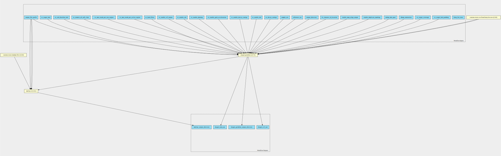
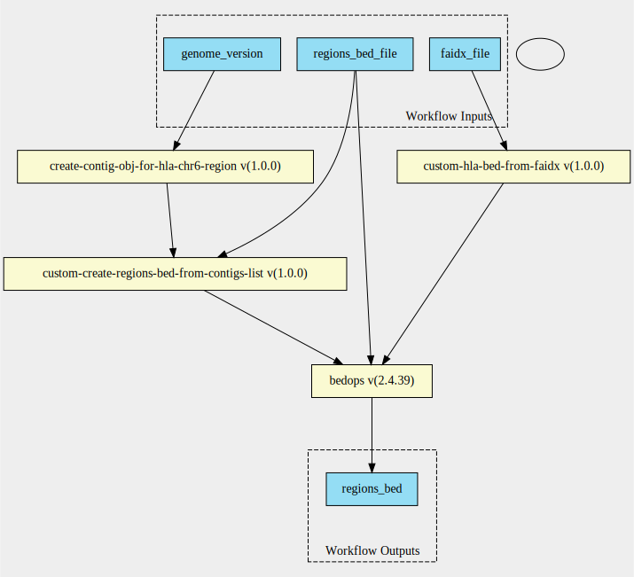
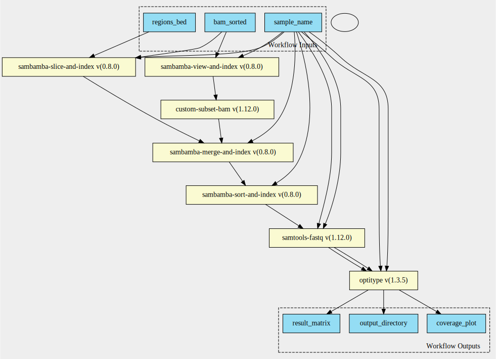

dragen-qc-hla-pipeline 3.7.5--1.3.5 workflow
============================================

## Table of Contents
  
- [Overview](#dragen-qc-hla-pipeline-v375--135-overview)  
- [Visual](#visual-workflow-overview)  
- [Links](#related-links)  
- [Inputs](#dragen-qc-hla-pipeline-v375--135-inputs)  
- [Steps](#dragen-qc-hla-pipeline-v375--135-steps)  
- [Outputs](#dragen-qc-hla-pipeline-v375--135-outputs)  
- [ICA](#ica)  

## dragen-qc-hla-pipeline v(3.7.5--1.3.5) Overview

  
> ID: dragen-qc-hla-pipeline--3.7.5--1.3.5  
> md5sum: 5380314a8aec7e17de1f2be6ce95e75b

### dragen-qc-hla-pipeline v(3.7.5--1.3.5) documentation
  
Workflow definition for germline analysis through dragen.
Also, includes QC report and HLA calls summary.
Uses fastq_list_row objects to files as inputs.

### Categories
  

## Visual Workflow Overview
  

## Related Links
  
- [CWL File Path](../../../../../../workflows/dragen-qc-hla-pipeline/3.7.5--1.3.5/dragen-qc-hla-pipeline__3.7.5--1.3.5.cwl)  

### Uses
  
- [custom-touch-file 1.0.0 :construction:](../../../tools/custom-touch-file/1.0.0/custom-touch-file__1.0.0.md)  
- [dragen-germline-pipeline 3.7.5](../../dragen-germline-pipeline/3.7.5/dragen-germline-pipeline__3.7.5.md)  
- [get-faidx-file-from-reference-file 1.0.0](../../../expressions/get-faidx-file-from-reference-file/1.0.0/get-faidx-file-from-reference-file__1.0.0.md)  
- [get-hla-regions-bed 1.0.0](../../get-hla-regions-bed/1.0.0/get-hla-regions-bed__1.0.0.md)  
- [optitype-pipeline 1.3.5](../../optitype-pipeline/1.3.5/optitype-pipeline__1.3.5.md)  
- [multiqc 1.10.1](../../../tools/multiqc/1.10.1/multiqc__1.10.1.md)  
- [somalier-extract 0.2.13 :construction:](../../../tools/somalier-extract/0.2.13/somalier-extract__0.2.13.md)  

  

## dragen-qc-hla-pipeline v(3.7.5--1.3.5) Inputs

### fastq list rows

  
> ID: fastq_list_rows
  
**Optional:** `False`  
**Type:** `fastq-list-row[]`  
**Docs:**  
The row of fastq lists.
  Each row has the following attributes:
    * RGID
    * RGLB
    * RGSM
    * Lane
    * Read1File
    * Read2File (optional)

### genome version

  
> ID: genome_version
  
**Optional:** `True`  
**Type:** `<cwl_utils.parser_v1_1.InputEnumSchema object at 0x7f5517945d00>`  
**Docs:**  
Either hg38 (default) or GRCh37?
Used to set chromosome regions to filter down bam file for optitype workflow

### hla reference fasta

  
> ID: hla_reference_fasta
  
**Optional:** `False`  
**Type:** `File`  
**Docs:**  
Reference to align / filter large output bam to before running through optitype tool

### reference fasta

  
> ID: reference_fasta
  
**Optional:** `False`  
**Type:** `File`  
**Docs:**  
The reference fasta file with a .fai index.
Required for somalier and optitype steps

### reference tar

  
> ID: reference_tar_dragen
  
**Optional:** `False`  
**Type:** `File`  
**Docs:**  
Path to ref data tarball

### sample name

  
> ID: sample_name
  
**Optional:** `False`  
**Type:** `string`  
**Docs:**  
What is the name of the sample?
Used to pre-fill out many other inputs.

### sites somalier

  
> ID: sites_somalier
  
**Optional:** `False`  
**Type:** `File`  
**Docs:**  
gzipped vcf file. Required for somalier sites

  

## dragen-qc-hla-pipeline v(3.7.5--1.3.5) Steps

### Create dummy file

  
> ID: dragen-qc-hla-pipeline--3.7.5--1.3.5/create_dummy_file_step
  
**Step Type:** tool  
**Docs:**
  
Intermediate step for letting multiqc-interop be placed in stream mode

#### Links
  
[CWL File Path](../../../../../../tools/custom-touch-file/1.0.0/custom-touch-file__1.0.0.cwl)  
[CWL File Help Page :construction:](../../../tools/custom-touch-file/1.0.0/custom-touch-file__1.0.0.md)  

### dragen germline step

  
> ID: dragen-qc-hla-pipeline--3.7.5--1.3.5/dragen_germline_step
  
**Step Type:** workflow  
**Docs:**
  
Runs the dragen germline 3.7.5 workflow

#### Links
  
[CWL File Path](../../../../../../workflows/dragen-germline-pipeline/3.7.5/dragen-germline-pipeline__3.7.5.cwl)  
[CWL File Help Page](../../dragen-germline-pipeline/3.7.5/dragen-germline-pipeline__3.7.5.md)
#### Subworkflow overview
  
  

### get faidx file step

  
> ID: dragen-qc-hla-pipeline--3.7.5--1.3.5/get_faidx_file_step
  
**Step Type:** expression  
**Docs:**
  
Get the index of the reference fasta as its own file.
Used by the get-regions-bed workflow

#### Links
  
[CWL File Path](../../../../../../expressions/get-faidx-file-from-reference-file/1.0.0/get-faidx-file-from-reference-file__1.0.0.cwl)  
[CWL File Help Page](../../../expressions/get-faidx-file-from-reference-file/1.0.0/get-faidx-file-from-reference-file__1.0.0.md)  

### get hla regions bed

  
> ID: dragen-qc-hla-pipeline--3.7.5--1.3.5/get_hla_regions_bed_step
  
**Step Type:** workflow  
**Docs:**
  
Get the hla regions for input into the optitype workflow

#### Links
  
[CWL File Path](../../../../../../workflows/get-hla-regions-bed/1.0.0/get-hla-regions-bed__1.0.0.cwl)  
[CWL File Help Page](../../get-hla-regions-bed/1.0.0/get-hla-regions-bed__1.0.0.md)
#### Subworkflow overview
  
  

### optitype

  
> ID: dragen-qc-hla-pipeline--3.7.5--1.3.5/optitype_step
  
**Step Type:** workflow  
**Docs:**
  
Run the optitype pipeline

#### Links
  
[CWL File Path](../../../../../../workflows/optitype-pipeline/1.3.5/optitype-pipeline__1.3.5.cwl)  
[CWL File Help Page](../../optitype-pipeline/1.3.5/optitype-pipeline__1.3.5.md)
#### Subworkflow overview
  
  

### qc step

  
> ID: dragen-qc-hla-pipeline--3.7.5--1.3.5/qc_step
  
**Step Type:** tool  
**Docs:**
  
Runs multiqc on the run folder
Uses a dummy file so that the folder can be placed in 'stream' mode.

#### Links
  
[CWL File Path](../../../../../../tools/multiqc/1.10.1/multiqc__1.10.1.cwl)  
[CWL File Help Page](../../../tools/multiqc/1.10.1/multiqc__1.10.1.md)  

### somalier

  
> ID: dragen-qc-hla-pipeline--3.7.5--1.3.5/somalier_step
  
**Step Type:** tool  
**Docs:**
  
Runs the somalier extract function to call the fingerprint on the germline bam file

#### Links
  
[CWL File Path](../../../../../../tools/somalier-extract/0.2.13/somalier-extract__0.2.13.cwl)  
[CWL File Help Page :construction:](../../../tools/somalier-extract/0.2.13/somalier-extract__0.2.13.md)  

## dragen-qc-hla-pipeline v(3.7.5--1.3.5) Outputs

### Output alignment file

  
> ID: dragen-qc-hla-pipeline--3.7.5--1.3.5/dragen_bam_output  

  
**Optional:** `False`  
**Output Type:** `File`  
**Docs:**  
Output alignment file for dragen germline run
  

### dragen output directory

  
> ID: dragen-qc-hla-pipeline--3.7.5--1.3.5/dragen_output_directory  

  
**Optional:** `False`  
**Output Type:** `Directory`  
**Docs:**  
Output directory for dragen
  

### Output variant calling file

  
> ID: dragen-qc-hla-pipeline--3.7.5--1.3.5/dragen_vcf_output  

  
**Optional:** `False`  
**Output Type:** `File`  
**Docs:**  
Output vcf file for dragen germline run
  

### multiqc output directory

  
> ID: dragen-qc-hla-pipeline--3.7.5--1.3.5/multiqc_output_directory  

  
**Optional:** `False`  
**Output Type:** `Directory`  
**Docs:**  
Output directory with multiqc data and html
  

### multiqc output file

  
> ID: dragen-qc-hla-pipeline--3.7.5--1.3.5/multiqc_output_file  

  
**Optional:** `False`  
**Output Type:** `File`  
**Docs:**  
Output html for multiqc
  

### optitype coverage plot

  
> ID: dragen-qc-hla-pipeline--3.7.5--1.3.5/optitype_coverage_plot  

  
**Optional:** `False`  
**Output Type:** `File`  
**Docs:**  
Output coverage pdf from optitype step
  

### optitype output directory

  
> ID: dragen-qc-hla-pipeline--3.7.5--1.3.5/optitype_output_directory  

  
**Optional:** `False`  
**Output Type:** `Directory`  
**Docs:**  
Output directory for optitype files
  

### optitype result matrix

  
> ID: dragen-qc-hla-pipeline--3.7.5--1.3.5/optitype_result_matrix  

  
**Optional:** `False`  
**Output Type:** `File`  
**Docs:**  
Output matrix file from optitype step
  

### somalier output directory

  
> ID: dragen-qc-hla-pipeline--3.7.5--1.3.5/somalier_output_directory  

  
**Optional:** `False`  
**Output Type:** `Directory`  
**Docs:**  
Output directory from somalier step
  

  

## ICA

### Project: development_workflows

> wfl id: wfl.31d0e45ea17443f18768386f16b82af8  

  
**workflow name:** dragen-qc-hla-pipeline_dev-wf  
**wfl version name:** 3.7.5--1.3.5  

  

