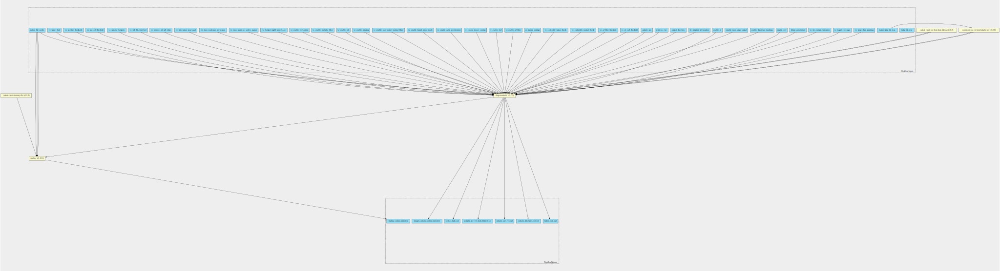
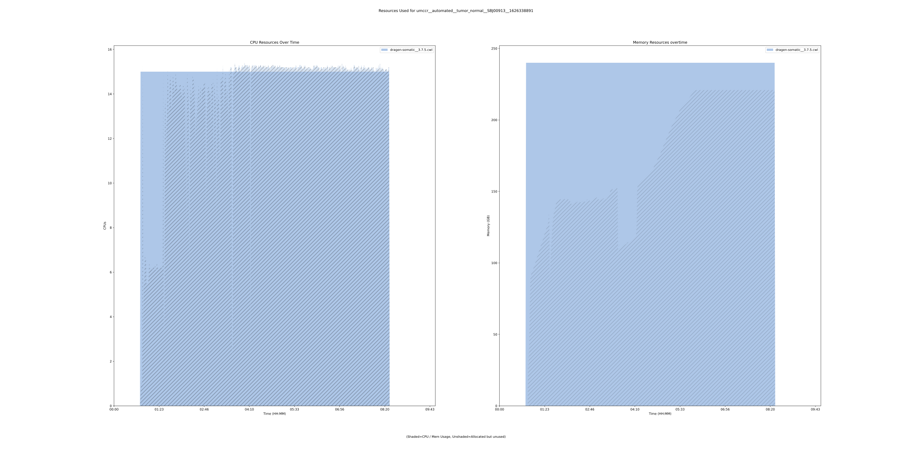
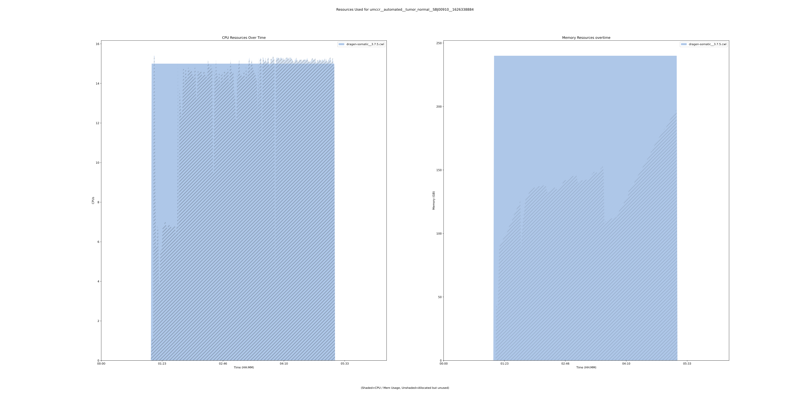

dragen-somatic-pipeline 3.7.5 workflow
======================================

## Table of Contents
  
- [Overview](#dragen-somatic-pipeline-v375-overview)  
- [Visual](#visual-workflow-overview)  
- [Links](#related-links)  
- [Inputs](#dragen-somatic-pipeline-v375-inputs)  
- [Steps](#dragen-somatic-pipeline-v375-steps)  
- [Outputs](#dragen-somatic-pipeline-v375-outputs)  
- [ICA](#ica)  


## dragen-somatic-pipeline v(3.7.5) Overview


  
> ID: dragen-somatic-pipeline--3.7.5  
> md5sum: 605e6e7e39454132389ab3ec24437371

### dragen-somatic-pipeline v(3.7.5) documentation
  
Run tumor-normal dragen somatic pipeline
v 3.7.5.
Workflow takes in two separate lists of object stor version of the fastq_list.csv equivalent
See the fastq_list_row schema definitions for more information.
More information on the documentation can be found [here](https://sapac.support.illumina.com/content/dam/illumina-support/help/Illumina_DRAGEN_Bio_IT_Platform_v3_7_1000000141465/Content/SW/Informatics/Dragen/GPipelineSomCom_appDRAG.htm)

### Categories
  
- dragen  
- variant-calling  


## Visual Workflow Overview
  
[](https://github.com/umccr/cwl-ica/raw/main/.github/catalogue/images/workflows/dragen-somatic-pipeline/3.7.5/dragen-somatic-pipeline__3.7.5.svg)
## Related Links
  
- [CWL File Path](../../../../../../workflows/dragen-somatic-pipeline/3.7.5/dragen-somatic-pipeline__3.7.5.cwl)  


### Uses
  
- [custom-touch-file 1.0.0 :construction:](../../../tools/custom-touch-file/1.0.0/custom-touch-file__1.0.0.md)  
- [custom-create-csv-from-fastq-list-rows 1.0.0 :construction:](../../../tools/custom-create-csv-from-fastq-list-rows/1.0.0/custom-create-csv-from-fastq-list-rows__1.0.0.md)  
- [custom-create-csv-from-fastq-list-rows 1.0.0 :construction:](../../../tools/custom-create-csv-from-fastq-list-rows/1.0.0/custom-create-csv-from-fastq-list-rows__1.0.0.md)  
- [multiqc 1.10.1](../../../tools/multiqc/1.10.1/multiqc__1.10.1.md)  
- [dragen-somatic 3.7.5](../../../tools/dragen-somatic/3.7.5/dragen-somatic__3.7.5.md)  

  


## dragen-somatic-pipeline v(3.7.5) Inputs

### dbsnp annotation


  
> ID: dbsnp_annotation
  
**Optional:** `True`  
**Type:** `File`  
**Docs:**  
In Germline, Tumor-Normal somatic, or Tumor-Only somatic modes,
DRAGEN can look up variant calls in a dbSNP database and add annotations for any matches that it finds there.
To enable the dbSNP database search, set the --dbsnp option to the full path to the dbSNP database
VCF or .vcf.gz file, which must be sorted in reference order.


### enable duplicate marking


  
> ID: enable_duplicate_marking
  
**Optional:** `True`  
**Type:** `boolean`  
**Docs:**  
Enable the flagging of duplicate output
alignment records.


### enable map align output


  
> ID: enable_map_align_output
  
**Optional:** `True`  
**Type:** `boolean`  
**Docs:**  
Enables saving the output from the
map/align stage. Default is true when only
running map/align. Default is false if
running the variant caller.


### enable sv


  
> ID: enable_sv
  
**Optional:** `True`  
**Type:** `boolean`  
**Docs:**  
Enable/disable structural variant
caller. Default is false.


### Row of fastq lists


  
> ID: fastq_list_rows
  
**Optional:** `False`  
**Type:** `fastq-list-row[]`  
**Docs:**  
The row of fastq lists.
Each row has the following attributes:
  * RGID
  * RGLB
  * RGSM
  * Lane
  * Read1File
  * Read2File (optional)


### license instance id location


  
> ID: lic_instance_id_location
  
**Optional:** `True`  
**Type:** `['File', 'string']`  
**Docs:**  
You may wish to place your own in.
Optional value, default set to /opt/instance-identity
which is a path inside the dragen container


### output directory


  
> ID: output_directory
  
**Optional:** `False`  
**Type:** `string`  
**Docs:**  
Required - The output directory.


### output file prefix


  
> ID: output_file_prefix
  
**Optional:** `False`  
**Type:** `string`  
**Docs:**  
Required - the output file prefix


### reference tar


  
> ID: reference_tar
  
**Optional:** `False`  
**Type:** `File`  
**Docs:**  
Path to ref data tarball


### sample sex


  
> ID: sample_sex
  
**Optional:** `True`  
**Type:** `<cwl_utils.parser_v1_1.InputEnumSchema object at 0x7f55a938bf70>`  
**Docs:**  
Specifies the sex of a sample


### Row of fastq lists


  
> ID: tumor_fastq_list_rows
  
**Optional:** `False`  
**Type:** `fastq-list-row[]`  
**Docs:**  
The row of fastq lists.
Each row has the following attributes:
  * RGID
  * RGLB
  * RGSM
  * Lane
  * Read1File
  * Read2File (optional)


### vc af call threshold


  
> ID: vc_af_call_threshold
  
**Optional:** `True`  
**Type:** `float`  
**Docs:**  
Set the allele frequency call threshold to emit a call in the VCF if the AF filter is enabled.
The default is 0.01.


### vc af filter threshold


  
> ID: vc_af_filter_threshold
  
**Optional:** `True`  
**Type:** `float`  
**Docs:**  
Set the allele frequency filter threshold to mark emitted VCF calls as filtered if the AF filter is
enabled.
The default is 0.05.


### vc callability normal thresh


  
> ID: vc_callability_normal_thresh
  
**Optional:** `True`  
**Type:** `int`  
**Docs:**  
The --vc-callability-normal-thresh option specifies the callability threshold for normal samples.
The somatic callable regions report includes all regions with normal coverage above the normal threshold.


### vc callability tumor thresh


  
> ID: vc_callability_tumor_thresh
  
**Optional:** `True`  
**Type:** `int`  
**Docs:**  
The --vc-callability-tumor-thresh option specifies the callability threshold for tumor samples. The
somatic callable regions report includes all regions with tumor coverage above the tumor threshold.


### vc decoy contigs


  
> ID: vc_decoy_contigs
  
**Optional:** `True`  
**Type:** `string`  
**Docs:**  
The --vc-decoy-contigs option specifies a comma-separated list of contigs to skip during variant calling.
This option can be set in the configuration file.


### vc enable af filter


  
> ID: vc_enable_af_filter
  
**Optional:** `True`  
**Type:** `boolean`  
**Docs:**  
Enables the allele frequency filter. The default value is false. When set to true, the VCF excludes variants
with allele frequencies below the AF call threshold or variants with an allele frequency below the AF filter
threshold and tagged with low AF filter tag. The default AF call threshold is 1% and the default AF filter
threshold is 5%.
To change the threshold values, use the following command line options:
  --vc-af-callthreshold and --vc-af-filter-threshold.


### vc enable baf


  
> ID: vc_enable_baf
  
**Optional:** `True`  
**Type:** `boolean`  
**Docs:**  
Enable or disable B-allele frequency output. Enabled by default.


### vc enable decoy contigs


  
> ID: vc_enable_decoy_contigs
  
**Optional:** `True`  
**Type:** `boolean`  
**Docs:**  
If --vc-enable-decoy-contigs is set to true, variant calls on the decoy contigs are enabled.
The default value is false.


### vc enable gatk acceleration


  
> ID: vc_enable_gatk_acceleration
  
**Optional:** `True`  
**Type:** `boolean`  
**Docs:**  
If is set to true, the variant caller runs in GATK mode
(concordant with GATK 3.7 in germline mode and GATK 4.0 in somatic mode).


### vc enable liquid tumor mode


  
> ID: vc_enable_liquid_tumor_mode
  
**Optional:** `True`  
**Type:** `boolean`  
**Docs:**  
In a tumor-normal analysis, DRAGEN accounts for tumor-in-normal (TiN) contamination by running liquid
tumor mode. Liquid tumor mode is disabled by default. When liquid tumor mode is enabled, DRAGEN is
able to call variants in the presence of TiN contamination up to a specified maximum tolerance level.
vc-enable-liquid-tumor-mode enables liquid tumor mode with a default maximum contamination
TiN tolerance of 0.15. If using the default maximum contamination TiN tolerance, somatic variants are
expected to be observed in the normal sample with allele frequencies up to 15% of the corresponding
allele in the tumor sample.


### vc enable non homoref normal filter


  
> ID: vc_enable_non_homref_normal_filter
  
**Optional:** `True`  
**Type:** `boolean`  
**Docs:**  
Enables the non-homref normal filter. The default value is true. When set to true, the VCF filters out
variants if the normal sample genotype is not a homozygous reference.


### vc enable phasing


  
> ID: vc_enable_phasing
  
**Optional:** `True`  
**Type:** `boolean`  
**Docs:**  
The –vc-enable-phasing option enables variants to be phased when possible. The default value is true.


### vc enable roh


  
> ID: vc_enable_roh
  
**Optional:** `True`  
**Type:** `boolean`  
**Docs:**  
Enable or disable the ROH caller by setting this option to true or false. Enabled by default for human autosomes only.


### vc enable triallelic filter


  
> ID: vc_enable_triallelic_filter
  
**Optional:** `True`  
**Type:** `boolean`  
**Docs:**  
Enables the multiallelic filter. The default is true.


### vc enable vcf output


  
> ID: vc_enable_vcf_output
  
**Optional:** `True`  
**Type:** `boolean`  
**Docs:**  
The –vc-enable-vcf-output option enables VCF file output during a gVCF run. The default value is false.


### vc hotspot log10 prior boost


  
> ID: vc_hotspot_log10_prior_boost
  
**Optional:** `True`  
**Type:** `int`  
**Docs:**  
The size of the hotspot adjustment can be controlled via vc-hotspotlog10-prior-boost,
which has a default value of 4 (log10 scale) corresponding to an increase of 40 phred.


### vc max reads per active region


  
> ID: vc_max_reads_per_active_region
  
**Optional:** `True`  
**Type:** `int`  
**Docs:**  
specifies the maximum number of reads covering a given active region.
Default is 10000 for the somatic workflow


### vc max reads per raw region


  
> ID: vc_max_reads_per_raw_region
  
**Optional:** `True`  
**Type:** `int`  
**Docs:**  
specifies the maximum number of reads covering a given raw region.
Default is 30000 for the somatic workflow


### vc min tumor read qual


  
> ID: vc_min_tumor_read_qual
  
**Optional:** `True`  
**Type:** `int`  
**Docs:**  
The --vc-min-tumor-read-qual option specifies the minimum read quality (MAPQ) to be considered for
variant calling. The default value is 3 for tumor-normal analysis or 20 for tumor-only analysis.


### vc remove all soft clips


  
> ID: vc_remove_all_soft_clips
  
**Optional:** `True`  
**Type:** `boolean`  
**Docs:**  
If is set to true, the variant caller does not use soft clips of reads to determine variants.


### vc roh blacklist bed


  
> ID: vc_roh_blacklist_bed
  
**Optional:** `True`  
**Type:** `File`  
**Docs:**  
If provided, the ROH caller ignores variants that are contained in any region in the blacklist BED file.
DRAGEN distributes blacklist files for all popular human genomes and automatically selects a blacklist to
match the genome in use, unless this option is used explicitly select a file.


### vc somatic hotspots


  
> ID: vc_somatic_hotspots
  
**Optional:** `True`  
**Type:** `File`  
**Docs:**  
The somatic hotspots option allows an input VCF to specify the positions where the risk for somatic
mutations are assumed to be significantly elevated. DRAGEN genotyping priors are boosted for all
postions specified in the VCF, so it is possible to call a variant at one of these sites with fewer supporting
reads. The cosmic database in VCF format can be used as one source of prior information to boost
sensitivity for known somatic mutations.


### vc sq call threshold


  
> ID: vc_sq_call_threshold
  
**Optional:** `True`  
**Type:** `float`  
**Docs:**  
Emits calls in the VCF. The default is 3.
If the value for vc-sq-filter-threshold is lower than vc-sq-callthreshold,
the filter threshold value is used instead of the call threshold value


### vc sq filter threshold


  
> ID: vc_sq_filter_threshold
  
**Optional:** `True`  
**Type:** `float`  
**Docs:**  
Marks emitted VCF calls as filtered.
The default is 17.5 for tumor-normal and 6.5 for tumor-only.


### vc target bed


  
> ID: vc_target_bed
  
**Optional:** `True`  
**Type:** `File`  
**Docs:**  
This is an optional command line input that restricts processing of the small variant caller,
target bed related coverage, and callability metrics to regions specified in a BED file.


### vc target bed padding


  
> ID: vc_target_bed_padding
  
**Optional:** `True`  
**Type:** `int`  
**Docs:**  
This is an optional command line input that can be used to pad all of the target
BED regions with the specified value.
For example, if a BED region is 1:1000-2000 and a padding value of 100 is used,
it is equivalent to using a BED region of 1:900-2100 and a padding value of 0.

Any padding added to --vc-target-bed-padding is used by the small variant caller
and by the target bed coverage/callability reports. The default padding is 0.


### vc target coverage


  
> ID: vc_target_coverage
  
**Optional:** `True`  
**Type:** `int`  
**Docs:**  
The --vc-target-coverage option specifies the target coverage for down-sampling.
The default value is 500 for germline mode and 50 for somatic mode.


### vc tin contam tolerance


  
> ID: vc_tin_contam_tolerance
  
**Optional:** `True`  
**Type:** `float`  
**Docs:**  
--vc-tin-contam-tolerance enables liquid tumor mode and allows you to
 set the maximum contamination TiN tolerance. The maximum contamination TiN tolerance must be
 greater than zero. For example, vc-tin-contam-tolerance=-0.1.

  


## dragen-somatic-pipeline v(3.7.5) Steps

### Create dummy file


  
> ID: dragen-somatic-pipeline--3.7.5/create_dummy_file_step
  
**Step Type:** tool  
**Docs:**
  
Intermediate step for letting multiqc-interop be placed in stream mode

#### Links
  
[CWL File Path](../../../../../../tools/custom-touch-file/1.0.0/custom-touch-file__1.0.0.cwl)  
[CWL File Help Page :construction:](../../../tools/custom-touch-file/1.0.0/custom-touch-file__1.0.0.md)  


### create fastq list csv step


  
> ID: dragen-somatic-pipeline--3.7.5/create_fastq_list_csv_step
  
**Step Type:** tool  
**Docs:**
  
Create the normal fastq list csv to then run the somatic tool.
Takes in an array of fastq_list_row schema.
Returns a csv file along with predefined_mount_path schema

#### Links
  
[CWL File Path](../../../../../../tools/custom-create-csv-from-fastq-list-rows/1.0.0/custom-create-csv-from-fastq-list-rows__1.0.0.cwl)  
[CWL File Help Page :construction:](../../../tools/custom-create-csv-from-fastq-list-rows/1.0.0/custom-create-csv-from-fastq-list-rows__1.0.0.md)  


### create tumor fastq list csv step


  
> ID: dragen-somatic-pipeline--3.7.5/create_tumor_fastq_list_csv_step
  
**Step Type:** tool  
**Docs:**
  
Create the tumor fastq list csv to then run the somatic tool.
Takes in an array of fastq_list_row schema.
Returns a csv file along with predefined_mount_path schema

#### Links
  
[CWL File Path](../../../../../../tools/custom-create-csv-from-fastq-list-rows/1.0.0/custom-create-csv-from-fastq-list-rows__1.0.0.cwl)  
[CWL File Help Page :construction:](../../../tools/custom-create-csv-from-fastq-list-rows/1.0.0/custom-create-csv-from-fastq-list-rows__1.0.0.md)  


### dragen qc step


  
> ID: dragen-somatic-pipeline--3.7.5/dragen_qc_step
  
**Step Type:** tool  
**Docs:**
  
The dragen qc step - this takes in an array of dirs

#### Links
  
[CWL File Path](../../../../../../tools/multiqc/1.10.1/multiqc__1.10.1.cwl)  
[CWL File Help Page](../../../tools/multiqc/1.10.1/multiqc__1.10.1.md)  


### run dragen somatic step


  
> ID: dragen-somatic-pipeline--3.7.5/run_dragen_somatic_step
  
**Step Type:** tool  
**Docs:**
  
Runs the dragen somatic workflow on the FPGA.
Takes in a normal and tumor fastq list and corresponding mount paths from the predefined_mount_paths.
All other options avaiable at the top of the workflow

#### Links
  
[CWL File Path](../../../../../../tools/dragen-somatic/3.7.5/dragen-somatic__3.7.5.cwl)  
[CWL File Help Page](../../../tools/dragen-somatic/3.7.5/dragen-somatic__3.7.5.md)  


## dragen-somatic-pipeline v(3.7.5) Outputs

### dragen somatic output directory


  
> ID: dragen-somatic-pipeline--3.7.5/dragen_somatic_output_directory  

  
**Optional:** `False`  
**Output Type:** `Directory`  
**Docs:**  
Output directory containing all outputs of the somatic dragen run
  


### multiqc output directory


  
> ID: dragen-somatic-pipeline--3.7.5/multiqc_output_directory  

  
**Optional:** `False`  
**Output Type:** `Directory`  
**Docs:**  
The output directory for multiqc
  


### output normal bam


  
> ID: dragen-somatic-pipeline--3.7.5/normal_bam_out  

  
**Optional:** `True`  
**Output Type:** `File`  
**Docs:**  
Bam file of the normal sample
  


### somatic snv vcf filetered


  
> ID: dragen-somatic-pipeline--3.7.5/somatic_snv_vcf_hard_filtered_out  

  
**Optional:** `True`  
**Output Type:** `File`  
**Docs:**  
Output of the snv vcf filtered tumor calls
  


### somatic snv vcf


  
> ID: dragen-somatic-pipeline--3.7.5/somatic_snv_vcf_out  

  
**Optional:** `True`  
**Output Type:** `File`  
**Docs:**  
Output of the snv vcf tumor calls
  


### somatic sv vcf filetered


  
> ID: dragen-somatic-pipeline--3.7.5/somatic_structural_vcf_out  

  
**Optional:** `True`  
**Output Type:** `File`  
**Docs:**  
Output of the sv vcf filtered tumor calls.
Exists only if --enable-sv is set to true.
  


### output tumor bam


  
> ID: dragen-somatic-pipeline--3.7.5/tumor_bam_out  

  
**Optional:** `True`  
**Output Type:** `File`  
**Docs:**  
Bam file of the tumor sample
  

  


## ICA

### ToC
  
- [development_workflows](#project-development_workflows)  
- [production_workflows](#project-production_workflows)  


### Project: development_workflows


> wfl id: wfl.32e346cdbb854f6487e7594ec17a81f9  

  
**workflow name:** dragen-somatic-pipeline_dev-wf  
**wfl version name:** 3.7.5  


#### Run Instances

##### ToC
  
- [Run wfr.e3c6b8ce7e4447cbbd321b5c96ef7670](#run-wfre3c6b8ce7e4447cbbd321b5c96ef7670)  
- [Run wfr.58436856778e4f70ae7856869571470c](#run-wfr58436856778e4f70ae7856869571470c)  


##### Run wfr.e3c6b8ce7e4447cbbd321b5c96ef7670


  
> Run Name: umccr__automated__tumor_normal__SBJ00913__1626338891  

  
**Start Time:** 2021-07-15 08:48:13 UTC  
**Duration:** 2021-07-15 18:13:17 UTC  
**End Time:** 0 days 09:25:03  


###### Reproduce Run


```bash

# Run the submission template to create the workflow input json and launch script            
cwl-ica copy-workflow-submission-template --ica-workflow-run-instance-id wfr.e3c6b8ce7e4447cbbd321b5c96ef7670

# Edit the input json file (optional)
# vim wfr.e3c6b8ce7e4447cbbd321b5c96ef7670.template.json 

# Run the launch script
bash wfr.e3c6b8ce7e4447cbbd321b5c96ef7670.launch.sh
                                    
```  


###### Run Inputs


```
{
    "output_file_prefix": "MDX210179",
    "output_directory": "SBJ00913",
    "fastq_list_rows": [
        {
            "rgid": "GTTCCAAT.GCAGAATT.2.210708_A00130_0166_AH7KTJDSX2.MDX210178_L2100747",
            "rglb": "L2100747",
            "rgsm": "MDX210178",
            "lane": 2,
            "read_1": {
                "class": "File",
                "location": "gds://umccr-fastq-data-dev/210708_A00130_0166_AH7KTJDSX2/WGS_TsqNano/CMitchell/MDX210178_L2100747_S7_L002_R1_001.fastq.gz"
            },
            "read_2": {
                "class": "File",
                "location": "gds://umccr-fastq-data-dev/210708_A00130_0166_AH7KTJDSX2/WGS_TsqNano/CMitchell/MDX210178_L2100747_S7_L002_R2_001.fastq.gz"
            }
        }
    ],
    "tumor_fastq_list_rows": [
        {
            "rgid": "ACCTTGGC.ATGAGGCC.2.210708_A00130_0166_AH7KTJDSX2.MDX210179_L2100748",
            "rglb": "L2100748",
            "rgsm": "MDX210179",
            "lane": 2,
            "read_1": {
                "class": "File",
                "location": "gds://umccr-fastq-data-dev/210708_A00130_0166_AH7KTJDSX2/WGS_TsqNano/CMitchell/MDX210179_L2100748_S8_L002_R1_001.fastq.gz"
            },
            "read_2": {
                "class": "File",
                "location": "gds://umccr-fastq-data-dev/210708_A00130_0166_AH7KTJDSX2/WGS_TsqNano/CMitchell/MDX210179_L2100748_S8_L002_R2_001.fastq.gz"
            }
        }
    ],
    "enable_map_align_output": true,
    "enable_duplicate_marking": true,
    "enable_sv": true,
    "reference_tar": {
        "class": "File",
        "location": "gds://umccr-refdata-dev/dragen/genomes/hg38/3.7.5/hg38_alt_ht_3_7_5.tar.gz"
    }
}
```  


###### Run Engine Parameters


```
{
    "workDirectory": "gds://wfr.e3c6b8ce7e4447cbbd321b5c96ef7670/umccr__automated__tumor_normal__SBJ00913__1626338891",
    "outputDirectory": "gds://wfr.e3c6b8ce7e4447cbbd321b5c96ef7670/umccr__automated__tumor_normal__SBJ00913__1626338891/outputs",
    "tmpOutputDirectory": "gds://wfr.e3c6b8ce7e4447cbbd321b5c96ef7670/umccr__automated__tumor_normal__SBJ00913__1626338891/steps",
    "logDirectory": "gds://wfr.e3c6b8ce7e4447cbbd321b5c96ef7670/umccr__automated__tumor_normal__SBJ00913__1626338891/logs",
    "maxScatter": 32,
    "outputSetting": "move",
    "copyOutputInstanceType": "StandardHiCpu",
    "copyOutputInstanceSize": "Medium",
    "defaultInputMode": "'Download'",
    "inputModeOverrides": {},
    "tesUseInputManifest": "'auto'",
    "cwltool": "3.0.20201203173111",
    "engine": "1.16.0-202106091735-develop"
}
```  


###### Run Outputs


```
{
    "dragen_somatic_output_directory": {
        "location": "gds://wfr.e3c6b8ce7e4447cbbd321b5c96ef7670/umccr__automated__tumor_normal__SBJ00913__1626338891/outputs/SBJ00913",
        "basename": "SBJ00913",
        "nameroot": "",
        "nameext": "",
        "class": "Directory",
        "size": null
    },
    "multiqc_output_directory": {
        "location": "gds://wfr.e3c6b8ce7e4447cbbd321b5c96ef7670/umccr__automated__tumor_normal__SBJ00913__1626338891/outputs/MDX210179_dragen_somatic_multiqc",
        "basename": "MDX210179_dragen_somatic_multiqc",
        "nameroot": "",
        "nameext": "",
        "class": "Directory",
        "size": null
    },
    "normal_bam_out": {
        "location": "gds://wfr.e3c6b8ce7e4447cbbd321b5c96ef7670/umccr__automated__tumor_normal__SBJ00913__1626338891/outputs/SBJ00913/MDX210179.bam",
        "basename": "MDX210179.bam",
        "nameroot": "MDX210179",
        "nameext": ".bam",
        "class": "File",
        "size": 84305846185,
        "secondaryFiles": [
            {
                "basename": "MDX210179.bam.bai",
                "location": "gds://wfr.e3c6b8ce7e4447cbbd321b5c96ef7670/umccr__automated__tumor_normal__SBJ00913__1626338891/outputs/SBJ00913/MDX210179.bam.bai",
                "class": "File",
                "nameroot": "MDX210179.bam",
                "nameext": ".bai",
                "http://commonwl.org/cwltool#generation": 0
            }
        ],
        "http://commonwl.org/cwltool#generation": 0
    },
    "somatic_snv_vcf_hard_filtered_out": {
        "location": "gds://wfr.e3c6b8ce7e4447cbbd321b5c96ef7670/umccr__automated__tumor_normal__SBJ00913__1626338891/outputs/SBJ00913/MDX210179.hard-filtered.vcf.gz",
        "basename": "MDX210179.hard-filtered.vcf.gz",
        "nameroot": "MDX210179.hard-filtered.vcf",
        "nameext": ".gz",
        "class": "File",
        "size": 8586739,
        "secondaryFiles": [
            {
                "basename": "MDX210179.hard-filtered.vcf.gz.tbi",
                "location": "gds://wfr.e3c6b8ce7e4447cbbd321b5c96ef7670/umccr__automated__tumor_normal__SBJ00913__1626338891/outputs/SBJ00913/MDX210179.hard-filtered.vcf.gz.tbi",
                "class": "File",
                "nameroot": "MDX210179.hard-filtered.vcf.gz",
                "nameext": ".tbi",
                "http://commonwl.org/cwltool#generation": 0
            }
        ],
        "http://commonwl.org/cwltool#generation": 0
    },
    "somatic_snv_vcf_out": {
        "location": "gds://wfr.e3c6b8ce7e4447cbbd321b5c96ef7670/umccr__automated__tumor_normal__SBJ00913__1626338891/outputs/SBJ00913/MDX210179.vcf.gz",
        "basename": "MDX210179.vcf.gz",
        "nameroot": "MDX210179.vcf",
        "nameext": ".gz",
        "class": "File",
        "size": 7951407,
        "secondaryFiles": [
            {
                "basename": "MDX210179.vcf.gz.tbi",
                "location": "gds://wfr.e3c6b8ce7e4447cbbd321b5c96ef7670/umccr__automated__tumor_normal__SBJ00913__1626338891/outputs/SBJ00913/MDX210179.vcf.gz.tbi",
                "class": "File",
                "nameroot": "MDX210179.vcf.gz",
                "nameext": ".tbi",
                "http://commonwl.org/cwltool#generation": 0
            }
        ],
        "http://commonwl.org/cwltool#generation": 0
    },
    "somatic_structural_vcf_out": {
        "location": "gds://wfr.e3c6b8ce7e4447cbbd321b5c96ef7670/umccr__automated__tumor_normal__SBJ00913__1626338891/outputs/SBJ00913/MDX210179.sv.vcf.gz",
        "basename": "MDX210179.sv.vcf.gz",
        "nameroot": "MDX210179.sv.vcf",
        "nameext": ".gz",
        "class": "File",
        "size": 89029,
        "secondaryFiles": [
            {
                "basename": "MDX210179.sv.vcf.gz.tbi",
                "location": "gds://wfr.e3c6b8ce7e4447cbbd321b5c96ef7670/umccr__automated__tumor_normal__SBJ00913__1626338891/outputs/SBJ00913/MDX210179.sv.vcf.gz.tbi",
                "class": "File",
                "nameroot": "MDX210179.sv.vcf.gz",
                "nameext": ".tbi",
                "http://commonwl.org/cwltool#generation": 0
            }
        ],
        "http://commonwl.org/cwltool#generation": 0
    },
    "tumor_bam_out": {
        "location": "gds://wfr.e3c6b8ce7e4447cbbd321b5c96ef7670/umccr__automated__tumor_normal__SBJ00913__1626338891/outputs/SBJ00913/MDX210179_tumor.bam",
        "basename": "MDX210179_tumor.bam",
        "nameroot": "MDX210179_tumor",
        "nameext": ".bam",
        "class": "File",
        "size": 190038608495,
        "secondaryFiles": [
            {
                "basename": "MDX210179_tumor.bam.bai",
                "location": "gds://wfr.e3c6b8ce7e4447cbbd321b5c96ef7670/umccr__automated__tumor_normal__SBJ00913__1626338891/outputs/SBJ00913/MDX210179_tumor.bam.bai",
                "class": "File",
                "nameroot": "MDX210179_tumor.bam",
                "nameext": ".bai",
                "http://commonwl.org/cwltool#generation": 0
            }
        ],
        "http://commonwl.org/cwltool#generation": 0
    },
    "output_dir_gds_session_id": "ssn.cc014a5bc2154e149b08769cafc38024",
    "output_dir_gds_folder_id": "fol.a103ab2152634bf9b4cf08d936288333"
}
```  


###### Run Resources Usage
  

  
[](https://github.com/umccr/cwl-ica/raw/main/.github/catalogue/images/runs/workflows/dragen-somatic-pipeline/3.7.5/umccr__automated__tumor_normal__SBJ00913__1626338891__wfr.e3c6b8ce7e4447cbbd321b5c96ef7670.svg)  


##### Run wfr.58436856778e4f70ae7856869571470c


  
> Run Name: umccr__automated__tumor_normal__SBJ00910__1626338884  

  
**Start Time:** 2021-07-15 08:48:10 UTC  
**Duration:** 2021-07-15 15:01:03 UTC  
**End Time:** 0 days 06:12:52  


###### Reproduce Run


```bash

# Run the submission template to create the workflow input json and launch script            
cwl-ica copy-workflow-submission-template --ica-workflow-run-instance-id wfr.58436856778e4f70ae7856869571470c

# Edit the input json file (optional)
# vim wfr.58436856778e4f70ae7856869571470c.template.json 

# Run the launch script
bash wfr.58436856778e4f70ae7856869571470c.launch.sh
                                    
```  


###### Run Inputs


```
{
    "output_file_prefix": "MDX210176",
    "output_directory": "SBJ00910",
    "fastq_list_rows": [
        {
            "rgid": "ATGGCATG.GGTACCTT.1.210708_A00130_0166_AH7KTJDSX2.MDX210175_L2100745",
            "rglb": "L2100745",
            "rgsm": "MDX210175",
            "lane": 1,
            "read_1": {
                "class": "File",
                "location": "gds://umccr-fastq-data-dev/210708_A00130_0166_AH7KTJDSX2/WGS_TsqNano/VCCC/MDX210175_L2100745_S5_L001_R1_001.fastq.gz"
            },
            "read_2": {
                "class": "File",
                "location": "gds://umccr-fastq-data-dev/210708_A00130_0166_AH7KTJDSX2/WGS_TsqNano/VCCC/MDX210175_L2100745_S5_L001_R2_001.fastq.gz"
            }
        }
    ],
    "tumor_fastq_list_rows": [
        {
            "rgid": "GCAATGCA.AACGTTCC.1.210708_A00130_0166_AH7KTJDSX2.MDX210176_L2100746",
            "rglb": "L2100746",
            "rgsm": "MDX210176",
            "lane": 1,
            "read_1": {
                "class": "File",
                "location": "gds://umccr-fastq-data-dev/210708_A00130_0166_AH7KTJDSX2/WGS_TsqNano/VCCC/MDX210176_L2100746_S6_L001_R1_001.fastq.gz"
            },
            "read_2": {
                "class": "File",
                "location": "gds://umccr-fastq-data-dev/210708_A00130_0166_AH7KTJDSX2/WGS_TsqNano/VCCC/MDX210176_L2100746_S6_L001_R2_001.fastq.gz"
            }
        }
    ],
    "enable_map_align_output": true,
    "enable_duplicate_marking": true,
    "enable_sv": true,
    "reference_tar": {
        "class": "File",
        "location": "gds://umccr-refdata-dev/dragen/genomes/hg38/3.7.5/hg38_alt_ht_3_7_5.tar.gz"
    }
}
```  


###### Run Engine Parameters


```
{
    "workDirectory": "gds://wfr.58436856778e4f70ae7856869571470c/umccr__automated__tumor_normal__SBJ00910__1626338884",
    "outputDirectory": "gds://wfr.58436856778e4f70ae7856869571470c/umccr__automated__tumor_normal__SBJ00910__1626338884/outputs",
    "tmpOutputDirectory": "gds://wfr.58436856778e4f70ae7856869571470c/umccr__automated__tumor_normal__SBJ00910__1626338884/steps",
    "logDirectory": "gds://wfr.58436856778e4f70ae7856869571470c/umccr__automated__tumor_normal__SBJ00910__1626338884/logs",
    "maxScatter": 32,
    "outputSetting": "move",
    "copyOutputInstanceType": "StandardHiCpu",
    "copyOutputInstanceSize": "Medium",
    "defaultInputMode": "'Download'",
    "inputModeOverrides": {},
    "tesUseInputManifest": "'auto'",
    "cwltool": "3.0.20201203173111",
    "engine": "1.16.0-202106091735-develop"
}
```  


###### Run Outputs


```
{
    "dragen_somatic_output_directory": {
        "location": "gds://wfr.58436856778e4f70ae7856869571470c/umccr__automated__tumor_normal__SBJ00910__1626338884/outputs/SBJ00910",
        "basename": "SBJ00910",
        "nameroot": "",
        "nameext": "",
        "class": "Directory",
        "size": null
    },
    "multiqc_output_directory": {
        "location": "gds://wfr.58436856778e4f70ae7856869571470c/umccr__automated__tumor_normal__SBJ00910__1626338884/outputs/MDX210176_dragen_somatic_multiqc",
        "basename": "MDX210176_dragen_somatic_multiqc",
        "nameroot": "",
        "nameext": "",
        "class": "Directory",
        "size": null
    },
    "normal_bam_out": {
        "location": "gds://wfr.58436856778e4f70ae7856869571470c/umccr__automated__tumor_normal__SBJ00910__1626338884/outputs/SBJ00910/MDX210176.bam",
        "basename": "MDX210176.bam",
        "nameroot": "MDX210176",
        "nameext": ".bam",
        "class": "File",
        "size": 111670297837,
        "secondaryFiles": [
            {
                "basename": "MDX210176.bam.bai",
                "location": "gds://wfr.58436856778e4f70ae7856869571470c/umccr__automated__tumor_normal__SBJ00910__1626338884/outputs/SBJ00910/MDX210176.bam.bai",
                "class": "File",
                "nameroot": "MDX210176.bam",
                "nameext": ".bai",
                "http://commonwl.org/cwltool#generation": 0
            }
        ],
        "http://commonwl.org/cwltool#generation": 0
    },
    "somatic_snv_vcf_hard_filtered_out": {
        "location": "gds://wfr.58436856778e4f70ae7856869571470c/umccr__automated__tumor_normal__SBJ00910__1626338884/outputs/SBJ00910/MDX210176.hard-filtered.vcf.gz",
        "basename": "MDX210176.hard-filtered.vcf.gz",
        "nameroot": "MDX210176.hard-filtered.vcf",
        "nameext": ".gz",
        "class": "File",
        "size": 3176203,
        "secondaryFiles": [
            {
                "basename": "MDX210176.hard-filtered.vcf.gz.tbi",
                "location": "gds://wfr.58436856778e4f70ae7856869571470c/umccr__automated__tumor_normal__SBJ00910__1626338884/outputs/SBJ00910/MDX210176.hard-filtered.vcf.gz.tbi",
                "class": "File",
                "nameroot": "MDX210176.hard-filtered.vcf.gz",
                "nameext": ".tbi",
                "http://commonwl.org/cwltool#generation": 0
            }
        ],
        "http://commonwl.org/cwltool#generation": 0
    },
    "somatic_snv_vcf_out": {
        "location": "gds://wfr.58436856778e4f70ae7856869571470c/umccr__automated__tumor_normal__SBJ00910__1626338884/outputs/SBJ00910/MDX210176.vcf.gz",
        "basename": "MDX210176.vcf.gz",
        "nameroot": "MDX210176.vcf",
        "nameext": ".gz",
        "class": "File",
        "size": 2957664,
        "secondaryFiles": [
            {
                "basename": "MDX210176.vcf.gz.tbi",
                "location": "gds://wfr.58436856778e4f70ae7856869571470c/umccr__automated__tumor_normal__SBJ00910__1626338884/outputs/SBJ00910/MDX210176.vcf.gz.tbi",
                "class": "File",
                "nameroot": "MDX210176.vcf.gz",
                "nameext": ".tbi",
                "http://commonwl.org/cwltool#generation": 0
            }
        ],
        "http://commonwl.org/cwltool#generation": 0
    },
    "somatic_structural_vcf_out": {
        "location": "gds://wfr.58436856778e4f70ae7856869571470c/umccr__automated__tumor_normal__SBJ00910__1626338884/outputs/SBJ00910/MDX210176.sv.vcf.gz",
        "basename": "MDX210176.sv.vcf.gz",
        "nameroot": "MDX210176.sv.vcf",
        "nameext": ".gz",
        "class": "File",
        "size": 44251,
        "secondaryFiles": [
            {
                "basename": "MDX210176.sv.vcf.gz.tbi",
                "location": "gds://wfr.58436856778e4f70ae7856869571470c/umccr__automated__tumor_normal__SBJ00910__1626338884/outputs/SBJ00910/MDX210176.sv.vcf.gz.tbi",
                "class": "File",
                "nameroot": "MDX210176.sv.vcf.gz",
                "nameext": ".tbi",
                "http://commonwl.org/cwltool#generation": 0
            }
        ],
        "http://commonwl.org/cwltool#generation": 0
    },
    "tumor_bam_out": {
        "location": "gds://wfr.58436856778e4f70ae7856869571470c/umccr__automated__tumor_normal__SBJ00910__1626338884/outputs/SBJ00910/MDX210176_tumor.bam",
        "basename": "MDX210176_tumor.bam",
        "nameroot": "MDX210176_tumor",
        "nameext": ".bam",
        "class": "File",
        "size": 148550172353,
        "secondaryFiles": [
            {
                "basename": "MDX210176_tumor.bam.bai",
                "location": "gds://wfr.58436856778e4f70ae7856869571470c/umccr__automated__tumor_normal__SBJ00910__1626338884/outputs/SBJ00910/MDX210176_tumor.bam.bai",
                "class": "File",
                "nameroot": "MDX210176_tumor.bam",
                "nameext": ".bai",
                "http://commonwl.org/cwltool#generation": 0
            }
        ],
        "http://commonwl.org/cwltool#generation": 0
    },
    "output_dir_gds_session_id": "ssn.2e13b3e3dcf64f899d3f5f1b3d6785b9",
    "output_dir_gds_folder_id": "fol.5002ded876154e1db4cc08d936288333"
}
```  


###### Run Resources Usage
  

  
[](https://github.com/umccr/cwl-ica/raw/main/.github/catalogue/images/runs/workflows/dragen-somatic-pipeline/3.7.5/umccr__automated__tumor_normal__SBJ00910__1626338884__wfr.58436856778e4f70ae7856869571470c.svg)  


### Project: production_workflows


> wfl id: wfl.aa0ccece4e004839aa7374d1d6530633  

  
**workflow name:** dragen-somatic-pipeline_prod-wf  
**wfl version name:** 3.7.5--09e7d14  

  

