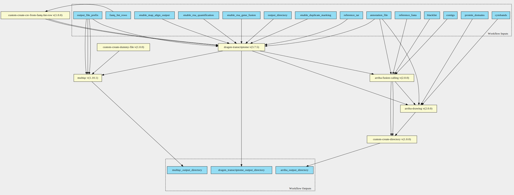
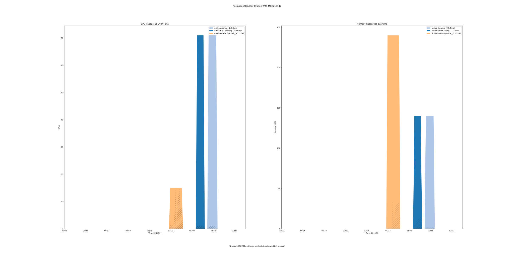

dragen-transcriptome-pipeline 3.7.5 workflow
============================================

## Table of Contents
  
- [Overview](#dragen-transcriptome-pipeline-v375-overview)  
- [Visual](#visual-workflow-overview)  
- [Links](#related-links)  
- [Inputs](#dragen-transcriptome-pipeline-v375-inputs)  
- [Steps](#dragen-transcriptome-pipeline-v375-steps)  
- [Outputs](#dragen-transcriptome-pipeline-v375-outputs)  
- [ICA](#ica)  


## dragen-transcriptome-pipeline v(3.7.5) Overview


  
> ID: dragen-transcriptome-pipeline--3.7.5  
> md5sum: 2eb9e5078c181d0f66eef2dc02ecdf3b

### dragen-transcriptome-pipeline v(3.7.5) documentation
  
Workflow takes in dragen param along with object store version of a fastq_list.csv equivalent.
See the fastq_list_row schema definitions for more information.
More information on the documentation can be found [here](https://sapac.support.illumina.com/content/dam/illumina-support/help/Illumina_DRAGEN_Bio_IT_Platform_v3_7_1000000141465/Content/SW/Informatics/Dragen/GPipelineVarCal_fDG.htm)

### Categories
  


## Visual Workflow Overview
  
[](https://github.com/umccr/cwl-ica/raw/main/.github/catalogue/images/workflows/dragen-transcriptome-pipeline/3.7.5/dragen-transcriptome-pipeline__3.7.5.svg)
## Related Links
  
- [CWL File Path](../../../../../../workflows/dragen-transcriptome-pipeline/3.7.5/dragen-transcriptome-pipeline__3.7.5.cwl)  


### Uses
  
- [arriba-drawing 2.0.0](../../../tools/arriba-drawing/2.0.0/arriba-drawing__2.0.0.md)  
- [arriba-fusion-calling 2.0.0](../../../tools/arriba-fusion-calling/2.0.0/arriba-fusion-calling__2.0.0.md)  
- [custom-create-directory 1.0.0](../../../tools/custom-create-directory/1.0.0/custom-create-directory__1.0.0.md)  
- [custom-touch-file 1.0.0 :construction:](../../../tools/custom-touch-file/1.0.0/custom-touch-file__1.0.0.md)  
- [custom-create-csv-from-fastq-list-rows 1.0.0 :construction:](../../../tools/custom-create-csv-from-fastq-list-rows/1.0.0/custom-create-csv-from-fastq-list-rows__1.0.0.md)  
- [multiqc 1.10.1](../../../tools/multiqc/1.10.1/multiqc__1.10.1.md)  
- [dragen-transcriptome 3.7.5](../../../tools/dragen-transcriptome/3.7.5/dragen-transcriptome__3.7.5.md)  

  


## dragen-transcriptome-pipeline v(3.7.5) Inputs

### annotation file


  
> ID: annotation_file
  
**Optional:** `False`  
**Type:** `File`  
**Docs:**  
Path to annotation transcript file.


### blacklist


  
> ID: blacklist
  
**Optional:** `False`  
**Type:** `File`  
**Docs:**  
File with blacklist range


### contigs


  
> ID: contigs
  
**Optional:** `True`  
**Type:** `string`  
**Docs:**  
Optional - List of interesting contigs
If not specified, defaults to 1,2,3,4,5,6,7,8,9,10,11,12,13,14,15,16,17,18,19,20,21,22,X,Y


### cytobands


  
> ID: cytobands
  
**Optional:** `False`  
**Type:** `File`  
**Docs:**  
Coordinates of the Giemsa staining bands.


### enable duplicate marking


  
> ID: enable_duplicate_marking
  
**Optional:** `True`  
**Type:** `boolean`  
**Docs:**  
Mark identical alignments as duplicates


### enable map align output


  
> ID: enable_map_align_output
  
**Optional:** `True`  
**Type:** `boolean`  
**Docs:**  
Do you wish to have the output bam files present


### enable rna gene fusion


  
> ID: enable_rna_gene_fusion
  
**Optional:** `True`  
**Type:** `boolean`  
**Docs:**  
Optional - Enable the DRAGEN Gene Fusion module - defaults to true


### enable rna quantification


  
> ID: enable_rna_quantification
  
**Optional:** `True`  
**Type:** `boolean`  
**Docs:**  
Optional - Enable the quantification module - defaults to true


### Row of fastq lists


  
> ID: fastq_list_rows
  
**Optional:** `False`  
**Type:** `fastq-list-row[]`  
**Docs:**  
The row of fastq lists.
Each row has the following attributes:
  * RGID
  * RGLB
  * RGSM
  * Lane
  * Read1File
  * Read2File (optional)


### output directory


  
> ID: output_directory
  
**Optional:** `False`  
**Type:** `string`  
**Docs:**  
The directory where all output files are placed


### output file prefix


  
> ID: output_file_prefix
  
**Optional:** `False`  
**Type:** `string`  
**Docs:**  
The prefix given to all output files


### protein domains


  
> ID: protein_domains
  
**Optional:** `False`  
**Type:** `File`  
**Docs:**  
GFF3 file containing the genomic coordinates of protein domains


### reference Fasta


  
> ID: reference_fasta
  
**Optional:** `False`  
**Type:** `File`  
**Docs:**  
FastA file with genome sequence


### reference tar


  
> ID: reference_tar
  
**Optional:** `False`  
**Type:** `File`  
**Docs:**  
Path to ref data tarball

  


## dragen-transcriptome-pipeline v(3.7.5) Steps

### arriba drawing step


  
> ID: dragen-transcriptome-pipeline--3.7.5/arriba_drawing_step
  
**Step Type:** tool  
**Docs:**
  
Run Arriba's drawing script for fusions predicted by previous step.

#### Links
  
[CWL File Path](../../../../../../tools/arriba-drawing/2.0.0/arriba-drawing__2.0.0.cwl)  
[CWL File Help Page](../../../tools/arriba-drawing/2.0.0/arriba-drawing__2.0.0.md)  


### arriba fusion step


  
> ID: dragen-transcriptome-pipeline--3.7.5/arriba_fusion_step
  
**Step Type:** tool  
**Docs:**
  
Runs Arriba fusion calling on the bam file produced by Dragen.

#### Links
  
[CWL File Path](../../../../../../tools/arriba-fusion-calling/2.0.0/arriba-fusion-calling__2.0.0.cwl)  
[CWL File Help Page](../../../tools/arriba-fusion-calling/2.0.0/arriba-fusion-calling__2.0.0.md)  


### create arriba output directory


  
> ID: dragen-transcriptome-pipeline--3.7.5/create_arriba_output_directory
  
**Step Type:** tool  
**Docs:**
  
Create an output directory to contain the arriba files

#### Links
  
[CWL File Path](../../../../../../tools/custom-create-directory/1.0.0/custom-create-directory__1.0.0.cwl)  
[CWL File Help Page](../../../tools/custom-create-directory/1.0.0/custom-create-directory__1.0.0.md)  


### Create dummy file


  
> ID: dragen-transcriptome-pipeline--3.7.5/create_dummy_file_step
  
**Step Type:** tool  
**Docs:**
  
Intermediate step for letting multiqc-interop be placed in stream mode

#### Links
  
[CWL File Path](../../../../../../tools/custom-touch-file/1.0.0/custom-touch-file__1.0.0.cwl)  
[CWL File Help Page :construction:](../../../tools/custom-touch-file/1.0.0/custom-touch-file__1.0.0.md)  


### create fastq list csv step


  
> ID: dragen-transcriptome-pipeline--3.7.5/create_fastq_list_csv_step
  
**Step Type:** tool  
**Docs:**
  
Create the fastq list csv to then run the germline tool.
Takes in an array of fastq_list_row schema.
Returns a csv file along with predefined_mount_path schema

#### Links
  
[CWL File Path](../../../../../../tools/custom-create-csv-from-fastq-list-rows/1.0.0/custom-create-csv-from-fastq-list-rows__1.0.0.cwl)  
[CWL File Help Page :construction:](../../../tools/custom-create-csv-from-fastq-list-rows/1.0.0/custom-create-csv-from-fastq-list-rows__1.0.0.md)  


### dragen qc step


  
> ID: dragen-transcriptome-pipeline--3.7.5/dragen_qc_step
  
**Step Type:** tool  
**Docs:**
  
The dragen qc step - this takes in an array of dirs

#### Links
  
[CWL File Path](../../../../../../tools/multiqc/1.10.1/multiqc__1.10.1.cwl)  
[CWL File Help Page](../../../tools/multiqc/1.10.1/multiqc__1.10.1.md)  


### run dragen transcriptome step


  
> ID: dragen-transcriptome-pipeline--3.7.5/run_dragen_transcriptome_step
  
**Step Type:** tool  
**Docs:**
  
Runs the dragen transcriptome workflow on the FPGA.
Takes in a fastq list and corresponding mount paths from the predefined_mount_paths.
All other options avaiable at the top of the workflow

#### Links
  
[CWL File Path](../../../../../../tools/dragen-transcriptome/3.7.5/dragen-transcriptome__3.7.5.cwl)  
[CWL File Help Page](../../../tools/dragen-transcriptome/3.7.5/dragen-transcriptome__3.7.5.md)  


## dragen-transcriptome-pipeline v(3.7.5) Outputs

### arriba output directory


  
> ID: dragen-transcriptome-pipeline--3.7.5/arriba_output_directory  

  
**Optional:** `False`  
**Output Type:** `Directory`  
**Docs:**  
The directory containing output files from arriba
  


### dragen transcriptome output directory


  
> ID: dragen-transcriptome-pipeline--3.7.5/dragen_transcriptome_output_directory  

  
**Optional:** `False`  
**Output Type:** `Directory`  
**Docs:**  
The output directory containing all transcriptome output files
  


### multiqc output directory


  
> ID: dragen-transcriptome-pipeline--3.7.5/multiqc_output_directory  

  
**Optional:** `False`  
**Output Type:** `Directory`  
**Docs:**  
The output directory for multiqc
  

  


## ICA

### ToC
  
- [development_workflows](#project-development_workflows)  
- [production_workflows](#project-production_workflows)  


### Project: development_workflows


> wfl id: wfl.286d4a2e82f048609d5b288a9d2868f6  

  
**workflow name:** dragen-transcriptome-pipeline_dev-wf  
**wfl version name:** 3.7.5  


#### Run Instances

##### ToC
  
- [Run wfr.f0fa0ea3972f405aa5af5003e1427428](#run-wfrf0fa0ea3972f405aa5af5003e1427428)  


##### Run wfr.f0fa0ea3972f405aa5af5003e1427428


  
> Run Name: Dragen-WTS-MDX210147  

  
**Start Time:** 2021-07-17 06:31:29 UTC  
**Duration:** 2021-07-17 08:46:37 UTC  
**End Time:** 0 days 02:15:07  


###### Reproduce Run


```bash

# Run the submission template to create the workflow input json and launch script            
cwl-ica copy-workflow-submission-template --ica-workflow-run-instance-id wfr.f0fa0ea3972f405aa5af5003e1427428

# Edit the input json file (optional)
# vim wfr.f0fa0ea3972f405aa5af5003e1427428.template.json 

# Run the launch script
bash wfr.f0fa0ea3972f405aa5af5003e1427428.launch.sh
                                    
```  


###### Run Inputs


```
{
    "annotation_file": {
        "class": "File",
        "location": "gds://stratus-sehrish2/data/wts/ref-transcripts.non-zero-length.gtf"
    },
    "blacklist": {
        "class": "File",
        "location": "gds://stratus-sehrish2/data/arriba-blacklist.tsv.gz"
    },
    "cytobands": {
        "class": "File",
        "location": "gds://stratus-sehrish2/data/arriba/cytobands_hg38_GRCh38_2018-02-23.tsv"
    },
    "fastq_list_rows": [
        {
            "lane": 1,
            "read_1": {
                "class": "File",
                "location": "gds://stratus-sehrish2/data/wts/2021-07-01_WTS_NebRNA/VCCC/MDX210147_L2100702_S5_L001_R1_001.fastq.gz"
            },
            "read_2": {
                "class": "File",
                "location": "gds://stratus-sehrish2/data/wts/2021-07-01_WTS_NebRNA/VCCC/MDX210147_L2100702_S5_L001_R2_001.fastq.gz"
            },
            "rgid": "S5",
            "rglb": "UnknownLibrary",
            "rgsm": "S5"
        }
    ],
    "output_directory": "testing",
    "output_file_prefix": "BALL-Test",
    "protein_domains": {
        "class": "File",
        "location": "gds://stratus-sehrish2/data/arriba/protein_domains_hg38_GRCh38_2018-03-06.gff3"
    },
    "reference_fasta": {
        "class": "File",
        "location": "gds://stratus-sehrish2/hg38.fa"
    },
    "reference_tar": {
        "class": "File",
        "location": "gds://umccr-refdata-dev/dragen/genomes/hg38/3.7.5/hg38_alt_ht_3_7_5.tar.gz"
    }
}
```  


###### Run Engine Parameters


```
{
    "workDirectory": "gds://wfr.f0fa0ea3972f405aa5af5003e1427428/Dragen-WTS-MDX210147",
    "outputDirectory": "gds://stratus-sehrish2/dragen-wts/MDX210147_L2100702",
    "tmpOutputDirectory": "gds://wfr.f0fa0ea3972f405aa5af5003e1427428/Dragen-WTS-MDX210147/steps",
    "logDirectory": "gds://wfr.f0fa0ea3972f405aa5af5003e1427428/Dragen-WTS-MDX210147/logs",
    "maxScatter": 32,
    "outputSetting": "move",
    "copyOutputInstanceType": "StandardHiCpu",
    "copyOutputInstanceSize": "Medium",
    "defaultInputMode": "'Download'",
    "inputModeOverrides": {},
    "tesUseInputManifest": "'auto'",
    "cwltool": "3.0.20201203173111",
    "engine": "1.16.0-202106091735-develop"
}
```  


###### Run Outputs


```
{
    "arriba_output_directory": {
        "location": "gds://stratus-sehrish2/dragen-wts/MDX210147_L2100702/arriba_outputs",
        "basename": "arriba_outputs",
        "nameroot": "",
        "nameext": "",
        "class": "Directory",
        "size": null
    },
    "dragen_transcriptome_output_directory": {
        "location": "gds://stratus-sehrish2/dragen-wts/MDX210147_L2100702/testing",
        "basename": "testing",
        "nameroot": "",
        "nameext": "",
        "class": "Directory",
        "size": null
    },
    "multiqc_output_directory": {
        "location": "gds://stratus-sehrish2/dragen-wts/MDX210147_L2100702/BALL-Test_dragen_transcriptome_multiqc",
        "basename": "BALL-Test_dragen_transcriptome_multiqc",
        "nameroot": "",
        "nameext": "",
        "class": "Directory",
        "size": null
    },
    "output_dir_gds_session_id": null,
    "output_dir_gds_folder_id": null
}
```  


###### Run Resources Usage
  

  
[](https://github.com/umccr/cwl-ica/raw/main/.github/catalogue/images/runs/workflows/dragen-transcriptome-pipeline/3.7.5/Dragen-WTS-MDX210147__wfr.f0fa0ea3972f405aa5af5003e1427428.svg)  


### Project: production_workflows


> wfl id: wfl.7e5ba7470b5549a6b4bf6d95daaa1214  

  
**workflow name:** dragen-transcriptome-pipeline_prod-wf  
**wfl version name:** 3.7.5--d142c57  

  

