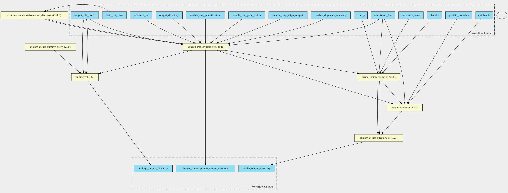

dragen-transcriptome-pipeline 3.8.4 workflow
============================================

## Table of Contents
  
- [Overview](#dragen-transcriptome-pipeline-v384-overview)  
- [Visual](#visual-workflow-overview)  
- [Links](#related-links)  
- [Inputs](#dragen-transcriptome-pipeline-v384-inputs)  
- [Steps](#dragen-transcriptome-pipeline-v384-steps)  
- [Outputs](#dragen-transcriptome-pipeline-v384-outputs)  
- [ICA](#ica)  

## dragen-transcriptome-pipeline v(3.8.4) Overview

  
> ID: dragen-transcriptome-pipeline--3.8.4  
> md5sum: d06c7d671f82027e581e0b67681a4d91

### dragen-transcriptome-pipeline v(3.8.4) documentation
  
Workflow takes in dragen param along with object store version of a fastq_list.csv equivalent.
See the fastq_list_row schema definitions for more information.
More information on the documentation can be found [here](https://sapac.support.illumina.com/content/dam/illumina-support/help/Illumina_DRAGEN_Bio_IT_Platform_v3_7_1000000141465/Content/SW/Informatics/Dragen/GPipelineVarCal_fDG.htm)

### Categories
  

## Visual Workflow Overview
  

## Related Links
  
- [CWL File Path](../../../../../../workflows/dragen-transcriptome-pipeline/3.8.4/dragen-transcriptome-pipeline__3.8.4.cwl)  

### Uses
  
- [arriba-drawing 2.0.0](../../../tools/arriba-drawing/2.0.0/arriba-drawing__2.0.0.md)  
- [arriba-fusion-calling 2.0.0](../../../tools/arriba-fusion-calling/2.0.0/arriba-fusion-calling__2.0.0.md)  
- [custom-create-directory 1.0.0](../../../tools/custom-create-directory/1.0.0/custom-create-directory__1.0.0.md)  
- [custom-touch-file 1.0.0 :construction:](../../../tools/custom-touch-file/1.0.0/custom-touch-file__1.0.0.md)  
- [custom-create-csv-from-fastq-list-rows 1.0.0 :construction:](../../../tools/custom-create-csv-from-fastq-list-rows/1.0.0/custom-create-csv-from-fastq-list-rows__1.0.0.md)  
- [multiqc 1.11.0](../../../tools/multiqc/1.11.0/multiqc__1.11.0.md)  
- [dragen-transcriptome 3.8.4](../../../tools/dragen-transcriptome/3.8.4/dragen-transcriptome__3.8.4.md)  

  

## dragen-transcriptome-pipeline v(3.8.4) Inputs

### annotation file

  
> ID: annotation_file
  
**Optional:** `False`  
**Type:** `File`  
**Docs:**  
Path to annotation transcript file.

### blacklist

  
> ID: blacklist
  
**Optional:** `False`  
**Type:** `File`  
**Docs:**  
File with blacklist range

### contigs

  
> ID: contigs
  
**Optional:** `True`  
**Type:** `string`  
**Docs:**  
Optional - List of interesting contigs
If not specified, defaults to 1,2,3,4,5,6,7,8,9,10,11,12,13,14,15,16,17,18,19,20,21,22,X,Y

### cytobands

  
> ID: cytobands
  
**Optional:** `False`  
**Type:** `File`  
**Docs:**  
Coordinates of the Giemsa staining bands.

### enable duplicate marking

  
> ID: enable_duplicate_marking
  
**Optional:** `True`  
**Type:** `boolean`  
**Docs:**  
Mark identical alignments as duplicates

### enable map align output

  
> ID: enable_map_align_output
  
**Optional:** `True`  
**Type:** `boolean`  
**Docs:**  
Do you wish to have the output bam files present

### enable rna gene fusion

  
> ID: enable_rna_gene_fusion
  
**Optional:** `True`  
**Type:** `boolean`  
**Docs:**  
Optional - Enable the DRAGEN Gene Fusion module - defaults to true

### enable rna quantification

  
> ID: enable_rna_quantification
  
**Optional:** `True`  
**Type:** `boolean`  
**Docs:**  
Optional - Enable the quantification module - defaults to true

### Row of fastq lists

  
> ID: fastq_list_rows
  
**Optional:** `False`  
**Type:** `fastq-list-row[]`  
**Docs:**  
The row of fastq lists.
Each row has the following attributes:
  * RGID
  * RGLB
  * RGSM
  * Lane
  * Read1File
  * Read2File (optional)

### output directory

  
> ID: output_directory
  
**Optional:** `False`  
**Type:** `string`  
**Docs:**  
The directory where all output files are placed

### output file prefix

  
> ID: output_file_prefix
  
**Optional:** `False`  
**Type:** `string`  
**Docs:**  
The prefix given to all output files

### protein domains

  
> ID: protein_domains
  
**Optional:** `False`  
**Type:** `File`  
**Docs:**  
GFF3 file containing the genomic coordinates of protein domains

### reference Fasta

  
> ID: reference_fasta
  
**Optional:** `False`  
**Type:** `File`  
**Docs:**  
FastA file with genome sequence

### reference tar

  
> ID: reference_tar
  
**Optional:** `False`  
**Type:** `File`  
**Docs:**  
Path to ref data tarball

  

## dragen-transcriptome-pipeline v(3.8.4) Steps

### arriba drawing step

  
> ID: dragen-transcriptome-pipeline--3.8.4/arriba_drawing_step
  
**Step Type:** tool  
**Docs:**
  
Run Arriba drawing script for fusions predicted by previous step.

#### Links
  
[CWL File Path](../../../../../../tools/arriba-drawing/2.0.0/arriba-drawing__2.0.0.cwl)  
[CWL File Help Page](../../../tools/arriba-drawing/2.0.0/arriba-drawing__2.0.0.md)  

### arriba fusion step

  
> ID: dragen-transcriptome-pipeline--3.8.4/arriba_fusion_step
  
**Step Type:** tool  
**Docs:**
  
Runs Arriba fusion calling on the bam file produced by Dragen.

#### Links
  
[CWL File Path](../../../../../../tools/arriba-fusion-calling/2.0.0/arriba-fusion-calling__2.0.0.cwl)  
[CWL File Help Page](../../../tools/arriba-fusion-calling/2.0.0/arriba-fusion-calling__2.0.0.md)  

### create arriba output directory

  
> ID: dragen-transcriptome-pipeline--3.8.4/create_arriba_output_directory
  
**Step Type:** tool  
**Docs:**
  
Create an output directory to contain the arriba files

#### Links
  
[CWL File Path](../../../../../../tools/custom-create-directory/1.0.0/custom-create-directory__1.0.0.cwl)  
[CWL File Help Page](../../../tools/custom-create-directory/1.0.0/custom-create-directory__1.0.0.md)  

### Create dummy file

  
> ID: dragen-transcriptome-pipeline--3.8.4/create_dummy_file_step
  
**Step Type:** tool  
**Docs:**
  
Intermediate step for letting multiqc-interop be placed in stream mode

#### Links
  
[CWL File Path](../../../../../../tools/custom-touch-file/1.0.0/custom-touch-file__1.0.0.cwl)  
[CWL File Help Page :construction:](../../../tools/custom-touch-file/1.0.0/custom-touch-file__1.0.0.md)  

### create fastq list csv step

  
> ID: dragen-transcriptome-pipeline--3.8.4/create_fastq_list_csv_step
  
**Step Type:** tool  
**Docs:**
  
Create the fastq list csv to then run the germline tool.
Takes in an array of fastq_list_row schema.
Returns a csv file along with predefined_mount_path schema

#### Links
  
[CWL File Path](../../../../../../tools/custom-create-csv-from-fastq-list-rows/1.0.0/custom-create-csv-from-fastq-list-rows__1.0.0.cwl)  
[CWL File Help Page :construction:](../../../tools/custom-create-csv-from-fastq-list-rows/1.0.0/custom-create-csv-from-fastq-list-rows__1.0.0.md)  

### dragen qc step

  
> ID: dragen-transcriptome-pipeline--3.8.4/dragen_qc_step
  
**Step Type:** tool  
**Docs:**
  
The dragen qc step - this takes in an array of dirs

#### Links
  
[CWL File Path](../../../../../../tools/multiqc/1.11.0/multiqc__1.11.0.cwl)  
[CWL File Help Page](../../../tools/multiqc/1.11.0/multiqc__1.11.0.md)  

### run dragen transcriptome step

  
> ID: dragen-transcriptome-pipeline--3.8.4/run_dragen_transcriptome_step
  
**Step Type:** tool  
**Docs:**
  
Runs the dragen transcriptome workflow on the FPGA.
Takes in a fastq list and corresponding mount paths from the predefined_mount_paths.
All other options avaiable at the top of the workflow

#### Links
  
[CWL File Path](../../../../../../tools/dragen-transcriptome/3.8.4/dragen-transcriptome__3.8.4.cwl)  
[CWL File Help Page](../../../tools/dragen-transcriptome/3.8.4/dragen-transcriptome__3.8.4.md)  

## dragen-transcriptome-pipeline v(3.8.4) Outputs

### arriba output directory

  
> ID: dragen-transcriptome-pipeline--3.8.4/arriba_output_directory  

  
**Optional:** `False`  
**Output Type:** `Directory`  
**Docs:**  
The directory containing output files from arriba
  

### dragen transcriptome output directory

  
> ID: dragen-transcriptome-pipeline--3.8.4/dragen_transcriptome_output_directory  

  
**Optional:** `False`  
**Output Type:** `Directory`  
**Docs:**  
The output directory containing all transcriptome output files
  

### multiqc output directory

  
> ID: dragen-transcriptome-pipeline--3.8.4/multiqc_output_directory  

  
**Optional:** `False`  
**Output Type:** `Directory`  
**Docs:**  
The output directory for multiqc
  

  

## ICA

### ToC
  
- [development_workflows](#project-development_workflows)  

### Project: development_workflows

> wfl id: wfl.286d4a2e82f048609d5b288a9d2868f6  

  
**workflow name:** dragen-transcriptome-pipeline_dev-wf  
**wfl version name:** 3.8.4  

  

