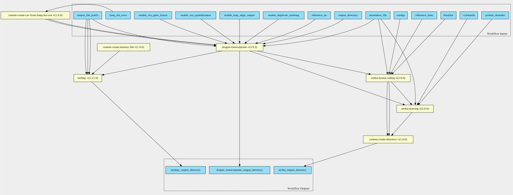
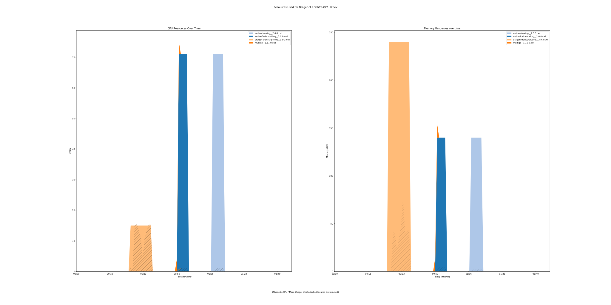
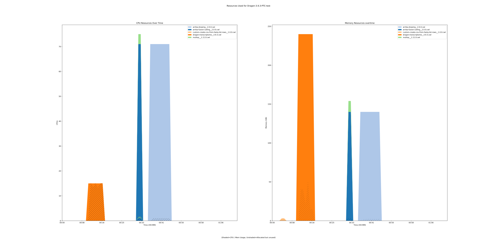
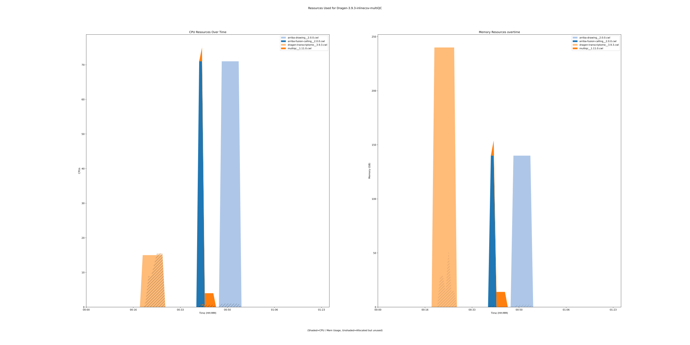

dragen-transcriptome-pipeline 3.9.3 workflow
============================================

## Table of Contents
  
- [Overview](#dragen-transcriptome-pipeline-v393-overview)  
- [Visual](#visual-workflow-overview)  
- [Links](#related-links)  
- [Inputs](#dragen-transcriptome-pipeline-v393-inputs)  
- [Steps](#dragen-transcriptome-pipeline-v393-steps)  
- [Outputs](#dragen-transcriptome-pipeline-v393-outputs)  
- [ICA](#ica)  


## dragen-transcriptome-pipeline v(3.9.3) Overview


  
> ID: dragen-transcriptome-pipeline--3.9.3  
> md5sum: 038d3874e34e619632ac04e10dd0b580

### dragen-transcriptome-pipeline v(3.9.3) documentation
  
Workflow takes in dragen param along with object store version of a fastq_list.csv equivalent.
See the fastq_list_row schema definitions for more information.
More information on the documentation can be found [here](https://support-docs.illumina.com/SW/DRAGEN_v39/Content/SW/DRAGEN/TPipelineIntro_fDG.htm)

### Categories
  


## Visual Workflow Overview
  
[](https://github.com/umccr/cwl-ica/raw/main/.github/catalogue/images/workflows/dragen-transcriptome-pipeline/3.9.3/dragen-transcriptome-pipeline__3.9.3.svg)
## Related Links
  
- [CWL File Path](../../../../../../workflows/dragen-transcriptome-pipeline/3.9.3/dragen-transcriptome-pipeline__3.9.3.cwl)  


### Uses
  
- [arriba-drawing 2.3.0](../../../tools/arriba-drawing/2.3.0/arriba-drawing__2.3.0.md)  
- [arriba-fusion-calling 2.3.0](../../../tools/arriba-fusion-calling/2.3.0/arriba-fusion-calling__2.3.0.md)  
- [custom-create-directory 1.0.0](../../../tools/custom-create-directory/1.0.0/custom-create-directory__1.0.0.md)  
- [custom-touch-file 1.0.0 :construction:](../../../tools/custom-touch-file/1.0.0/custom-touch-file__1.0.0.md)  
- [multiqc 1.14.0](../../../tools/multiqc/1.14.0/multiqc__1.14.0.md)  
- [dragen-transcriptome 3.9.3](../../../tools/dragen-transcriptome/3.9.3/dragen-transcriptome__3.9.3.md)  
- [qualimap 2.2.2](../../../tools/qualimap/2.2.2/qualimap__2.2.2.md)  

  


## dragen-transcriptome-pipeline v(3.9.3) Inputs

### algorithm


  
> ID: algorithm
  
**Optional:** `True`  
**Type:** `string`  
**Docs:**  
Counting algorithm:
uniquely-mapped-reads(default) or proportional.


### annotation file


  
> ID: annotation_file
  
**Optional:** `False`  
**Type:** `File`  
**Docs:**  
Path to annotation transcript file.


### blacklist


  
> ID: blacklist
  
**Optional:** `False`  
**Type:** `File`  
**Docs:**  
File with blacklist range


### cl config


  
> ID: cl_config
  
**Optional:** `True`  
**Type:** `string`  
**Docs:**  
command line config to supply additional config values on the command line.


### contigs


  
> ID: contigs
  
**Optional:** `True`  
**Type:** `string`  
**Docs:**  
Optional - List of interesting contigs
If not specified, defaults to 1,2,3,4,5,6,7,8,9,10,11,12,13,14,15,16,17,18,19,20,21,22,X,Y


### cytobands


  
> ID: cytobands
  
**Optional:** `False`  
**Type:** `File`  
**Docs:**  
Coordinates of the Giemsa staining bands.


### enable duplicate marking


  
> ID: enable_duplicate_marking
  
**Optional:** `False`  
**Type:** `boolean`  
**Docs:**  
Mark identical alignments as duplicates


### enable map align output


  
> ID: enable_map_align_output
  
**Optional:** `False`  
**Type:** `boolean`  
**Docs:**  
Do you wish to have the output bam files present


### enable rna gene fusion


  
> ID: enable_rna_gene_fusion
  
**Optional:** `True`  
**Type:** `boolean`  
**Docs:**  
Optional - Enable the DRAGEN Gene Fusion module - defaults to true


### enable rna quantification


  
> ID: enable_rna_quantification
  
**Optional:** `True`  
**Type:** `boolean`  
**Docs:**  
Optional - Enable the quantification module - defaults to true


### fastq list


  
> ID: fastq_list
  
**Optional:** `True`  
**Type:** `File`  
**Docs:**  
CSV file that contains a list of FASTQ files
to process. read_1 and read_2 components in the CSV file must be presigned urls.


### Row of fastq lists


  
> ID: fastq_list_rows
  
**Optional:** `True`  
**Type:** `fastq-list-row[]`  
**Docs:**  
The row of fastq lists.
Each row has the following attributes:
  * RGID
  * RGLB
  * RGSM
  * Lane
  * Read1File
  * Read2File (optional)


### java mem


  
> ID: java_mem
  
**Optional:** `False`  
**Type:** `string`  
**Docs:**  
Set desired Java heap memory size


### license instance id location


  
> ID: lic_instance_id_location
  
**Optional:** `True`  
**Type:** `['File', 'string']`  
**Docs:**  
You may wish to place your own in.
Optional value, default set to /opt/instance-identity
which is a path inside the dragen container


### output directory


  
> ID: output_directory
  
**Optional:** `False`  
**Type:** `string`  
**Docs:**  
The directory where all output files are placed


### output directory name arriba


  
> ID: output_directory_name_arriba
  
**Optional:** `True`  
**Type:** `string`  
**Docs:**  
Name of the directory to collect arriba outputs in.


### output file prefix


  
> ID: output_file_prefix
  
**Optional:** `False`  
**Type:** `string`  
**Docs:**  
The prefix given to all output files


### protein domains


  
> ID: protein_domains
  
**Optional:** `False`  
**Type:** `File`  
**Docs:**  
GFF3 file containing the genomic coordinates of protein domains.


### qc reference samples


  
> ID: qc_reference_samples
  
**Optional:** `False`  
**Type:** `.[]`  
**Docs:**  
Reference samples for multiQC report


### reference Fasta


  
> ID: reference_fasta
  
**Optional:** `False`  
**Type:** `File`  
**Docs:**  
FastA file with genome sequence


### reference tar


  
> ID: reference_tar
  
**Optional:** `False`  
**Type:** `File`  
**Docs:**  
Path to ref data tarball


### tmp dir


  
> ID: tmp_dir
  
**Optional:** `True`  
**Type:** `string`  
**Docs:**  
Qualimap creates temporary bam files when sorting by name, which takes up space in the system tmp dir (usually /tmp). 
This can be avoided by sorting the bam file by name before running Qualimap.

  


## dragen-transcriptome-pipeline v(3.9.3) Steps

### arriba drawing step


  
> ID: dragen-transcriptome-pipeline--3.9.3/arriba_drawing_step
  
**Step Type:** tool  
**Docs:**
  
Run Arriba drawing script for fusions predicted by previous step.

#### Links
  
[CWL File Path](../../../../../../tools/arriba-drawing/2.3.0/arriba-drawing__2.3.0.cwl)  
[CWL File Help Page](../../../tools/arriba-drawing/2.3.0/arriba-drawing__2.3.0.md)  


### arriba fusion step


  
> ID: dragen-transcriptome-pipeline--3.9.3/arriba_fusion_step
  
**Step Type:** tool  
**Docs:**
  
Runs Arriba fusion calling on the bam file produced by Dragen.

#### Links
  
[CWL File Path](../../../../../../tools/arriba-fusion-calling/2.3.0/arriba-fusion-calling__2.3.0.cwl)  
[CWL File Help Page](../../../tools/arriba-fusion-calling/2.3.0/arriba-fusion-calling__2.3.0.md)  


### create arriba output directory


  
> ID: dragen-transcriptome-pipeline--3.9.3/create_arriba_output_directory
  
**Step Type:** tool  
**Docs:**
  
Create an output directory to contain the arriba files

#### Links
  
[CWL File Path](../../../../../../tools/custom-create-directory/1.0.0/custom-create-directory__1.0.0.cwl)  
[CWL File Help Page](../../../tools/custom-create-directory/1.0.0/custom-create-directory__1.0.0.md)  


### Create dummy file


  
> ID: dragen-transcriptome-pipeline--3.9.3/create_dummy_file_step
  
**Step Type:** tool  
**Docs:**
  
Intermediate step for letting multiqc-interop be placed in stream mode

#### Links
  
[CWL File Path](../../../../../../tools/custom-touch-file/1.0.0/custom-touch-file__1.0.0.cwl)  
[CWL File Help Page :construction:](../../../tools/custom-touch-file/1.0.0/custom-touch-file__1.0.0.md)  


### dragen qc step


  
> ID: dragen-transcriptome-pipeline--3.9.3/dragen_qc_step
  
**Step Type:** tool  
**Docs:**
  
The dragen qc step - this takes in an array of dirs

#### Links
  
[CWL File Path](../../../../../../tools/multiqc/1.14.0/multiqc__1.14.0.cwl)  
[CWL File Help Page](../../../tools/multiqc/1.14.0/multiqc__1.14.0.md)  


### run dragen transcriptome step


  
> ID: dragen-transcriptome-pipeline--3.9.3/run_dragen_transcriptome_step
  
**Step Type:** tool  
**Docs:**
  
Runs the dragen transcriptome workflow on the FPGA.
Takes in a fastq list and corresponding mount paths from the predefined_mount_paths.
All other options avaiable at the top of the workflow

#### Links
  
[CWL File Path](../../../../../../tools/dragen-transcriptome/3.9.3/dragen-transcriptome__3.9.3.cwl)  
[CWL File Help Page](../../../tools/dragen-transcriptome/3.9.3/dragen-transcriptome__3.9.3.md)  


### run qualimap step


  
> ID: dragen-transcriptome-pipeline--3.9.3/run_qualimap_step
  
**Step Type:** tool  
**Docs:**
  
Run qualimap step to generate additional QC metrics

#### Links
  
[CWL File Path](../../../../../../tools/qualimap/2.2.2/qualimap__2.2.2.cwl)  
[CWL File Help Page](../../../tools/qualimap/2.2.2/qualimap__2.2.2.md)  


## dragen-transcriptome-pipeline v(3.9.3) Outputs

### arriba output directory


  
> ID: dragen-transcriptome-pipeline--3.9.3/arriba_output_directory  

  
**Optional:** `False`  
**Output Type:** `Directory`  
**Docs:**  
The directory containing output files from arriba
  


### dragen transcriptome output directory


  
> ID: dragen-transcriptome-pipeline--3.9.3/dragen_transcriptome_output_directory  

  
**Optional:** `False`  
**Output Type:** `Directory`  
**Docs:**  
The output directory containing all transcriptome output files
  


### multiqc output directory


  
> ID: dragen-transcriptome-pipeline--3.9.3/multiqc_output_directory  

  
**Optional:** `False`  
**Output Type:** `Directory`  
**Docs:**  
The output directory for multiqc
  


### dragen transcriptome output directory


  
> ID: dragen-transcriptome-pipeline--3.9.3/qualimap_output_directory  

  
**Optional:** `False`  
**Output Type:** `Directory`  
**Docs:**  
The output directory containing all transcriptome output files
  

  


## ICA

### ToC
  
- [development_workflows](#project-development_workflows)  
- [production_workflows](#project-production_workflows)  


### Project: development_workflows


> wfl id: wfl.286d4a2e82f048609d5b288a9d2868f6  

  
**workflow name:** dragen-transcriptome-pipeline_dev-wf  
**wfl version name:** 3.9.3  


#### Run Instances

##### ToC
  
- [Run wfr.784173de5b4342b797f04259ebd04df6](#run-wfr784173de5b4342b797f04259ebd04df6)  
- [Run wfr.f75bddad9d4740d3873fce5ceb782bc7](#run-wfrf75bddad9d4740d3873fce5ceb782bc7)  
- [Run wfr.491f5fd1b5e74f6e87113d964675504e](#run-wfr491f5fd1b5e74f6e87113d964675504e)  


##### Run wfr.784173de5b4342b797f04259ebd04df6


  
> Run Name: Dragen-3.9.3-WTS-QC1.12dev  

  
**Start Time:** 2021-09-24 01:42:42 UTC  
**Duration:** 2021-09-24 03:24:58 UTC  
**End Time:** 0 days 01:42:15  


###### Reproduce Run


```bash

# Run the submission template to create the workflow input json and launch script            
cwl-ica copy-workflow-submission-template --ica-workflow-run-instance-id wfr.784173de5b4342b797f04259ebd04df6

# Edit the input json file (optional)
# vim wfr.784173de5b4342b797f04259ebd04df6.template.json 

# Run the launch script
bash wfr.784173de5b4342b797f04259ebd04df6.launch.sh
                                    
```  


###### Run Inputs


```
{
    "annotation_file": {
        "class": "File",
        "location": "gds://umccr-refdata-dev/dragen/hsapiens/hg38/rnaseq/ref-transcripts.non-zero-length.gtf"
    },
    "blacklist": {
        "class": "File",
        "location": "gds://umccr-refdata-dev/dragen/hsapiens/hg38/rnaseq/fusion/arriba-blacklist.tsv.gz"
    },
    "cytobands": {
        "class": "File",
        "location": "gds://umccr-refdata-dev/dragen/hsapiens/hg38/rnaseq/fusion/arriba-cytobands.tsv"
    },
    "fastq_list_rows": [
        {
            "lane": 1,
            "read_1": {
                "class": "File",
                "location": "gds://stratus-sehrish2/data/wts/2021-07-01_WTS_NebRNA/VCCC/MDX210147_L2100702_S5_L001_R1_001.fastq.gz"
            },
            "read_2": {
                "class": "File",
                "location": "gds://stratus-sehrish2/data/wts/2021-07-01_WTS_NebRNA/VCCC/MDX210147_L2100702_S5_L001_R2_001.fastq.gz"
            },
            "rgid": "BALL1",
            "rglb": "UnknownLibrary",
            "rgsm": "BALL1"
        }
    ],
    "output_directory": "MDX210147",
    "output_file_prefix": "BALL-MDX210147",
    "protein_domains": {
        "class": "File",
        "location": "gds://umccr-refdata-dev/dragen/hsapiens/hg38/rnaseq/fusion/arriba-protein-domains.gff3"
    },
    "reference_fasta": {
        "class": "File",
        "location": "gds://umccr-refdata-dev/dragen/genomes/hg38/hg38.fa"
    },
    "reference_tar": {
        "class": "File",
        "location": "gds://umccr-refdata-dev/dragen/genomes/hg38/3.8.4/hg38_alt_ht_3_8_4.tar.gz"
    }
}
```  


###### Run Engine Parameters


```
{
    "workDirectory": "gds://wfr.784173de5b4342b797f04259ebd04df6/Dragen-3.9.3-WTS-QC1.12dev",
    "outputDirectory": "gds://wfr.784173de5b4342b797f04259ebd04df6/Dragen-3.9.3-WTS-QC1.12dev/outputs",
    "tmpOutputDirectory": "gds://wfr.784173de5b4342b797f04259ebd04df6/Dragen-3.9.3-WTS-QC1.12dev/steps",
    "logDirectory": "gds://wfr.784173de5b4342b797f04259ebd04df6/Dragen-3.9.3-WTS-QC1.12dev/logs",
    "maxScatter": 32,
    "outputSetting": "move",
    "copyOutputInstanceType": "StandardHiCpu",
    "copyOutputInstanceSize": "Medium",
    "defaultInputMode": "'Download'",
    "inputModeOverrides": {},
    "tesUseInputManifest": "'auto'",
    "cwltool": "3.0.20201203173111",
    "engine": "1.17.0-202107161017-stratus-master"
}
```  


###### Run Outputs


```
{
    "arriba_output_directory": {
        "location": "gds://wfr.784173de5b4342b797f04259ebd04df6/Dragen-3.9.3-WTS-QC1.12dev/outputs/arriba_outputs",
        "basename": "arriba_outputs",
        "nameroot": "",
        "nameext": "",
        "class": "Directory",
        "size": null
    },
    "dragen_transcriptome_output_directory": {
        "location": "gds://wfr.784173de5b4342b797f04259ebd04df6/Dragen-3.9.3-WTS-QC1.12dev/outputs/MDX210147",
        "basename": "MDX210147",
        "nameroot": "",
        "nameext": "",
        "class": "Directory",
        "size": null
    },
    "multiqc_output_directory": {
        "location": "gds://wfr.784173de5b4342b797f04259ebd04df6/Dragen-3.9.3-WTS-QC1.12dev/outputs/BALL-MDX210147_dragen_transcriptome_multiqc",
        "basename": "BALL-MDX210147_dragen_transcriptome_multiqc",
        "nameroot": "",
        "nameext": "",
        "class": "Directory",
        "size": null
    },
    "output_dir_gds_session_id": "ssn.9756c5a03c994e2b84a1273cf204d441",
    "output_dir_gds_folder_id": "fol.10b2cff5e6f44b738c9008d97eb3814f"
}
```  


###### Run Resources Usage
  

  
[](https://github.com/umccr/cwl-ica/raw/main/.github/catalogue/images/runs/workflows/dragen-transcriptome-pipeline/3.9.3/Dragen-3.9.3-WTS-QC1.12dev__wfr.784173de5b4342b797f04259ebd04df6.svg)  


##### Run wfr.f75bddad9d4740d3873fce5ceb782bc7


  
> Run Name: Dragen-3.9.3-PTC-test  

  
**Start Time:** 2021-12-06 04:43:40 UTC  
**Duration:** 2021-12-06 05:54:28 UTC  
**End Time:** 0 days 01:10:48  


###### Reproduce Run


```bash

# Run the submission template to create the workflow input json and launch script            
cwl-ica copy-workflow-submission-template --ica-workflow-run-instance-id wfr.f75bddad9d4740d3873fce5ceb782bc7

# Edit the input json file (optional)
# vim wfr.f75bddad9d4740d3873fce5ceb782bc7.template.json 

# Run the launch script
bash wfr.f75bddad9d4740d3873fce5ceb782bc7.launch.sh
                                    
```  


###### Run Inputs


```
{
    "annotation_file": {
        "class": "File",
        "location": "gds://development/reference-data/dragen_wts/hg38/ref-transcripts.non-zero-length.gtf"
    },
    "blacklist": {
        "class": "File",
        "location": "gds://development/reference-data/dragen_wts/arriba/hg38/arriba-blacklist.tsv.gz"
    },
    "cytobands": {
        "class": "File",
        "location": "gds://development/reference-data/dragen_wts/arriba/hg38/arriba-cytobands.tsv"
    },
    "fastq_list_rows": [
        {
            "lane": 1,
            "read_1": {
                "class": "File",
                "location": "gds://development/validation_data/wts/PTC_NebRNA210629_L2100706/fastq/PTC_NebRNA210629_L2100706_S9_L001_R1_001.fastq.gz"
            },
            "read_2": {
                "class": "File",
                "location": "gds://development/validation_data/wts/PTC_NebRNA210629_L2100706/fastq/PTC_NebRNA210629_L2100706_S9_L001_R2_001.fastq.gz"
            },
            "rgid": "PTC_NebRNA210629",
            "rglb": "L2100706",
            "rgsm": "PTC_NebRNA210629"
        }
    ],
    "output_directory": "PTC",
    "output_file_prefix": "L2100706",
    "protein_domains": {
        "class": "File",
        "location": "gds://development/reference-data/dragen_wts/arriba/hg38/arriba-protein-domains.gff3"
    },
    "reference_fasta": {
        "class": "File",
        "location": "gds://development/reference-data/genomes/hg38/hg38.fa"
    },
    "reference_tar": {
        "class": "File",
        "location": "gds://development/reference-data/dragen_hash_tables/v8/hg38/altaware-cnv-anchored/hg38-v8-altaware-cnv-anchored.tar.gz"
    }
}
```  


###### Run Engine Parameters


```
{
    "workDirectory": "gds://wfr.f75bddad9d4740d3873fce5ceb782bc7/Dragen-3.9.3-PTC-test",
    "outputDirectory": "gds://wfr.f75bddad9d4740d3873fce5ceb782bc7/Dragen-3.9.3-PTC-test/outputs",
    "tmpOutputDirectory": "gds://wfr.f75bddad9d4740d3873fce5ceb782bc7/Dragen-3.9.3-PTC-test/steps",
    "logDirectory": "gds://wfr.f75bddad9d4740d3873fce5ceb782bc7/Dragen-3.9.3-PTC-test/logs",
    "maxScatter": 32,
    "outputSetting": "move",
    "copyOutputInstanceType": "StandardHiCpu",
    "copyOutputInstanceSize": "Medium",
    "defaultInputMode": "'Download'",
    "inputModeOverrides": {},
    "tesUseInputManifest": "'auto'",
    "cwltool": "3.0.20201203173111",
    "engine": "1.18.0-202109141250-stratus-master"
}
```  


###### Run Outputs


```
{
    "arriba_output_directory": {
        "location": "gds://wfr.f75bddad9d4740d3873fce5ceb782bc7/Dragen-3.9.3-PTC-test/outputs/arriba_outputs",
        "basename": "arriba_outputs",
        "nameroot": "",
        "nameext": "",
        "class": "Directory",
        "size": null
    },
    "dragen_transcriptome_output_directory": {
        "location": "gds://wfr.f75bddad9d4740d3873fce5ceb782bc7/Dragen-3.9.3-PTC-test/outputs/PTC",
        "basename": "PTC",
        "nameroot": "",
        "nameext": "",
        "class": "Directory",
        "size": null
    },
    "multiqc_output_directory": {
        "location": "gds://wfr.f75bddad9d4740d3873fce5ceb782bc7/Dragen-3.9.3-PTC-test/outputs/L2100706_dragen_transcriptome_multiqc",
        "basename": "L2100706_dragen_transcriptome_multiqc",
        "nameroot": "",
        "nameext": "",
        "class": "Directory",
        "size": null
    },
    "output_dir_gds_session_id": "ssn.f2662457d5124b52954f66abfacd4fe8",
    "output_dir_gds_folder_id": "fol.00b1176eaeb14ddfc54608d9aa2400b8"
}
```  


###### Run Resources Usage
  

  
[](https://github.com/umccr/cwl-ica/raw/main/.github/catalogue/images/runs/workflows/dragen-transcriptome-pipeline/3.9.3/Dragen-3.9.3-PTC-test__wfr.f75bddad9d4740d3873fce5ceb782bc7.svg)  


##### Run wfr.491f5fd1b5e74f6e87113d964675504e


  
> Run Name: Dragen-3.9.3-inlinecsv-multiQC  

  
**Start Time:** 2022-03-02 22:53:09 UTC  
**Duration:** 2022-03-03 00:15:20 UTC  
**End Time:** 0 days 01:22:10  


###### Reproduce Run


```bash

# Run the submission template to create the workflow input json and launch script            
cwl-ica copy-workflow-submission-template --ica-workflow-run-instance-id wfr.491f5fd1b5e74f6e87113d964675504e

# Edit the input json file (optional)
# vim wfr.491f5fd1b5e74f6e87113d964675504e.template.json 

# Run the launch script
bash wfr.491f5fd1b5e74f6e87113d964675504e.launch.sh
                                    
```  


###### Run Inputs


```
{
    "annotation_file": {
        "class": "File",
        "location": "gds://development/reference-data/dragen_wts/hg38/ref-transcripts.non-zero-length.gtf"
    },
    "blacklist": {
        "class": "File",
        "location": "gds://development/reference-data/dragen_wts/arriba/hg38/arriba-blacklist.tsv.gz"
    },
    "cytobands": {
        "class": "File",
        "location": "gds://development/reference-data/dragen_wts/arriba/hg38/arriba-cytobands.tsv"
    },
    "fastq_list_rows": [
        {
            "lane": 1,
            "read_1": {
                "class": "File",
                "location": "gds://development/validation_data/wts/PTC_NebRNA210629_L2100706/fastq/PTC_NebRNA210629_L2100706_S9_L001_R1_001.fastq.gz"
            },
            "read_2": {
                "class": "File",
                "location": "gds://development/validation_data/wts/PTC_NebRNA210629_L2100706/fastq/PTC_NebRNA210629_L2100706_S9_L001_R2_001.fastq.gz"
            },
            "rgid": "PTC_NebRNA210629",
            "rglb": "L2100706",
            "rgsm": "PTC_NebRNA210629"
        }
    ],
    "output_directory": "PTC",
    "output_file_prefix": "L2100706",
    "protein_domains": {
        "class": "File",
        "location": "gds://development/reference-data/dragen_wts/arriba/hg38/arriba-protein-domains.gff3"
    },
    "qc_reference_samples": [
        {
            "class": "Directory",
            "location": "gds://development/validation_data/wts/SBJ00061_MDX190049_L1900440/analysis/dragen_wts/2021-12-01--3.9.3/SBJ00061"
        },
        {
            "class": "Directory",
            "location": "gds://development/validation_data/wts/SBJ00188_MDX190169_L1900877/analysis/dragen_wts/2021-12-01--3.9.3/SBJ00188"
        },
        {
            "class": "Directory",
            "location": "gds://development/validation_data/wts/SBJ00199_MDX190193_L1900920/analysis/dragen_wts/2021-12-01--3.9.3/SBJ00199"
        },
        {
            "class": "Directory",
            "location": "gds://development/validation_data/wts/SBJ00236_MDX190219_L1901023/analysis/dragen_wts/2021-12-01--3.9.3/SBJ00236"
        },
        {
            "class": "Directory",
            "location": "gds://development/validation_data/wts/SBJ00238_MDX190231_L1901028/analysis/dragen_wts/2021-11-29--3.9.3/SBJ00238"
        },
        {
            "class": "Directory",
            "location": "gds://development/validation_data/wts/SBJ00028_PRJ190190_L1900423/analysis/dragen_wts/2021-12-01--3.9.3/SBJ00028"
        }
    ],
    "reference_fasta": {
        "class": "File",
        "location": "gds://development/reference-data/genomes/hg38/hg38.fa"
    },
    "reference_tar": {
        "class": "File",
        "location": "gds://development/reference-data/dragen_hash_tables/v8/hg38/altaware-cnv-anchored/hg38-v8-altaware-cnv-anchored.tar.gz"
    },
    "replace_names": {
        "class": "File",
        "location": "gds://stratus-sehrish2/data/multiQC/sample-names-replace.tsv"
    }
}
```  


###### Run Engine Parameters


```
{
    "workDirectory": "gds://wfr.491f5fd1b5e74f6e87113d964675504e/Dragen-3.9.3-inlinecsv-multiQC",
    "outputDirectory": "gds://wfr.491f5fd1b5e74f6e87113d964675504e/Dragen-3.9.3-inlinecsv-multiQC/outputs",
    "tmpOutputDirectory": "gds://wfr.491f5fd1b5e74f6e87113d964675504e/Dragen-3.9.3-inlinecsv-multiQC/steps",
    "logDirectory": "gds://wfr.491f5fd1b5e74f6e87113d964675504e/Dragen-3.9.3-inlinecsv-multiQC/logs",
    "maxScatter": 32,
    "outputSetting": "move",
    "copyOutputInstanceType": "StandardHiCpu",
    "copyOutputInstanceSize": "Medium",
    "defaultInputMode": "'Download'",
    "inputModeOverrides": {},
    "tesUseInputManifest": "'auto'",
    "cwltool": "3.0.20201203173111",
    "engine": "1.20.0-202201191609-develop"
}
```  


###### Run Outputs


```
{
    "arriba_output_directory": {
        "location": "gds://wfr.491f5fd1b5e74f6e87113d964675504e/Dragen-3.9.3-inlinecsv-multiQC/outputs/arriba",
        "basename": "arriba",
        "nameroot": "arriba",
        "nameext": "",
        "class": "Directory",
        "size": null
    },
    "dragen_transcriptome_output_directory": {
        "location": "gds://wfr.491f5fd1b5e74f6e87113d964675504e/Dragen-3.9.3-inlinecsv-multiQC/outputs/PTC",
        "basename": "PTC",
        "nameroot": "PTC",
        "nameext": "",
        "class": "Directory",
        "size": null
    },
    "multiqc_output_directory": {
        "location": "gds://wfr.491f5fd1b5e74f6e87113d964675504e/Dragen-3.9.3-inlinecsv-multiQC/outputs/L2100706_dragen_transcriptome_multiqc",
        "basename": "L2100706_dragen_transcriptome_multiqc",
        "nameroot": "L2100706_dragen_transcriptome_multiqc",
        "nameext": "",
        "class": "Directory",
        "size": null
    },
    "output_dir_gds_session_id": "ssn.0c72275a2f6d4ae8aa81a898cf0dcc0c",
    "output_dir_gds_folder_id": "fol.5d54f6ac725a4458ee2b08d9ebfc12bc"
}
```  


###### Run Resources Usage
  

  
[](https://github.com/umccr/cwl-ica/raw/main/.github/catalogue/images/runs/workflows/dragen-transcriptome-pipeline/3.9.3/Dragen-3.9.3-inlinecsv-multiQC__wfr.491f5fd1b5e74f6e87113d964675504e.svg)  


### Project: production_workflows


> wfl id: wfl.7e5ba7470b5549a6b4bf6d95daaa1214  

  
**workflow name:** dragen-transcriptome-pipeline_prod-wf  
**wfl version name:** 3.9.3--8fdabfc  

  

