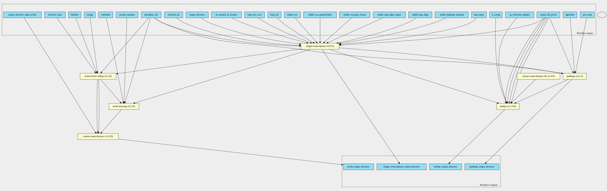

dragen-transcriptome-pipeline 4.0.3 workflow
============================================

## Table of Contents
  
- [Overview](#dragen-transcriptome-pipeline-v403-overview)  
- [Visual](#visual-workflow-overview)  
- [Links](#related-links)  
- [Inputs](#dragen-transcriptome-pipeline-v403-inputs)  
- [Steps](#dragen-transcriptome-pipeline-v403-steps)  
- [Outputs](#dragen-transcriptome-pipeline-v403-outputs)  
- [ICA](#ica)  

## dragen-transcriptome-pipeline v(4.0.3) Overview

  
> ID: dragen-transcriptome-pipeline--4.0.3  
> md5sum: fa48d66b4cc6b4acf6b96350e6ce5134

### dragen-transcriptome-pipeline v(4.0.3) documentation
  
Documentation for dragen-transcriptome-pipeline v4.0.3

### Categories
  

## Visual Workflow Overview
  

## Related Links
  
- [CWL File Path](../../../../../../workflows/dragen-transcriptome-pipeline/4.0.3/dragen-transcriptome-pipeline__4.0.3.cwl)  

### Uses
  
- [arriba-drawing 2.3.0 :construction:](file:/home/runner/work/cwl-ica/cwl-ica/tools/arriba-drawing/2.3.0/arriba-drawing__2.3.0.md)  
- [arriba-fusion-calling 2.3.0 :construction:](file:/home/runner/work/cwl-ica/cwl-ica/tools/arriba-fusion-calling/2.3.0/arriba-fusion-calling__2.3.0.md)  
- [custom-create-directory 1.0.0 :construction:](file:/home/runner/work/cwl-ica/cwl-ica/tools/custom-create-directory/1.0.0/custom-create-directory__1.0.0.md)  
- [custom-touch-file 1.0.0 :construction:](file:/home/runner/work/cwl-ica/cwl-ica/tools/custom-touch-file/1.0.0/custom-touch-file__1.0.0.md)  
- [multiqc 1.12.0 :construction:](file:/home/runner/work/cwl-ica/cwl-ica/tools/multiqc/1.12.0/multiqc__1.12.0.md)  
- [dragen-transcriptome 4.0.3 :construction:](file:/home/runner/work/cwl-ica/cwl-ica/tools/dragen-transcriptome/4.0.3/dragen-transcriptome__4.0.3.md)  
- [qualimap 2.2.2 :construction:](file:/home/runner/work/cwl-ica/cwl-ica/tools/qualimap/2.2.2/qualimap__2.2.2.md)  

  

## dragen-transcriptome-pipeline v(4.0.3) Inputs

### algorithm

  
> ID: algorithm
  
**Optional:** `True`  
**Type:** `string`  
**Docs:**  
Counting algorithm:
uniquely-mapped-reads(default) or proportional.

### annotation file

  
> ID: annotation_file
  
**Optional:** `False`  
**Type:** `File`  
**Docs:**  
Path to annotation transcript file.

### blacklist

  
> ID: blacklist
  
**Optional:** `False`  
**Type:** `File`  
**Docs:**  
File with blacklist range

### cl config

  
> ID: cl_config
  
**Optional:** `True`  
**Type:** `string`  
**Docs:**  
command line config to supply additional config values on the command line.

### contigs

  
> ID: contigs
  
**Optional:** `True`  
**Type:** `string`  
**Docs:**  
Optional - List of interesting contigs
If not specified, defaults to 1,2,3,4,5,6,7,8,9,10,11,12,13,14,15,16,17,18,19,20,21,22,X,Y

### cytobands

  
> ID: cytobands
  
**Optional:** `False`  
**Type:** `File`  
**Docs:**  
Coordinates of the Giemsa staining bands.

### enable duplicate marking

  
> ID: enable_duplicate_marking
  
**Optional:** `False`  
**Type:** `boolean`  
**Docs:**  
Mark identical alignments as duplicates

### enable map align output

  
> ID: enable_map_align_output
  
**Optional:** `False`  
**Type:** `boolean`  
**Docs:**  
Do you wish to have the output bam files present

### enable rna gene fusion

  
> ID: enable_rna_gene_fusion
  
**Optional:** `True`  
**Type:** `boolean`  
**Docs:**  
Optional - Enable the DRAGEN Gene Fusion module - defaults to true

### enable rna quantification

  
> ID: enable_rna_quantification
  
**Optional:** `True`  
**Type:** `boolean`  
**Docs:**  
Optional - Enable the quantification module - defaults to true

### fastq list

  
> ID: fastq_list
  
**Optional:** `True`  
**Type:** `File`  
**Docs:**  
CSV file that contains a list of FASTQ files
to process. read_1 and read_2 components in the CSV file must be presigned urls.

### Row of fastq lists

  
> ID: fastq_list_rows
  
**Optional:** `True`  
**Type:** `fastq-list-row[]`  
**Docs:**  
The row of fastq lists.
Each row has the following attributes:
  * RGID
  * RGLB
  * RGSM
  * Lane
  * Read1File
  * Read2File (optional)

### java mem

  
> ID: java_mem
  
**Optional:** `False`  
**Type:** `string`  
**Docs:**  
Set desired Java heap memory size

### license instance id location

  
> ID: lic_instance_id_location
  
**Optional:** `True`  
**Type:** `['File', 'string']`  
**Docs:**  
You may wish to place your own in.
Optional value, default set to /opt/instance-identity
which is a path inside the dragen container

### output directory

  
> ID: output_directory
  
**Optional:** `False`  
**Type:** `string`  
**Docs:**  
The directory where all output files are placed

### output directory name arriba

  
> ID: output_directory_name_arriba
  
**Optional:** `True`  
**Type:** `string`  
**Docs:**  
Name of the directory to collect arriba outputs in.

### output file prefix

  
> ID: output_file_prefix
  
**Optional:** `False`  
**Type:** `string`  
**Docs:**  
The prefix given to all output files

### protein domains

  
> ID: protein_domains
  
**Optional:** `False`  
**Type:** `File`  
**Docs:**  
GFF3 file containing the genomic coordinates of protein domains.

### qc reference samples

  
> ID: qc_reference_samples
  
**Optional:** `False`  
**Type:** `.[]`  
**Docs:**  
Reference samples for multiQC report

### reference Fasta

  
> ID: reference_fasta
  
**Optional:** `False`  
**Type:** `File`  
**Docs:**  
FastA file with genome sequence

### reference tar

  
> ID: reference_tar
  
**Optional:** `False`  
**Type:** `File`  
**Docs:**  
Path to ref data tarball

### tmp dir

  
> ID: tmp_dir
  
**Optional:** `True`  
**Type:** `string`  
**Docs:**  
Qualimap creates temporary bam files when sorting by name, which takes up space in the system tmp dir (usually /tmp). 
This can be avoided by sorting the bam file by name before running Qualimap.

  

## dragen-transcriptome-pipeline v(4.0.3) Steps

### arriba drawing step

  
> ID: dragen-transcriptome-pipeline--4.0.3/arriba_drawing_step
  
**Step Type:** workflow  
**Docs:**
  
Run Arriba drawing script for fusions predicted by previous step.

#### Links
  
[CWL File Path](../../../../../../workflows/dragen-transcriptome-pipeline/4.0.3/file:/home/runner/work/cwl-ica/cwl-ica/tools/arriba-drawing/2.3.0/arriba-drawing__2.3.0.cwl)  
[CWL File Help Page :construction:](file:/home/runner/work/cwl-ica/cwl-ica/tools/arriba-drawing/2.3.0/arriba-drawing__2.3.0.md)
#### Subworkflow overview
  
  

### arriba fusion step

  
> ID: dragen-transcriptome-pipeline--4.0.3/arriba_fusion_step
  
**Step Type:** workflow  
**Docs:**
  
Runs Arriba fusion calling on the bam file produced by Dragen.

#### Links
  
[CWL File Path](../../../../../../workflows/dragen-transcriptome-pipeline/4.0.3/file:/home/runner/work/cwl-ica/cwl-ica/tools/arriba-fusion-calling/2.3.0/arriba-fusion-calling__2.3.0.cwl)  
[CWL File Help Page :construction:](file:/home/runner/work/cwl-ica/cwl-ica/tools/arriba-fusion-calling/2.3.0/arriba-fusion-calling__2.3.0.md)
#### Subworkflow overview
  
  

### create arriba output directory

  
> ID: dragen-transcriptome-pipeline--4.0.3/create_arriba_output_directory
  
**Step Type:** workflow  
**Docs:**
  
Create an output directory to contain the arriba files

#### Links
  
[CWL File Path](../../../../../../workflows/dragen-transcriptome-pipeline/4.0.3/file:/home/runner/work/cwl-ica/cwl-ica/tools/custom-create-directory/1.0.0/custom-create-directory__1.0.0.cwl)  
[CWL File Help Page :construction:](file:/home/runner/work/cwl-ica/cwl-ica/tools/custom-create-directory/1.0.0/custom-create-directory__1.0.0.md)
#### Subworkflow overview
  
  

### Create dummy file

  
> ID: dragen-transcriptome-pipeline--4.0.3/create_dummy_file_step
  
**Step Type:** workflow  
**Docs:**
  
Intermediate step for letting multiqc-interop be placed in stream mode

#### Links
  
[CWL File Path](../../../../../../workflows/dragen-transcriptome-pipeline/4.0.3/file:/home/runner/work/cwl-ica/cwl-ica/tools/custom-touch-file/1.0.0/custom-touch-file__1.0.0.cwl)  
[CWL File Help Page :construction:](file:/home/runner/work/cwl-ica/cwl-ica/tools/custom-touch-file/1.0.0/custom-touch-file__1.0.0.md)
#### Subworkflow overview
  
  

### dragen qc step

  
> ID: dragen-transcriptome-pipeline--4.0.3/dragen_qc_step
  
**Step Type:** workflow  
**Docs:**
  
The dragen qc step - this takes in an array of dirs

#### Links
  
[CWL File Path](../../../../../../workflows/dragen-transcriptome-pipeline/4.0.3/file:/home/runner/work/cwl-ica/cwl-ica/tools/multiqc/1.12.0/multiqc__1.12.0.cwl)  
[CWL File Help Page :construction:](file:/home/runner/work/cwl-ica/cwl-ica/tools/multiqc/1.12.0/multiqc__1.12.0.md)
#### Subworkflow overview
  
  

### run dragen transcriptome step

  
> ID: dragen-transcriptome-pipeline--4.0.3/run_dragen_transcriptome_step
  
**Step Type:** workflow  
**Docs:**
  
Runs the dragen transcriptome workflow on the FPGA.
Takes in a fastq list and corresponding mount paths from the predefined_mount_paths.
All other options avaiable at the top of the workflow

#### Links
  
[CWL File Path](../../../../../../workflows/dragen-transcriptome-pipeline/4.0.3/file:/home/runner/work/cwl-ica/cwl-ica/tools/dragen-transcriptome/4.0.3/dragen-transcriptome__4.0.3.cwl)  
[CWL File Help Page :construction:](file:/home/runner/work/cwl-ica/cwl-ica/tools/dragen-transcriptome/4.0.3/dragen-transcriptome__4.0.3.md)
#### Subworkflow overview
  
  

### run qualimap step

  
> ID: dragen-transcriptome-pipeline--4.0.3/run_qualimap_step
  
**Step Type:** workflow  
**Docs:**
  
Run qualimap step to generate additional QC metrics

#### Links
  
[CWL File Path](../../../../../../workflows/dragen-transcriptome-pipeline/4.0.3/file:/home/runner/work/cwl-ica/cwl-ica/tools/qualimap/2.2.2/qualimap__2.2.2.cwl)  
[CWL File Help Page :construction:](file:/home/runner/work/cwl-ica/cwl-ica/tools/qualimap/2.2.2/qualimap__2.2.2.md)
#### Subworkflow overview
  
  

## dragen-transcriptome-pipeline v(4.0.3) Outputs

### arriba output directory

  
> ID: dragen-transcriptome-pipeline--4.0.3/arriba_output_directory  

  
**Optional:** `False`  
**Output Type:** `Directory`  
**Docs:**  
The directory containing output files from arriba
  

### dragen transcriptome output directory

  
> ID: dragen-transcriptome-pipeline--4.0.3/dragen_transcriptome_output_directory  

  
**Optional:** `False`  
**Output Type:** `Directory`  
**Docs:**  
The output directory containing all transcriptome output files
  

### multiqc output directory

  
> ID: dragen-transcriptome-pipeline--4.0.3/multiqc_output_directory  

  
**Optional:** `False`  
**Output Type:** `Directory`  
**Docs:**  
The output directory for multiqc
  

### dragen transcriptome output directory

  
> ID: dragen-transcriptome-pipeline--4.0.3/qualimap_output_directory  

  
**Optional:** `False`  
**Output Type:** `Directory`  
**Docs:**  
The output directory containing all transcriptome output files
  

  

## ICA

### ToC
  
- [development_workflows](#project-development_workflows)  

### Project: development_workflows

> wfl id: wfl.286d4a2e82f048609d5b288a9d2868f6  

  
**workflow name:** dragen-transcriptome-pipeline_dev-wf  
**wfl version name:** 4.0.3  

  

