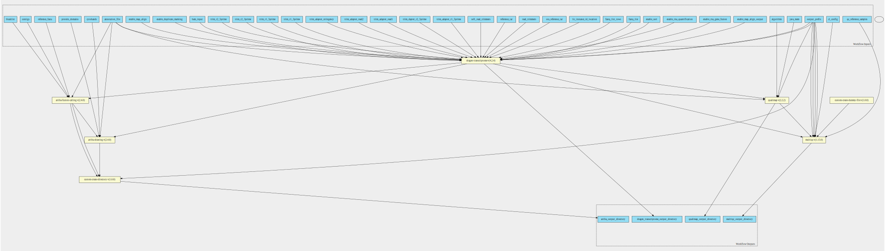

dragen-transcriptome-pipeline 4.2.4 workflow
============================================

## Table of Contents
  
- [Overview](#dragen-transcriptome-pipeline-v424-overview)  
- [Visual](#visual-workflow-overview)  
- [Links](#related-links)  
- [Inputs](#dragen-transcriptome-pipeline-v424-inputs)  
- [Steps](#dragen-transcriptome-pipeline-v424-steps)  
- [Outputs](#dragen-transcriptome-pipeline-v424-outputs)  
- [ICA](#ica)  

## dragen-transcriptome-pipeline v(4.2.4) Overview

  
> ID: dragen-transcriptome-pipeline--4.2.4  
> md5sum: 95c7798c0be56e0346fc987f11dbe8ce

### dragen-transcriptome-pipeline v(4.2.4) documentation
  
Documentation for dragen-transcriptome-pipeline v4.2.4

### Categories
  

## Visual Workflow Overview
  

## Related Links
  
- [CWL File Path](../../../../../../workflows/dragen-transcriptome-pipeline/4.2.4/dragen-transcriptome-pipeline__4.2.4.cwl)  

### Uses
  
- [arriba-drawing 2.4.0](../../../tools/arriba-drawing/2.4.0/arriba-drawing__2.4.0.md)  
- [arriba-fusion-calling 2.4.0](../../../tools/arriba-fusion-calling/2.4.0/arriba-fusion-calling__2.4.0.md)  
- [custom-create-directory 1.0.0](../../../tools/custom-create-directory/1.0.0/custom-create-directory__1.0.0.md)  
- [custom-touch-file 1.0.0 :construction:](../../../tools/custom-touch-file/1.0.0/custom-touch-file__1.0.0.md)  
- [multiqc 1.15.0](../../../tools/multiqc/1.15.0/multiqc__1.15.0.md)  
- [dragen-transcriptome 4.2.4](../../../tools/dragen-transcriptome/4.2.4/dragen-transcriptome__4.2.4.md)  
- [qualimap 2.2.2](../../../tools/qualimap/2.2.2/qualimap__2.2.2.md)  

  

## dragen-transcriptome-pipeline v(4.2.4) Inputs

### algorithm

  
> ID: algorithm
  
**Optional:** `True`  
**Type:** `string`  
**Docs:**  
Counting algorithm:
uniquely-mapped-reads(default) or proportional.

### annotation file

  
> ID: annotation_file
  
**Optional:** `False`  
**Type:** `File`  
**Docs:**  
Path to annotation transcript file.

### bam input

  
> ID: bam_input
  
**Optional:** `True`  
**Type:** `File`  
**Docs:**  
Input a BAM file for WTS analysis

### blacklist

  
> ID: blacklist
  
**Optional:** `False`  
**Type:** `File`  
**Docs:**  
File with blacklist range

### cl config

  
> ID: cl_config
  
**Optional:** `True`  
**Type:** `string`  
**Docs:**  
command line config to supply additional config values on the command line.

### contigs

  
> ID: contigs
  
**Optional:** `True`  
**Type:** `string`  
**Docs:**  
Optional - List of interesting contigs
If not specified, defaults to 1,2,3,4,5,6,7,8,9,10,11,12,13,14,15,16,17,18,19,20,21,22,X,Y

### cytobands

  
> ID: cytobands
  
**Optional:** `False`  
**Type:** `File`  
**Docs:**  
Coordinates of the Giemsa staining bands.

### enable duplicate marking

  
> ID: enable_duplicate_marking
  
**Optional:** `False`  
**Type:** `boolean`  
**Docs:**  
Mark identical alignments as duplicates

### enable map align

  
> ID: enable_map_align
  
**Optional:** `True`  
**Type:** `boolean`  
**Docs:**  
Enabled by default.
Set this value to false if using bam_input AND tumor_bam_input

### enable map align output

  
> ID: enable_map_align_output
  
**Optional:** `False`  
**Type:** `boolean`  
**Docs:**  
Do you wish to have the output bam files present

### enable rna gene fusion

  
> ID: enable_rna_gene_fusion
  
**Optional:** `True`  
**Type:** `boolean`  
**Docs:**  
Optional - Enable the DRAGEN Gene Fusion module - defaults to true

### enable rna quantification

  
> ID: enable_rna_quantification
  
**Optional:** `True`  
**Type:** `boolean`  
**Docs:**  
Optional - Enable the quantification module - defaults to true

### enable sort

  
> ID: enable_sort
  
**Optional:** `True`  
**Type:** `boolean`  
**Docs:**  
True by default, only set this to false if using --bam-input as input parameter

### fastq list

  
> ID: fastq_list
  
**Optional:** `True`  
**Type:** `File`  
**Docs:**  
CSV file that contains a list of FASTQ files
to process. read_1 and read_2 components in the CSV file must be presigned urls.

### Row of fastq lists

  
> ID: fastq_list_rows
  
**Optional:** `True`  
**Type:** `fastq-list-row[]`  
**Docs:**  
The row of fastq lists.
Each row has the following attributes:
  * RGID
  * RGLB
  * RGSM
  * Lane
  * Read1File
  * Read2File (optional)

### java mem

  
> ID: java_mem
  
**Optional:** `False`  
**Type:** `string`  
**Docs:**  
Set desired Java heap memory size

### license instance id location

  
> ID: lic_instance_id_location
  
**Optional:** `True`  
**Type:** `['File', 'string']`  
**Docs:**  
You may wish to place your own in.
Optional value, default set to /opt/instance-identity
which is a path inside the dragen container

### output directory

  
> ID: output_directory
  
**Optional:** `False`  
**Type:** `string`  
**Docs:**  
The directory where all output files are placed

### output directory name arriba

  
> ID: output_directory_name_arriba
  
**Optional:** `True`  
**Type:** `string`  
**Docs:**  
Name of the directory to collect arriba outputs in.

### output file prefix

  
> ID: output_file_prefix
  
**Optional:** `False`  
**Type:** `string`  
**Docs:**  
The prefix given to all output files

### protein domains

  
> ID: protein_domains
  
**Optional:** `False`  
**Type:** `File`  
**Docs:**  
GFF3 file containing the genomic coordinates of protein domains.

### qc reference samples

  
> ID: qc_reference_samples
  
**Optional:** `False`  
**Type:** `.[]`  
**Docs:**  
Reference samples for multiQC report

### read trimming

  
> ID: read_trimmers
  
**Optional:** `True`  
**Type:** `string`  
**Docs:**  
To enable trimming filters in hard-trimming mode, set to a comma-separated list of the trimmer tools 
you would like to use. To disable trimming, set to none. During mapping, artifacts are removed from all reads.
Read trimming is disabled by default.

### reference Fasta

  
> ID: reference_fasta
  
**Optional:** `False`  
**Type:** `File`  
**Docs:**  
FastA file with genome sequence

### reference tar

  
> ID: reference_tar
  
**Optional:** `False`  
**Type:** `File`  
**Docs:**  
Path to ref data tarball

### soft read trimming

  
> ID: soft_read_trimmers
  
**Optional:** `True`  
**Type:** `string`  
**Docs:**  
To enable trimming filters in soft-trimming mode, set to a comma-separated list of the trimmer tools 
you would like to use. To disable soft trimming, set to none. During mapping, reads are aligned as if trimmed,
and bases are not removed from the reads. Soft-trimming is enabled for the polyg filter by default.

### tmp dir

  
> ID: tmp_dir
  
**Optional:** `True`  
**Type:** `string`  
**Docs:**  
Qualimap creates temporary bam files when sorting by name, which takes up space in the system tmp dir (usually /tmp). 
This can be avoided by sorting the bam file by name before running Qualimap.

### trim adapter r1 5prime

  
> ID: trim_adapter_r1_5prime
  
**Optional:** `True`  
**Type:** `File`  
**Docs:**  
Specify the FASTA file that contains adapter sequences to trim from the 5' end of Read 1. 
NB: the sequences should be in reverse order (with respect to their appearance in the FASTQ) but not complemented.

### trim adapter read1

  
> ID: trim_adapter_read1
  
**Optional:** `True`  
**Type:** `File`  
**Docs:**  
Specify the FASTA file that contains adapter sequences to trim from the 3' end of Read 1.

### trim adapter read2

  
> ID: trim_adapter_read2
  
**Optional:** `True`  
**Type:** `File`  
**Docs:**  
Specify the FASTA file that contains adapter sequences to trim from the 3' end of Read 2.

### trim adapter stringency

  
> ID: trim_adapter_stringency
  
**Optional:** `True`  
**Type:** `int`  
**Docs:**  
Specify the minimum number of adapter bases required for trimming

### trim adapter r2 5prime

  
> ID: trim_dapter_r2_5prime
  
**Optional:** `True`  
**Type:** `File`  
**Docs:**  
Specify the FASTA file that contains adapter sequences to trim from the 5' end of Read 2.
NB: the sequences should be in reverse order (with respect to their appearance in the FASTQ) but not complemented.

### trim r1 3prime

  
> ID: trim_r1_3prime
  
**Optional:** `True`  
**Type:** `int`  
**Docs:**  
Specify the minimum number of bases to trim from the 3' end of Read 1 (default: 0).

### trim r1 5prime

  
> ID: trim_r1_5prime
  
**Optional:** `True`  
**Type:** `int`  
**Docs:**  
Specify the minimum number of bases to trim from the 5' end of Read 1 (default: 0).

### trim r2 3prime

  
> ID: trim_r2_3prime
  
**Optional:** `True`  
**Type:** `int`  
**Docs:**  
Specify the minimum number of bases to trim from the 3' end of Read 2 (default: 0).

### trim r2 5prime

  
> ID: trim_r2_5prime
  
**Optional:** `True`  
**Type:** `int`  
**Docs:**  
Specify the minimum number of bases to trim from the 5' end of Read 2 (default: 0).

  

## dragen-transcriptome-pipeline v(4.2.4) Steps

### arriba drawing step

  
> ID: dragen-transcriptome-pipeline--4.2.4/arriba_drawing_step
  
**Step Type:** tool  
**Docs:**
  
Run Arriba drawing script for fusions predicted by previous step.

#### Links
  
[CWL File Path](../../../../../../tools/arriba-drawing/2.4.0/arriba-drawing__2.4.0.cwl)  
[CWL File Help Page](../../../tools/arriba-drawing/2.4.0/arriba-drawing__2.4.0.md)  

### arriba fusion step

  
> ID: dragen-transcriptome-pipeline--4.2.4/arriba_fusion_step
  
**Step Type:** tool  
**Docs:**
  
Runs Arriba fusion calling on the bam file produced by Dragen.

#### Links
  
[CWL File Path](../../../../../../tools/arriba-fusion-calling/2.4.0/arriba-fusion-calling__2.4.0.cwl)  
[CWL File Help Page](../../../tools/arriba-fusion-calling/2.4.0/arriba-fusion-calling__2.4.0.md)  

### create arriba output directory

  
> ID: dragen-transcriptome-pipeline--4.2.4/create_arriba_output_directory
  
**Step Type:** tool  
**Docs:**
  
Create an output directory to contain the arriba files

#### Links
  
[CWL File Path](../../../../../../tools/custom-create-directory/1.0.0/custom-create-directory__1.0.0.cwl)  
[CWL File Help Page](../../../tools/custom-create-directory/1.0.0/custom-create-directory__1.0.0.md)  

### Create dummy file

  
> ID: dragen-transcriptome-pipeline--4.2.4/create_dummy_file_step
  
**Step Type:** tool  
**Docs:**
  
Intermediate step for letting multiqc-interop be placed in stream mode

#### Links
  
[CWL File Path](../../../../../../tools/custom-touch-file/1.0.0/custom-touch-file__1.0.0.cwl)  
[CWL File Help Page :construction:](../../../tools/custom-touch-file/1.0.0/custom-touch-file__1.0.0.md)  

### dragen qc step

  
> ID: dragen-transcriptome-pipeline--4.2.4/dragen_qc_step
  
**Step Type:** tool  
**Docs:**
  
The dragen qc step - this takes in an array of dirs

#### Links
  
[CWL File Path](../../../../../../tools/multiqc/1.15.0/multiqc__1.15.0.cwl)  
[CWL File Help Page](../../../tools/multiqc/1.15.0/multiqc__1.15.0.md)  

### run dragen transcriptome step

  
> ID: dragen-transcriptome-pipeline--4.2.4/run_dragen_transcriptome_step
  
**Step Type:** tool  
**Docs:**
  
Runs the dragen transcriptome workflow on the FPGA.
Takes in a fastq list and corresponding mount paths from the predefined_mount_paths.
All other options avaiable at the top of the workflow

#### Links
  
[CWL File Path](../../../../../../tools/dragen-transcriptome/4.2.4/dragen-transcriptome__4.2.4.cwl)  
[CWL File Help Page](../../../tools/dragen-transcriptome/4.2.4/dragen-transcriptome__4.2.4.md)  

### run qualimap step

  
> ID: dragen-transcriptome-pipeline--4.2.4/run_qualimap_step
  
**Step Type:** tool  
**Docs:**
  
Run qualimap step to generate additional QC metrics

#### Links
  
[CWL File Path](../../../../../../tools/qualimap/2.2.2/qualimap__2.2.2.cwl)  
[CWL File Help Page](../../../tools/qualimap/2.2.2/qualimap__2.2.2.md)  

## dragen-transcriptome-pipeline v(4.2.4) Outputs

### arriba output directory

  
> ID: dragen-transcriptome-pipeline--4.2.4/arriba_output_directory  

  
**Optional:** `False`  
**Output Type:** `Directory`  
**Docs:**  
The directory containing output files from arriba
  

### dragen transcriptome output directory

  
> ID: dragen-transcriptome-pipeline--4.2.4/dragen_transcriptome_output_directory  

  
**Optional:** `False`  
**Output Type:** `Directory`  
**Docs:**  
The output directory containing all transcriptome output files
  

### multiqc output directory

  
> ID: dragen-transcriptome-pipeline--4.2.4/multiqc_output_directory  

  
**Optional:** `False`  
**Output Type:** `Directory`  
**Docs:**  
The output directory for multiqc
  

### dragen transcriptome output directory

  
> ID: dragen-transcriptome-pipeline--4.2.4/qualimap_output_directory  

  
**Optional:** `False`  
**Output Type:** `Directory`  
**Docs:**  
The output directory containing all transcriptome output files
  

  

## ICA

### ToC
  
- [development_workflows](#project-development_workflows)  
- [production_workflows](#project-production_workflows)  

### Project: development_workflows

> wfl id: wfl.286d4a2e82f048609d5b288a9d2868f6  

  
**workflow name:** dragen-transcriptome-pipeline_dev-wf  
**wfl version name:** 4.2.4  

### Project: production_workflows

> wfl id: wfl.7e5ba7470b5549a6b4bf6d95daaa1214  

  
**workflow name:** dragen-transcriptome-pipeline_prod-wf  
**wfl version name:** 4.2.4--ad23456  

  

