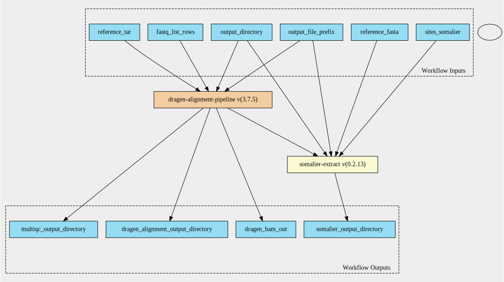

dragen-wgs-qc-pipeline 3.7.5 workflow
=====================================

## Table of Contents
  
- [Overview](#dragen-wgs-qc-pipeline-v375-overview)  
- [Visual](#visual-workflow-overview)  
- [Links](#related-links)  
- [Inputs](#dragen-wgs-qc-pipeline-v375-inputs)  
- [Steps](#dragen-wgs-qc-pipeline-v375-steps)  
- [Outputs](#dragen-wgs-qc-pipeline-v375-outputs)  
- [ICA](#ica)  


## dragen-wgs-qc-pipeline v(3.7.5) Overview


  
> ID: dragen-wgs-qc-pipeline--3.7.5  
> md5sum: c8171e4e4941f0744b774992ed8f0520

### dragen-wgs-qc-pipeline v(3.7.5) documentation
  
Documentation for dragen-alignment-pipeline v3.7.5

### Categories
  
- dragen  


## Visual Workflow Overview
  
[](https://github.com/umccr/cwl-ica/raw/main/.github/catalogue/images/workflows/dragen-wgs-qc-pipeline/3.7.5/dragen-wgs-qc-pipeline__3.7.5.svg)
## Related Links
  
- [CWL File Path](../../../../../../workflows/dragen-wgs-qc-pipeline/3.7.5/dragen-wgs-qc-pipeline__3.7.5.cwl)  


### Uses
  
- [dragen-alignment-pipeline 3.7.5 :construction:](file:/home/runner/work/cwl-ica/cwl-ica/workflows/dragen-alignment-pipeline/3.7.5/dragen-alignment-pipeline__3.7.5.md)  
- [somalier-extract 0.2.13 :construction:](file:/home/runner/work/cwl-ica/cwl-ica/tools/somalier-extract/0.2.13/somalier-extract__0.2.13.md)  

  


## dragen-wgs-qc-pipeline v(3.7.5) Inputs

### Row of fastq lists


  
> ID: fastq_list_rows
  
**Optional:** `False`  
**Type:** `fastq-list-row[]`  
**Docs:**  
The row of fastq lists.
Each row has the following attributes:
  * RGID
  * RGLB
  * RGSM
  * Lane
  * Read1File
  * Read2File (optional)


### output directory


  
> ID: output_directory
  
**Optional:** `False`  
**Type:** `string`  
**Docs:**  
The directory where all output files are placed


### output file prefix


  
> ID: output_file_prefix
  
**Optional:** `False`  
**Type:** `string`  
**Docs:**  
The prefix given to all output files


### reference fasta


  
> ID: reference_fasta
  
**Optional:** `False`  
**Type:** `File`  
**Docs:**  
FastA file with genome sequence


### reference tar


  
> ID: reference_tar
  
**Optional:** `False`  
**Type:** `File`  
**Docs:**  
Path to ref data tarball


### sites somalier


  
> ID: sites_somalier
  
**Optional:** `False`  
**Type:** `File`  
**Docs:**  
gzipped vcf file. Required for somalier sites

  


## dragen-wgs-qc-pipeline v(3.7.5) Steps

### run dragen alignment step


  
> ID: dragen-wgs-qc-pipeline--3.7.5/run_dragen_step
  
**Step Type:** workflow  
**Docs:**
  
Runs the alignment step on a dragen fpga
Takes in a fastq list and corresponding mount paths from the predefined mount paths
All other options available at the top of the workflow

#### Links
  
[CWL File Path](../../../../../../workflows/dragen-wgs-qc-pipeline/3.7.5/file:/home/runner/work/cwl-ica/cwl-ica/workflows/dragen-alignment-pipeline/3.7.5/dragen-alignment-pipeline__3.7.5.cwl)  
[CWL File Help Page :construction:](file:/home/runner/work/cwl-ica/cwl-ica/workflows/dragen-alignment-pipeline/3.7.5/dragen-alignment-pipeline__3.7.5.md)
#### Subworkflow overview
  
[](https://github.com/umccr/cwl-ica/raw/main/.github/catalogue/images/workflows/dragen-wgs-qc-pipeline/3.7.5/file:/home/runner/work/cwl-ica/cwl-ica/workflows/dragen-alignment-pipeline/3.7.5/dragen-alignment-pipeline__3.7.5.svg)  


### somalier


  
> ID: dragen-wgs-qc-pipeline--3.7.5/run_somalier_step
  
**Step Type:** workflow  
**Docs:**
  
Runs the somalier extract function to call the fingerprint on the germline bam file

#### Links
  
[CWL File Path](../../../../../../workflows/dragen-wgs-qc-pipeline/3.7.5/file:/home/runner/work/cwl-ica/cwl-ica/tools/somalier-extract/0.2.13/somalier-extract__0.2.13.cwl)  
[CWL File Help Page :construction:](file:/home/runner/work/cwl-ica/cwl-ica/tools/somalier-extract/0.2.13/somalier-extract__0.2.13.md)
#### Subworkflow overview
  
[](https://github.com/umccr/cwl-ica/raw/main/.github/catalogue/images/workflows/dragen-wgs-qc-pipeline/3.7.5/file:/home/runner/work/cwl-ica/cwl-ica/tools/somalier-extract/0.2.13/somalier-extract__0.2.13.svg)  


## dragen-wgs-qc-pipeline v(3.7.5) Outputs

### dragen alignment output directory


  
> ID: dragen-wgs-qc-pipeline--3.7.5/dragen_alignment_output_directory  

  
**Optional:** `False`  
**Output Type:** `Directory`  
**Docs:**  
The output directory containing all alignment output files and qc metrics
  


### dragen bam out


  
> ID: dragen-wgs-qc-pipeline--3.7.5/dragen_bam_out  

  
**Optional:** `False`  
**Output Type:** `File`  
**Docs:**  
The output alignment file
  


### dragen QC report out


  
> ID: dragen-wgs-qc-pipeline--3.7.5/multiqc_output_directory  

  
**Optional:** `False`  
**Output Type:** `Directory`  
**Docs:**  
The dragen multiQC output
  


### somalier output directory


  
> ID: dragen-wgs-qc-pipeline--3.7.5/somalier_output_directory  

  
**Optional:** `False`  
**Output Type:** `Directory`  
**Docs:**  
Output directory from somalier step
  

  


## ICA

### ToC
  
- [development_workflows](#project-development_workflows)  
- [production_workflows](#project-production_workflows)  


### Project: development_workflows


> wfl id: wfl.ff6ca1789f4e4eb0982ea3e01407aca8  

  
**workflow name:** dragen-wgs-qc-pipeline_dev-wf  
**wfl version name:** 3.7.5  


#### Run Instances

##### ToC
  
- [Run wfr.1fd8c32d79c34e179a4c0d6754edd3a2](#run-wfr1fd8c32d79c34e179a4c0d6754edd3a2)  


##### Run wfr.1fd8c32d79c34e179a4c0d6754edd3a2


  
> Run Name: umccr__automated__dragen_wgs_qc__210708_A00130_0166_AH7KTJDSX2__r.E92UIDDiCUKQS5joVDO6Gg__L2100746__1626290650  

  
**Start Time:** 2021-07-14 19:24:12 UTC  
**Duration:** 2021-07-14 23:23:00 UTC  
**End Time:** 0 days 03:58:48  


###### Reproduce Run


```bash

# Run the submission template to create the workflow input json and launch script            
cwl-ica copy-workflow-submission-template --ica-workflow-run-instance-id wfr.1fd8c32d79c34e179a4c0d6754edd3a2

# Edit the input json file (optional)
# vim wfr.1fd8c32d79c34e179a4c0d6754edd3a2.template.json 

# Run the launch script
bash wfr.1fd8c32d79c34e179a4c0d6754edd3a2.launch.sh
                                    
```  


###### Run Inputs


```
{
    "output_file_prefix": "L2100746",
    "output_directory": "L2100746_dragen",
    "fastq_list_rows": [
        {
            "rgid": "GCAATGCA.AACGTTCC.1.210708_A00130_0166_AH7KTJDSX2.MDX210176_L2100746",
            "rglb": "L2100746",
            "rgsm": "MDX210176",
            "lane": 1,
            "read_1": {
                "class": "File",
                "location": "gds://umccr-fastq-data-dev/210708_A00130_0166_AH7KTJDSX2/WGS_TsqNano/VCCC/MDX210176_L2100746_S6_L001_R1_001.fastq.gz"
            },
            "read_2": {
                "class": "File",
                "location": "gds://umccr-fastq-data-dev/210708_A00130_0166_AH7KTJDSX2/WGS_TsqNano/VCCC/MDX210176_L2100746_S6_L001_R2_001.fastq.gz"
            }
        }
    ],
    "sites_somalier": {
        "class": "File",
        "location": "gds://umccr-refdata-dev/somalier/sites.hg38.vcf.gz"
    },
    "reference_fasta": {
        "class": "File",
        "location": "gds://umccr-refdata-dev/dragen/genomes/hg38/hg38.fa"
    },
    "reference_tar": {
        "class": "File",
        "location": "gds://umccr-refdata-dev/dragen/genomes/hg38/3.7.5/hg38_alt_ht_3_7_5.tar.gz"
    }
}
```  


###### Run Engine Parameters


```
{
    "workDirectory": "gds://wfr.1fd8c32d79c34e179a4c0d6754edd3a2/umccr__automated__dragen_wgs_qc__210708_A00130_0166_AH7KTJDSX2__r.E92UIDDiCUKQS5joVDO6Gg__L2100746__1626290650",
    "outputDirectory": "gds://wfr.1fd8c32d79c34e179a4c0d6754edd3a2/umccr__automated__dragen_wgs_qc__210708_A00130_0166_AH7KTJDSX2__r.E92UIDDiCUKQS5joVDO6Gg__L2100746__1626290650/outputs",
    "tmpOutputDirectory": "gds://wfr.1fd8c32d79c34e179a4c0d6754edd3a2/umccr__automated__dragen_wgs_qc__210708_A00130_0166_AH7KTJDSX2__r.E92UIDDiCUKQS5joVDO6Gg__L2100746__1626290650/steps",
    "logDirectory": "gds://wfr.1fd8c32d79c34e179a4c0d6754edd3a2/umccr__automated__dragen_wgs_qc__210708_A00130_0166_AH7KTJDSX2__r.E92UIDDiCUKQS5joVDO6Gg__L2100746__1626290650/logs",
    "maxScatter": 32,
    "outputSetting": "move",
    "copyOutputInstanceType": "StandardHiCpu",
    "copyOutputInstanceSize": "Medium",
    "defaultInputMode": "'Download'",
    "inputModeOverrides": {},
    "tesUseInputManifest": "'auto'",
    "cwltool": "3.0.20201203173111",
    "engine": "1.16.0-202106091735-develop"
}
```  


###### Run Outputs


```
{
    "dragen_alignment_output_directory": {
        "location": "gds://wfr.1fd8c32d79c34e179a4c0d6754edd3a2/umccr__automated__dragen_wgs_qc__210708_A00130_0166_AH7KTJDSX2__r.E92UIDDiCUKQS5joVDO6Gg__L2100746__1626290650/outputs/L2100746_dragen",
        "basename": "L2100746_dragen",
        "nameroot": "",
        "nameext": "",
        "class": "Directory",
        "size": null
    },
    "dragen_bam_out": {
        "location": "gds://wfr.1fd8c32d79c34e179a4c0d6754edd3a2/umccr__automated__dragen_wgs_qc__210708_A00130_0166_AH7KTJDSX2__r.E92UIDDiCUKQS5joVDO6Gg__L2100746__1626290650/outputs/L2100746_dragen/L2100746.bam",
        "basename": "L2100746.bam",
        "nameroot": "L2100746",
        "nameext": ".bam",
        "class": "File",
        "size": 147389385187,
        "secondaryFiles": [
            {
                "basename": "L2100746.bam.bai",
                "location": "gds://wfr.1fd8c32d79c34e179a4c0d6754edd3a2/umccr__automated__dragen_wgs_qc__210708_A00130_0166_AH7KTJDSX2__r.E92UIDDiCUKQS5joVDO6Gg__L2100746__1626290650/outputs/L2100746_dragen/L2100746.bam.bai",
                "class": "File",
                "nameroot": "L2100746.bam",
                "nameext": ".bai",
                "http://commonwl.org/cwltool#generation": 0
            }
        ],
        "http://commonwl.org/cwltool#generation": 0
    },
    "multiqc_output_directory": {
        "location": "gds://wfr.1fd8c32d79c34e179a4c0d6754edd3a2/umccr__automated__dragen_wgs_qc__210708_A00130_0166_AH7KTJDSX2__r.E92UIDDiCUKQS5joVDO6Gg__L2100746__1626290650/outputs/L2100746_dragen_alignment_multiqc",
        "basename": "L2100746_dragen_alignment_multiqc",
        "nameroot": "",
        "nameext": "",
        "class": "Directory",
        "size": null
    },
    "somalier_output_directory": {
        "location": "gds://wfr.1fd8c32d79c34e179a4c0d6754edd3a2/umccr__automated__dragen_wgs_qc__210708_A00130_0166_AH7KTJDSX2__r.E92UIDDiCUKQS5joVDO6Gg__L2100746__1626290650/outputs/L2100746_dragen_somalier",
        "basename": "L2100746_dragen_somalier",
        "nameroot": "",
        "nameext": "",
        "class": "Directory",
        "size": null
    },
    "output_dir_gds_session_id": "ssn.b5ea2474cc11489698be83abab74832d",
    "output_dir_gds_folder_id": "fol.199132a8d5f643a9b2f108d936288333"
}
```  


###### Run Resources Usage
  

  
[](https://github.com/umccr/cwl-ica/raw/main/.github/catalogue/images/runs/workflows/dragen-wgs-qc-pipeline/3.7.5/umccr__automated__dragen_wgs_qc__210708_A00130_0166_AH7KTJDSX2__r.E92UIDDiCUKQS5joVDO6Gg__L2100746__1626290650__wfr.1fd8c32d79c34e179a4c0d6754edd3a2.svg)  


### Project: production_workflows


> wfl id: wfl.23f61cb1baab412a8c37dc93bed6c2af  

  
**workflow name:** dragen-wgs-qc-pipeline_prod-wf  
**wfl version name:** 3.7.5--66f4a1e  

  

