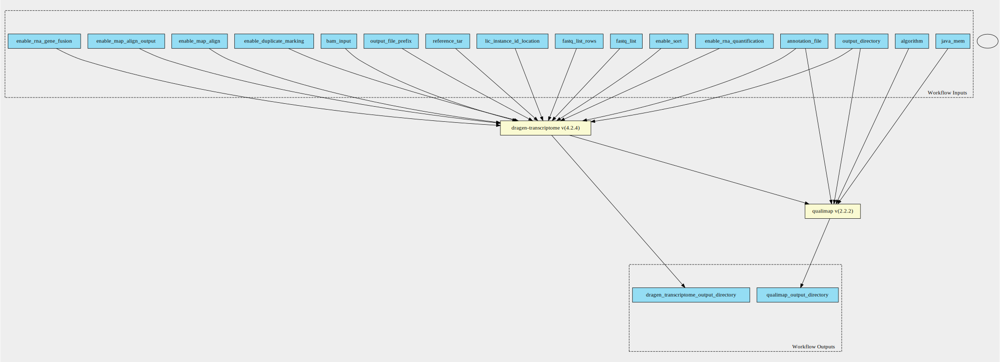

dragen-wts-qc-pipeline 4.2.4 workflow
=====================================

## Table of Contents
  
- [Overview](#dragen-wts-qc-pipeline-v424-overview)  
- [Visual](#visual-workflow-overview)  
- [Links](#related-links)  
- [Inputs](#dragen-wts-qc-pipeline-v424-inputs)  
- [Steps](#dragen-wts-qc-pipeline-v424-steps)  
- [Outputs](#dragen-wts-qc-pipeline-v424-outputs)  
- [ICA](#ica)  

## dragen-wts-qc-pipeline v(4.2.4) Overview

  
> ID: dragen-wts-qc-pipeline--4.2.4  
> md5sum: f37412bb676a8ea2ebbdcf6bc24b62a9

### dragen-wts-qc-pipeline v(4.2.4) documentation
  
Documentation for dragen-wts-qc-pipeline v4.2.4

### Categories
  

## Visual Workflow Overview
  

## Related Links
  
- [CWL File Path](../../../../../../workflows/dragen-wts-qc-pipeline/4.2.4/dragen-wts-qc-pipeline__4.2.4.cwl)  

### Uses
  
- [dragen-transcriptome 4.2.4](../../../tools/dragen-transcriptome/4.2.4/dragen-transcriptome__4.2.4.md)  
- [qualimap 2.2.2](../../../tools/qualimap/2.2.2/qualimap__2.2.2.md)  

  

## dragen-wts-qc-pipeline v(4.2.4) Inputs

### algorithm

  
> ID: algorithm
  
**Optional:** `True`  
**Type:** `string`  
**Docs:**  
Counting algorithm:
uniquely-mapped-reads(default) or proportional.

### annotation file

  
> ID: annotation_file
  
**Optional:** `False`  
**Type:** `File`  
**Docs:**  
Path to annotation transcript file.

### bam input

  
> ID: bam_input
  
**Optional:** `True`  
**Type:** `File`  
**Docs:**  
Input a BAM file for WTS analysis

### enable duplicate marking

  
> ID: enable_duplicate_marking
  
**Optional:** `False`  
**Type:** `boolean`  
**Docs:**  
Mark identical alignments as duplicates

### enable map align

  
> ID: enable_map_align
  
**Optional:** `True`  
**Type:** `boolean`  
**Docs:**  
Enabled by default.
Set this value to false if using bam_input AND tumor_bam_input

### enable map align output

  
> ID: enable_map_align_output
  
**Optional:** `False`  
**Type:** `boolean`  
**Docs:**  
Do you wish to have the output bam files present

### enable rna gene fusion

  
> ID: enable_rna_gene_fusion
  
**Optional:** `True`  
**Type:** `boolean`  
**Docs:**  
Optional - Enable the DRAGEN Gene Fusion module - defaults to true

### enable rna quantification

  
> ID: enable_rna_quantification
  
**Optional:** `True`  
**Type:** `boolean`  
**Docs:**  
Optional - Enable the quantification module - defaults to true

### enable sort

  
> ID: enable_sort
  
**Optional:** `True`  
**Type:** `boolean`  
**Docs:**  
True by default, only set this to false if using --bam-input as input parameter

### fastq list

  
> ID: fastq_list
  
**Optional:** `True`  
**Type:** `File`  
**Docs:**  
CSV file that contains a list of FASTQ files
to process. read_1 and read_2 components in the CSV file must be presigned urls.

### Row of fastq lists

  
> ID: fastq_list_rows
  
**Optional:** `True`  
**Type:** `fastq-list-row[]`  
**Docs:**  
The row of fastq lists.
Each row has the following attributes:
  * RGID
  * RGLB
  * RGSM
  * Lane
  * Read1File
  * Read2File (optional)

### java mem

  
> ID: java_mem
  
**Optional:** `True`  
**Type:** `string`  
**Docs:**  
Set desired Java heap memory size

### license instance id location

  
> ID: lic_instance_id_location
  
**Optional:** `True`  
**Type:** `['File', 'string']`  
**Docs:**  
You may wish to place your own in.
Optional value, default set to /opt/instance-identity
which is a path inside the dragen container

### output directory

  
> ID: output_directory
  
**Optional:** `False`  
**Type:** `string`  
**Docs:**  
The directory where all output files are placed

### output file prefix

  
> ID: output_file_prefix
  
**Optional:** `False`  
**Type:** `string`  
**Docs:**  
The prefix given to all output files

### reference tar

  
> ID: reference_tar
  
**Optional:** `False`  
**Type:** `File`  
**Docs:**  
Path to ref data tarball

  

## dragen-wts-qc-pipeline v(4.2.4) Steps

### run dragen transcriptome step

  
> ID: dragen-wts-qc-pipeline--4.2.4/run_dragen_transcriptome_step
  
**Step Type:** tool  
**Docs:**
  
Runs the dragen transcriptome workflow on the FPGA.
Takes in a fastq list and corresponding mount paths from the predefined_mount_paths.
All other options avaiable at the top of the workflow

#### Links
  
[CWL File Path](../../../../../../tools/dragen-transcriptome/4.2.4/dragen-transcriptome__4.2.4.cwl)  
[CWL File Help Page](../../../tools/dragen-transcriptome/4.2.4/dragen-transcriptome__4.2.4.md)  

### run qualimap step

  
> ID: dragen-wts-qc-pipeline--4.2.4/run_qualimap_step
  
**Step Type:** tool  
**Docs:**
  
Run qualimap step to generate additional QC metrics

#### Links
  
[CWL File Path](../../../../../../tools/qualimap/2.2.2/qualimap__2.2.2.cwl)  
[CWL File Help Page](../../../tools/qualimap/2.2.2/qualimap__2.2.2.md)  

## dragen-wts-qc-pipeline v(4.2.4) Outputs

### dragen transcriptome output directory

  
> ID: dragen-wts-qc-pipeline--4.2.4/dragen_transcriptome_output_directory  

  
**Optional:** `False`  
**Output Type:** `Directory`  
**Docs:**  
The output directory containing all transcriptome output files
  

### dragen transcriptome output directory

  
> ID: dragen-wts-qc-pipeline--4.2.4/qualimap_output_directory  

  
**Optional:** `False`  
**Output Type:** `Directory`  
**Docs:**  
The output directory containing all transcriptome output files
  

  

## ICA

### ToC
  
- [development_workflows](#project-development_workflows)  

### Project: development_workflows

> wfl id: wfl.a43d1dedadfd46719cb77e842f1f26eb  

  
**workflow name:** dragen-wts-qc-pipeline_dev-wf  
**wfl version name:** 4.2.4  

  

