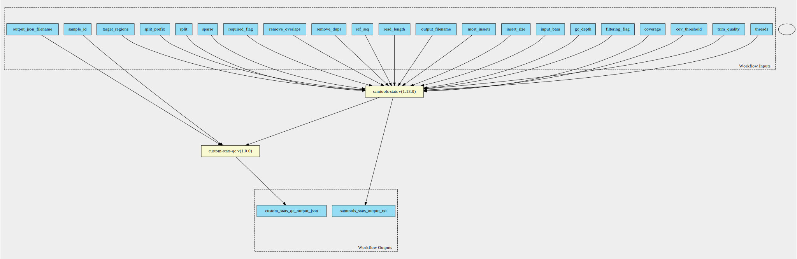

ghif-qc 1.0.0 workflow
======================

## Table of Contents
  
- [Overview](#ghif-qc-v100-overview)  
- [Visual](#visual-workflow-overview)  
- [Links](#related-links)  
- [Inputs](#ghif-qc-v100-inputs)  
- [Steps](#ghif-qc-v100-steps)  
- [Outputs](#ghif-qc-v100-outputs)  
- [ICA](#ica)  

## ghif-qc v(1.0.0) Overview

  
> ID: ghif-qc--1.0.0  
> md5sum: f8f9ab2af1aac8ea95eb2597f3e9405c

### ghif-qc v(1.0.0) documentation
  
Documentation for ghif-qc v1.0.0

### Categories
  

## Visual Workflow Overview
  

## Related Links
  
- [CWL File Path](../../../../../../workflows/ghif-qc/1.0.0/ghif-qc__1.0.0.cwl)  

### Uses
  
- [custom-stats-qc 1.0.0](../../../tools/custom-stats-qc/1.0.0/custom-stats-qc__1.0.0.md)  
- [samtools-stats 1.13.0](../../../tools/samtools-stats/1.13.0/samtools-stats__1.13.0.md)  

  

## ghif-qc v(1.0.0) Inputs

### GC depth

  
> ID: GC_depth
  
**Optional:** `True`  
**Type:** `float`  
**Docs:**  
the size of GC-depth bins (decreasing bin size increases memory requirement) [2e4]

### cov threshold

  
> ID: cov_threshold
  
**Optional:** `True`  
**Type:** `int`  
**Docs:**  
Only bases with coverage above this value will be included in the target percentage computation [0]

### coverage

  
> ID: coverage
  
**Optional:** `True`  
**Type:** `int[]`  
**Docs:**  
Set coverage distribution to the specified range (MIN, MAX, STEP all given as integers) [1,1000,1]

### filtering flag

  
> ID: filtering_flag
  
**Optional:** `True`  
**Type:** `int`  
**Docs:**  
iltering flag, 0 for unset. See also `samtools flags` [0]

### id

  
> ID: id
  
**Optional:** `True`  
**Type:** `string`  
**Docs:**  
Include only listed read group or sample name []

### input BAM

  
> ID: input_bam
  
**Optional:** `False`  
**Type:** `File`  
**Docs:**  
The BAM file to gather statistics from

### insert size

  
> ID: insert_size
  
**Optional:** `True`  
**Type:** `int`  
**Docs:**  
Maximum insert size [8000]

### most inserts

  
> ID: most_inserts
  
**Optional:** `True`  
**Type:** `float`  
**Docs:**  
Report only the main part of inserts [0.99]

### output filename

  
> ID: output_filename
  
**Optional:** `False`  
**Type:** `string`  
**Docs:**  
Redirects stdout

### output filename

  
> ID: output_json_filename
  
**Optional:** `False`  
**Type:** `string`  
**Docs:**  
output file

### read length

  
> ID: read_length
  
**Optional:** `True`  
**Type:** `int`  
**Docs:**  
Include in the statistics only reads with the given read length [-1]

### ref seq

  
> ID: ref_seq
  
**Optional:** `True`  
**Type:** `File`  
**Docs:**  
Reference sequence (required for GC-depth and mismatches-per-cycle calculation). []

### remove dups

  
> ID: remove_dups
  
**Optional:** `True`  
**Type:** `boolean`  
**Docs:**  
Exclude from statistics reads marked as duplicates

### remove overlaps

  
> ID: remove_overlaps
  
**Optional:** `True`  
**Type:** `boolean`  
**Docs:**  
Remove overlaps of paired-end reads from coverage and base count computations.

### required flag

  
> ID: required_flag
  
**Optional:** `True`  
**Type:** `int`  
**Docs:**  
Required flag, 0 for unset. See also `samtools flags` [0]

### sample id

  
> ID: sample_id
  
**Optional:** `False`  
**Type:** `string`  
**Docs:**  
Id of the input sample

### sparse

  
> ID: sparse
  
**Optional:** `True`  
**Type:** `boolean`  
**Docs:**  
Suppress outputting IS rows where there are no insertions.

### split

  
> ID: split
  
**Optional:** `True`  
**Type:** `string`  
**Docs:**  
In addition to the complete statistics, also output categorised statistics based on the tagged field TAG 
(e.g., use --split RG to split into read groups).

### split prefix

  
> ID: split_prefix
  
**Optional:** `True`  
**Type:** `string`  
**Docs:**  
A path or string prefix to prepend to filenames output when creating categorised 
statistics files with -S/--split. [input filename]

### target regions

  
> ID: target_regions
  
**Optional:** `True`  
**Type:** `File`  
**Docs:**  
Do stats in these regions only. Tab-delimited file chr,from,to, 1-based, inclusive. []

### threads

  
> ID: threads
  
**Optional:** `True`  
**Type:** `int`  
**Docs:**  
Number of input/output compression threads to use in addition to main thread [0].

### trim quality

  
> ID: trim_quality
  
**Optional:** `True`  
**Type:** `int`  
**Docs:**  
The BWA trimming parameter [0]

  

## ghif-qc v(1.0.0) Steps

### custom stats qc step

  
> ID: ghif-qc--1.0.0/custom_stats_qc_step
  
**Step Type:** tool  
**Docs:**
  
A tool to extract custom QC metrics from samtools stats output and convert to json format.
#### Links
  
[CWL File Path](../../../../../../tools/custom-stats-qc/1.0.0/custom-stats-qc__1.0.0.cwl)  
[CWL File Help Page](../../../tools/custom-stats-qc/1.0.0/custom-stats-qc__1.0.0.md)  

### samtools stats step

  
> ID: ghif-qc--1.0.0/samtools_stats_step
  
**Step Type:** tool  
**Docs:**
  
samtools stats collects statistics from BAM files and outputs in a text format. The output can be visualized graphically using plot-bamstats.
#### Links
  
[CWL File Path](../../../../../../tools/samtools-stats/1.13.0/samtools-stats__1.13.0.cwl)  
[CWL File Help Page](../../../tools/samtools-stats/1.13.0/samtools-stats__1.13.0.md)  

## ghif-qc v(1.0.0) Outputs

### custom stats qc output json

  
> ID: ghif-qc--1.0.0/custom_stats_qc_output_json  

  
**Optional:** `False`  
**Output Type:** `File`  
**Docs:**  
JSON output file containing custom metrics
  

### samtools stats output txt

  
> ID: ghif-qc--1.0.0/samtools_stats_output_txt  

  
**Optional:** `False`  
**Output Type:** `File`  
**Docs:**  
Output file, of varying format depending on the command run
  

  

## ICA

### ToC
  
- [development_workflows](#project-development_workflows)  

### Project: development_workflows

> wfl id: wfl.5d05d214eb3e4604ba7153118173f63e  

  
**workflow name:** ghif-qc_dev-wf  
**wfl version name:** 1.0.0  

  

