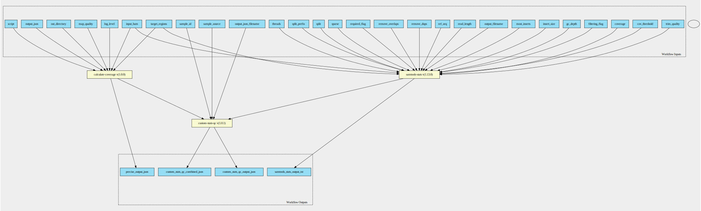
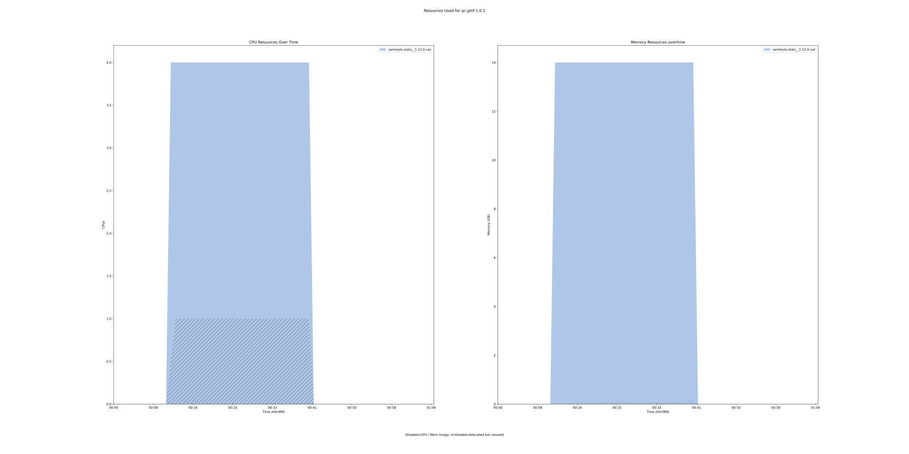
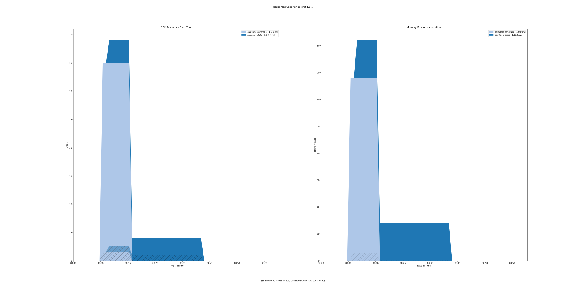

ghif-qc 1.0.1 workflow
======================

## Table of Contents
  
- [Overview](#ghif-qc-v101-overview)  
- [Visual](#visual-workflow-overview)  
- [Links](#related-links)  
- [Inputs](#ghif-qc-v101-inputs)  
- [Steps](#ghif-qc-v101-steps)  
- [Outputs](#ghif-qc-v101-outputs)  
- [ICA](#ica)  


## ghif-qc v(1.0.1) Overview


  
> ID: ghif-qc--1.0.1  
> md5sum: f4c14ae45adb63a4cd17591696a7ff64

### ghif-qc v(1.0.1) documentation
  
Documentation for ghif-qc v1.0.1

### Categories
  


## Visual Workflow Overview
  
[](https://github.com/umccr/cwl-ica/raw/main/.github/catalogue/images/workflows/ghif-qc/1.0.1/ghif-qc__1.0.1.svg)
## Related Links
  
- [CWL File Path](../../../../../../workflows/ghif-qc/1.0.1/ghif-qc__1.0.1.cwl)  


### Uses
  
- [calculate-coverage 1.0.0 :construction:](file:/home/runner/work/cwl-ica/cwl-ica/tools/calculate-coverage/1.0.0/calculate-coverage__1.0.0.md)  
- [custom-stats-qc 1.0.1 :construction:](file:/home/runner/work/cwl-ica/cwl-ica/tools/custom-stats-qc/1.0.1/custom-stats-qc__1.0.1.md)  
- [samtools-stats 1.13.0 :construction:](file:/home/runner/work/cwl-ica/cwl-ica/tools/samtools-stats/1.13.0/samtools-stats__1.13.0.md)  

  


## ghif-qc v(1.0.1) Inputs

### cov threshold


  
> ID: cov_threshold
  
**Optional:** `True`  
**Type:** `int`  
**Docs:**  
Only bases with coverage above this value will be included in the target percentage computation [0]


### coverage


  
> ID: coverage
  
**Optional:** `True`  
**Type:** `.[]`  
**Docs:**  
Set coverage distribution to the specified range (MIN, MAX, STEP all given as integers) [1,1000,1]


### filtering flag


  
> ID: filtering_flag
  
**Optional:** `True`  
**Type:** `int`  
**Docs:**  
iltering flag, 0 for unset. See also `samtools flags` [0]


### GC depth


  
> ID: gc_depth
  
**Optional:** `True`  
**Type:** `float`  
**Docs:**  
the size of GC-depth bins (decreasing bin size increases memory requirement) [2e4]


### id


  
> ID: id
  
**Optional:** `True`  
**Type:** `string`  
**Docs:**  
Include only listed read group or sample name []


### input BAM


  
> ID: input_bam
  
**Optional:** `False`  
**Type:** `File`  
**Docs:**  
The BAM file to gather statistics from


### insert size


  
> ID: insert_size
  
**Optional:** `True`  
**Type:** `int`  
**Docs:**  
Maximum insert size [8000]


### log level


  
> ID: log_level
  
**Optional:** `True`  
**Type:** `string`  
**Docs:**  
Set logging level to INFO (default), WARNING or DEBUG.


### map quality


  
> ID: map_quality
  
**Optional:** `True`  
**Type:** `int`  
**Docs:**  
Mapping quality threshold. Default: 20.


### most inserts


  
> ID: most_inserts
  
**Optional:** `True`  
**Type:** `float`  
**Docs:**  
Report only the main part of inserts [0.99]


### out directory


  
> ID: out_directory
  
**Optional:** `True`  
**Type:** `Directory`  
**Docs:**  
Path to scratch directory. Default: ./


### output filename


  
> ID: output_filename
  
**Optional:** `False`  
**Type:** `string`  
**Docs:**  
Redirects stdout


### output json


  
> ID: output_json
  
**Optional:** `False`  
**Type:** `string`  
**Docs:**  
output file


### output filename


  
> ID: output_json_filename
  
**Optional:** `False`  
**Type:** `string`  
**Docs:**  
output file


### read length


  
> ID: read_length
  
**Optional:** `True`  
**Type:** `int`  
**Docs:**  
Include in the statistics only reads with the given read length [-1]


### ref seq


  
> ID: ref_seq
  
**Optional:** `True`  
**Type:** `File`  
**Docs:**  
Reference sequence (required for GC-depth and mismatches-per-cycle calculation). []


### remove dups


  
> ID: remove_dups
  
**Optional:** `True`  
**Type:** `boolean`  
**Docs:**  
Exclude from statistics reads marked as duplicates


### remove overlaps


  
> ID: remove_overlaps
  
**Optional:** `True`  
**Type:** `boolean`  
**Docs:**  
Remove overlaps of paired-end reads from coverage and base count computations.


### required flag


  
> ID: required_flag
  
**Optional:** `True`  
**Type:** `int`  
**Docs:**  
Required flag, 0 for unset. See also `samtools flags` [0]


### sample id


  
> ID: sample_id
  
**Optional:** `False`  
**Type:** `string`  
**Docs:**  
Sample identity


### sample source


  
> ID: sample_source
  
**Optional:** `False`  
**Type:** `string`  
**Docs:**  
Sample original source


### script


  
> ID: script
  
**Optional:** `False`  
**Type:** `File`  
**Docs:**  
Path to PRECISE python script on GitHub


### sparse


  
> ID: sparse
  
**Optional:** `True`  
**Type:** `boolean`  
**Docs:**  
Suppress outputting IS rows where there are no insertions.


### split


  
> ID: split
  
**Optional:** `True`  
**Type:** `string`  
**Docs:**  
In addition to the complete statistics, also output categorised statistics based on the tagged field TAG 
(e.g., use --split RG to split into read groups).


### split prefix


  
> ID: split_prefix
  
**Optional:** `True`  
**Type:** `string`  
**Docs:**  
A path or string prefix to prepend to filenames output when creating categorised 
statistics files with -S/--split. [input filename]


### target regions


  
> ID: target_regions
  
**Optional:** `True`  
**Type:** `File`  
**Docs:**  
Do stats in these regions only. Tab-delimited file chr,from,to, 1-based, inclusive. []


### threads


  
> ID: threads
  
**Optional:** `True`  
**Type:** `int`  
**Docs:**  
Number of input/output compression threads to use in addition to main thread [0].


### trim quality


  
> ID: trim_quality
  
**Optional:** `True`  
**Type:** `int`  
**Docs:**  
The BWA trimming parameter [0]

  


## ghif-qc v(1.0.1) Steps

### calculate coverage step


  
> ID: ghif-qc--1.0.1/calculate_coverage_step
  
**Step Type:** workflow  
**Docs:**
  
PRECISE tool that runs a script to calculate few custom QC metrics

#### Links
  
[CWL File Path](../../../../../../workflows/ghif-qc/1.0.1/file:/home/runner/work/cwl-ica/cwl-ica/tools/calculate-coverage/1.0.0/calculate-coverage__1.0.0.cwl)  
[CWL File Help Page :construction:](file:/home/runner/work/cwl-ica/cwl-ica/tools/calculate-coverage/1.0.0/calculate-coverage__1.0.0.md)
#### Subworkflow overview
  
[](https://github.com/umccr/cwl-ica/raw/main/.github/catalogue/images/workflows/ghif-qc/1.0.1/file:/home/runner/work/cwl-ica/cwl-ica/tools/calculate-coverage/1.0.0/calculate-coverage__1.0.0.svg)  


### custom stats qc step


  
> ID: ghif-qc--1.0.1/custom_stats_qc_step
  
**Step Type:** workflow  
**Docs:**
  
A tool to extract custom QC metrics from samtools stats output and convert to json format.
#### Links
  
[CWL File Path](../../../../../../workflows/ghif-qc/1.0.1/file:/home/runner/work/cwl-ica/cwl-ica/tools/custom-stats-qc/1.0.1/custom-stats-qc__1.0.1.cwl)  
[CWL File Help Page :construction:](file:/home/runner/work/cwl-ica/cwl-ica/tools/custom-stats-qc/1.0.1/custom-stats-qc__1.0.1.md)
#### Subworkflow overview
  
[](https://github.com/umccr/cwl-ica/raw/main/.github/catalogue/images/workflows/ghif-qc/1.0.1/file:/home/runner/work/cwl-ica/cwl-ica/tools/custom-stats-qc/1.0.1/custom-stats-qc__1.0.1.svg)  


### samtools stats step


  
> ID: ghif-qc--1.0.1/samtools_stats_step
  
**Step Type:** workflow  
**Docs:**
  
samtools stats collects statistics from BAM files and outputs in a text format. The output can be visualized graphically using plot-bamstats.
#### Links
  
[CWL File Path](../../../../../../workflows/ghif-qc/1.0.1/file:/home/runner/work/cwl-ica/cwl-ica/tools/samtools-stats/1.13.0/samtools-stats__1.13.0.cwl)  
[CWL File Help Page :construction:](file:/home/runner/work/cwl-ica/cwl-ica/tools/samtools-stats/1.13.0/samtools-stats__1.13.0.md)
#### Subworkflow overview
  
[](https://github.com/umccr/cwl-ica/raw/main/.github/catalogue/images/workflows/ghif-qc/1.0.1/file:/home/runner/work/cwl-ica/cwl-ica/tools/samtools-stats/1.13.0/samtools-stats__1.13.0.svg)  


## ghif-qc v(1.0.1) Outputs

### custom stats qc combined json


  
> ID: ghif-qc--1.0.1/custom_stats_qc_combined_json  

  
**Optional:** `False`  
**Output Type:** `File`  
**Docs:**  
Internal custom JSON output file combined with PRECISE JSON output
  


### custom stats qc output json


  
> ID: ghif-qc--1.0.1/custom_stats_qc_output_json  

  
**Optional:** `False`  
**Output Type:** `File`  
**Docs:**  
JSON output file containing custom metrics
  


### precise output json


  
> ID: ghif-qc--1.0.1/precise_output_json  

  
**Optional:** `False`  
**Output Type:** `File`  
**Docs:**  
Output file from PRECISE QC script/implementation
  


### samtools stats output txt


  
> ID: ghif-qc--1.0.1/samtools_stats_output_txt  

  
**Optional:** `False`  
**Output Type:** `File`  
**Docs:**  
Output file, of varying format depending on the command run
  

  


## ICA

### ToC
  
- [development_workflows](#project-development_workflows)  


### Project: development_workflows


> wfl id: wfl.5d05d214eb3e4604ba7153118173f63e  

  
**workflow name:** ghif-qc_dev-wf  
**wfl version name:** 1.0.1  


#### Run Instances

##### ToC
  
- [Run wfr.f6adb13c92e340f89317c337674b18a6](#run-wfrf6adb13c92e340f89317c337674b18a6)  
- [Run wfr.10176db758d94e56833422dfd60d0f90](#run-wfr10176db758d94e56833422dfd60d0f90)  


##### Run wfr.f6adb13c92e340f89317c337674b18a6


  
> Run Name: qc-ghif-1.0.1  

  
**Start Time:** 2022-01-19 11:20:04 UTC  
**Duration:** 2022-01-19 12:24:11 UTC  
**End Time:** 0 days 01:04:07  


###### Reproduce Run


```bash

# Run the submission template to create the workflow input json and launch script            
cwl-ica copy-workflow-submission-template --ica-workflow-run-instance-id wfr.f6adb13c92e340f89317c337674b18a6

# Edit the input json file (optional)
# vim wfr.f6adb13c92e340f89317c337674b18a6.template.json 

# Run the launch script
bash wfr.f6adb13c92e340f89317c337674b18a6.launch.sh
                                    
```  


###### Run Inputs


```
{
    "cov_threshold": 20,
    "filtering_flag": 2304,
    "input_bam": {
        "class": "File",
        "location": "gds://umccr-temp-data-dev/helen/GHIF_QC/NA12878.bam"
    },
    "output_filename": "NA12878-test",
    "output_json_filename": "ghifQC",
    "ref_seq": {
        "class": "File",
        "location": "gds://umccr-temp-data-dev/helen/GHIF_QC/hg38_alt_aware_nohla.fa"
    },
    "remove_dups": true,
    "remove_overlaps": true,
    "sample_id": "NA12878",
    "sample_source": "GIAB",
    "target_regions": {
        "class": "File",
        "location": "gds://umccr-temp-data-dev/helen/GHIF_QC/Targets_Homo_sapiens_assembly38_autosomes.txt"
    }
}
```  


###### Run Engine Parameters


```
{
    "workDirectory": "gds://wfr.f6adb13c92e340f89317c337674b18a6/qc-ghif-1.0.1",
    "outputDirectory": "gds://wfr.f6adb13c92e340f89317c337674b18a6/qc-ghif-1.0.1/outputs",
    "tmpOutputDirectory": "gds://wfr.f6adb13c92e340f89317c337674b18a6/qc-ghif-1.0.1/steps",
    "logDirectory": "gds://wfr.f6adb13c92e340f89317c337674b18a6/qc-ghif-1.0.1/logs",
    "maxScatter": 32,
    "outputSetting": "move",
    "copyOutputInstanceType": "StandardHiCpu",
    "copyOutputInstanceSize": "Medium",
    "defaultInputMode": "'Download'",
    "inputModeOverrides": {},
    "tesUseInputManifest": "'auto'",
    "cwltool": "3.0.20201203173111",
    "engine": "1.18.0-202109141250-stratus-master"
}
```  


###### Run Outputs


```
{
    "custom_stats_qc_output_json": {
        "location": "gds://wfr.f6adb13c92e340f89317c337674b18a6/qc-ghif-1.0.1/outputs/ghifQC.json",
        "basename": "ghifQC.json",
        "nameroot": "ghifQC",
        "nameext": ".json",
        "class": "File",
        "size": 2694,
        "http://commonwl.org/cwltool#generation": 0
    },
    "samtools_stats_output_txt": {
        "location": "gds://wfr.f6adb13c92e340f89317c337674b18a6/qc-ghif-1.0.1/outputs/NA12878-test.txt",
        "basename": "NA12878-test.txt",
        "nameroot": "NA12878-test",
        "nameext": ".txt",
        "class": "File",
        "size": 130616,
        "http://commonwl.org/cwltool#generation": 0
    },
    "output_dir_gds_session_id": "ssn.b75d1da5fa44472d9b7ddd4719466c43",
    "output_dir_gds_folder_id": "fol.016e48606e5e43e0d7b508d9d6ea2c10"
}
```  


###### Run Resources Usage
  

  
[](https://github.com/umccr/cwl-ica/raw/main/.github/catalogue/images/runs/workflows/ghif-qc/1.0.1/qc-ghif-1.0.1__wfr.f6adb13c92e340f89317c337674b18a6.svg)  


##### Run wfr.10176db758d94e56833422dfd60d0f90


  
> Run Name: qc-ghif-1.0.1  

  
**Start Time:** 2022-01-27 05:15:52 UTC  
**Duration:** 2022-01-27 06:15:52 UTC  
**End Time:** 0 days 00:59:59  


###### Reproduce Run


```bash

# Run the submission template to create the workflow input json and launch script            
cwl-ica copy-workflow-submission-template --ica-workflow-run-instance-id wfr.10176db758d94e56833422dfd60d0f90

# Edit the input json file (optional)
# vim wfr.10176db758d94e56833422dfd60d0f90.template.json 

# Run the launch script
bash wfr.10176db758d94e56833422dfd60d0f90.launch.sh
                                    
```  


###### Run Inputs


```
{
    "cov_threshold": 20,
    "filtering_flag": 2304,
    "input_bam": {
        "class": "File",
        "location": "gds://umccr-temp-data-dev/helen/GHIF_QC/NA12878.bam"
    },
    "output_filename": "NA12878-samtools",
    "output_json": "NA12878-precise.json",
    "output_json_filename": "NA12878-custom",
    "ref_seq": {
        "class": "File",
        "location": "gds://umccr-temp-data-dev/helen/GHIF_QC/hg38_alt_aware_nohla.fa"
    },
    "remove_dups": true,
    "remove_overlaps": true,
    "sample_id": "NA12878",
    "sample_source": "GIAB",
    "script": {
        "class": "File",
        "location": "https://raw.githubusercontent.com/skanwal/wgs-sample-qc/main/calculate_coverage.py"
    },
    "target_regions": {
        "class": "File",
        "location": "gds://umccr-temp-data-dev/helen/GHIF_QC/Targets_Homo_sapiens_assembly38_autosomes.txt"
    }
}
```  


###### Run Engine Parameters


```
{
    "workDirectory": "gds://wfr.10176db758d94e56833422dfd60d0f90/qc-ghif-1.0.1",
    "outputDirectory": "gds://wfr.10176db758d94e56833422dfd60d0f90/qc-ghif-1.0.1/outputs",
    "tmpOutputDirectory": "gds://wfr.10176db758d94e56833422dfd60d0f90/qc-ghif-1.0.1/steps",
    "logDirectory": "gds://wfr.10176db758d94e56833422dfd60d0f90/qc-ghif-1.0.1/logs",
    "maxScatter": 32,
    "outputSetting": "move",
    "copyOutputInstanceType": "StandardHiCpu",
    "copyOutputInstanceSize": "Medium",
    "defaultInputMode": "'Download'",
    "inputModeOverrides": {},
    "tesUseInputManifest": "'auto'",
    "cwltool": "3.0.20201203173111",
    "engine": "1.20.0-202201191609-develop"
}
```  


###### Run Outputs


```
{
    "custom_stats_qc_combined_json": {
        "location": "gds://wfr.10176db758d94e56833422dfd60d0f90/qc-ghif-1.0.1/outputs/NA12878-custom_combined.json",
        "basename": "NA12878-custom_combined.json",
        "nameroot": "NA12878-custom_combined",
        "nameext": ".json",
        "class": "File",
        "size": 9487,
        "http://commonwl.org/cwltool#generation": 0
    },
    "custom_stats_qc_output_json": {
        "location": "gds://wfr.10176db758d94e56833422dfd60d0f90/qc-ghif-1.0.1/outputs/NA12878-custom.json",
        "basename": "NA12878-custom.json",
        "nameroot": "NA12878-custom",
        "nameext": ".json",
        "class": "File",
        "size": 2694,
        "http://commonwl.org/cwltool#generation": 0
    },
    "precise_output_json": {
        "location": "gds://wfr.10176db758d94e56833422dfd60d0f90/qc-ghif-1.0.1/outputs/NA12878-precise.json",
        "basename": "NA12878-precise.json",
        "nameroot": "NA12878-precise",
        "nameext": ".json",
        "class": "File",
        "size": 7969,
        "http://commonwl.org/cwltool#generation": 0
    },
    "samtools_stats_output_txt": {
        "location": "gds://wfr.10176db758d94e56833422dfd60d0f90/qc-ghif-1.0.1/outputs/NA12878-samtools.txt",
        "basename": "NA12878-samtools.txt",
        "nameroot": "NA12878-samtools",
        "nameext": ".txt",
        "class": "File",
        "size": 130616,
        "http://commonwl.org/cwltool#generation": 0
    },
    "output_dir_gds_session_id": "ssn.bcb9d7dbe4d0466aa28f27c78d86b716",
    "output_dir_gds_folder_id": "fol.293227fa9cc54bd9a5e908d9e1281311"
}
```  


###### Run Resources Usage
  

  
[](https://github.com/umccr/cwl-ica/raw/main/.github/catalogue/images/runs/workflows/ghif-qc/1.0.1/qc-ghif-1.0.1__wfr.10176db758d94e56833422dfd60d0f90.svg)  

  

