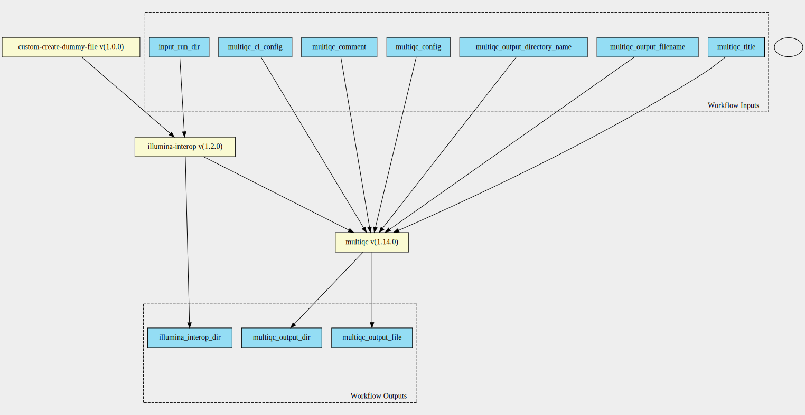

illumina-interop-qc 1.2.0--1.14.0 workflow
==========================================

## Table of Contents
  
- [Overview](#illumina-interop-qc-v120--1140-overview)  
- [Visual](#visual-workflow-overview)  
- [Links](#related-links)  
- [Inputs](#illumina-interop-qc-v120--1140-inputs)  
- [Steps](#illumina-interop-qc-v120--1140-steps)  
- [Outputs](#illumina-interop-qc-v120--1140-outputs)  
- [ICA](#ica)  

## illumina-interop-qc v(1.2.0--1.14.0) Overview

  
> ID: illumina-interop-qc--1.2.0--1.14.0  
> md5sum: 0ce252fa8165d4afd7242b37a2f2540c

### illumina-interop-qc v(1.2.0--1.14.0) documentation
  
Documentation for illumina-interop-qc v1.2.0--1.14.0

### Categories
  

## Visual Workflow Overview
  

## Related Links
  
- [CWL File Path](../../../../../../workflows/illumina-interop-qc/1.2.0--1.14.0/illumina-interop-qc__1.2.0--1.14.0.cwl)  

### Uses
  
- [custom-touch-file 1.0.0 :construction:](../../../tools/custom-touch-file/1.0.0/custom-touch-file__1.0.0.md)  
- [illumina-interop 1.2.0](../../../tools/illumina-interop/1.2.0/illumina-interop__1.2.0.md)  
- [multiqc 1.14.0](../../../tools/multiqc/1.14.0/multiqc__1.14.0.md)  

  

## illumina-interop-qc v(1.2.0--1.14.0) Inputs

### input run directory

  
> ID: input_run_dir
  
**Optional:** `False`  
**Type:** `Directory`  
**Docs:**  
The bcl directory

### multiqc cl config

  
> ID: multiqc_cl_config
  
**Optional:** `True`  
**Type:** `string`  
**Docs:**  
Configuration via the cli for multiqc

### multiqc comment

  
> ID: multiqc_comment
  
**Optional:** `True`  
**Type:** `string`  
**Docs:**  
Any commentary to place in the multiqc report

### multiqc config

  
> ID: multiqc_config
  
**Optional:** `True`  
**Type:** `File`  
**Docs:**  
Configuration file for multiqc

### multiqc output directory name

  
> ID: multiqc_output_directory_name
  
**Optional:** `False`  
**Type:** `string`  
**Docs:**  
Name of the output directory for multiqc

### multiqc output filename

  
> ID: multiqc_output_filename
  
**Optional:** `False`  
**Type:** `string`  
**Docs:**  
The name of the multiqc output file

### multiqc title

  
> ID: multiqc_title
  
**Optional:** `False`  
**Type:** `string`  
**Docs:**  
The name of the title for multiqc

  

## illumina-interop-qc v(1.2.0--1.14.0) Steps

### Create dummy file

  
> ID: illumina-interop-qc--1.2.0--1.14.0/create_dummy_file_step
  
**Step Type:** tool  
**Docs:**
  
Intermediate step for letting interop be placed in stream mode

#### Links
  
[CWL File Path](../../../../../../tools/custom-touch-file/1.0.0/custom-touch-file__1.0.0.cwl)  
[CWL File Help Page :construction:](../../../tools/custom-touch-file/1.0.0/custom-touch-file__1.0.0.md)  

### illumina interop step

  
> ID: illumina-interop-qc--1.2.0--1.14.0/illumina_interop_step
  
**Step Type:** tool  
**Docs:**
  
Call illumina interop step

#### Links
  
[CWL File Path](../../../../../../tools/illumina-interop/1.2.0/illumina-interop__1.2.0.cwl)  
[CWL File Help Page](../../../tools/illumina-interop/1.2.0/illumina-interop__1.2.0.md)  

### multiqc step

  
> ID: illumina-interop-qc--1.2.0--1.14.0/multiqc_step
  
**Step Type:** tool  
**Docs:**
  
Run multiqc on interop summary files

#### Links
  
[CWL File Path](../../../../../../tools/multiqc/1.14.0/multiqc__1.14.0.cwl)  
[CWL File Help Page](../../../tools/multiqc/1.14.0/multiqc__1.14.0.md)  

## illumina-interop-qc v(1.2.0--1.14.0) Outputs

### illumina interop directory

  
> ID: illumina-interop-qc--1.2.0--1.14.0/illumina_interop_dir  

  
**Optional:** `False`  
**Output Type:** `Directory`  
**Docs:**  
The illumina interop output directory
  

### multiqc output directory

  
> ID: illumina-interop-qc--1.2.0--1.14.0/multiqc_output_dir  

  
**Optional:** `False`  
**Output Type:** `Directory`  
**Docs:**  
The multiqc output directory
  

### multiqc output file

  
> ID: illumina-interop-qc--1.2.0--1.14.0/multiqc_output_file  

  
**Optional:** `False`  
**Output Type:** `File`  
**Docs:**  
HTML output file
  

  

## ICA

### ToC
  
- [development_workflows](#project-development_workflows)  

### Project: development_workflows

> wfl id: wfl.6423709b62684c348f7b8305fe40cdf1  

  
**workflow name:** illumina-interop-qc_dev-wf  
**wfl version name:** 1.2.0--1.14.0  

  

