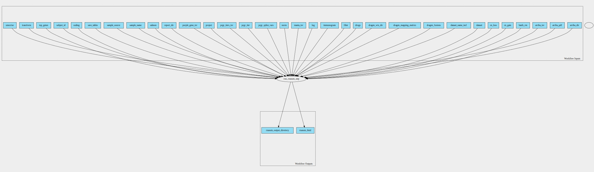

rnasum-pipeline 1.1.0 workflow
==============================

## Table of Contents
  
- [Overview](#rnasum-pipeline-v110-overview)  
- [Visual](#visual-workflow-overview)  
- [Links](#related-links)  
- [Inputs](#rnasum-pipeline-v110-inputs)  
- [Steps](#rnasum-pipeline-v110-steps)  
- [Outputs](#rnasum-pipeline-v110-outputs)  
- [ICA](#ica)  

## rnasum-pipeline v(1.1.0) Overview

  
> ID: rnasum-pipeline--1.1.0  
> md5sum: 28bb78f3359e7f977c4be97880886a02

### rnasum-pipeline v(1.1.0) documentation
  
Documentation for rnasum-pipeline v1.1.0

### Categories
  

## Visual Workflow Overview
  

## Related Links
  
- [CWL File Path](../../../../../../workflows/rnasum-pipeline/1.1.0/rnasum-pipeline__1.1.0.cwl)  

### Uses
  
- [rnasum 1.1.0](../../../tools/rnasum/1.1.0/rnasum__1.1.0.md)  

  

## rnasum-pipeline v(1.1.0) Inputs

### arriba directory

  
> ID: arriba_dir
  
**Optional:** `True`  
**Type:** `Directory`  
**Docs:**  
Location of the arriba outputs directory

### arriba pdf

  
> ID: arriba_pdf
  
**Optional:** `True`  
**Type:** `File`  
**Docs:**  
Location of the pdf output from arriba

### arriba tsv

  
> ID: arriba_tsv
  
**Optional:** `True`  
**Type:** `File`  
**Docs:**  
Location of the tsv output from arriba

### batch rm

  
> ID: batch_rm
  
**Optional:** `True`  
**Type:** `boolean`  
**Docs:**  
Remove batch-associated effects between datasets. Available options are: "TRUE" (default) and "FALSE"

### cn gain

  
> ID: cn_gain
  
**Optional:** `True`  
**Type:** `int`  
**Docs:**  
CN threshold value to classify genes within gained regions.

### cn loss

  
> ID: cn_loss
  
**Optional:** `True`  
**Type:** `int`  
**Docs:**  
CN threshold value to classify genes within lost regions.

### dataset

  
> ID: dataset
  
**Optional:** `False`  
**Type:** `string`  
**Docs:**  
Reference dataset selection from https://github.com/umccr/RNAsum/blob/master/TCGA_projects_summary.md

### dataset name incl

  
> ID: dataset_name_incl
  
**Optional:** `True`  
**Type:** `boolean`  
**Docs:**  
Include dataset in the report and sample name.

### dragen fusions

  
> ID: dragen_fusions
  
**Optional:** `True`  
**Type:** `File`  
**Docs:**  
Location of the fusion output from Dragen RNA-seq pipeline

### dragen mapping metrics

  
> ID: dragen_mapping_metrics
  
**Optional:** `True`  
**Type:** `File`  
**Docs:**  
Location of the mapping metrics from Dragen RNA-seq pipeline

### dragen transcriptome directory

  
> ID: dragen_wts_dir
  
**Optional:** `True`  
**Type:** `Directory`  
**Docs:**  
Location of the results from Dragen RNA-seq pipeline

### drugs

  
> ID: drugs
  
**Optional:** `True`  
**Type:** `boolean`  
**Docs:**  
Include drug matching section in the report.

### filter

  
> ID: filter
  
**Optional:** `True`  
**Type:** `boolean`  
**Docs:**  
Filtering out low expressed genes. Available options are: "TRUE" (default) and "FALSE"

### immunogram

  
> ID: immunogram
  
**Optional:** `True`  
**Type:** `boolean`  
**Docs:**  
Include drug matching section in the report.

### log

  
> ID: log
  
**Optional:** `True`  
**Type:** `boolean`  
**Docs:**  
Log (base 2) transform data before normalisation. Available options are: "TRUE" (default) and "FALSE"

### manta tsv

  
> ID: manta_tsv
  
**Optional:** `True`  
**Type:** `File`  
**Docs:**  
Location of the tsv output from manta

### norm

  
> ID: norm
  
**Optional:** `True`  
**Type:** `string`  
**Docs:**  
Normalisation method

### PCGR splice vars

  
> ID: pcgr_splice_vars
  
**Optional:** `True`  
**Type:** `boolean`  
**Docs:**  
Include non-coding splice region variants reported in PCGR. Available options are: "TRUE" (default) and "FALSE"

### pcgr tier

  
> ID: pcgr_tier
  
**Optional:** `True`  
**Type:** `int`  
**Docs:**  
Tier threshold for reporting variants reported in PCGR.

### pcgr tiers tsv

  
> ID: pcgr_tiers_tsv
  
**Optional:** `True`  
**Type:** `File`  
**Docs:**  
Location of the tsv output from pcgr

### project

  
> ID: project
  
**Optional:** `True`  
**Type:** `string`  
**Docs:**  
Project name. This information is for annotation purposes only

### purple gene tsv

  
> ID: purple_gene_tsv
  
**Optional:** `True`  
**Type:** `File`  
**Docs:**  
Location of the tsv output from purple

### report dir

  
> ID: report_dir
  
**Optional:** `False`  
**Type:** `string`  
**Docs:**  
Desired location for the outputs

### salmom

  
> ID: salmon
  
**Optional:** `True`  
**Type:** `File`  
**Docs:**  
Location of the quantification output from salmon

### sample name

  
> ID: sample_name
  
**Optional:** `False`  
**Type:** `string`  
**Docs:**  
Desired sample name to be presented in the report

### sample source

  
> ID: sample_source
  
**Optional:** `True`  
**Type:** `string`  
**Docs:**  
Source of investigated sample (e.g. fresh frozen tissue, organoid).
This information is for annotation purposes only

### save tables

  
> ID: save_tables
  
**Optional:** `True`  
**Type:** `boolean`  
**Docs:**  
Save interactive summary tables as HTML. Available options are: "TRUE" (default) and "FALSE"

### scaling

  
> ID: scaling
  
**Optional:** `True`  
**Type:** `string`  
**Docs:**  
Apply "gene-wise" (default) or "group-wise" data scaling

### subject id

  
> ID: subject_id
  
**Optional:** `True`  
**Type:** `string`  
**Docs:**  
Subject ID. If umccrise output is specified (flag --umccrise) then Subject ID 
is extracted from there and used to overwrite this argument.

### top genes

  
> ID: top_genes
  
**Optional:** `True`  
**Type:** `int`  
**Docs:**  
The number of top ranked genes to be presented.

### transform

  
> ID: transform
  
**Optional:** `True`  
**Type:** `string`  
**Docs:**  
Transformation method to be used when converting read counts

### umccrise directory

  
> ID: umccrise
  
**Optional:** `True`  
**Type:** `Directory`  
**Docs:**  
The umccrise output directory

  

## rnasum-pipeline v(1.1.0) Steps

### run rnasum step

  
> ID: rnasum-pipeline--1.1.0/run_rnasum_step
  
**Step Type:** tool  
**Docs:**
  
Run the rnasum pipeline

#### Links
  
[CWL File Path](../../../../../../tools/rnasum/1.1.0/rnasum__1.1.0.cwl)  
[CWL File Help Page](../../../tools/rnasum/1.1.0/rnasum__1.1.0.md)  

## rnasum-pipeline v(1.1.0) Outputs

### rnasum html

  
> ID: rnasum-pipeline--1.1.0/rnasum_html  

  
**Optional:** `False`  
**Output Type:** `File`  
**Docs:**  
The HTML report output of RNAsum
  

### RNAsum output directory

  
> ID: rnasum-pipeline--1.1.0/rnasum_output_directory  

  
**Optional:** `False`  
**Output Type:** `Directory`  
**Docs:**  
Output directory containing all outputs of the RNAsum run  

  

