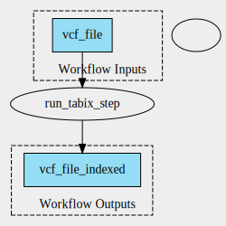

tabix-workflow 0.2.6 workflow
=============================

## Table of Contents
  
- [Overview](#tabix-workflow-v026-overview)  
- [Visual](#visual-workflow-overview)  
- [Links](#related-links)  
- [Inputs](#tabix-workflow-v026-inputs)  
- [Steps](#tabix-workflow-v026-steps)  
- [Outputs](#tabix-workflow-v026-outputs)  
- [ICA](#ica)  

## tabix-workflow v(0.2.6) Overview

  
> ID: tabix-workflow--0.2.6  
> md5sum: 04754879b824a05abe76bb28708b6d70

### tabix-workflow v(0.2.6) documentation
  
Just run the tabix tool

### Categories
  

## Visual Workflow Overview
  

## Related Links
  
- [CWL File Path](../../../../../../workflows/tabix-workflow/0.2.6/tabix-workflow__0.2.6.cwl)  

### Uses
  
- [tabix 0.2.6 :construction:](file:/home/runner/work/cwl-ica/cwl-ica/tools/tabix/0.2.6/tabix__0.2.6.md)  

  

## tabix-workflow v(0.2.6) Inputs

### vcf file

  
> ID: vcf_file
  
**Optional:** `False`  
**Type:** `File`  
**Docs:**  
The input vcf file to be indexed

  

## tabix-workflow v(0.2.6) Steps

### run tabix step

  
> ID: tabix-workflow--0.2.6/run_tabix_step
  
**Step Type:** workflow  
**Docs:**
  
Run tabix workflow

#### Links
  
[CWL File Path](../../../../../../workflows/tabix-workflow/0.2.6/file:/home/runner/work/cwl-ica/cwl-ica/tools/tabix/0.2.6/tabix__0.2.6.cwl)  
[CWL File Help Page :construction:](file:/home/runner/work/cwl-ica/cwl-ica/tools/tabix/0.2.6/tabix__0.2.6.md)
#### Subworkflow overview
  
  

## tabix-workflow v(0.2.6) Outputs

### vcf file indexed

  
> ID: tabix-workflow--0.2.6/vcf_file_indexed  

  
**Optional:** `False`  
**Output Type:** `File`  
**Docs:**  
The indexed vcf file
  

  

