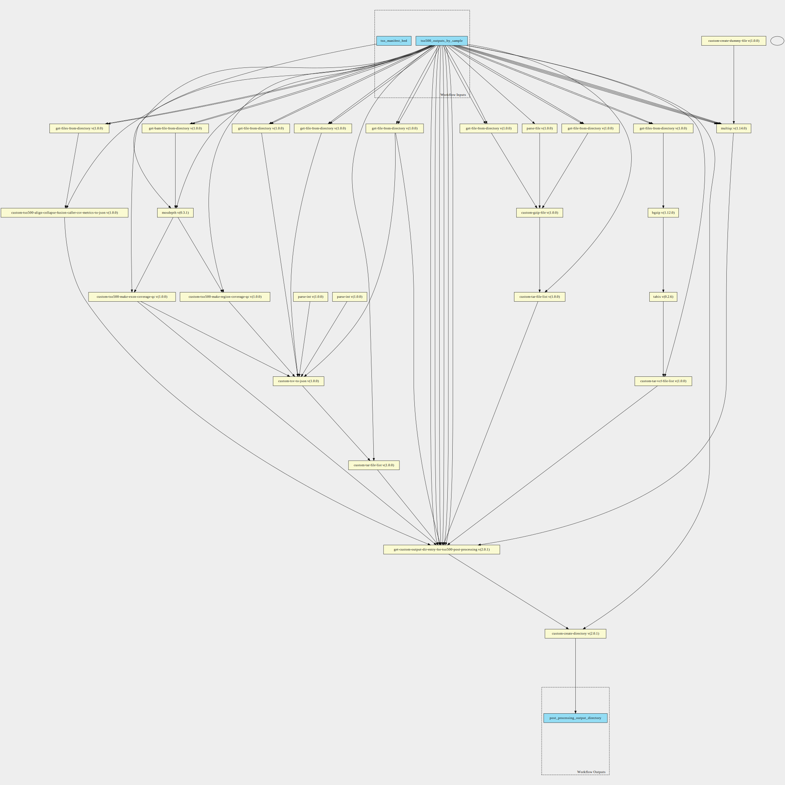

tso500-ctdna-post-processing-pipeline 1.0.0 workflow
====================================================

## Table of Contents
  
- [Overview](#tso500-ctdna-post-processing-pipeline-v100-overview)  
- [Visual](#visual-workflow-overview)  
- [Links](#related-links)  
- [Inputs](#tso500-ctdna-post-processing-pipeline-v100-inputs)  
- [Steps](#tso500-ctdna-post-processing-pipeline-v100-steps)  
- [Outputs](#tso500-ctdna-post-processing-pipeline-v100-outputs)  
- [ICA](#ica)  

## tso500-ctdna-post-processing-pipeline v(1.0.0) Overview

  
> ID: tso500-ctdna-post-processing-pipeline--1.0.0  
> md5sum: ff570bd041c676cb90d6ad613baf67dd

### tso500-ctdna-post-processing-pipeline v(1.0.0) documentation
  
UMCCR CWL tso500-ctdna-post-processing-pipeline v1.0.0

Original pipeline source can be found [here](https://github.com/YinanWang16/tso500-ctdna-post-processing/blob/main/cwl/workflows/umccr-cttso-post-processiong__v1.0.0.cwl).

The workflow has 6 main steps

* intermediate expressions - for collection of bam, vcf, csv and json files
* Coverage analysis
  * Create csv of exons with a list of low level coverage
  * Summary report of coverage over exons
* JSONising of dragen metrics
* Compression of json files
* Compression of vcf files
* Creation of the output directory with the select files

### Categories
  
- tso500  

## Visual Workflow Overview
  

## Related Links
  
- [CWL File Path](../../../../../../workflows/tso500-ctdna-post-processing-pipeline/1.0.0/tso500-ctdna-post-processing-pipeline__1.0.0.cwl)  

### Uses
  
- [custom-tso500-cnv-caller-bin-counts-to-json 1.0.0](../../../tools/custom-tso500-cnv-caller-bin-counts-to-json/1.0.0/custom-tso500-cnv-caller-bin-counts-to-json__1.0.0.md)  
- [custom-gzip-file 1.0.0](../../../tools/custom-gzip-file/1.0.0/custom-gzip-file__1.0.0.md)  
- [bgzip 1.12.0](../../../tools/bgzip/1.12.0/bgzip__1.12.0.md)  
- [custom-tsv-to-json 1.0.0](../../../tools/custom-tsv-to-json/1.0.0/custom-tsv-to-json__1.0.0.md)  
- [get-custom-output-dir-entry-for-tso500-post-processing 2.0.1](../../../expressions/get-custom-output-dir-entry-for-tso500-post-processing/2.0.1/get-custom-output-dir-entry-for-tso500-post-processing__2.0.1.md)  
- [custom-touch-file 1.0.0 :construction:](../../../tools/custom-touch-file/1.0.0/custom-touch-file__1.0.0.md)  
- [custom-create-directory 2.0.1](../../../tools/custom-create-directory/2.0.1/custom-create-directory__2.0.1.md)  
- [custom-tso500-align-collapse-fusion-caller-csv-metrics-to-json 1.0.0](../../../tools/custom-tso500-align-collapse-fusion-caller-csv-metrics-to-json/1.0.0/custom-tso500-align-collapse-fusion-caller-csv-metrics-to-json__1.0.0.md)  
- [custom-tar-file-list 1.0.0](../../../tools/custom-tar-file-list/1.0.0/custom-tar-file-list__1.0.0.md)  
- [custom-tar-file-list 1.0.0](../../../tools/custom-tar-file-list/1.0.0/custom-tar-file-list__1.0.0.md)  
- [custom-tar-vcf-file-list 1.0.0](../../../tools/custom-tar-vcf-file-list/1.0.0/custom-tar-vcf-file-list__1.0.0.md)  
- [get-files-from-directory 1.0.0 :construction:](../../../expressions/get-files-from-directory/1.0.0/get-files-from-directory__1.0.0.md)  
- [get-file-from-directory 1.0.0 :construction:](../../../expressions/get-file-from-directory/1.0.0/get-file-from-directory__1.0.0.md)  
- [custom-tar-file-list 1.0.0](../../../tools/custom-tar-file-list/1.0.0/custom-tar-file-list__1.0.0.md)  
- [get-files-from-directory 1.0.0 :construction:](../../../expressions/get-files-from-directory/1.0.0/get-files-from-directory__1.0.0.md)  
- [get-file-from-directory 1.0.0 :construction:](../../../expressions/get-file-from-directory/1.0.0/get-file-from-directory__1.0.0.md)  
- [custom-tar-file-list 1.0.0](../../../tools/custom-tar-file-list/1.0.0/custom-tar-file-list__1.0.0.md)  
- [get-file-from-directory 1.0.0 :construction:](../../../expressions/get-file-from-directory/1.0.0/get-file-from-directory__1.0.0.md)  
- [get-file-from-directory 1.0.0 :construction:](../../../expressions/get-file-from-directory/1.0.0/get-file-from-directory__1.0.0.md)  
- [get-file-from-directory 1.0.0 :construction:](../../../expressions/get-file-from-directory/1.0.0/get-file-from-directory__1.0.0.md)  
- [parse-int 1.0.0](../../../expressions/parse-int/1.0.0/parse-int__1.0.0.md)  
- [get-bam-file-from-directory 1.0.0](../../../expressions/get-bam-file-from-directory/1.0.0/get-bam-file-from-directory__1.0.0.md)  
- [parse-file 1.0.0](../../../expressions/parse-file/1.0.0/parse-file__1.0.0.md)  
- [get-file-from-directory 1.0.0 :construction:](../../../expressions/get-file-from-directory/1.0.0/get-file-from-directory__1.0.0.md)  
- [get-file-from-directory 1.0.0 :construction:](../../../expressions/get-file-from-directory/1.0.0/get-file-from-directory__1.0.0.md)  
- [get-files-from-directory 1.0.0 :construction:](../../../expressions/get-files-from-directory/1.0.0/get-files-from-directory__1.0.0.md)  
- [parse-int 1.0.0](../../../expressions/parse-int/1.0.0/parse-int__1.0.0.md)  
- [tabix 0.2.6](../../../tools/tabix/0.2.6/tabix__0.2.6.md)  
- [custom-tso500-make-exon-coverage-qc 1.0.0](../../../tools/custom-tso500-make-exon-coverage-qc/1.0.0/custom-tso500-make-exon-coverage-qc__1.0.0.md)  
- [custom-tso500-make-region-coverage-qc 1.0.0](../../../tools/custom-tso500-make-region-coverage-qc/1.0.0/custom-tso500-make-region-coverage-qc__1.0.0.md)  
- [mosdepth 0.3.1](../../../tools/mosdepth/0.3.1/mosdepth__0.3.1.md)  
- [multiqc 1.14.0](../../../tools/multiqc/1.14.0/multiqc__1.14.0.md)  

### Used By
  
- [tso500-ctdna-with-post-processing-pipeline 1.1.0--1.0.0](../../tso500-ctdna-with-post-processing-pipeline/1.1.0--1.0.0/tso500-ctdna-with-post-processing-pipeline__1.1.0--1.0.0.md)  
- [tso500-ctdna-with-post-processing-pipeline 1.2.0--1.0.0](../../tso500-ctdna-with-post-processing-pipeline/1.2.0--1.0.0/tso500-ctdna-with-post-processing-pipeline__1.2.0--1.0.0.md)  

  

## tso500-ctdna-post-processing-pipeline v(1.0.0) Inputs

### tso500 outputs by sample

  
> ID: tso500_outputs_by_sample
  
**Optional:** `False`  
**Type:** `file:///home/runner/work/cwl-ica/cwl-ica/schemas/tso500-outputs-by-sample/1.0.0/tso500-outputs-by-sample__1.0.0.yaml#tso500-outputs-by-sample`  
**Docs:**  
Directories and Files of UMCCR tso500 output

### tso manifest bed

  
> ID: tso_manifest_bed
  
**Optional:** `False`  
**Type:** `File`  
**Docs:**  
TST500C_manifest.bed file from TSO500 resources

  

## tso500-ctdna-post-processing-pipeline v(1.0.0) Steps

### cnv caller to json step

  
> ID: tso500-ctdna-post-processing-pipeline--1.0.0/cnv_caller_counts_tsv_to_json_step
  
**Step Type:** tool  
**Docs:**
  
Collect all of the cnv caller metrics and convert to compressed json

#### Links
  
[CWL File Path](../../../../../../tools/custom-tso500-cnv-caller-bin-counts-to-json/1.0.0/custom-tso500-cnv-caller-bin-counts-to-json__1.0.0.cwl)  
[CWL File Help Page](../../../tools/custom-tso500-cnv-caller-bin-counts-to-json/1.0.0/custom-tso500-cnv-caller-bin-counts-to-json__1.0.0.md)  

### compress reporting jsons with gzip step

  
> ID: tso500-ctdna-post-processing-pipeline--1.0.0/compress_reporting_jsons_with_gzip_step
  
**Step Type:** tool  
**Docs:**
  
Compress the tmb, msi and sample analysis results jsons with gzip

#### Links
  
[CWL File Path](../../../../../../tools/custom-gzip-file/1.0.0/custom-gzip-file__1.0.0.cwl)  
[CWL File Help Page](../../../tools/custom-gzip-file/1.0.0/custom-gzip-file__1.0.0.md)  

### compress vcf files step

  
> ID: tso500-ctdna-post-processing-pipeline--1.0.0/compress_vcf_files_step
  
**Step Type:** tool  
**Docs:**
  
Compress (and index) vcf files with bgzip

#### Links
  
[CWL File Path](../../../../../../tools/bgzip/1.12.0/bgzip__1.12.0.cwl)  
[CWL File Help Page](../../../tools/bgzip/1.12.0/bgzip__1.12.0.md)  

### convert metric csvs into json gzip step

  
> ID: tso500-ctdna-post-processing-pipeline--1.0.0/convert_metric_csvs_into_json_gzip_step
  
**Step Type:** tool  
**Docs:**
  
Convert the metric csv files into compressed jsons

#### Links
  
[CWL File Path](../../../../../../tools/custom-tsv-to-json/1.0.0/custom-tsv-to-json__1.0.0.cwl)  
[CWL File Help Page](../../../tools/custom-tsv-to-json/1.0.0/custom-tsv-to-json__1.0.0.md)  

### create custom output entry list array step

  
> ID: tso500-ctdna-post-processing-pipeline--1.0.0/create_custom_output_entry_list_array_step
  
**Step Type:** expression  
**Docs:**
  
Create the array of inputs to go into custom create directory.

#### Links
  
[CWL File Path](../../../../../../expressions/get-custom-output-dir-entry-for-tso500-post-processing/2.0.1/get-custom-output-dir-entry-for-tso500-post-processing__2.0.1.cwl)  
[CWL File Help Page](../../../expressions/get-custom-output-dir-entry-for-tso500-post-processing/2.0.1/get-custom-output-dir-entry-for-tso500-post-processing__2.0.1.md)  

### Create dummy file

  
> ID: tso500-ctdna-post-processing-pipeline--1.0.0/create_dummy_file_step
  
**Step Type:** tool  
**Docs:**
  
Intermediate step for letting multiqc-interop be placed in stream mode

#### Links
  
[CWL File Path](../../../../../../tools/custom-touch-file/1.0.0/custom-touch-file__1.0.0.cwl)  
[CWL File Help Page :construction:](../../../tools/custom-touch-file/1.0.0/custom-touch-file__1.0.0.md)  

### create output directory

  
> ID: tso500-ctdna-post-processing-pipeline--1.0.0/create_output_directory
  
**Step Type:** tool  
**Docs:**
  
Create the output directory containing all the files listed in the previous step.

#### Links
  
[CWL File Path](../../../../../../tools/custom-create-directory/2.0.1/custom-create-directory__2.0.1.cwl)  
[CWL File Help Page](../../../tools/custom-create-directory/2.0.1/custom-create-directory__2.0.1.md)  

### dragen metrics to json step

  
> ID: tso500-ctdna-post-processing-pipeline--1.0.0/dragen_metrics_to_json_step
  
**Step Type:** tool  
**Docs:**
  
Collect all of the dragen metrics and convert to compressed json

#### Links
  
[CWL File Path](../../../../../../tools/custom-tso500-align-collapse-fusion-caller-csv-metrics-to-json/1.0.0/custom-tso500-align-collapse-fusion-caller-csv-metrics-to-json__1.0.0.cwl)  
[CWL File Help Page](../../../tools/custom-tso500-align-collapse-fusion-caller-csv-metrics-to-json/1.0.0/custom-tso500-align-collapse-fusion-caller-csv-metrics-to-json__1.0.0.md)  

### gather compressed metric json files into tar step

  
> ID: tso500-ctdna-post-processing-pipeline--1.0.0/gather_compressed_metric_json_files_into_tar_step
  
**Step Type:** tool  
**Docs:**
  
Gather the compressed metric jsons files into a tar ball.
This is to limit the number of input files / directories into the final collection step.

#### Links
  
[CWL File Path](../../../../../../tools/custom-tar-file-list/1.0.0/custom-tar-file-list__1.0.0.cwl)  
[CWL File Help Page](../../../tools/custom-tar-file-list/1.0.0/custom-tar-file-list__1.0.0.md)  

### gather compressed reporting json files into tar step

  
> ID: tso500-ctdna-post-processing-pipeline--1.0.0/gather_compressed_reporting_json_files_into_tar_step
  
**Step Type:** tool  
**Docs:**
  
Zip up the compressed jsons into a tar ball.
This is to limit the number of input files / directories into the final collection step.

#### Links
  
[CWL File Path](../../../../../../tools/custom-tar-file-list/1.0.0/custom-tar-file-list__1.0.0.cwl)  
[CWL File Help Page](../../../tools/custom-tar-file-list/1.0.0/custom-tar-file-list__1.0.0.md)  

### gather compressed vcf files into tar step

  
> ID: tso500-ctdna-post-processing-pipeline--1.0.0/gather_compressed_vcf_files_into_tar_step
  
**Step Type:** tool  
**Docs:**
  
Gather the vcf files into a tar ball.
This is to limit the number of input files / directories into the final collection step.

#### Links
  
[CWL File Path](../../../../../../tools/custom-tar-vcf-file-list/1.0.0/custom-tar-vcf-file-list__1.0.0.cwl)  
[CWL File Help Page](../../../tools/custom-tar-vcf-file-list/1.0.0/custom-tar-vcf-file-list__1.0.0.md)  

### get align collapse fusion caller metrics csv files intermediates step

  
> ID: tso500-ctdna-post-processing-pipeline--1.0.0/get_align_collapse_fusion_caller_metrics_csv_files_intermediate_step
  
**Step Type:** expression  
**Docs:**
  
Get the metrics csv files generated by dragen in the AlignCollapseFusionCaller folder

#### Links
  
[CWL File Path](../../../../../../expressions/get-files-from-directory/1.0.0/get-files-from-directory__1.0.0.cwl)  
[CWL File Help Page :construction:](../../../expressions/get-files-from-directory/1.0.0/get-files-from-directory__1.0.0.md)  

### get align collapse fusion caller metrics csv files intermediates step

  
> ID: tso500-ctdna-post-processing-pipeline--1.0.0/get_align_collapse_fusion_caller_replay_json
  
**Step Type:** expression  
**Docs:**
  
Get the metrics csv files generated by dragen in the AlignCollapseFusionCaller folder

#### Links
  
[CWL File Path](../../../../../../expressions/get-file-from-directory/1.0.0/get-file-from-directory__1.0.0.cwl)  
[CWL File Help Page :construction:](../../../expressions/get-file-from-directory/1.0.0/get-file-from-directory__1.0.0.md)  

### gather csvs as tarball

  
> ID: tso500-ctdna-post-processing-pipeline--1.0.0/get_cnv_bin_count_csvs_as_tarball_step
  
**Step Type:** tool  
**Docs:**
  
Gather the csv files into a tar ball.

#### Links
  
[CWL File Path](../../../../../../tools/custom-tar-file-list/1.0.0/custom-tar-file-list__1.0.0.cwl)  
[CWL File Help Page](../../../tools/custom-tar-file-list/1.0.0/custom-tar-file-list__1.0.0.md)  

### Get CNV Caller metrics tsv files intermediate step

  
> ID: tso500-ctdna-post-processing-pipeline--1.0.0/get_cnv_caller_bin_count_tsv_files_intermediate_step
  
**Step Type:** expression  
**Docs:**
  
Get the metric tsv files generated by the cnv caller

#### Links
  
[CWL File Path](../../../../../../expressions/get-files-from-directory/1.0.0/get-files-from-directory__1.0.0.cwl)  
[CWL File Help Page :construction:](../../../expressions/get-files-from-directory/1.0.0/get-files-from-directory__1.0.0.md)  

### get complex phased variant vcf step

  
> ID: tso500-ctdna-post-processing-pipeline--1.0.0/get_complex_phased_variant_vcf_step
  
**Step Type:** expression  
**Docs:**
  
Get the vcf file <SampleName>.Complex.vcf from the PhasedVariants Step

#### Links
  
[CWL File Path](../../../../../../expressions/get-file-from-directory/1.0.0/get-file-from-directory__1.0.0.cwl)  
[CWL File Help Page :construction:](../../../expressions/get-file-from-directory/1.0.0/get-file-from-directory__1.0.0.md)  

### gather csvs as tarball

  
> ID: tso500-ctdna-post-processing-pipeline--1.0.0/get_decompressed_metrics_csvs_files_as_tarball_step
  
**Step Type:** tool  
**Docs:**
  
Gather the csv files into a tar ball.

#### Links
  
[CWL File Path](../../../../../../tools/custom-tar-file-list/1.0.0/custom-tar-file-list__1.0.0.cwl)  
[CWL File Help Page](../../../tools/custom-tar-file-list/1.0.0/custom-tar-file-list__1.0.0.md)  

### get fragment length hist csv intermediate step

  
> ID: tso500-ctdna-post-processing-pipeline--1.0.0/get_fragment_length_hist_csv_intermediate_step
  
**Step Type:** expression  
**Docs:**
  
Get the fragment length hist csv from the AlignCollapseFusionCaller directory

#### Links
  
[CWL File Path](../../../../../../expressions/get-file-from-directory/1.0.0/get-file-from-directory__1.0.0.cwl)  
[CWL File Help Page :construction:](../../../expressions/get-file-from-directory/1.0.0/get-file-from-directory__1.0.0.md)  

### get fusion csv intermediate step

  
> ID: tso500-ctdna-post-processing-pipeline--1.0.0/get_fusion_csv_intermediate_step
  
**Step Type:** expression  
**Docs:**
  
Get the fusions csv file from the results folder

#### Links
  
[CWL File Path](../../../../../../expressions/get-file-from-directory/1.0.0/get-file-from-directory__1.0.0.cwl)  
[CWL File Help Page :construction:](../../../expressions/get-file-from-directory/1.0.0/get-file-from-directory__1.0.0.md)  

### get msi json intermediate step

  
> ID: tso500-ctdna-post-processing-pipeline--1.0.0/get_msi_json_intermediate_step
  
**Step Type:** expression  
**Docs:**
  
Get the MSI json file from the MSI directory

#### Links
  
[CWL File Path](../../../../../../expressions/get-file-from-directory/1.0.0/get-file-from-directory__1.0.0.cwl)  
[CWL File Help Page :construction:](../../../expressions/get-file-from-directory/1.0.0/get-file-from-directory__1.0.0.md)  

### get one val for skip rows parameter

  
> ID: tso500-ctdna-post-processing-pipeline--1.0.0/get_one_val_for_skip_rows_parameter
  
**Step Type:** expression  
**Docs:**
  
Get a one value for skip rows parameter

#### Links
  
[CWL File Path](../../../../../../expressions/parse-int/1.0.0/parse-int__1.0.0.cwl)  
[CWL File Help Page](../../../expressions/parse-int/1.0.0/parse-int__1.0.0.md)  

### get bam file intermediate step

  
> ID: tso500-ctdna-post-processing-pipeline--1.0.0/get_raw_bam_file_intermediate_step
  
**Step Type:** expression  
**Docs:**
  
Get the raw bam file from the AlignCollapseFusionCaller directory for the sample
Returns the bam file with the bam index as a secondary file

#### Links
  
[CWL File Path](../../../../../../expressions/get-bam-file-from-directory/1.0.0/get-bam-file-from-directory__1.0.0.cwl)  
[CWL File Help Page](../../../expressions/get-bam-file-from-directory/1.0.0/get-bam-file-from-directory__1.0.0.md)  

### get sample analysis results intermediate step

  
> ID: tso500-ctdna-post-processing-pipeline--1.0.0/get_sample_analysis_results_intermediate_step
  
**Step Type:** expression  
**Docs:**
  
Get the sample analysis results json file. We need to have this as an output of a step rather than
a component of a schema for the downstream step

#### Links
  
[CWL File Path](../../../../../../expressions/parse-file/1.0.0/parse-file__1.0.0.cwl)  
[CWL File Help Page](../../../expressions/parse-file/1.0.0/parse-file__1.0.0.md)  

### get tmb json intermediate step

  
> ID: tso500-ctdna-post-processing-pipeline--1.0.0/get_tmb_json_intermediate_step
  
**Step Type:** expression  
**Docs:**
  
Get the tmb json file from the TMB directory

#### Links
  
[CWL File Path](../../../../../../expressions/get-file-from-directory/1.0.0/get-file-from-directory__1.0.0.cwl)  
[CWL File Help Page :construction:](../../../expressions/get-file-from-directory/1.0.0/get-file-from-directory__1.0.0.md)  

### get tmb trace tsv intermediate step

  
> ID: tso500-ctdna-post-processing-pipeline--1.0.0/get_tmb_trace_tsv_intermediate_step
  
**Step Type:** expression  
**Docs:**
  
Get the tmb trace tsv file from the TMB Directory

#### Links
  
[CWL File Path](../../../../../../expressions/get-file-from-directory/1.0.0/get-file-from-directory__1.0.0.cwl)  
[CWL File Help Page :construction:](../../../expressions/get-file-from-directory/1.0.0/get-file-from-directory__1.0.0.md)  

### get vcf files intermediate step

  
> ID: tso500-ctdna-post-processing-pipeline--1.0.0/get_vcf_files_intermediate_step
  
**Step Type:** expression  
**Docs:**
  
Get the vcf files from the results folder for a given sample. Returns the following files:
  * MergedSmallVariants.vcf
  * CopyNumberVariants.vcf
  * MergedSmallVariants.genome.vcf

#### Links
  
[CWL File Path](../../../../../../expressions/get-files-from-directory/1.0.0/get-files-from-directory__1.0.0.cwl)  
[CWL File Help Page :construction:](../../../expressions/get-files-from-directory/1.0.0/get-files-from-directory__1.0.0.md)  

### get zero val for skip rows parameter

  
> ID: tso500-ctdna-post-processing-pipeline--1.0.0/get_zero_val_for_skip_rows_parameter
  
**Step Type:** expression  
**Docs:**
  
Get a zero value for skip rows parameter

#### Links
  
[CWL File Path](../../../../../../expressions/parse-int/1.0.0/parse-int__1.0.0.cwl)  
[CWL File Help Page](../../../expressions/parse-int/1.0.0/parse-int__1.0.0.md)  

### index vcf files step

  
> ID: tso500-ctdna-post-processing-pipeline--1.0.0/index_vcf_files_step
  
**Step Type:** tool  
**Docs:**
  
Add the tabix specific index to the vcf files

#### Links
  
[CWL File Path](../../../../../../tools/tabix/0.2.6/tabix__0.2.6.cwl)  
[CWL File Help Page](../../../tools/tabix/0.2.6/tabix__0.2.6.md)  

### make exon coverage qc step

  
> ID: tso500-ctdna-post-processing-pipeline--1.0.0/make_exon_coverage_qc_step
  
**Step Type:** tool  
**Docs:**
  
Provide which exons have an insufficient amount of coverage

#### Links
  
[CWL File Path](../../../../../../tools/custom-tso500-make-exon-coverage-qc/1.0.0/custom-tso500-make-exon-coverage-qc__1.0.0.cwl)  
[CWL File Help Page](../../../tools/custom-tso500-make-exon-coverage-qc/1.0.0/custom-tso500-make-exon-coverage-qc__1.0.0.md)  

### make per coverage threshold qc step

  
> ID: tso500-ctdna-post-processing-pipeline--1.0.0/make_per_coverage_threshold_qc_step
  
**Step Type:** tool  
**Docs:**
  
For each region of coverage, summate how many regions had sufficient coverage of each coverage level

#### Links
  
[CWL File Path](../../../../../../tools/custom-tso500-make-region-coverage-qc/1.0.0/custom-tso500-make-region-coverage-qc__1.0.0.cwl)  
[CWL File Help Page](../../../tools/custom-tso500-make-region-coverage-qc/1.0.0/custom-tso500-make-region-coverage-qc__1.0.0.md)  

### mosdepth step

  
> ID: tso500-ctdna-post-processing-pipeline--1.0.0/mosdepth_step
  
**Step Type:** tool  
**Docs:**
  
Use the tso manifest input file and report the threshold of coverage over each region of interest

#### Links
  
[CWL File Path](../../../../../../tools/mosdepth/0.3.1/mosdepth__0.3.1.cwl)  
[CWL File Help Page](../../../tools/mosdepth/0.3.1/mosdepth__0.3.1.md)  

### run dragen multiqc on align collapse fusion caller dir step

  
> ID: tso500-ctdna-post-processing-pipeline--1.0.0/run_dragen_multiqc_on_align_collapse_fusion_caller_dir_step
  
**Step Type:** tool  
**Docs:**
  
Run the dragen and dragen fastqc modules on the align collapse fusion caller directory

#### Links
  
[CWL File Path](../../../../../../tools/multiqc/1.14.0/multiqc__1.14.0.cwl)  
[CWL File Help Page](../../../tools/multiqc/1.14.0/multiqc__1.14.0.md)  

## tso500-ctdna-post-processing-pipeline v(1.0.0) Outputs

### tso500 post processing output directory

  
> ID: tso500-ctdna-post-processing-pipeline--1.0.0/post_processing_output_directory  

  
**Optional:** `False`  
**Output Type:** `Directory`  
**Docs:**  
Post processing output directory for tso500
  

  

## ICA

### ToC
  
- [development_workflows](#project-development_workflows)  
- [collab-illumina-dev_workflows](#project-collab-illumina-dev_workflows)  

### Project: development_workflows

> wfl id: wfl.8c296420b9934b1eb582a61e27bb598a  

  
**workflow name:** tso500-ctdna-post-processing-pipeline_dev-wf  
**wfl version name:** 1.0.0  

### Project: collab-illumina-dev_workflows

> wfl id: wfl.fb0b7f1dbe164fceb8d6db7e83384647  

  
**workflow name:** tso500-ctdna-post-processing-pipeline_clb-ilmn-dev_wf  
**wfl version name:** 1.0.0  

  

