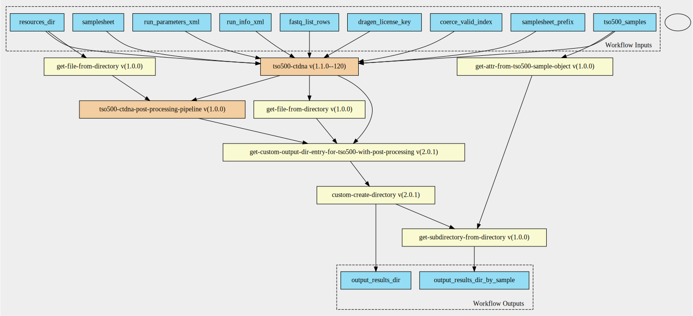

tso500-ctdna-with-post-processing-pipeline 1.1.0--1.0.0 workflow
================================================================

## Table of Contents
  
- [Overview](#tso500-ctdna-with-post-processing-pipeline-v110--100-overview)  
- [Visual](#visual-workflow-overview)  
- [Links](#related-links)  
- [Inputs](#tso500-ctdna-with-post-processing-pipeline-v110--100-inputs)  
- [Steps](#tso500-ctdna-with-post-processing-pipeline-v110--100-steps)  
- [Outputs](#tso500-ctdna-with-post-processing-pipeline-v110--100-outputs)  
- [ICA](#ica)  


## tso500-ctdna-with-post-processing-pipeline v(1.1.0--1.0.0) Overview


  
> ID: tso500-ctdna-with-post-processing-pipeline--1.1.0--1.0.0  
> md5sum: acf845c12be68021133f05444afbe80a

### tso500-ctdna-with-post-processing-pipeline v(1.1.0--1.0.0) documentation
  
Runs the tso500-ctdna pipeline then runs the post-processing pipeline over each sample
Only intermediate step is collecting the tso500 bed file from the resources directory

### Categories
  
- tso500  


## Visual Workflow Overview
  
[](https://github.com/umccr/cwl-ica/raw/main/.github/catalogue/images/workflows/tso500-ctdna-with-post-processing-pipeline/1.1.0--1.0.0/tso500-ctdna-with-post-processing-pipeline__1.1.0--1.0.0.svg)
## Related Links
  
- [CWL File Path](../../../../../../workflows/tso500-ctdna-with-post-processing-pipeline/1.1.0--1.0.0/tso500-ctdna-with-post-processing-pipeline__1.1.0--1.0.0.cwl)  


### Uses
  
- [custom-create-directory 2.0.1](../../../tools/custom-create-directory/2.0.1/custom-create-directory__2.0.1.md)  
- [get-custom-output-dir-entry-for-tso500-with-post-processing 2.0.1](../../../expressions/get-custom-output-dir-entry-for-tso500-with-post-processing/2.0.1/get-custom-output-dir-entry-for-tso500-with-post-processing__2.0.1.md)  
- [get-file-from-directory 1.0.0 :construction:](../../../expressions/get-file-from-directory/1.0.0/get-file-from-directory__1.0.0.md)  
- [get-attr-from-tso500-sample-object 1.0.0 :construction:](../../../expressions/get-attr-from-tso500-sample-object/1.0.0/get-attr-from-tso500-sample-object__1.0.0.md)  
- [get-subdirectory-from-directory 1.0.0 :construction:](../../../expressions/get-subdirectory-from-directory/1.0.0/get-subdirectory-from-directory__1.0.0.md)  
- [get-file-from-directory 1.0.0 :construction:](../../../expressions/get-file-from-directory/1.0.0/get-file-from-directory__1.0.0.md)  
- [tso500-ctdna-post-processing-pipeline 1.0.0](../../tso500-ctdna-post-processing-pipeline/1.0.0/tso500-ctdna-post-processing-pipeline__1.0.0.md)  
- [tso500-ctdna 1.1.0--120](../../tso500-ctdna/1.1.0--120/tso500-ctdna__1.1.0--120.md)  

  


## tso500-ctdna-with-post-processing-pipeline v(1.1.0--1.0.0) Inputs

### dragen license key


  
> ID: dragen_license_key
  
**Optional:** `True`  
**Type:** `File`  
**Docs:**  
File containing the dragen license


### fastq list rows


  
> ID: fastq_list_rows
  
**Optional:** `False`  
**Type:** `fastq-list-row[]`  
**Docs:**  
A list of fastq list rows where each element has the following attributes
* rgid  # Not used
* rgsm
* rglb  # Not used
* read_1
* read_2


### resources dir


  
> ID: resources_dir
  
**Optional:** `False`  
**Type:** `Directory`  
**Docs:**  
The directory of resources


### run info xml


  
> ID: run_info_xml
  
**Optional:** `False`  
**Type:** `File`  
**Docs:**  
The run info xml file found inside the run folder


### run parameters xml


  
> ID: run_parameters_xml
  
**Optional:** `False`  
**Type:** `File`  
**Docs:**  
The run parameters xml file found inside the run folder


### sample sheet


  
> ID: samplesheet
  
**Optional:** `False`  
**Type:** `File`  
**Docs:**  
The sample sheet file, expects a V2 samplesheet.
Even though we don't demultiplex, we still need the information on Sample_Type and Pair_ID to determine which
workflow (DNA / RNA) to run through, we gather this through the tso500_samples input schema and then append to the
samplesheet. Please make sure that the sample_id in the tso500 sample schema match the Sample_ID in the
"<samplesheet_prefix>_Data" column.


### samplesheet prefix


  
> ID: samplesheet_prefix
  
**Optional:** `True`  
**Type:** `string`  
**Docs:**  
Points to the TSO500 section of the samplesheet.  If you are using a samplesheet from BCLConvert,
please set this to "BCLConvert"


### tso500 samples


  
> ID: tso500_samples
  
**Optional:** `False`  
**Type:** `tso500-sample[]`  
**Docs:**  
A list of tso500 samples each element has the following attributes:
* sample_id
* sample_type
* pair_id

  


## tso500-ctdna-with-post-processing-pipeline v(1.1.0--1.0.0) Steps

### create output directory


  
> ID: tso500-ctdna-with-post-processing-pipeline--1.1.0--1.0.0/create_final_output_directory
  
**Step Type:** tool  
**Docs:**
  
Create the output directory containing all the files listed in the previous step.

#### Links
  
[CWL File Path](../../../../../../tools/custom-create-directory/2.0.1/custom-create-directory__2.0.1.cwl)  
[CWL File Help Page](../../../tools/custom-create-directory/2.0.1/custom-create-directory__2.0.1.md)  


### create output directory


  
> ID: tso500-ctdna-with-post-processing-pipeline--1.1.0--1.0.0/get_final_directory_output_for_tso500_pipeline
  
**Step Type:** expression  
**Docs:**
  
Create the output directory containing all the files and directories listed in the previous step.

#### Links
  
[CWL File Path](../../../../../../expressions/get-custom-output-dir-entry-for-tso500-with-post-processing/2.0.1/get-custom-output-dir-entry-for-tso500-with-post-processing__2.0.1.cwl)  
[CWL File Help Page](../../../expressions/get-custom-output-dir-entry-for-tso500-with-post-processing/2.0.1/get-custom-output-dir-entry-for-tso500-with-post-processing__2.0.1.md)  


### get intermediate samplesheet from validation step


  
> ID: tso500-ctdna-with-post-processing-pipeline--1.1.0--1.0.0/get_intermediate_samplesheet_from_validation_step
  
**Step Type:** expression  
**Docs:**
  
Get the intermediate samplesheet from the validation step.
Returns a V1 samplesheet

#### Links
  
[CWL File Path](../../../../../../expressions/get-file-from-directory/1.0.0/get-file-from-directory__1.0.0.cwl)  
[CWL File Help Page :construction:](../../../expressions/get-file-from-directory/1.0.0/get-file-from-directory__1.0.0.md)  


### get sample ids from tso500 sample objects


  
> ID: tso500-ctdna-with-post-processing-pipeline--1.1.0--1.0.0/get_sample_ids_from_tso500_sample_object
  
**Step Type:** expression  
**Docs:**
  
Generate a list of sample ids from the tso500 sample objects

#### Links
  
[CWL File Path](../../../../../../expressions/get-attr-from-tso500-sample-object/1.0.0/get-attr-from-tso500-sample-object__1.0.0.cwl)  
[CWL File Help Page :construction:](../../../expressions/get-attr-from-tso500-sample-object/1.0.0/get-attr-from-tso500-sample-object__1.0.0.md)  


### sample output directory


  
> ID: tso500-ctdna-with-post-processing-pipeline--1.1.0--1.0.0/get_sample_output_directory
  
**Step Type:** expression  
**Docs:**
  
The sample output directory containing all of the samples post-processing files

#### Links
  
[CWL File Path](../../../../../../expressions/get-subdirectory-from-directory/1.0.0/get-subdirectory-from-directory__1.0.0.cwl)  
[CWL File Help Page :construction:](../../../expressions/get-subdirectory-from-directory/1.0.0/get-subdirectory-from-directory__1.0.0.md)  


### get tso bed file from resources dir


  
> ID: tso500-ctdna-with-post-processing-pipeline--1.1.0--1.0.0/get_tso_manifest_bed_from_resources_dir
  
**Step Type:** expression  
**Docs:**
  
Given the resources directory collect the following file:
  * TST500C_manifest.bed

#### Links
  
[CWL File Path](../../../../../../expressions/get-file-from-directory/1.0.0/get-file-from-directory__1.0.0.cwl)  
[CWL File Help Page :construction:](../../../expressions/get-file-from-directory/1.0.0/get-file-from-directory__1.0.0.md)  


### run tso ctdna post processing workflow step


  
> ID: tso500-ctdna-with-post-processing-pipeline--1.1.0--1.0.0/run_tso_ctdna_post_processing_workflow_step
  
**Step Type:** workflow  
**Docs:**
  
Run the very customised ctdna post processing workflow step for each sample

#### Links
  
[CWL File Path](../../../../../../workflows/tso500-ctdna-post-processing-pipeline/1.0.0/tso500-ctdna-post-processing-pipeline__1.0.0.cwl)  
[CWL File Help Page](../../tso500-ctdna-post-processing-pipeline/1.0.0/tso500-ctdna-post-processing-pipeline__1.0.0.md)
#### Subworkflow overview
  
[](https://github.com/umccr/cwl-ica/raw/main/.github/catalogue/images/workflows/tso500-ctdna-post-processing-pipeline/1.0.0/tso500-ctdna-post-processing-pipeline__1.0.0.svg)  


### run tso ctdna workflow step


  
> ID: tso500-ctdna-with-post-processing-pipeline--1.1.0--1.0.0/run_tso_ctdna_workflow_step
  
**Step Type:** workflow  
**Docs:**
  
Run the CWL version of the tso500 ctDNA WDL / ISL workflow

#### Links
  
[CWL File Path](../../../../../../workflows/tso500-ctdna/1.1.0--120/tso500-ctdna__1.1.0--120.cwl)  
[CWL File Help Page](../../tso500-ctdna/1.1.0--120/tso500-ctdna__1.1.0--120.md)
#### Subworkflow overview
  
[](https://github.com/umccr/cwl-ica/raw/main/.github/catalogue/images/workflows/tso500-ctdna/1.1.0--120/tso500-ctdna__1.1.0--120.svg)  


## tso500-ctdna-with-post-processing-pipeline v(1.1.0--1.0.0) Outputs

### output results dir


  
> ID: tso500-ctdna-with-post-processing-pipeline--1.1.0--1.0.0/output_results_dir  

  
**Optional:** `False`  
**Output Type:** `Directory`  
**Docs:**  
The output directory
  


### output results dir by sample


  
> ID: tso500-ctdna-with-post-processing-pipeline--1.1.0--1.0.0/output_results_dir_by_sample  

  
**Optional:** `False`  
**Output Type:** `Directory[]`  
**Docs:**  
The sample subdirectory of the results
  

  


## ICA

### ToC
  
- [development_workflows](#project-development_workflows)  
- [production_workflows](#project-production_workflows)  
- [collab-illumina-dev_workflows](#project-collab-illumina-dev_workflows)  


### Project: development_workflows


> wfl id: wfl.b0be3d1bbd8140bbaa64038f0eb8f7c2  

  
**workflow name:** tso500-ctdna-with-post-processing-pipeline_dev-wf  
**wfl version name:** 1.1.0--1.0.0  


### Project: production_workflows


> wfl id: wfl.230846758ccf42e3831283ab0e45af0a  

  
**workflow name:** tso500-ctdna-with-post-processing-pipeline_prod-wf  
**wfl version name:** 1.1.0--1.0.0--b8f38b3  


### Project: collab-illumina-dev_workflows


> wfl id: wfl.8660595a483040cea0bb175989dd97b1  

  
**workflow name:** tso500-ctdna-with-post-processing-pipeline_clb-ilmn-dev_wf  
**wfl version name:** 1.1.0--1.0.0  


#### Run Instances

##### ToC
  
- [Run wfr.d92a2d28bbfe46fe878f6513fdb06723](#run-wfrd92a2d28bbfe46fe878f6513fdb06723)  
- [Run wfr.c419c549d0c349538ba811f65c8ed684](#run-wfrc419c549d0c349538ba811f65c8ed684)  


##### Run wfr.d92a2d28bbfe46fe878f6513fdb06723


  
> Run Name: tso500-ctdna-full-start-end-workflow-test  

  
**Start Time:** 2021-08-18 21:38:31 UTC  
**Duration:** 2021-08-19 05:40:56 UTC  
**End Time:** 0 days 08:02:24  


###### Reproduce Run


```bash

# Run the submission template to create the workflow input json and launch script            
cwl-ica copy-workflow-submission-template --ica-workflow-run-instance-id wfr.d92a2d28bbfe46fe878f6513fdb06723

# Edit the input json file (optional)
# vim wfr.d92a2d28bbfe46fe878f6513fdb06723.template.json 

# Run the launch script
bash wfr.d92a2d28bbfe46fe878f6513fdb06723.launch.sh
                                    
```  


###### Run Inputs


```
{
    "dragen_license_key": {
        "class": "File",
        "location": "gds://collab-illumina-dev/dragen-license/cttso/license_umccr.txt"
    },
    "fastq_list_rows": [
        {
            "lane": 1,
            "read_1": {
                "class": "File",
                "location": "gds://collab-yinan/test_data/run/200212_A00807_0128_AH5CWWDSXY/FASTQ/Seraseq_Comp_Mut_Mix_AF1_DNA_rep1/Seraseq_Comp_Mut_Mix_AF1_DNA_rep1_S1_L001_R1_001.fastq.gz"
            },
            "read_2": {
                "class": "File",
                "location": "gds://collab-yinan/test_data/run/200212_A00807_0128_AH5CWWDSXY/FASTQ/Seraseq_Comp_Mut_Mix_AF1_DNA_rep1/Seraseq_Comp_Mut_Mix_AF1_DNA_rep1_S1_L001_R2_001.fastq.gz"
            },
            "rgid": "Seraseq_Comp_Mut_Mix_AF1_DNA_rep1.1.AGCGATAG.TTATTCGT",
            "rglb": "UnknownLibrary",
            "rgsm": "Seraseq_Comp_Mut_Mix_AF1_DNA_rep1"
        }
    ],
    "resources_dir": {
        "class": "Directory",
        "location": "gds://collab-illumina-dev/reference-data/dragen_tso_ctdna/ruo-1.1.0.3/"
    },
    "run_info_xml": {
        "class": "File",
        "location": "gds://collab-yinan/test_data/run/200212_A00807_0128_AH5CWWDSXY/RunInfo.xml"
    },
    "run_parameters_xml": {
        "class": "File",
        "location": "gds://collab-yinan/test_data/run/200212_A00807_0128_AH5CWWDSXY/RunParameters.xml"
    },
    "samplesheet": {
        "class": "File",
        "location": "gds://collab-yinan/test_data/run/200212_A00807_0128_AH5CWWDSXY/SampleSheet.csv"
    },
    "samplesheet_prefix": "BCLConvert",
    "tso500_samples": [
        {
            "pair_id": "Seraseq_Comp_Mut_Mix_AF1_DNA_rep1",
            "sample_id": "Seraseq_Comp_Mut_Mix_AF1_DNA_rep1",
            "sample_name": "Seraseq_Comp_Mut_Mix_AF1_DNA_rep1",
            "sample_type": "DNA"
        }
    ]
}
```  


###### Run Engine Parameters


```
{
    "workDirectory": "gds://wfr.d92a2d28bbfe46fe878f6513fdb06723/tso500-ctdna-full-start-end-workflow-test",
    "outputDirectory": "gds://wfr.d92a2d28bbfe46fe878f6513fdb06723/tso500-ctdna-full-start-end-workflow-test/outputs",
    "tmpOutputDirectory": "gds://wfr.d92a2d28bbfe46fe878f6513fdb06723/tso500-ctdna-full-start-end-workflow-test/steps",
    "logDirectory": "gds://wfr.d92a2d28bbfe46fe878f6513fdb06723/tso500-ctdna-full-start-end-workflow-test/logs",
    "maxScatter": 8,
    "outputSetting": "move",
    "copyOutputInstanceType": "StandardHiCpu",
    "copyOutputInstanceSize": "Medium",
    "defaultInputMode": "'Download'",
    "inputModeOverrides": {},
    "tesUseInputManifest": "'auto'",
    "cwltool": "3.0.20201203173111",
    "engine": "1.17.0-202107161017-stratus-master"
}
```  


###### Run Outputs


```
{
    "output_results_dir": {
        "location": "gds://wfr.d92a2d28bbfe46fe878f6513fdb06723/tso500-ctdna-full-start-end-workflow-test/outputs/Results",
        "basename": "Results",
        "nameroot": "",
        "nameext": "",
        "class": "Directory",
        "size": null
    },
    "output_results_dir_by_sample": [
        {
            "class": "Directory",
            "location": "gds://wfr.d92a2d28bbfe46fe878f6513fdb06723/tso500-ctdna-full-start-end-workflow-test/outputs/Results/Seraseq_Comp_Mut_Mix_AF1_DNA_rep1",
            "basename": "Seraseq_Comp_Mut_Mix_AF1_DNA_rep1",
            "listing": [
                {
                    "class": "File",
                    "location": "gds://wfr.d92a2d28bbfe46fe878f6513fdb06723/tso500-ctdna-full-start-end-workflow-test/outputs/Results/Seraseq_Comp_Mut_Mix_AF1_DNA_rep1/Seraseq_Comp_Mut_Mix_AF1_DNA_rep1.AlignCollapseFusionCaller_metrics.json.gz",
                    "basename": "Seraseq_Comp_Mut_Mix_AF1_DNA_rep1.AlignCollapseFusionCaller_metrics.json.gz",
                    "size": 2965,
                    "nameroot": "Seraseq_Comp_Mut_Mix_AF1_DNA_rep1.AlignCollapseFusionCaller_metrics.json",
                    "nameext": ".gz"
                },
                {
                    "class": "File",
                    "location": "gds://wfr.d92a2d28bbfe46fe878f6513fdb06723/tso500-ctdna-full-start-end-workflow-test/outputs/Results/Seraseq_Comp_Mut_Mix_AF1_DNA_rep1/Seraseq_Comp_Mut_Mix_AF1_DNA_rep1.TargetRegionCoverage.json.gz",
                    "basename": "Seraseq_Comp_Mut_Mix_AF1_DNA_rep1.TargetRegionCoverage.json.gz",
                    "size": 325,
                    "nameroot": "Seraseq_Comp_Mut_Mix_AF1_DNA_rep1.TargetRegionCoverage.json",
                    "nameext": ".gz"
                },
                {
                    "class": "File",
                    "location": "gds://wfr.d92a2d28bbfe46fe878f6513fdb06723/tso500-ctdna-full-start-end-workflow-test/outputs/Results/Seraseq_Comp_Mut_Mix_AF1_DNA_rep1/Seraseq_Comp_Mut_Mix_AF1_DNA_rep1.bam",
                    "basename": "Seraseq_Comp_Mut_Mix_AF1_DNA_rep1.bam",
                    "size": 4075258556,
                    "nameroot": "Seraseq_Comp_Mut_Mix_AF1_DNA_rep1",
                    "nameext": ".bam"
                },
                {
                    "class": "File",
                    "location": "gds://wfr.d92a2d28bbfe46fe878f6513fdb06723/tso500-ctdna-full-start-end-workflow-test/outputs/Results/Seraseq_Comp_Mut_Mix_AF1_DNA_rep1/Seraseq_Comp_Mut_Mix_AF1_DNA_rep1.bam.bai",
                    "basename": "Seraseq_Comp_Mut_Mix_AF1_DNA_rep1.bam.bai",
                    "size": 6305904,
                    "nameroot": "Seraseq_Comp_Mut_Mix_AF1_DNA_rep1.bam",
                    "nameext": ".bai"
                },
                {
                    "class": "File",
                    "location": "gds://wfr.d92a2d28bbfe46fe878f6513fdb06723/tso500-ctdna-full-start-end-workflow-test/outputs/Results/Seraseq_Comp_Mut_Mix_AF1_DNA_rep1/Seraseq_Comp_Mut_Mix_AF1_DNA_rep1.bam.md5sum",
                    "basename": "Seraseq_Comp_Mut_Mix_AF1_DNA_rep1.bam.md5sum",
                    "size": 32,
                    "nameroot": "Seraseq_Comp_Mut_Mix_AF1_DNA_rep1.bam",
                    "nameext": ".md5sum"
                },
                {
                    "class": "File",
                    "location": "gds://wfr.d92a2d28bbfe46fe878f6513fdb06723/tso500-ctdna-full-start-end-workflow-test/outputs/Results/Seraseq_Comp_Mut_Mix_AF1_DNA_rep1/Seraseq_Comp_Mut_Mix_AF1_DNA_rep1.cleaned.stitched.bam",
                    "basename": "Seraseq_Comp_Mut_Mix_AF1_DNA_rep1.cleaned.stitched.bam",
                    "size": 1966150721,
                    "nameroot": "Seraseq_Comp_Mut_Mix_AF1_DNA_rep1.cleaned.stitched",
                    "nameext": ".bam"
                },
                {
                    "class": "File",
                    "location": "gds://wfr.d92a2d28bbfe46fe878f6513fdb06723/tso500-ctdna-full-start-end-workflow-test/outputs/Results/Seraseq_Comp_Mut_Mix_AF1_DNA_rep1/Seraseq_Comp_Mut_Mix_AF1_DNA_rep1.cleaned.stitched.bam.bai",
                    "basename": "Seraseq_Comp_Mut_Mix_AF1_DNA_rep1.cleaned.stitched.bam.bai",
                    "size": 3448192,
                    "nameroot": "Seraseq_Comp_Mut_Mix_AF1_DNA_rep1.cleaned.stitched.bam",
                    "nameext": ".bai"
                },
                {
                    "class": "File",
                    "location": "gds://wfr.d92a2d28bbfe46fe878f6513fdb06723/tso500-ctdna-full-start-end-workflow-test/outputs/Results/Seraseq_Comp_Mut_Mix_AF1_DNA_rep1/Seraseq_Comp_Mut_Mix_AF1_DNA_rep1.fragment_length_hist.json.gz",
                    "basename": "Seraseq_Comp_Mut_Mix_AF1_DNA_rep1.fragment_length_hist.json.gz",
                    "size": 3960,
                    "nameroot": "Seraseq_Comp_Mut_Mix_AF1_DNA_rep1.fragment_length_hist.json",
                    "nameext": ".gz"
                },
                {
                    "class": "File",
                    "location": "gds://wfr.d92a2d28bbfe46fe878f6513fdb06723/tso500-ctdna-full-start-end-workflow-test/outputs/Results/Seraseq_Comp_Mut_Mix_AF1_DNA_rep1/Seraseq_Comp_Mut_Mix_AF1_DNA_rep1.msi.json.gz",
                    "basename": "Seraseq_Comp_Mut_Mix_AF1_DNA_rep1.msi.json.gz",
                    "size": 548,
                    "nameroot": "Seraseq_Comp_Mut_Mix_AF1_DNA_rep1.msi.json",
                    "nameext": ".gz"
                },
                {
                    "class": "File",
                    "location": "gds://wfr.d92a2d28bbfe46fe878f6513fdb06723/tso500-ctdna-full-start-end-workflow-test/outputs/Results/Seraseq_Comp_Mut_Mix_AF1_DNA_rep1/Seraseq_Comp_Mut_Mix_AF1_DNA_rep1.tmb.json.gz",
                    "basename": "Seraseq_Comp_Mut_Mix_AF1_DNA_rep1.tmb.json.gz",
                    "size": 487,
                    "nameroot": "Seraseq_Comp_Mut_Mix_AF1_DNA_rep1.tmb.json",
                    "nameext": ".gz"
                },
                {
                    "class": "File",
                    "location": "gds://wfr.d92a2d28bbfe46fe878f6513fdb06723/tso500-ctdna-full-start-end-workflow-test/outputs/Results/Seraseq_Comp_Mut_Mix_AF1_DNA_rep1/Seraseq_Comp_Mut_Mix_AF1_DNA_rep1_CopyNumberVariants.vcf.gz",
                    "basename": "Seraseq_Comp_Mut_Mix_AF1_DNA_rep1_CopyNumberVariants.vcf.gz",
                    "size": 2073,
                    "nameroot": "Seraseq_Comp_Mut_Mix_AF1_DNA_rep1_CopyNumberVariants.vcf",
                    "nameext": ".gz"
                },
                {
                    "class": "File",
                    "location": "gds://wfr.d92a2d28bbfe46fe878f6513fdb06723/tso500-ctdna-full-start-end-workflow-test/outputs/Results/Seraseq_Comp_Mut_Mix_AF1_DNA_rep1/Seraseq_Comp_Mut_Mix_AF1_DNA_rep1_CopyNumberVariants.vcf.gz.tbi",
                    "basename": "Seraseq_Comp_Mut_Mix_AF1_DNA_rep1_CopyNumberVariants.vcf.gz.tbi",
                    "size": 3236,
                    "nameroot": "Seraseq_Comp_Mut_Mix_AF1_DNA_rep1_CopyNumberVariants.vcf.gz",
                    "nameext": ".tbi"
                },
                {
                    "class": "File",
                    "location": "gds://wfr.d92a2d28bbfe46fe878f6513fdb06723/tso500-ctdna-full-start-end-workflow-test/outputs/Results/Seraseq_Comp_Mut_Mix_AF1_DNA_rep1/Seraseq_Comp_Mut_Mix_AF1_DNA_rep1_Failed_Exon_coverage_QC.json.gz",
                    "basename": "Seraseq_Comp_Mut_Mix_AF1_DNA_rep1_Failed_Exon_coverage_QC.json.gz",
                    "size": 1738,
                    "nameroot": "Seraseq_Comp_Mut_Mix_AF1_DNA_rep1_Failed_Exon_coverage_QC.json",
                    "nameext": ".gz"
                },
                {
                    "class": "File",
                    "location": "gds://wfr.d92a2d28bbfe46fe878f6513fdb06723/tso500-ctdna-full-start-end-workflow-test/outputs/Results/Seraseq_Comp_Mut_Mix_AF1_DNA_rep1/Seraseq_Comp_Mut_Mix_AF1_DNA_rep1_Failed_Exon_coverage_QC.txt",
                    "basename": "Seraseq_Comp_Mut_Mix_AF1_DNA_rep1_Failed_Exon_coverage_QC.txt",
                    "size": 4132,
                    "nameroot": "Seraseq_Comp_Mut_Mix_AF1_DNA_rep1_Failed_Exon_coverage_QC",
                    "nameext": ".txt"
                },
                {
                    "class": "File",
                    "location": "gds://wfr.d92a2d28bbfe46fe878f6513fdb06723/tso500-ctdna-full-start-end-workflow-test/outputs/Results/Seraseq_Comp_Mut_Mix_AF1_DNA_rep1/Seraseq_Comp_Mut_Mix_AF1_DNA_rep1_Fusions.json.gz",
                    "basename": "Seraseq_Comp_Mut_Mix_AF1_DNA_rep1_Fusions.json.gz",
                    "size": 839,
                    "nameroot": "Seraseq_Comp_Mut_Mix_AF1_DNA_rep1_Fusions.json",
                    "nameext": ".gz"
                },
                {
                    "class": "File",
                    "location": "gds://wfr.d92a2d28bbfe46fe878f6513fdb06723/tso500-ctdna-full-start-end-workflow-test/outputs/Results/Seraseq_Comp_Mut_Mix_AF1_DNA_rep1/Seraseq_Comp_Mut_Mix_AF1_DNA_rep1_MergedSmallVariants.genome.vcf.gz",
                    "basename": "Seraseq_Comp_Mut_Mix_AF1_DNA_rep1_MergedSmallVariants.genome.vcf.gz",
                    "size": 54886731,
                    "nameroot": "Seraseq_Comp_Mut_Mix_AF1_DNA_rep1_MergedSmallVariants.genome.vcf",
                    "nameext": ".gz"
                },
                {
                    "class": "File",
                    "location": "gds://wfr.d92a2d28bbfe46fe878f6513fdb06723/tso500-ctdna-full-start-end-workflow-test/outputs/Results/Seraseq_Comp_Mut_Mix_AF1_DNA_rep1/Seraseq_Comp_Mut_Mix_AF1_DNA_rep1_MergedSmallVariants.genome.vcf.gz.tbi",
                    "basename": "Seraseq_Comp_Mut_Mix_AF1_DNA_rep1_MergedSmallVariants.genome.vcf.gz.tbi",
                    "size": 40915,
                    "nameroot": "Seraseq_Comp_Mut_Mix_AF1_DNA_rep1_MergedSmallVariants.genome.vcf.gz",
                    "nameext": ".tbi"
                },
                {
                    "class": "File",
                    "location": "gds://wfr.d92a2d28bbfe46fe878f6513fdb06723/tso500-ctdna-full-start-end-workflow-test/outputs/Results/Seraseq_Comp_Mut_Mix_AF1_DNA_rep1/Seraseq_Comp_Mut_Mix_AF1_DNA_rep1_MergedSmallVariants.vcf.gz",
                    "basename": "Seraseq_Comp_Mut_Mix_AF1_DNA_rep1_MergedSmallVariants.vcf.gz",
                    "size": 11212109,
                    "nameroot": "Seraseq_Comp_Mut_Mix_AF1_DNA_rep1_MergedSmallVariants.vcf",
                    "nameext": ".gz"
                },
                {
                    "class": "File",
                    "location": "gds://wfr.d92a2d28bbfe46fe878f6513fdb06723/tso500-ctdna-full-start-end-workflow-test/outputs/Results/Seraseq_Comp_Mut_Mix_AF1_DNA_rep1/Seraseq_Comp_Mut_Mix_AF1_DNA_rep1_MergedSmallVariants.vcf.gz.tbi",
                    "basename": "Seraseq_Comp_Mut_Mix_AF1_DNA_rep1_MergedSmallVariants.vcf.gz.tbi",
                    "size": 34841,
                    "nameroot": "Seraseq_Comp_Mut_Mix_AF1_DNA_rep1_MergedSmallVariants.vcf.gz",
                    "nameext": ".tbi"
                },
                {
                    "class": "File",
                    "location": "gds://wfr.d92a2d28bbfe46fe878f6513fdb06723/tso500-ctdna-full-start-end-workflow-test/outputs/Results/Seraseq_Comp_Mut_Mix_AF1_DNA_rep1/Seraseq_Comp_Mut_Mix_AF1_DNA_rep1_MergedSmallVariantsAnnotated.json.gz",
                    "basename": "Seraseq_Comp_Mut_Mix_AF1_DNA_rep1_MergedSmallVariantsAnnotated.json.gz",
                    "size": 188643208,
                    "nameroot": "Seraseq_Comp_Mut_Mix_AF1_DNA_rep1_MergedSmallVariantsAnnotated.json",
                    "nameext": ".gz"
                },
                {
                    "class": "File",
                    "location": "gds://wfr.d92a2d28bbfe46fe878f6513fdb06723/tso500-ctdna-full-start-end-workflow-test/outputs/Results/Seraseq_Comp_Mut_Mix_AF1_DNA_rep1/Seraseq_Comp_Mut_Mix_AF1_DNA_rep1_MergedSmallVariantsAnnotated.json.gz.jsi",
                    "basename": "Seraseq_Comp_Mut_Mix_AF1_DNA_rep1_MergedSmallVariantsAnnotated.json.gz.jsi",
                    "size": 29699,
                    "nameroot": "Seraseq_Comp_Mut_Mix_AF1_DNA_rep1_MergedSmallVariantsAnnotated.json.gz",
                    "nameext": ".jsi"
                },
                {
                    "class": "File",
                    "location": "gds://wfr.d92a2d28bbfe46fe878f6513fdb06723/tso500-ctdna-full-start-end-workflow-test/outputs/Results/Seraseq_Comp_Mut_Mix_AF1_DNA_rep1/Seraseq_Comp_Mut_Mix_AF1_DNA_rep1_SampleAnalysisResults.json.gz",
                    "basename": "Seraseq_Comp_Mut_Mix_AF1_DNA_rep1_SampleAnalysisResults.json.gz",
                    "size": 116147,
                    "nameroot": "Seraseq_Comp_Mut_Mix_AF1_DNA_rep1_SampleAnalysisResults.json",
                    "nameext": ".gz"
                },
                {
                    "class": "File",
                    "location": "gds://wfr.d92a2d28bbfe46fe878f6513fdb06723/tso500-ctdna-full-start-end-workflow-test/outputs/Results/Seraseq_Comp_Mut_Mix_AF1_DNA_rep1/Seraseq_Comp_Mut_Mix_AF1_DNA_rep1_TMB_Trace.json.gz",
                    "basename": "Seraseq_Comp_Mut_Mix_AF1_DNA_rep1_TMB_Trace.json.gz",
                    "size": 59354,
                    "nameroot": "Seraseq_Comp_Mut_Mix_AF1_DNA_rep1_TMB_Trace.json",
                    "nameext": ".gz"
                },
                {
                    "class": "File",
                    "location": "gds://wfr.d92a2d28bbfe46fe878f6513fdb06723/tso500-ctdna-full-start-end-workflow-test/outputs/Results/Seraseq_Comp_Mut_Mix_AF1_DNA_rep1/evidence.Seraseq_Comp_Mut_Mix_AF1_DNA_rep1.bam",
                    "basename": "evidence.Seraseq_Comp_Mut_Mix_AF1_DNA_rep1.bam",
                    "size": 17937454,
                    "nameroot": "evidence.Seraseq_Comp_Mut_Mix_AF1_DNA_rep1",
                    "nameext": ".bam"
                },
                {
                    "class": "File",
                    "location": "gds://wfr.d92a2d28bbfe46fe878f6513fdb06723/tso500-ctdna-full-start-end-workflow-test/outputs/Results/Seraseq_Comp_Mut_Mix_AF1_DNA_rep1/evidence.Seraseq_Comp_Mut_Mix_AF1_DNA_rep1.bam.bai",
                    "basename": "evidence.Seraseq_Comp_Mut_Mix_AF1_DNA_rep1.bam.bai",
                    "size": 2499784,
                    "nameroot": "evidence.Seraseq_Comp_Mut_Mix_AF1_DNA_rep1.bam",
                    "nameext": ".bai"
                }
            ]
        }
    ],
    "output_dir_gds_session_id": "ssn.5f474e02c1024ea59561bae3870348ad",
    "output_dir_gds_folder_id": "fol.6368939ec873485c640f08d961c57b0b"
}
```  


###### Run Resources Usage
  

  
[](https://github.com/umccr/cwl-ica/raw/main/.github/catalogue/images/runs/workflows/tso500-ctdna-with-post-processing-pipeline/1.1.0--1.0.0/tso500-ctdna-full-start-end-workflow-test__wfr.d92a2d28bbfe46fe878f6513fdb06723.svg)  


##### Run wfr.c419c549d0c349538ba811f65c8ed684


  
> Run Name: tso500-ctdna-full-start-end-workflow-test  

  
**Start Time:** 2021-10-12 21:04:23 UTC  
**Duration:** 2021-10-13 04:52:36 UTC  
**End Time:** 0 days 07:48:12  


###### Reproduce Run


```bash

# Run the submission template to create the workflow input json and launch script            
cwl-ica copy-workflow-submission-template --ica-workflow-run-instance-id wfr.c419c549d0c349538ba811f65c8ed684

# Edit the input json file (optional)
# vim wfr.c419c549d0c349538ba811f65c8ed684.template.json 

# Run the launch script
bash wfr.c419c549d0c349538ba811f65c8ed684.launch.sh
                                    
```  


###### Run Inputs


```
{
    "dragen_license_key": {
        "class": "File",
        "location": "gds://collab-illumina-dev/dragen-license/cttso/license_umccr.txt"
    },
    "fastq_list_rows": [
        {
            "lane": 1,
            "read_1": {
                "class": "File",
                "location": "gds://collab-yinan/test_data/run/200212_A00807_0128_AH5CWWDSXY/FASTQ/Seraseq_Comp_Mut_Mix_AF1_DNA_rep1/Seraseq_Comp_Mut_Mix_AF1_DNA_rep1_S1_L001_R1_001.fastq.gz"
            },
            "read_2": {
                "class": "File",
                "location": "gds://collab-yinan/test_data/run/200212_A00807_0128_AH5CWWDSXY/FASTQ/Seraseq_Comp_Mut_Mix_AF1_DNA_rep1/Seraseq_Comp_Mut_Mix_AF1_DNA_rep1_S1_L001_R2_001.fastq.gz"
            },
            "rgid": "Seraseq_Comp_Mut_Mix_AF1_DNA_rep1.1.AGCGATAG.TTATTCGT",
            "rglb": "UnknownLibrary",
            "rgsm": "Seraseq_Comp_Mut_Mix_AF1_DNA_rep1"
        }
    ],
    "resources_dir": {
        "class": "Directory",
        "location": "gds://collab-illumina-dev/reference-data/dragen_tso_ctdna/ruo-1.1.0.3/"
    },
    "run_info_xml": {
        "class": "File",
        "location": "gds://collab-yinan/test_data/run/200212_A00807_0128_AH5CWWDSXY/RunInfo.xml"
    },
    "run_parameters_xml": {
        "class": "File",
        "location": "gds://collab-yinan/test_data/run/200212_A00807_0128_AH5CWWDSXY/RunParameters.xml"
    },
    "samplesheet": {
        "class": "File",
        "location": "gds://collab-yinan/test_data/run/200212_A00807_0128_AH5CWWDSXY/SampleSheet.csv"
    },
    "samplesheet_prefix": "BCLConvert",
    "tso500_samples": [
        {
            "pair_id": "Seraseq_Comp_Mut_Mix_AF1_DNA_rep1",
            "sample_id": "Seraseq_Comp_Mut_Mix_AF1_DNA_rep1",
            "sample_name": "Seraseq_Comp_Mut_Mix_AF1_DNA_rep1",
            "sample_type": "DNA"
        }
    ]
}
```  


###### Run Engine Parameters


```
{
    "workDirectory": "gds://wfr.c419c549d0c349538ba811f65c8ed684/tso500-ctdna-full-start-end-workflow-test",
    "outputDirectory": "gds://wfr.c419c549d0c349538ba811f65c8ed684/tso500-ctdna-full-start-end-workflow-test/outputs",
    "tmpOutputDirectory": "gds://wfr.c419c549d0c349538ba811f65c8ed684/tso500-ctdna-full-start-end-workflow-test/steps",
    "logDirectory": "gds://wfr.c419c549d0c349538ba811f65c8ed684/tso500-ctdna-full-start-end-workflow-test/logs",
    "maxScatter": 8,
    "outputSetting": "move",
    "copyOutputInstanceType": "StandardHiCpu",
    "copyOutputInstanceSize": "Medium",
    "defaultInputMode": "'Download'",
    "inputModeOverrides": {},
    "tesUseInputManifest": "'auto'",
    "cwltool": "3.0.20201203173111",
    "engine": "1.18.0-202109141250-stratus-master"
}
```  


###### Run Outputs


```
{
    "output_results_dir": {
        "location": "gds://wfr.c419c549d0c349538ba811f65c8ed684/tso500-ctdna-full-start-end-workflow-test/outputs/Results",
        "basename": "Results",
        "nameroot": "",
        "nameext": "",
        "class": "Directory",
        "size": null
    },
    "output_results_dir_by_sample": [
        {
            "class": "Directory",
            "location": "gds://wfr.c419c549d0c349538ba811f65c8ed684/tso500-ctdna-full-start-end-workflow-test/outputs/Results/Seraseq_Comp_Mut_Mix_AF1_DNA_rep1",
            "basename": "Seraseq_Comp_Mut_Mix_AF1_DNA_rep1",
            "listing": [
                {
                    "class": "File",
                    "location": "gds://wfr.c419c549d0c349538ba811f65c8ed684/tso500-ctdna-full-start-end-workflow-test/outputs/Results/Seraseq_Comp_Mut_Mix_AF1_DNA_rep1/Seraseq_Comp_Mut_Mix_AF1_DNA_rep1.AlignCollapseFusionCaller_metrics.json.gz",
                    "basename": "Seraseq_Comp_Mut_Mix_AF1_DNA_rep1.AlignCollapseFusionCaller_metrics.json.gz",
                    "size": 2962,
                    "nameroot": "Seraseq_Comp_Mut_Mix_AF1_DNA_rep1.AlignCollapseFusionCaller_metrics.json",
                    "nameext": ".gz"
                },
                {
                    "class": "File",
                    "location": "gds://wfr.c419c549d0c349538ba811f65c8ed684/tso500-ctdna-full-start-end-workflow-test/outputs/Results/Seraseq_Comp_Mut_Mix_AF1_DNA_rep1/Seraseq_Comp_Mut_Mix_AF1_DNA_rep1.TargetRegionCoverage.json.gz",
                    "basename": "Seraseq_Comp_Mut_Mix_AF1_DNA_rep1.TargetRegionCoverage.json.gz",
                    "size": 325,
                    "nameroot": "Seraseq_Comp_Mut_Mix_AF1_DNA_rep1.TargetRegionCoverage.json",
                    "nameext": ".gz"
                },
                {
                    "class": "File",
                    "location": "gds://wfr.c419c549d0c349538ba811f65c8ed684/tso500-ctdna-full-start-end-workflow-test/outputs/Results/Seraseq_Comp_Mut_Mix_AF1_DNA_rep1/Seraseq_Comp_Mut_Mix_AF1_DNA_rep1.bam",
                    "basename": "Seraseq_Comp_Mut_Mix_AF1_DNA_rep1.bam",
                    "size": 4075258553,
                    "nameroot": "Seraseq_Comp_Mut_Mix_AF1_DNA_rep1",
                    "nameext": ".bam"
                },
                {
                    "class": "File",
                    "location": "gds://wfr.c419c549d0c349538ba811f65c8ed684/tso500-ctdna-full-start-end-workflow-test/outputs/Results/Seraseq_Comp_Mut_Mix_AF1_DNA_rep1/Seraseq_Comp_Mut_Mix_AF1_DNA_rep1.bam.bai",
                    "basename": "Seraseq_Comp_Mut_Mix_AF1_DNA_rep1.bam.bai",
                    "size": 6305904,
                    "nameroot": "Seraseq_Comp_Mut_Mix_AF1_DNA_rep1.bam",
                    "nameext": ".bai"
                },
                {
                    "class": "File",
                    "location": "gds://wfr.c419c549d0c349538ba811f65c8ed684/tso500-ctdna-full-start-end-workflow-test/outputs/Results/Seraseq_Comp_Mut_Mix_AF1_DNA_rep1/Seraseq_Comp_Mut_Mix_AF1_DNA_rep1.bam.md5sum",
                    "basename": "Seraseq_Comp_Mut_Mix_AF1_DNA_rep1.bam.md5sum",
                    "size": 32,
                    "nameroot": "Seraseq_Comp_Mut_Mix_AF1_DNA_rep1.bam",
                    "nameext": ".md5sum"
                },
                {
                    "class": "File",
                    "location": "gds://wfr.c419c549d0c349538ba811f65c8ed684/tso500-ctdna-full-start-end-workflow-test/outputs/Results/Seraseq_Comp_Mut_Mix_AF1_DNA_rep1/Seraseq_Comp_Mut_Mix_AF1_DNA_rep1.cleaned.stitched.bam",
                    "basename": "Seraseq_Comp_Mut_Mix_AF1_DNA_rep1.cleaned.stitched.bam",
                    "size": 1966150722,
                    "nameroot": "Seraseq_Comp_Mut_Mix_AF1_DNA_rep1.cleaned.stitched",
                    "nameext": ".bam"
                },
                {
                    "class": "File",
                    "location": "gds://wfr.c419c549d0c349538ba811f65c8ed684/tso500-ctdna-full-start-end-workflow-test/outputs/Results/Seraseq_Comp_Mut_Mix_AF1_DNA_rep1/Seraseq_Comp_Mut_Mix_AF1_DNA_rep1.cleaned.stitched.bam.bai",
                    "basename": "Seraseq_Comp_Mut_Mix_AF1_DNA_rep1.cleaned.stitched.bam.bai",
                    "size": 3448192,
                    "nameroot": "Seraseq_Comp_Mut_Mix_AF1_DNA_rep1.cleaned.stitched.bam",
                    "nameext": ".bai"
                },
                {
                    "class": "File",
                    "location": "gds://wfr.c419c549d0c349538ba811f65c8ed684/tso500-ctdna-full-start-end-workflow-test/outputs/Results/Seraseq_Comp_Mut_Mix_AF1_DNA_rep1/Seraseq_Comp_Mut_Mix_AF1_DNA_rep1.fragment_length_hist.json.gz",
                    "basename": "Seraseq_Comp_Mut_Mix_AF1_DNA_rep1.fragment_length_hist.json.gz",
                    "size": 3960,
                    "nameroot": "Seraseq_Comp_Mut_Mix_AF1_DNA_rep1.fragment_length_hist.json",
                    "nameext": ".gz"
                },
                {
                    "class": "File",
                    "location": "gds://wfr.c419c549d0c349538ba811f65c8ed684/tso500-ctdna-full-start-end-workflow-test/outputs/Results/Seraseq_Comp_Mut_Mix_AF1_DNA_rep1/Seraseq_Comp_Mut_Mix_AF1_DNA_rep1.msi.json.gz",
                    "basename": "Seraseq_Comp_Mut_Mix_AF1_DNA_rep1.msi.json.gz",
                    "size": 548,
                    "nameroot": "Seraseq_Comp_Mut_Mix_AF1_DNA_rep1.msi.json",
                    "nameext": ".gz"
                },
                {
                    "class": "File",
                    "location": "gds://wfr.c419c549d0c349538ba811f65c8ed684/tso500-ctdna-full-start-end-workflow-test/outputs/Results/Seraseq_Comp_Mut_Mix_AF1_DNA_rep1/Seraseq_Comp_Mut_Mix_AF1_DNA_rep1.tmb.json.gz",
                    "basename": "Seraseq_Comp_Mut_Mix_AF1_DNA_rep1.tmb.json.gz",
                    "size": 487,
                    "nameroot": "Seraseq_Comp_Mut_Mix_AF1_DNA_rep1.tmb.json",
                    "nameext": ".gz"
                },
                {
                    "class": "File",
                    "location": "gds://wfr.c419c549d0c349538ba811f65c8ed684/tso500-ctdna-full-start-end-workflow-test/outputs/Results/Seraseq_Comp_Mut_Mix_AF1_DNA_rep1/Seraseq_Comp_Mut_Mix_AF1_DNA_rep1_CopyNumberVariants.vcf.gz",
                    "basename": "Seraseq_Comp_Mut_Mix_AF1_DNA_rep1_CopyNumberVariants.vcf.gz",
                    "size": 2073,
                    "nameroot": "Seraseq_Comp_Mut_Mix_AF1_DNA_rep1_CopyNumberVariants.vcf",
                    "nameext": ".gz"
                },
                {
                    "class": "File",
                    "location": "gds://wfr.c419c549d0c349538ba811f65c8ed684/tso500-ctdna-full-start-end-workflow-test/outputs/Results/Seraseq_Comp_Mut_Mix_AF1_DNA_rep1/Seraseq_Comp_Mut_Mix_AF1_DNA_rep1_CopyNumberVariants.vcf.gz.tbi",
                    "basename": "Seraseq_Comp_Mut_Mix_AF1_DNA_rep1_CopyNumberVariants.vcf.gz.tbi",
                    "size": 3236,
                    "nameroot": "Seraseq_Comp_Mut_Mix_AF1_DNA_rep1_CopyNumberVariants.vcf.gz",
                    "nameext": ".tbi"
                },
                {
                    "class": "File",
                    "location": "gds://wfr.c419c549d0c349538ba811f65c8ed684/tso500-ctdna-full-start-end-workflow-test/outputs/Results/Seraseq_Comp_Mut_Mix_AF1_DNA_rep1/Seraseq_Comp_Mut_Mix_AF1_DNA_rep1_Failed_Exon_coverage_QC.json.gz",
                    "basename": "Seraseq_Comp_Mut_Mix_AF1_DNA_rep1_Failed_Exon_coverage_QC.json.gz",
                    "size": 1738,
                    "nameroot": "Seraseq_Comp_Mut_Mix_AF1_DNA_rep1_Failed_Exon_coverage_QC.json",
                    "nameext": ".gz"
                },
                {
                    "class": "File",
                    "location": "gds://wfr.c419c549d0c349538ba811f65c8ed684/tso500-ctdna-full-start-end-workflow-test/outputs/Results/Seraseq_Comp_Mut_Mix_AF1_DNA_rep1/Seraseq_Comp_Mut_Mix_AF1_DNA_rep1_Failed_Exon_coverage_QC.txt",
                    "basename": "Seraseq_Comp_Mut_Mix_AF1_DNA_rep1_Failed_Exon_coverage_QC.txt",
                    "size": 4132,
                    "nameroot": "Seraseq_Comp_Mut_Mix_AF1_DNA_rep1_Failed_Exon_coverage_QC",
                    "nameext": ".txt"
                },
                {
                    "class": "File",
                    "location": "gds://wfr.c419c549d0c349538ba811f65c8ed684/tso500-ctdna-full-start-end-workflow-test/outputs/Results/Seraseq_Comp_Mut_Mix_AF1_DNA_rep1/Seraseq_Comp_Mut_Mix_AF1_DNA_rep1_Fusions.csv",
                    "basename": "Seraseq_Comp_Mut_Mix_AF1_DNA_rep1_Fusions.csv",
                    "size": 2466,
                    "nameroot": "Seraseq_Comp_Mut_Mix_AF1_DNA_rep1_Fusions",
                    "nameext": ".csv"
                },
                {
                    "class": "File",
                    "location": "gds://wfr.c419c549d0c349538ba811f65c8ed684/tso500-ctdna-full-start-end-workflow-test/outputs/Results/Seraseq_Comp_Mut_Mix_AF1_DNA_rep1/Seraseq_Comp_Mut_Mix_AF1_DNA_rep1_Fusions.json.gz",
                    "basename": "Seraseq_Comp_Mut_Mix_AF1_DNA_rep1_Fusions.json.gz",
                    "size": 839,
                    "nameroot": "Seraseq_Comp_Mut_Mix_AF1_DNA_rep1_Fusions.json",
                    "nameext": ".gz"
                },
                {
                    "class": "File",
                    "location": "gds://wfr.c419c549d0c349538ba811f65c8ed684/tso500-ctdna-full-start-end-workflow-test/outputs/Results/Seraseq_Comp_Mut_Mix_AF1_DNA_rep1/Seraseq_Comp_Mut_Mix_AF1_DNA_rep1_MergedSmallVariants.genome.vcf.gz",
                    "basename": "Seraseq_Comp_Mut_Mix_AF1_DNA_rep1_MergedSmallVariants.genome.vcf.gz",
                    "size": 54886731,
                    "nameroot": "Seraseq_Comp_Mut_Mix_AF1_DNA_rep1_MergedSmallVariants.genome.vcf",
                    "nameext": ".gz"
                },
                {
                    "class": "File",
                    "location": "gds://wfr.c419c549d0c349538ba811f65c8ed684/tso500-ctdna-full-start-end-workflow-test/outputs/Results/Seraseq_Comp_Mut_Mix_AF1_DNA_rep1/Seraseq_Comp_Mut_Mix_AF1_DNA_rep1_MergedSmallVariants.genome.vcf.gz.tbi",
                    "basename": "Seraseq_Comp_Mut_Mix_AF1_DNA_rep1_MergedSmallVariants.genome.vcf.gz.tbi",
                    "size": 40915,
                    "nameroot": "Seraseq_Comp_Mut_Mix_AF1_DNA_rep1_MergedSmallVariants.genome.vcf.gz",
                    "nameext": ".tbi"
                },
                {
                    "class": "File",
                    "location": "gds://wfr.c419c549d0c349538ba811f65c8ed684/tso500-ctdna-full-start-end-workflow-test/outputs/Results/Seraseq_Comp_Mut_Mix_AF1_DNA_rep1/Seraseq_Comp_Mut_Mix_AF1_DNA_rep1_MergedSmallVariants.vcf.gz",
                    "basename": "Seraseq_Comp_Mut_Mix_AF1_DNA_rep1_MergedSmallVariants.vcf.gz",
                    "size": 11212107,
                    "nameroot": "Seraseq_Comp_Mut_Mix_AF1_DNA_rep1_MergedSmallVariants.vcf",
                    "nameext": ".gz"
                },
                {
                    "class": "File",
                    "location": "gds://wfr.c419c549d0c349538ba811f65c8ed684/tso500-ctdna-full-start-end-workflow-test/outputs/Results/Seraseq_Comp_Mut_Mix_AF1_DNA_rep1/Seraseq_Comp_Mut_Mix_AF1_DNA_rep1_MergedSmallVariants.vcf.gz.tbi",
                    "basename": "Seraseq_Comp_Mut_Mix_AF1_DNA_rep1_MergedSmallVariants.vcf.gz.tbi",
                    "size": 34833,
                    "nameroot": "Seraseq_Comp_Mut_Mix_AF1_DNA_rep1_MergedSmallVariants.vcf.gz",
                    "nameext": ".tbi"
                },
                {
                    "class": "File",
                    "location": "gds://wfr.c419c549d0c349538ba811f65c8ed684/tso500-ctdna-full-start-end-workflow-test/outputs/Results/Seraseq_Comp_Mut_Mix_AF1_DNA_rep1/Seraseq_Comp_Mut_Mix_AF1_DNA_rep1_MergedSmallVariantsAnnotated.json.gz",
                    "basename": "Seraseq_Comp_Mut_Mix_AF1_DNA_rep1_MergedSmallVariantsAnnotated.json.gz",
                    "size": 188643240,
                    "nameroot": "Seraseq_Comp_Mut_Mix_AF1_DNA_rep1_MergedSmallVariantsAnnotated.json",
                    "nameext": ".gz"
                },
                {
                    "class": "File",
                    "location": "gds://wfr.c419c549d0c349538ba811f65c8ed684/tso500-ctdna-full-start-end-workflow-test/outputs/Results/Seraseq_Comp_Mut_Mix_AF1_DNA_rep1/Seraseq_Comp_Mut_Mix_AF1_DNA_rep1_MergedSmallVariantsAnnotated.json.gz.jsi",
                    "basename": "Seraseq_Comp_Mut_Mix_AF1_DNA_rep1_MergedSmallVariantsAnnotated.json.gz.jsi",
                    "size": 29699,
                    "nameroot": "Seraseq_Comp_Mut_Mix_AF1_DNA_rep1_MergedSmallVariantsAnnotated.json.gz",
                    "nameext": ".jsi"
                },
                {
                    "class": "File",
                    "location": "gds://wfr.c419c549d0c349538ba811f65c8ed684/tso500-ctdna-full-start-end-workflow-test/outputs/Results/Seraseq_Comp_Mut_Mix_AF1_DNA_rep1/Seraseq_Comp_Mut_Mix_AF1_DNA_rep1_SampleAnalysisResults.json.gz",
                    "basename": "Seraseq_Comp_Mut_Mix_AF1_DNA_rep1_SampleAnalysisResults.json.gz",
                    "size": 116146,
                    "nameroot": "Seraseq_Comp_Mut_Mix_AF1_DNA_rep1_SampleAnalysisResults.json",
                    "nameext": ".gz"
                },
                {
                    "class": "File",
                    "location": "gds://wfr.c419c549d0c349538ba811f65c8ed684/tso500-ctdna-full-start-end-workflow-test/outputs/Results/Seraseq_Comp_Mut_Mix_AF1_DNA_rep1/Seraseq_Comp_Mut_Mix_AF1_DNA_rep1_TMB_Trace.json.gz",
                    "basename": "Seraseq_Comp_Mut_Mix_AF1_DNA_rep1_TMB_Trace.json.gz",
                    "size": 59354,
                    "nameroot": "Seraseq_Comp_Mut_Mix_AF1_DNA_rep1_TMB_Trace.json",
                    "nameext": ".gz"
                },
                {
                    "class": "File",
                    "location": "gds://wfr.c419c549d0c349538ba811f65c8ed684/tso500-ctdna-full-start-end-workflow-test/outputs/Results/Seraseq_Comp_Mut_Mix_AF1_DNA_rep1/evidence.Seraseq_Comp_Mut_Mix_AF1_DNA_rep1.bam",
                    "basename": "evidence.Seraseq_Comp_Mut_Mix_AF1_DNA_rep1.bam",
                    "size": 17937474,
                    "nameroot": "evidence.Seraseq_Comp_Mut_Mix_AF1_DNA_rep1",
                    "nameext": ".bam"
                },
                {
                    "class": "File",
                    "location": "gds://wfr.c419c549d0c349538ba811f65c8ed684/tso500-ctdna-full-start-end-workflow-test/outputs/Results/Seraseq_Comp_Mut_Mix_AF1_DNA_rep1/evidence.Seraseq_Comp_Mut_Mix_AF1_DNA_rep1.bam.bai",
                    "basename": "evidence.Seraseq_Comp_Mut_Mix_AF1_DNA_rep1.bam.bai",
                    "size": 2499784,
                    "nameroot": "evidence.Seraseq_Comp_Mut_Mix_AF1_DNA_rep1.bam",
                    "nameext": ".bai"
                }
            ]
        }
    ],
    "output_dir_gds_session_id": "ssn.c4964a2f172644abb70947b909c65588",
    "output_dir_gds_folder_id": "fol.6101becd0efa43f3608b08d98dc40305"
}
```  


###### Run Resources Usage
  

  
[](https://github.com/umccr/cwl-ica/raw/main/.github/catalogue/images/runs/workflows/tso500-ctdna-with-post-processing-pipeline/1.1.0--1.0.0/tso500-ctdna-full-start-end-workflow-test__wfr.c419c549d0c349538ba811f65c8ed684.svg)  

  

