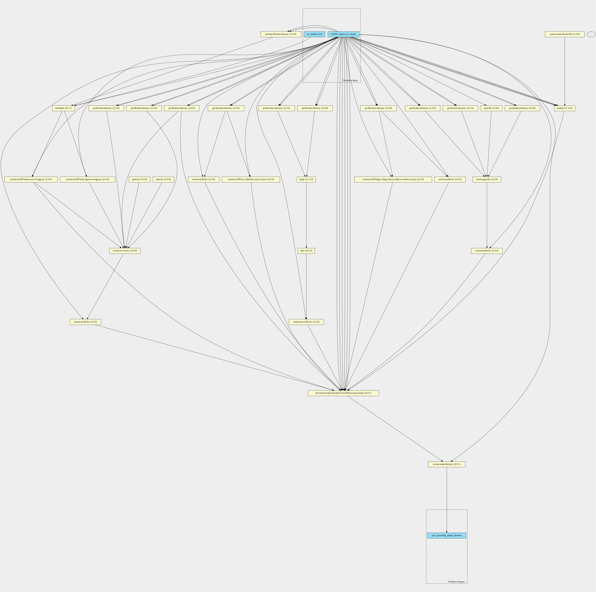
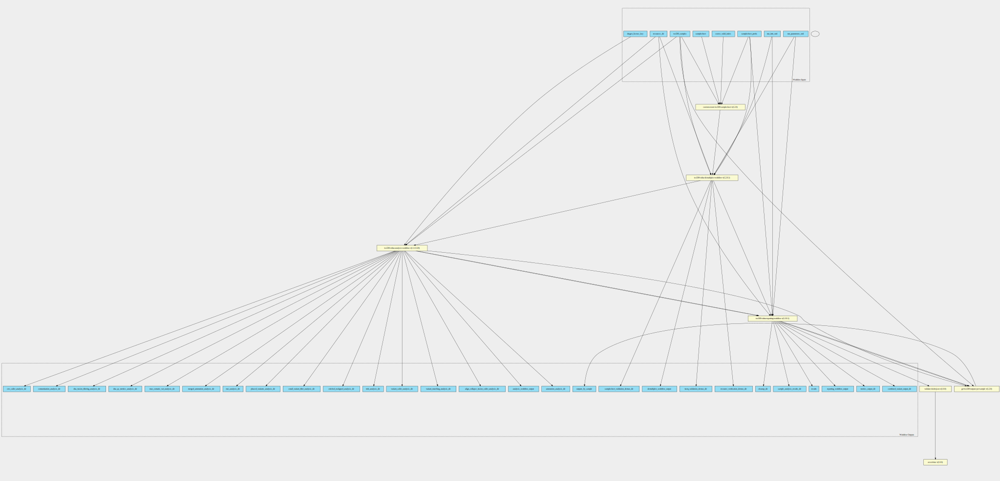

tso500-ctdna-with-post-processing-pipeline 1.2.0--1.0.0 workflow
================================================================

## Table of Contents
  
- [Overview](#tso500-ctdna-with-post-processing-pipeline-v120--100-overview)  
- [Visual](#visual-workflow-overview)  
- [Links](#related-links)  
- [Inputs](#tso500-ctdna-with-post-processing-pipeline-v120--100-inputs)  
- [Steps](#tso500-ctdna-with-post-processing-pipeline-v120--100-steps)  
- [Outputs](#tso500-ctdna-with-post-processing-pipeline-v120--100-outputs)  
- [ICA](#ica)  

## tso500-ctdna-with-post-processing-pipeline v(1.2.0--1.0.0) Overview

  
> ID: tso500-ctdna-with-post-processing-pipeline--1.2.0--1.0.0  
> md5sum: b42d5baaacb379677c152020e1599d00

### tso500-ctdna-with-post-processing-pipeline v(1.2.0--1.0.0) documentation
  
Runs the tso500-ctdna pipeline then runs the post-processing pipeline over each sample
Only intermediate step is collecting the tso500 bed file from the resources directory

### Categories
  
- tso500  

## Visual Workflow Overview
  

## Related Links
  
- [CWL File Path](../../../../../../workflows/tso500-ctdna-with-post-processing-pipeline/1.2.0--1.0.0/tso500-ctdna-with-post-processing-pipeline__1.2.0--1.0.0.cwl)  

### Uses
  
- [custom-create-directory 2.0.1](../../../tools/custom-create-directory/2.0.1/custom-create-directory__2.0.1.md)  
- [get-custom-output-dir-entry-for-tso500-with-post-processing 2.0.1](../../../expressions/get-custom-output-dir-entry-for-tso500-with-post-processing/2.0.1/get-custom-output-dir-entry-for-tso500-with-post-processing__2.0.1.md)  
- [get-file-from-directory 1.0.0 :construction:](../../../expressions/get-file-from-directory/1.0.0/get-file-from-directory__1.0.0.md)  
- [get-attr-from-tso500-sample-object 1.2.0 :construction:](../../../expressions/get-attr-from-tso500-sample-object/1.2.0/get-attr-from-tso500-sample-object__1.2.0.md)  
- [get-subdirectory-from-directory 1.0.0 :construction:](../../../expressions/get-subdirectory-from-directory/1.0.0/get-subdirectory-from-directory__1.0.0.md)  
- [get-file-from-directory 1.0.0 :construction:](../../../expressions/get-file-from-directory/1.0.0/get-file-from-directory__1.0.0.md)  
- [tso500-ctdna-post-processing-pipeline 1.0.0](../../tso500-ctdna-post-processing-pipeline/1.0.0/tso500-ctdna-post-processing-pipeline__1.0.0.md)  
- [tso500-ctdna 1.2.0--1](../../tso500-ctdna/1.2.0--1/tso500-ctdna__1.2.0--1.md)  

  

## tso500-ctdna-with-post-processing-pipeline v(1.2.0--1.0.0) Inputs

### coerce valid index

  
> ID: coerce_valid_index
  
**Optional:** `True`  
**Type:** `boolean`  
**Docs:**  
Coerce the valid index

### dragen license key

  
> ID: dragen_license_key
  
**Optional:** `True`  
**Type:** `File`  
**Docs:**  
File containing the dragen license

### resources dir

  
> ID: resources_dir
  
**Optional:** `False`  
**Type:** `Directory`  
**Docs:**  
The directory of resources

### run info xml

  
> ID: run_info_xml
  
**Optional:** `False`  
**Type:** `File`  
**Docs:**  
The run info xml file found inside the run folder

### run parameters xml

  
> ID: run_parameters_xml
  
**Optional:** `False`  
**Type:** `File`  
**Docs:**  
The run parameters xml file found inside the run folder

### sample sheet

  
> ID: samplesheet
  
**Optional:** `False`  
**Type:** `File`  
**Docs:**  
The sample sheet file, expects a V2 samplesheet.
Even though we don't demultiplex, we still need the information on Sample_Type and Pair_ID to determine which
workflow (DNA / RNA) to run through, we gather this through the tso500_samples input schema and then append to the
samplesheet. Please make sure that the sample_id in the tso500 sample schema match the Sample_ID in the
"<samplesheet_prefix>_Data" column.

### samplesheet prefix

  
> ID: samplesheet_prefix
  
**Optional:** `True`  
**Type:** `string`  
**Docs:**  
Points to the TSO500 section of the samplesheet.  If you are using a samplesheet from BCLConvert,
please set this to "BCLConvert"

### tso500 samples

  
> ID: tso500_samples
  
**Optional:** `False`  
**Type:** `tso500-sample[]`  
**Docs:**  
A list of tso500 samples each element has the following attributes:
* sample_id
* sample_type
* pair_id
* fastq list rows

  

## tso500-ctdna-with-post-processing-pipeline v(1.2.0--1.0.0) Steps

### create output directory

  
> ID: tso500-ctdna-with-post-processing-pipeline--1.2.0--1.0.0/create_final_output_directory
  
**Step Type:** tool  
**Docs:**
  
Create the output directory containing all the files listed in the previous step.

#### Links
  
[CWL File Path](../../../../../../tools/custom-create-directory/2.0.1/custom-create-directory__2.0.1.cwl)  
[CWL File Help Page](../../../tools/custom-create-directory/2.0.1/custom-create-directory__2.0.1.md)  

### create output directory

  
> ID: tso500-ctdna-with-post-processing-pipeline--1.2.0--1.0.0/get_final_directory_output_for_tso500_pipeline
  
**Step Type:** expression  
**Docs:**
  
Create the output directory containing all the files and directories listed in the previous step.

#### Links
  
[CWL File Path](../../../../../../expressions/get-custom-output-dir-entry-for-tso500-with-post-processing/2.0.1/get-custom-output-dir-entry-for-tso500-with-post-processing__2.0.1.cwl)  
[CWL File Help Page](../../../expressions/get-custom-output-dir-entry-for-tso500-with-post-processing/2.0.1/get-custom-output-dir-entry-for-tso500-with-post-processing__2.0.1.md)  

### get intermediate samplesheet from validation step

  
> ID: tso500-ctdna-with-post-processing-pipeline--1.2.0--1.0.0/get_intermediate_samplesheet_from_validation_step
  
**Step Type:** expression  
**Docs:**
  
Get the intermediate samplesheet from the validation step.
Returns a V1 samplesheet

#### Links
  
[CWL File Path](../../../../../../expressions/get-file-from-directory/1.0.0/get-file-from-directory__1.0.0.cwl)  
[CWL File Help Page :construction:](../../../expressions/get-file-from-directory/1.0.0/get-file-from-directory__1.0.0.md)  

### get sample ids from tso500 sample objects

  
> ID: tso500-ctdna-with-post-processing-pipeline--1.2.0--1.0.0/get_sample_ids_from_tso500_sample_object
  
**Step Type:** expression  
**Docs:**
  
Generate a list of sample ids from the tso500 sample objects

#### Links
  
[CWL File Path](../../../../../../expressions/get-attr-from-tso500-sample-object/1.2.0/get-attr-from-tso500-sample-object__1.2.0.cwl)  
[CWL File Help Page :construction:](../../../expressions/get-attr-from-tso500-sample-object/1.2.0/get-attr-from-tso500-sample-object__1.2.0.md)  

### sample output directory

  
> ID: tso500-ctdna-with-post-processing-pipeline--1.2.0--1.0.0/get_sample_output_directory
  
**Step Type:** expression  
**Docs:**
  
The sample output directory containing all of the samples post-processing files

#### Links
  
[CWL File Path](../../../../../../expressions/get-subdirectory-from-directory/1.0.0/get-subdirectory-from-directory__1.0.0.cwl)  
[CWL File Help Page :construction:](../../../expressions/get-subdirectory-from-directory/1.0.0/get-subdirectory-from-directory__1.0.0.md)  

### get tso bed file from resources dir

  
> ID: tso500-ctdna-with-post-processing-pipeline--1.2.0--1.0.0/get_tso_manifest_bed_from_resources_dir
  
**Step Type:** expression  
**Docs:**
  
Given the resources directory collect the following file:
  * TST500C_manifest.bed

#### Links
  
[CWL File Path](../../../../../../expressions/get-file-from-directory/1.0.0/get-file-from-directory__1.0.0.cwl)  
[CWL File Help Page :construction:](../../../expressions/get-file-from-directory/1.0.0/get-file-from-directory__1.0.0.md)  

### run tso ctdna post processing workflow step

  
> ID: tso500-ctdna-with-post-processing-pipeline--1.2.0--1.0.0/run_tso_ctdna_post_processing_workflow_step
  
**Step Type:** workflow  
**Docs:**
  
Run the very customised ctdna post processing workflow step for each sample

#### Links
  
[CWL File Path](../../../../../../workflows/tso500-ctdna-post-processing-pipeline/1.0.0/tso500-ctdna-post-processing-pipeline__1.0.0.cwl)  
[CWL File Help Page](../../tso500-ctdna-post-processing-pipeline/1.0.0/tso500-ctdna-post-processing-pipeline__1.0.0.md)
#### Subworkflow overview
  
  

### run tso ctdna workflow step

  
> ID: tso500-ctdna-with-post-processing-pipeline--1.2.0--1.0.0/run_tso_ctdna_workflow_step
  
**Step Type:** workflow  
**Docs:**
  
Run the CWL version of the tso500 ctDNA WDL / ISL workflow

#### Links
  
[CWL File Path](../../../../../../workflows/tso500-ctdna/1.2.0--1/tso500-ctdna__1.2.0--1.cwl)  
[CWL File Help Page](../../tso500-ctdna/1.2.0--1/tso500-ctdna__1.2.0--1.md)
#### Subworkflow overview
  
  

## tso500-ctdna-with-post-processing-pipeline v(1.2.0--1.0.0) Outputs

### output results dir

  
> ID: tso500-ctdna-with-post-processing-pipeline--1.2.0--1.0.0/output_results_dir  

  
**Optional:** `False`  
**Output Type:** `Directory`  
**Docs:**  
The output directory
  

### output results dir by sample

  
> ID: tso500-ctdna-with-post-processing-pipeline--1.2.0--1.0.0/output_results_dir_by_sample  

  
**Optional:** `False`  
**Output Type:** `.[]`  
**Docs:**  
The sample subdirectory of the results
  

  

## ICA

### ToC
  
- [development_workflows](#project-development_workflows)  
- [production_workflows](#project-production_workflows)  

### Project: development_workflows

> wfl id: wfl.b0be3d1bbd8140bbaa64038f0eb8f7c2  

  
**workflow name:** tso500-ctdna-with-post-processing-pipeline_dev-wf  
**wfl version name:** 1.2.0--1.0.0  

### Project: production_workflows

> wfl id: wfl.230846758ccf42e3831283ab0e45af0a  

  
**workflow name:** tso500-ctdna-with-post-processing-pipeline_prod-wf  
**wfl version name:** 1.2.0--1.0.0--3473aed  

  

