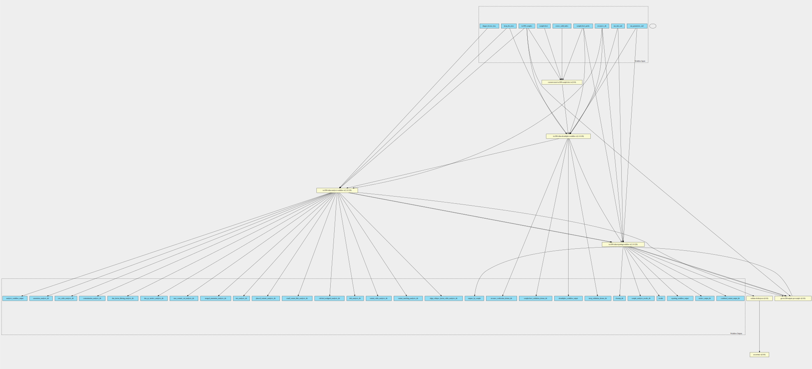

tso500-ctdna 1.1.0--120 workflow
================================

## Table of Contents
  
- [Overview](#tso500-ctdna-v110--120-overview)  
- [Visual](#visual-workflow-overview)  
- [Links](#related-links)  
- [Inputs](#tso500-ctdna-v110--120-inputs)  
- [Steps](#tso500-ctdna-v110--120-steps)  
- [Outputs](#tso500-ctdna-v110--120-outputs)  
- [ICA](#ica)  

## tso500-ctdna v(1.1.0--120) Overview

  
> ID: tso500-ctdna--1.1.0--120  
> md5sum: c4829cfb415e023febda1b66a4c66ef0

### tso500-ctdna v(1.1.0--120) documentation
  
Runs the TSO500 ctDNA workflow using the following docker container:
  * 239164580033.dkr.ecr.us-east-1.amazonaws.com/acadia-500-liquid-workflow-aws:ruo-1.1.0.120
This container is accessible to ICA customers only.
This CWL workflow is NOT generated by Illumina but the UMCCR team who bear no liability for misuse of this workflow.

You will need to be familiar with schemas in CWL in order to run this workflow.

This workflow completes the following steps:
1. Updates the Data section of the samplesheet to include the Sample_Type and the Pair_ID
2. Runs the DemultiplexWorkflow.wdl workflow through cromwell on the docker container listed above
3. Runs the AnalysisWorkflow.wdl workflow through cromwell on the docker container listed above
4. Runs the ReportingWorkflow.wdl workflow through cromwell on the docker container listed above

### Categories
  
- tso500  

## Visual Workflow Overview
  

## Related Links
  
- [CWL File Path](../../../../../../workflows/tso500-ctdna/1.1.0--120/tso500-ctdna__1.1.0--120.cwl)  

### Uses
  
- [custom-create-tso500-samplesheet 1.0.0](../../../tools/custom-create-tso500-samplesheet/1.0.0/custom-create-tso500-samplesheet__1.0.0.md)  
- [get-tso500-outputs-per-sample 1.0.0 :construction:](../../../expressions/get-tso500-outputs-per-sample/1.0.0/get-tso500-outputs-per-sample__1.0.0.md)  
- [tso500-ctdna-analysis-workflow 1.1.0--120](../../../tools/tso500-ctdna-analysis-workflow/1.1.0--120/tso500-ctdna-analysis-workflow__1.1.0--120.md)  
- [tso500-ctdna-demultiplex-workflow 1.1.0--120](../../../tools/tso500-ctdna-demultiplex-workflow/1.1.0--120/tso500-ctdna-demultiplex-workflow__1.1.0--120.md)  
- [tso500-ctdna-reporting-workflow 1.1.0--120](../../../tools/tso500-ctdna-reporting-workflow/1.1.0--120/tso500-ctdna-reporting-workflow__1.1.0--120.md)  

### Used By
  
- [tso500-ctdna-with-post-processing-pipeline 1.1.0--1.0.0](../../tso500-ctdna-with-post-processing-pipeline/1.1.0--1.0.0/tso500-ctdna-with-post-processing-pipeline__1.1.0--1.0.0.md)  

  

## tso500-ctdna v(1.1.0--120) Inputs

### dragen license key

  
> ID: dragen_license_key
  
**Optional:** `True`  
**Type:** `File`  
**Docs:**  
File containing the dragen license

### fastq list rows

  
> ID: fastq_list_rows
  
**Optional:** `False`  
**Type:** `fastq-list-row[]`  
**Docs:**  
A list of fastq list rows where each element has the following attributes
* rgid  # Not used
* rgsm
* rglb  # Not used
* read_1
* read_2

### resources dir

  
> ID: resources_dir
  
**Optional:** `False`  
**Type:** `Directory`  
**Docs:**  
The directory of resources

### run info xml

  
> ID: run_info_xml
  
**Optional:** `False`  
**Type:** `File`  
**Docs:**  
The run info xml file found inside the run folder

### run parameters xml

  
> ID: run_parameters_xml
  
**Optional:** `False`  
**Type:** `File`  
**Docs:**  
The run parameters xml file found inside the run folder

### sample sheet

  
> ID: samplesheet
  
**Optional:** `False`  
**Type:** `File`  
**Docs:**  
The sample sheet file, expects a V2 samplesheet.
Even though we don't demultiplex, we still need the information on Sample_Type and Pair_ID to determine which
workflow (DNA / RNA) to run through, we gather this through the tso500_samples input schema and then append to the
samplesheet. Please make sure that the sample_id in the tso500 sample schema match the Sample_ID in the
"<samplesheet_prefix>_Data" column.

### samplesheet prefix

  
> ID: samplesheet_prefix
  
**Optional:** `True`  
**Type:** `string`  
**Docs:**  
Points to the TSO500 section of the samplesheet.  If you are using a samplesheet from BCLConvert,
please set this to "BCLConvert"

### tso500 samples

  
> ID: tso500_samples
  
**Optional:** `False`  
**Type:** `tso500-sample[]`  
**Docs:**  
A list of tso500 samples each element has the following attributes:
* sample_id
* sample_type
* pair_id

  

## tso500-ctdna v(1.1.0--120) Steps

### add sample type and pair id to samplesheet step

  
> ID: tso500-ctdna--1.1.0--120/add_sample_type_and_pair_id_to_samplesheet_step
  
**Step Type:** tool  
**Docs:**
  
Adds the sample_type and pair_id attribute from each of the tso500 samples to
the samplesheet. Here the sample_id attribute of the tso500 sample must match
that of the Sample_ID column in the sample sheet.  This tool also overwrites the Sample_Project attribute
so that it matches the Sample_ID. This tool expects a v1 samplesheet as input

#### Links
  
[CWL File Path](../../../../../../tools/custom-create-tso500-samplesheet/1.0.0/custom-create-tso500-samplesheet__1.0.0.cwl)  
[CWL File Help Page](../../../tools/custom-create-tso500-samplesheet/1.0.0/custom-create-tso500-samplesheet__1.0.0.md)  

### get cttso outputs by sample

  
> ID: tso500-ctdna--1.1.0--120/get_cttso_outputs_by_sample
  
**Step Type:** expression  
**Docs:**
  
Get the CTTSO outputs per sample, contains all intermediate dirs and results dir
along with the sampleanalysis results json file

#### Links
  
[CWL File Path](../../../../../../expressions/get-tso500-outputs-per-sample/1.0.0/get-tso500-outputs-per-sample__1.0.0.cwl)  
[CWL File Help Page :construction:](../../../expressions/get-tso500-outputs-per-sample/1.0.0/get-tso500-outputs-per-sample__1.0.0.md)  

### run tso500 ctdna analysis workflow step

  
> ID: tso500-ctdna--1.1.0--120/run_tso500_ctdna_analysis_workflow_step
  
**Step Type:** tool  
**Docs:**
  
Run the tso500 ctdna analysis workflow step. This involves making sure that the fastq list rows are mounted as
per the WDL task expects them to be (which is every sample in its own project). Then creating an
input.json to match the inputs of the CWL with a WDL compatible input file and launching this through cromwell.

#### Links
  
[CWL File Path](../../../../../../tools/tso500-ctdna-analysis-workflow/1.1.0--120/tso500-ctdna-analysis-workflow__1.1.0--120.cwl)  
[CWL File Help Page](../../../tools/tso500-ctdna-analysis-workflow/1.1.0--120/tso500-ctdna-analysis-workflow__1.1.0--120.md)  

### run tso500 ctdna demultiplex workflow step

  
> ID: tso500-ctdna--1.1.0--120/run_tso500_ctdna_demultiplex_workflow_step
  
**Step Type:** tool  
**Docs:**
  
Runs the tso500 ctdna demultiplex workflow step. This involves making sure that the fastq list rows are mounted
as per as the WDL task expects them to be (which is every sample in its own project). Then creating an
input.json to match the inputs of the CWL with a WDL compatible input file and launching this through cromwell.

#### Links
  
[CWL File Path](../../../../../../tools/tso500-ctdna-demultiplex-workflow/1.1.0--120/tso500-ctdna-demultiplex-workflow__1.1.0--120.cwl)  
[CWL File Help Page](../../../tools/tso500-ctdna-demultiplex-workflow/1.1.0--120/tso500-ctdna-demultiplex-workflow__1.1.0--120.md)  

### run tso500 ctdna reporting workflow step

  
> ID: tso500-ctdna--1.1.0--120/run_tso500_ctdna_reporting_workflow_step
  
**Step Type:** tool  
**Docs:**
  
Run the tso500 ctdna repair workflow step

#### Links
  
[CWL File Path](../../../../../../tools/tso500-ctdna-reporting-workflow/1.1.0--120/tso500-ctdna-reporting-workflow__1.1.0--120.cwl)  
[CWL File Help Page](../../../tools/tso500-ctdna-reporting-workflow/1.1.0--120/tso500-ctdna-reporting-workflow__1.1.0--120.md)  

## tso500-ctdna v(1.1.0--120) Outputs

### align_collapse_fusion_caller_analysis_dir

  
> ID: tso500-ctdna--1.1.0--120/align_collapse_fusion_caller_analysis_dir  

  
**Optional:** `True`  
**Output Type:** `Directory`  
**Docs:**  
Intermediate output for align_collapse_fusion_caller_analysis step of the analysis workflow
  

### analysis workflow output

  
> ID: tso500-ctdna--1.1.0--120/analysis_workflow_output  

  
**Optional:** `False`  
**Output Type:** `Directory`  
**Docs:**  
Intermediate output files from the analysis workflow steps
  

### annotation_analysis_dir

  
> ID: tso500-ctdna--1.1.0--120/annotation_analysis_dir  

  
**Optional:** `True`  
**Output Type:** `Directory`  
**Docs:**  
Intermediate output for annotation_analysis step of the analysis workflow
  

### cleanup_dir

  
> ID: tso500-ctdna--1.1.0--120/cleanup_dir  

  
**Optional:** `True`  
**Output Type:** `Directory`  
**Docs:**  
Intermediate output for cleanup_dir
  

### cnv_caller_analysis_dir

  
> ID: tso500-ctdna--1.1.0--120/cnv_caller_analysis_dir  

  
**Optional:** `True`  
**Output Type:** `Directory`  
**Docs:**  
Intermediate output for cnv_caller_analysis step of the analysis workflow
  

### combined_variant_output_dir

  
> ID: tso500-ctdna--1.1.0--120/combined_variant_output_dir  

  
**Optional:** `True`  
**Output Type:** `Directory`  
**Docs:**  
Intermediate output for combined_variant_output_dir
  

### contamination_analysis_dir

  
> ID: tso500-ctdna--1.1.0--120/contamination_analysis_dir  

  
**Optional:** `True`  
**Output Type:** `Directory`  
**Docs:**  
Intermediate output for contamination_analysis step of the analysis workflow
  

### demultiplex workflow output

  
> ID: tso500-ctdna--1.1.0--120/demultiplex_workflow_output  

  
**Optional:** `False`  
**Output Type:** `Directory`  
**Docs:**  
Intermediate output files from the demultiplex workflow steps
  

### dna_fusion_filtering_analysis_dir

  
> ID: tso500-ctdna--1.1.0--120/dna_fusion_filtering_analysis_dir  

  
**Optional:** `True`  
**Output Type:** `Directory`  
**Docs:**  
Intermediate output for dna_fusion_filtering_analysis step of the analysis workflow
  

### dna_qc_metrics_analysis_dir

  
> ID: tso500-ctdna--1.1.0--120/dna_qc_metrics_analysis_dir  

  
**Optional:** `True`  
**Output Type:** `Directory`  
**Docs:**  
Intermediate output for dna_qc_metrics_analysis step of the analysis workflow
  

### fastq_validation_demux

  
> ID: tso500-ctdna--1.1.0--120/fastq_validation_demux_dir  

  
**Optional:** `True`  
**Output Type:** `Directory`  
**Docs:**  
fastq_validation_demux_dir intermediate output directory
  

### max_somatic_vaf_analysis_dir

  
> ID: tso500-ctdna--1.1.0--120/max_somatic_vaf_analysis_dir  

  
**Optional:** `True`  
**Output Type:** `Directory`  
**Docs:**  
Intermediate output for max_somatic_vaf_analysis step of the analysis workflow
  

### merged_annotation_analysis_dir

  
> ID: tso500-ctdna--1.1.0--120/merged_annotation_analysis_dir  

  
**Optional:** `True`  
**Output Type:** `Directory`  
**Docs:**  
Intermediate output for merged_annotation_analysis step of the analysis workflow
  

### metrics_output_dir

  
> ID: tso500-ctdna--1.1.0--120/metrics_output_dir  

  
**Optional:** `True`  
**Output Type:** `Directory`  
**Docs:**  
Intermediate output for metrics_output_dir
  

### msi_analysis_dir

  
> ID: tso500-ctdna--1.1.0--120/msi_analysis_dir  

  
**Optional:** `True`  
**Output Type:** `Directory`  
**Docs:**  
Intermediate output for msi_analysis step of the analysis workflow
  

### outputs by sample

  
> ID: tso500-ctdna--1.1.0--120/outputs_by_sample  

  
**Optional:** `False`  
**Output Type:** `tso500-outputs-by-sample[]`  
**Docs:**  
The sample output directories from the analysis step
  

### phased_variants_analysis_dir

  
> ID: tso500-ctdna--1.1.0--120/phased_variants_analysis_dir  

  
**Optional:** `True`  
**Output Type:** `Directory`  
**Docs:**  
Intermediate output for phased_variants_analysis step of the analysis workflow
  

### reporting workflow output

  
> ID: tso500-ctdna--1.1.0--120/reporting_workflow_output  

  
**Optional:** `False`  
**Output Type:** `Directory`  
**Docs:**  
Intermediate output files from the reporting workflow steps
  

### resource_verification_demux

  
> ID: tso500-ctdna--1.1.0--120/resource_verification_demux_dir  

  
**Optional:** `True`  
**Output Type:** `Directory`  
**Docs:**  
resource_verification_demux_dir intermediate output directory
  

### results

  
> ID: tso500-ctdna--1.1.0--120/results  

  
**Optional:** `False`  
**Output Type:** `Directory`  
**Docs:**  
Results directory, output from the reporting workflow
  

### sample_analysis_results_dir

  
> ID: tso500-ctdna--1.1.0--120/sample_analysis_results_dir  

  
**Optional:** `True`  
**Output Type:** `Directory`  
**Docs:**  
Intermediate output for sample_analysis_results_dir
  

### samplesheet_validation_demux

  
> ID: tso500-ctdna--1.1.0--120/samplesheet_validation_demux_dir  

  
**Optional:** `True`  
**Output Type:** `Directory`  
**Docs:**  
samplesheet_validation_demux_dir intermediate output directory
  

### small_variant_filter_analysis_dir

  
> ID: tso500-ctdna--1.1.0--120/small_variant_filter_analysis_dir  

  
**Optional:** `True`  
**Output Type:** `Directory`  
**Docs:**  
Intermediate output for small_variant_filter_analysis step of the analysis workflow
  

### stitched_realigned_analysis_dir

  
> ID: tso500-ctdna--1.1.0--120/stitched_realigned_analysis_dir  

  
**Optional:** `True`  
**Output Type:** `Directory`  
**Docs:**  
Intermediate output for stitched_realigned_analysis step of the analysis workflow
  

### tmb_analysis_dir

  
> ID: tso500-ctdna--1.1.0--120/tmb_analysis_dir  

  
**Optional:** `True`  
**Output Type:** `Directory`  
**Docs:**  
Intermediate output for tmb_analysis step of the analysis workflow
  

### variant_caller_analysis_dir

  
> ID: tso500-ctdna--1.1.0--120/variant_caller_analysis_dir  

  
**Optional:** `True`  
**Output Type:** `Directory`  
**Docs:**  
Intermediate output for variant_caller_analysis step of the analysis workflow
  

### variant_matching_analysis_dir

  
> ID: tso500-ctdna--1.1.0--120/variant_matching_analysis_dir  

  
**Optional:** `True`  
**Output Type:** `Directory`  
**Docs:**  
Intermediate output for variant_matching_analysis step of the analysis workflow
  

  

## ICA

### ToC
  
- [development_workflows](#project-development_workflows)  
- [production_workflows](#project-production_workflows)  
- [collab-illumina-dev_workflows](#project-collab-illumina-dev_workflows)  

### Project: development_workflows

> wfl id: wfl.3cfe22e0ca1f43a8b68c1ec820a0a5dc  

  
**workflow name:** tso500-ctdna_dev-wf  
**wfl version name:** 1.1.0--120  

### Project: production_workflows

> wfl id: wfl.576020a89adb49c3b2081a620d19104d  

  
**workflow name:** tso500-ctdna_prod-wf  
**wfl version name:** 1.1.0--120--b8f38b3  

### Project: collab-illumina-dev_workflows

> wfl id: wfl.2f5f214de24b450c8c71a3f7d5c0ae16  

  
**workflow name:** tso500-ctdna_clb-ilmn-dev  
**wfl version name:** 1.1.0--120  

  

