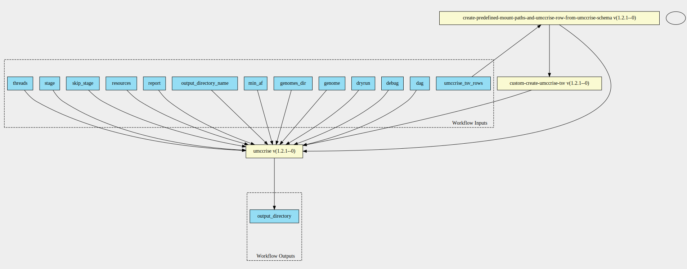

umccrise-pipeline 1.2.1--0 workflow
===================================

## Table of Contents
  
- [Overview](#umccrise-pipeline-v121--0-overview)  
- [Visual](#visual-workflow-overview)  
- [Links](#related-links)  
- [Inputs](#umccrise-pipeline-v121--0-inputs)  
- [Steps](#umccrise-pipeline-v121--0-steps)  
- [Outputs](#umccrise-pipeline-v121--0-outputs)  
- [ICA](#ica)  

## umccrise-pipeline v(1.2.1--0) Overview

  
> ID: umccrise-pipeline--1.2.1--0  
> md5sum: 6100f32cc0c1ecf82da6ea0da96f8622

### umccrise-pipeline v(1.2.1--0) documentation
  
Run the umccrise-pipeline v1.2.1--0

### Categories
  

## Visual Workflow Overview
  

## Related Links
  
- [CWL File Path](../../../../../../workflows/umccrise-pipeline/1.2.1--0/umccrise-pipeline__1.2.1--0.cwl)  

### Uses
  
- [create-predefined-mount-paths-and-umccrise-row-from-umccrise-schema 1.2.1--0](../../../expressions/create-predefined-mount-paths-and-umccrise-row-from-umccrise-schema/1.2.1--0/create-predefined-mount-paths-and-umccrise-row-from-umccrise-schema__1.2.1--0.md)  
- [custom-create-umccrise-tsv 1.2.1--0](../../../tools/custom-create-umccrise-tsv/1.2.1--0/custom-create-umccrise-tsv__1.2.1--0.md)  
- [umccrise 1.2.1--0](../../../tools/umccrise/1.2.1--0/umccrise__1.2.1--0.md)  

  

## umccrise-pipeline v(1.2.1--0) Inputs

### dag

  
> ID: dag
  
**Optional:** `True`  
**Type:** `boolean`  
**Docs:**  
Propagated to snakemake. Print the DAG of jobs in the dot language.

### debug

  
> ID: debug
  
**Optional:** `True`  
**Type:** `boolean`  
**Docs:**  
More verbose messages

### dryrun

  
> ID: dryrun
  
**Optional:** `True`  
**Type:** `boolean`  
**Docs:**  
Propagated to snakemake. Prints rules and commands to be run without actually executing them.

### genome

  
> ID: genome
  
**Optional:** `True`  
**Type:** `<cwl_utils.parser_v1_1.InputEnumSchema object at 0x7f3fc5adfe50>`  
**Docs:**  
genome

### genomes_dir

  
> ID: genomes_dir
  
**Optional:** `False`  
**Type:** `Directory`  
**Docs:**  
The reference data bundle for the umccrise tool

### min af

  
> ID: min_af
  
**Optional:** `True`  
**Type:** `float`  
**Docs:**  
AF threshold to filter small variants (unless a known hotspot)

### output directory name

  
> ID: output_directory_name
  
**Optional:** `False`  
**Type:** `string`  
**Docs:**  
The name of the output directory

### report

  
> ID: report
  
**Optional:** `True`  
**Type:** `boolean`  
**Docs:**  
Propagated to snakemake.
Create an HTML report with results and statistics.
The argument has to be a file path ending with ".html"

### resources

  
> ID: resources
  
**Optional:** `True`  
**Type:** `string[]`  
**Docs:**  
Can be used to limit the amount of memory allowed to be used

### skip stage

  
> ID: skip_stage
  
**Optional:** `True`  
**Type:** `string[]`  
**Docs:**  
Optionally, stages to skip, e.g.: -E oncoviruses -E cpsr

### stage

  
> ID: stage
  
**Optional:** `True`  
**Type:** `string[]`  
**Docs:**  
Optionally, specific stage to run, e.g.: -T pcgr -T coverage -T structural -T small_variants

### threads

  
> ID: threads
  
**Optional:** `True`  
**Type:** `int`  
**Docs:**  
Maximum number of cores to use at single time.
Defaults to runtime.cores

### umccrise tsv rows

  
> ID: umccrise_tsv_rows
  
**Optional:** `False`  
**Type:** `umccrise-input[]`  
**Docs:**  
The list of tsv rows schema

  

## umccrise-pipeline v(1.2.1--0) Steps

### create mount paths and umccrise tsv input jsons step

  
> ID: umccrise-pipeline--1.2.1--0/create_mount_paths_and_umccrise_tsv_input_jsons_step
  
**Step Type:** expression  
**Docs:**
  
Expression does two main things,
creates a list of predefined mount paths for listing in the umccrise step
and creates a list of jsons that represent umccrise list rows for the tsv creation

#### Links
  
[CWL File Path](../../../../../../expressions/create-predefined-mount-paths-and-umccrise-row-from-umccrise-schema/1.2.1--0/create-predefined-mount-paths-and-umccrise-row-from-umccrise-schema__1.2.1--0.cwl)  
[CWL File Help Page](../../../expressions/create-predefined-mount-paths-and-umccrise-row-from-umccrise-schema/1.2.1--0/create-predefined-mount-paths-and-umccrise-row-from-umccrise-schema__1.2.1--0.md)  

### create umccrise tsv

  
> ID: umccrise-pipeline--1.2.1--0/create_umccrise_tsv_step
  
**Step Type:** tool  
**Docs:**
  
Create the umccrise tsv from the jsonised input rows

#### Links
  
[CWL File Path](../../../../../../tools/custom-create-umccrise-tsv/1.2.1--0/custom-create-umccrise-tsv__1.2.1--0.cwl)  
[CWL File Help Page](../../../tools/custom-create-umccrise-tsv/1.2.1--0/custom-create-umccrise-tsv__1.2.1--0.md)  

### run umccrise step

  
> ID: umccrise-pipeline--1.2.1--0/run_umccrise_step
  
**Step Type:** tool  
**Docs:**
  
Run the umccrise step

#### Links
  
[CWL File Path](../../../../../../tools/umccrise/1.2.1--0/umccrise__1.2.1--0.cwl)  
[CWL File Help Page](../../../tools/umccrise/1.2.1--0/umccrise__1.2.1--0.md)  

## umccrise-pipeline v(1.2.1--0) Outputs

### output_directory

  
> ID: umccrise-pipeline--1.2.1--0/output_directory  

  
**Optional:** `False`  
**Output Type:** `Directory`  
**Docs:**  
The umccrise output directory
  

  

## ICA

### ToC
  
- [development_workflows](#project-development_workflows)  

### Project: development_workflows

> wfl id: wfl.b10e715320844774b730b12c6e7fe185  

  
**workflow name:** umccrise-pipeline_dev-wf  
**wfl version name:** 1.2.1--0  

  

