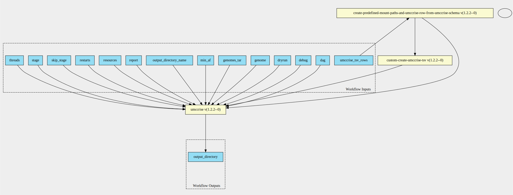
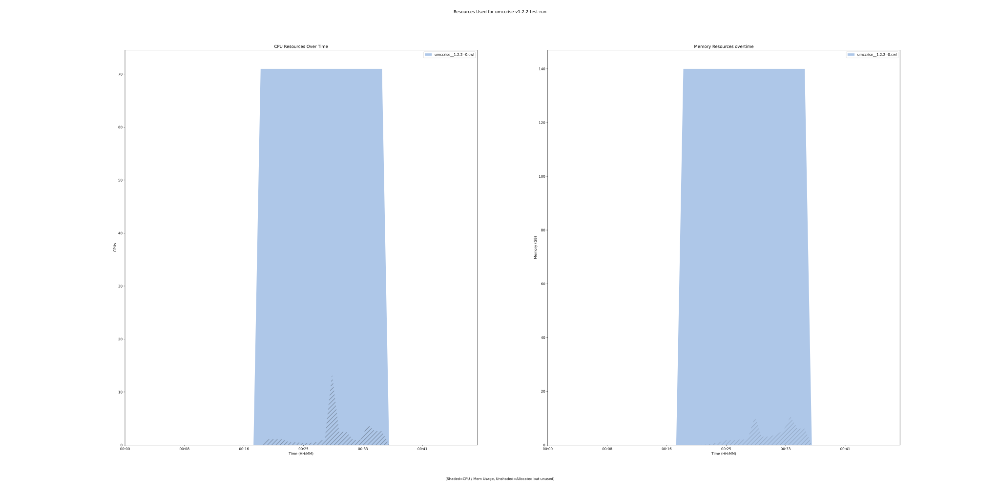

umccrise-pipeline 1.2.2--0 workflow
===================================

## Table of Contents
  
- [Overview](#umccrise-pipeline-v122--0-overview)  
- [Visual](#visual-workflow-overview)  
- [Links](#related-links)  
- [Inputs](#umccrise-pipeline-v122--0-inputs)  
- [Steps](#umccrise-pipeline-v122--0-steps)  
- [Outputs](#umccrise-pipeline-v122--0-outputs)  
- [ICA](#ica)  


## umccrise-pipeline v(1.2.2--0) Overview


  
> ID: umccrise-pipeline--1.2.2--0  
> md5sum: 5756b4495262e66599db3dda1d75c1a0

### umccrise-pipeline v(1.2.2--0) documentation
  
Run the umccrise-pipeline v1.2.2--0

### Categories
  


## Visual Workflow Overview
  
[](https://github.com/umccr/cwl-ica/raw/main/.github/catalogue/images/workflows/umccrise-pipeline/1.2.2--0/umccrise-pipeline__1.2.2--0.svg)
## Related Links
  
- [CWL File Path](../../../../../../workflows/umccrise-pipeline/1.2.2--0/umccrise-pipeline__1.2.2--0.cwl)  


### Uses
  
- [create-predefined-mount-paths-and-umccrise-row-from-umccrise-schema 1.2.2--0](../../../expressions/create-predefined-mount-paths-and-umccrise-row-from-umccrise-schema/1.2.2--0/create-predefined-mount-paths-and-umccrise-row-from-umccrise-schema__1.2.2--0.md)  
- [custom-create-umccrise-tsv 1.2.2--0](../../../tools/custom-create-umccrise-tsv/1.2.2--0/custom-create-umccrise-tsv__1.2.2--0.md)  
- [umccrise 1.2.2--0](../../../tools/umccrise/1.2.2--0/umccrise__1.2.2--0.md)  

  


## umccrise-pipeline v(1.2.2--0) Inputs

### dag


  
> ID: dag
  
**Optional:** `True`  
**Type:** `boolean`  
**Docs:**  
Propagated to snakemake. Print the DAG of jobs in the dot language.


### debug


  
> ID: debug
  
**Optional:** `True`  
**Type:** `boolean`  
**Docs:**  
More verbose messages


### dryrun


  
> ID: dryrun
  
**Optional:** `True`  
**Type:** `boolean`  
**Docs:**  
Propagated to snakemake. Prints rules and commands to be run without actually executing them.


### genome


  
> ID: genome
  
**Optional:** `True`  
**Type:** `[ GRCh37 | hg38 ]`  
**Docs:**  
genome


### genomes_tar


  
> ID: genomes_tar
  
**Optional:** `False`  
**Type:** `File`  
**Docs:**  
The reference data bundle for the umccrise tool


### min af


  
> ID: min_af
  
**Optional:** `True`  
**Type:** `float`  
**Docs:**  
AF threshold to filter small variants (unless a known hotspot)


### output directory name


  
> ID: output_directory_name
  
**Optional:** `False`  
**Type:** `string`  
**Docs:**  
The name of the output directory


### report


  
> ID: report
  
**Optional:** `True`  
**Type:** `boolean`  
**Docs:**  
Propagated to snakemake.
Create an HTML report with results and statistics.
The argument has to be a file path ending with ".html"


### resources


  
> ID: resources
  
**Optional:** `True`  
**Type:** `string[]`  
**Docs:**  
Can be used to limit the amount of memory allowed to be used


### restarts


  
> ID: restarts
  
**Optional:** `True`  
**Type:** `int`  
**Docs:**  
Number of attempts to complete a job


### skip stage


  
> ID: skip_stage
  
**Optional:** `True`  
**Type:** `string[]`  
**Docs:**  
Optionally, stages to skip, e.g.: -E oncoviruses -E cpsr


### stage


  
> ID: stage
  
**Optional:** `True`  
**Type:** `string[]`  
**Docs:**  
Optionally, specific stage to run, e.g.: -T pcgr -T coverage -T structural -T small_variants


### threads


  
> ID: threads
  
**Optional:** `True`  
**Type:** `int`  
**Docs:**  
Maximum number of cores to use at single time.
Defaults to runtime.cores


### umccrise tsv rows


  
> ID: umccrise_tsv_rows
  
**Optional:** `False`  
**Type:** `umccrise-input[]`  
**Docs:**  
The list of tsv rows schema

  


## umccrise-pipeline v(1.2.2--0) Steps

### create mount paths and umccrise tsv input jsons step


  
> ID: umccrise-pipeline--1.2.2--0/create_mount_paths_and_umccrise_tsv_input_jsons_step
  
**Step Type:** expression  
**Docs:**
  
Expression does two main things,
creates a list of predefined mount paths for listing in the umccrise step
and creates a list of jsons that represent umccrise list rows for the tsv creation

#### Links
  
[CWL File Path](../../../../../../expressions/create-predefined-mount-paths-and-umccrise-row-from-umccrise-schema/1.2.2--0/create-predefined-mount-paths-and-umccrise-row-from-umccrise-schema__1.2.2--0.cwl)  
[CWL File Help Page](../../../expressions/create-predefined-mount-paths-and-umccrise-row-from-umccrise-schema/1.2.2--0/create-predefined-mount-paths-and-umccrise-row-from-umccrise-schema__1.2.2--0.md)  


### create umccrise tsv


  
> ID: umccrise-pipeline--1.2.2--0/create_umccrise_tsv_step
  
**Step Type:** tool  
**Docs:**
  
Create the umccrise tsv from the jsonised input rows

#### Links
  
[CWL File Path](../../../../../../tools/custom-create-umccrise-tsv/1.2.2--0/custom-create-umccrise-tsv__1.2.2--0.cwl)  
[CWL File Help Page](../../../tools/custom-create-umccrise-tsv/1.2.2--0/custom-create-umccrise-tsv__1.2.2--0.md)  


### run umccrise step


  
> ID: umccrise-pipeline--1.2.2--0/run_umccrise_step
  
**Step Type:** tool  
**Docs:**
  
Run the umccrise step

#### Links
  
[CWL File Path](../../../../../../tools/umccrise/1.2.2--0/umccrise__1.2.2--0.cwl)  
[CWL File Help Page](../../../tools/umccrise/1.2.2--0/umccrise__1.2.2--0.md)  


## umccrise-pipeline v(1.2.2--0) Outputs

### output_directory


  
> ID: umccrise-pipeline--1.2.2--0/output_directory  

  
**Optional:** `False`  
**Output Type:** `Directory`  
**Docs:**  
The umccrise output directory
  

  


## ICA

### ToC
  
- [development_workflows](#project-development_workflows)  


### Project: development_workflows


> wfl id: wfl.b10e715320844774b730b12c6e7fe185  

  
**workflow name:** umccrise-pipeline_dev-wf  
**wfl version name:** 1.2.2--0  


#### Run Instances

##### ToC
  
- [Run wfr.070e013822304c0191e8195ce10a3b2b](#run-wfr070e013822304c0191e8195ce10a3b2b)  


##### Run wfr.070e013822304c0191e8195ce10a3b2b


  
> Run Name: umccrise-v1.2.2-test-run  

  
**Start Time:** 2021-08-20 02:18:05 UTC  
**Duration:** 2021-08-20 03:05:45 UTC  
**End Time:** 0 days 00:47:39  


###### Reproduce Run


```bash

# Run the submission template to create the workflow input json and launch script            
cwl-ica copy-workflow-submission-template --ica-workflow-run-instance-id wfr.070e013822304c0191e8195ce10a3b2b

# Edit the input json file (optional)
# vim wfr.070e013822304c0191e8195ce10a3b2b.template.json 

# Run the launch script
bash wfr.070e013822304c0191e8195ce10a3b2b.launch.sh
                                    
```  


###### Run Inputs


```
{
    "genomes_tar": {
        "class": "File",
        "path": "gds://development/reference-data/umccrise/1.0.10/genomes.tar.gz"
    },
    "output_directory_name": "test_data_umccrise_output_dir",
    "umccrise_tsv_rows": [
        {
            "germline_vcf": {
                "class": "File",
                "path": "gds://development/test-data/umccrise-test-data/20200921--88d675b/data/bcbio_test_project/final/2019-11-25_samples/N_SRR7890889-germline-ensemble-annotated.vcf.gz"
            },
            "normal": {
                "class": "File",
                "path": "gds://development/test-data/umccrise-test-data/20200921--88d675b/data/bcbio_test_project/final/N_SRR7890889/N_SRR7890889-ready.bam"
            },
            "sample": "SEQCII_50pc",
            "somatic_vcf": {
                "class": "File",
                "path": "gds://development/test-data/umccrise-test-data/20200921--88d675b/data/bcbio_test_project/final/2019-11-25_samples/SEQCII_50pc-ensemble-annotated.vcf.gz"
            },
            "sv_vcf": {
                "class": "File",
                "path": "gds://development/test-data/umccrise-test-data/20200921--88d675b/data/bcbio_test_project/final/T_SRR7890936_50pc/SEQCII_50pc-manta.vcf.gz"
            },
            "wgs": {
                "class": "File",
                "path": "gds://development/test-data/umccrise-test-data/20200921--88d675b/data/bcbio_test_project/final/T_SRR7890936_50pc/T_SRR7890936_50pc-ready.bam"
            }
        }
    ]
}
```  


###### Run Engine Parameters


```
{
    "workDirectory": "gds://wfr.070e013822304c0191e8195ce10a3b2b/umccrise-v1.2.2-test-run",
    "outputDirectory": "gds://wfr.070e013822304c0191e8195ce10a3b2b/umccrise-v1.2.2-test-run/outputs",
    "tmpOutputDirectory": "gds://wfr.070e013822304c0191e8195ce10a3b2b/umccrise-v1.2.2-test-run/steps",
    "logDirectory": "gds://wfr.070e013822304c0191e8195ce10a3b2b/umccrise-v1.2.2-test-run/logs",
    "maxScatter": 32,
    "outputSetting": "move",
    "copyOutputInstanceType": "StandardHiCpu",
    "copyOutputInstanceSize": "Medium",
    "defaultInputMode": "'Download'",
    "inputModeOverrides": {},
    "tesUseInputManifest": "'auto'",
    "cwltool": "3.0.20201203173111",
    "engine": "1.17.0-202107161017-stratus-master"
}
```  


###### Run Outputs


```
{
    "output_directory": {
        "location": "gds://wfr.070e013822304c0191e8195ce10a3b2b/umccrise-v1.2.2-test-run/outputs/test_data_umccrise_output_dir",
        "basename": "test_data_umccrise_output_dir",
        "nameroot": "",
        "nameext": "",
        "class": "Directory",
        "size": null
    },
    "output_dir_gds_session_id": "ssn.b51185c2c2d943da94fdff940faeb1f1",
    "output_dir_gds_folder_id": "fol.7dcb027aee464901824008d95e205f62"
}
```  


###### Run Resources Usage
  

  
[](https://github.com/umccr/cwl-ica/raw/main/.github/catalogue/images/runs/workflows/umccrise-pipeline/1.2.2--0/umccrise-v1.2.2-test-run__wfr.070e013822304c0191e8195ce10a3b2b.svg)  

  

