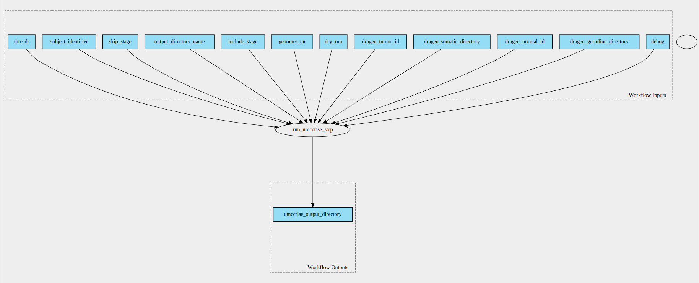

umccrise-pipeline 2.2.0--0 workflow
===================================

## Table of Contents
  
- [Overview](#umccrise-pipeline-v220--0-overview)  
- [Visual](#visual-workflow-overview)  
- [Links](#related-links)  
- [Inputs](#umccrise-pipeline-v220--0-inputs)  
- [Steps](#umccrise-pipeline-v220--0-steps)  
- [Outputs](#umccrise-pipeline-v220--0-outputs)  
- [ICA](#ica)  

## umccrise-pipeline v(2.2.0--0) Overview

  
> ID: umccrise-pipeline--2.2.0--0  
> md5sum: 3f9bb9bf72fbd9cc3534649a43c8b88b

### umccrise-pipeline v(2.2.0--0) documentation
  
Documentation for umccrise-pipeline v2.2.0--0

### Categories
  

## Visual Workflow Overview
  

## Related Links
  
- [CWL File Path](../../../../../../workflows/umccrise-pipeline/2.2.0--0/umccrise-pipeline__2.2.0--0.cwl)  

### Uses
  
- [umccrise 2.2.0--0](../../../tools/umccrise/2.2.0--0/umccrise__2.2.0--0.md)  

  

## umccrise-pipeline v(2.2.0--0) Inputs

### dragen germline directory

  
> ID: dragen_germline_directory
  
**Optional:** `False`  
**Type:** `Directory`  
**Docs:**  
The dragen germline directory

### dragen normal id

  
> ID: dragen_normal_id
  
**Optional:** `False`  
**Type:** `string`  
**Docs:**  
The name of the dragen normal sample

### dragen somatic directory

  
> ID: dragen_somatic_directory
  
**Optional:** `False`  
**Type:** `Directory`  
**Docs:**  
The dragen somatic directory

### dragen tumor id

  
> ID: dragen_tumor_id
  
**Optional:** `False`  
**Type:** `string`  
**Docs:**  
The name of the dragen tumor sample

### genomes tar

  
> ID: genomes_tar
  
**Optional:** `False`  
**Type:** `File`  
**Docs:**  
The reference umccrise tarball

### output directory name

  
> ID: output_directory_name
  
**Optional:** `False`  
**Type:** `string`  
**Docs:**  
The name of the output directory

### subject identifier

  
> ID: subject_identifier
  
**Optional:** `False`  
**Type:** `string`  
**Docs:**  
The subject ID (used to name output files)

### threads

  
> ID: threads
  
**Optional:** `True`  
**Type:** `int`  
**Docs:**  
Number of threads to use

  

## umccrise-pipeline v(2.2.0--0) Steps

### run umccrise

  
> ID: umccrise-pipeline--2.2.0--0/run_umccrise_step
  
**Step Type:** tool  
**Docs:**
  
Run the UMCCRise CommandLine Tool

#### Links
  
[CWL File Path](../../../../../../tools/umccrise/2.2.0--0/umccrise__2.2.0--0.cwl)  
[CWL File Help Page](../../../tools/umccrise/2.2.0--0/umccrise__2.2.0--0.md)  

## umccrise-pipeline v(2.2.0--0) Outputs

### umccrise output directory

  
> ID: umccrise-pipeline--2.2.0--0/umccrise_output_directory  

  
**Optional:** `False`  
**Output Type:** `Directory`  
**Docs:**  
The output directory containing all umccrise output files
  

  

## ICA

### ToC
  
- [development_workflows](#project-development_workflows)  

### Project: development_workflows

> wfl id: wfl.b10e715320844774b730b12c6e7fe185  

  
**workflow name:** umccrise-pipeline_dev-wf  
**wfl version name:** 2.2.0--0  

  

