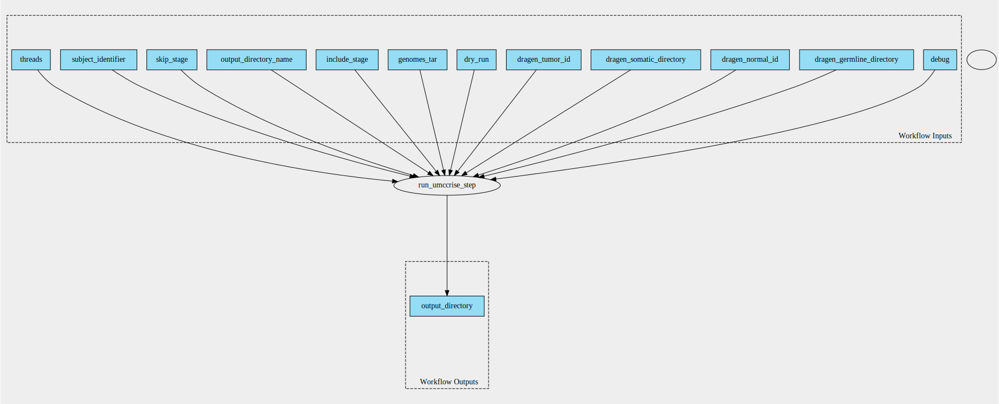

umccrise-pipeline 2.3.1--1 workflow
===================================

## Table of Contents
  
- [Overview](#umccrise-pipeline-v231--1-overview)  
- [Visual](#visual-workflow-overview)  
- [Links](#related-links)  
- [Inputs](#umccrise-pipeline-v231--1-inputs)  
- [Steps](#umccrise-pipeline-v231--1-steps)  
- [Outputs](#umccrise-pipeline-v231--1-outputs)  
- [ICA](#ica)  

## umccrise-pipeline v(2.3.1--1) Overview

  
> ID: umccrise-pipeline--2.3.1--1  
> md5sum: ba2ca49c6340460f6e339c3f48baffaf

### umccrise-pipeline v(2.3.1--1) documentation
  
Documentation for umccrise-pipeline v2.3.1--1

### Categories
  

## Visual Workflow Overview
  

## Related Links
  
- [CWL File Path](../../../../../../workflows/umccrise-pipeline/2.3.1--1/umccrise-pipeline__2.3.1--1.cwl)  

### Uses
  
- [umccrise 2.3.1--1](../../../tools/umccrise/2.3.1--1/umccrise__2.3.1--1.md)  

  

## umccrise-pipeline v(2.3.1--1) Inputs

### debug

  
> ID: debug
  
**Optional:** `True`  
**Type:** `boolean`  
**Docs:**  
Copy workspace to output directory if workflow fails

### dragen germline directory

  
> ID: dragen_germline_directory
  
**Optional:** `False`  
**Type:** `Directory`  
**Docs:**  
The dragen germline directory

### dragen normal id

  
> ID: dragen_normal_id
  
**Optional:** `True`  
**Type:** `string`  
**Docs:**  
The name of the dragen normal sample

### dragen somatic directory

  
> ID: dragen_somatic_directory
  
**Optional:** `False`  
**Type:** `Directory`  
**Docs:**  
The dragen somatic directory

### dragen tumor id

  
> ID: dragen_tumor_id
  
**Optional:** `True`  
**Type:** `string`  
**Docs:**  
The name of the dragen tumor sample

### dry run

  
> ID: dry_run
  
**Optional:** `True`  
**Type:** `boolean`  
**Docs:**  
Prints rules and commands to be run without actually executing them

### genomes tar

  
> ID: genomes_tar
  
**Optional:** `False`  
**Type:** `File`  
**Docs:**  
The reference umccrise tarball

### include stage

  
> ID: include_stage
  
**Optional:** `True`  
**Type:** `.[]`  
**Docs:**  
Optionally, specify stage(s) to run

### output directory name

  
> ID: output_directory_name
  
**Optional:** `False`  
**Type:** `string`  
**Docs:**  
The name of the output directory

### skip stage

  
> ID: skip_stage
  
**Optional:** `True`  
**Type:** `.[]`  
**Docs:**  
Runs all default stage(s) excluding the one selected

### subject identifier

  
> ID: subject_identifier
  
**Optional:** `False`  
**Type:** `string`  
**Docs:**  
The subject ID (used to name output files)

### threads

  
> ID: threads
  
**Optional:** `True`  
**Type:** `int`  
**Docs:**  
Number of threads to use

  

## umccrise-pipeline v(2.3.1--1) Steps

### run umccrise step

  
> ID: umccrise-pipeline--2.3.1--1/run_umccrise_step
  
**Step Type:** tool  
**Docs:**
  
Run the UMCCRise pipeline

#### Links
  
[CWL File Path](../../../../../../tools/umccrise/2.3.1--1/umccrise__2.3.1--1.cwl)  
[CWL File Help Page](../../../tools/umccrise/2.3.1--1/umccrise__2.3.1--1.md)  

## umccrise-pipeline v(2.3.1--1) Outputs

### output directory

  
> ID: umccrise-pipeline--2.3.1--1/output_directory  

  
**Optional:** `False`  
**Output Type:** `Directory`  
**Docs:**  
The output directory containing the results of the umccrise pipeline
  

  

