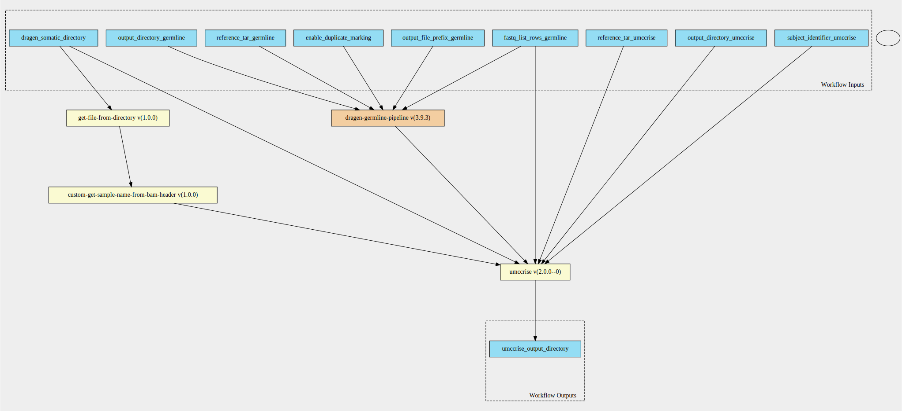
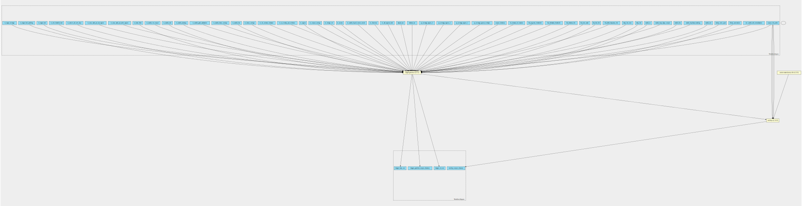

umccrise-with-dragen-germline-pipeline 2.0.0--3.9.3 workflow
============================================================

## Table of Contents
  
- [Overview](#umccrise-with-dragen-germline-pipeline-v200--393-overview)  
- [Visual](#visual-workflow-overview)  
- [Links](#related-links)  
- [Inputs](#umccrise-with-dragen-germline-pipeline-v200--393-inputs)  
- [Steps](#umccrise-with-dragen-germline-pipeline-v200--393-steps)  
- [Outputs](#umccrise-with-dragen-germline-pipeline-v200--393-outputs)  
- [ICA](#ica)  

## umccrise-with-dragen-germline-pipeline v(2.0.0--3.9.3) Overview

  
> ID: umccrise-with-dragen-germline-pipeline--2.0.0--3.9.3  
> md5sum: 2e6c4c1d830b59538471dfb77e09ec1c

### umccrise-with-dragen-germline-pipeline v(2.0.0--3.9.3) documentation
  
Run UMCCRise on a dragen-somatic output, but run germline on the normal fastqs first.
This means the inputs of this pipeline are:
1. Fastq list rows of the germline samples
2. An output directory from the dragen-somatic pipeline

3. Any additional umccrise parameters
4. Any additional germline parameters

### Categories
  

## Visual Workflow Overview
  

## Related Links
  
- [CWL File Path](../../../../../../workflows/umccrise-with-dragen-germline-pipeline/2.0.0--3.9.3/umccrise-with-dragen-germline-pipeline__2.0.0--3.9.3.cwl)  

### Uses
  
- [dragen-germline-pipeline 3.9.3](../../dragen-germline-pipeline/3.9.3/dragen-germline-pipeline__3.9.3.md)  
- [umccrise 2.0.0--0 :construction:](../../../tools/umccrise/2.0.0--0/umccrise__2.0.0--0.md)  

  

## umccrise-with-dragen-germline-pipeline v(2.0.0--3.9.3) Inputs

### dragen somatic directory

  
> ID: dragen_somatic_directory
  
**Optional:** `False`  
**Type:** `Directory`  
**Docs:**  
The output from the dragen somatic workflow

### fastq list rows germline

  
> ID: fastq_list_rows_germline
  
**Optional:** `False`  
**Type:** `fastq-list-row[]`  
**Docs:**  
The row of fastq lists.
Each row has the following attributes:
  * RGID
  * RGLB
  * RGSM
  * Lane
  * Read1File
  * Read2File (optional)

### output directory germline

  
> ID: output_directory_germline
  
**Optional:** `False`  
**Type:** `string`  
**Docs:**  
The directory where all output files are placed

### output directory umccrise

  
> ID: output_directory_umccrise
  
**Optional:** `False`  
**Type:** `string`  
**Docs:**  
The name of the output directory used for umccrise step

### output file prefix germline

  
> ID: output_file_prefix_germline
  
**Optional:** `False`  
**Type:** `string`  
**Docs:**  
The prefix given to all output files

### reference tar germline

  
> ID: reference_tar_germline
  
**Optional:** `False`  
**Type:** `File`  
**Docs:**  
Path to ref data tarball

### reference tar umccrise

  
> ID: reference_tar_umccrise
  
**Optional:** `False`  
**Type:** `File`  
**Docs:**  
The reference tar ball for umccrise

### subject identifier umccrise

  
> ID: subject_identifier_umccrise
  
**Optional:** `False`  
**Type:** `string`  
**Docs:**  
The subject identifier for umccrise to use on output files

  

## umccrise-with-dragen-germline-pipeline v(2.0.0--3.9.3) Steps

### run dragen germline step

  
> ID: umccrise-with-dragen-germline-pipeline--2.0.0--3.9.3/run_dragen_germline_pipeline_step
  
**Step Type:** workflow  
**Docs:**
  
Run the dragen germline workflow against the normal fastq.

#### Links
  
[CWL File Path](../../../../../../workflows/dragen-germline-pipeline/3.9.3/dragen-germline-pipeline__3.9.3.cwl)  
[CWL File Help Page](../../dragen-germline-pipeline/3.9.3/dragen-germline-pipeline__3.9.3.md)
#### Subworkflow overview
  
  

### run umccrise pipeline step

  
> ID: umccrise-with-dragen-germline-pipeline--2.0.0--3.9.3/run_umccrise_pipeline_step
  
**Step Type:** tool  
**Docs:**
  
Run the umccrise pipeline using the input somatic directory and output from the dragen germline step

#### Links
  
[CWL File Path](../../../../../../tools/umccrise/2.0.0--0/umccrise__2.0.0--0.cwl)  
[CWL File Help Page :construction:](../../../tools/umccrise/2.0.0--0/umccrise__2.0.0--0.md)  

## umccrise-with-dragen-germline-pipeline v(2.0.0--3.9.3) Outputs

### umccrise output directory

  
> ID: umccrise-with-dragen-germline-pipeline--2.0.0--3.9.3/umccrise_output_directory  

  
**Optional:** `False`  
**Output Type:** `Directory`  
**Docs:**  
The output directory containing all umccrise output files
  

  

## ICA

### ToC
  
- [development_workflows](#project-development_workflows)  

### Project: development_workflows

> wfl id: wfl.e4cd73b0e6e941b3b48afe03a7b5dc43  

  
**workflow name:** umccrise-with-dragen-germline-pipeline_dev-wf  
**wfl version name:** 2.0.0--3.9.3  

  

