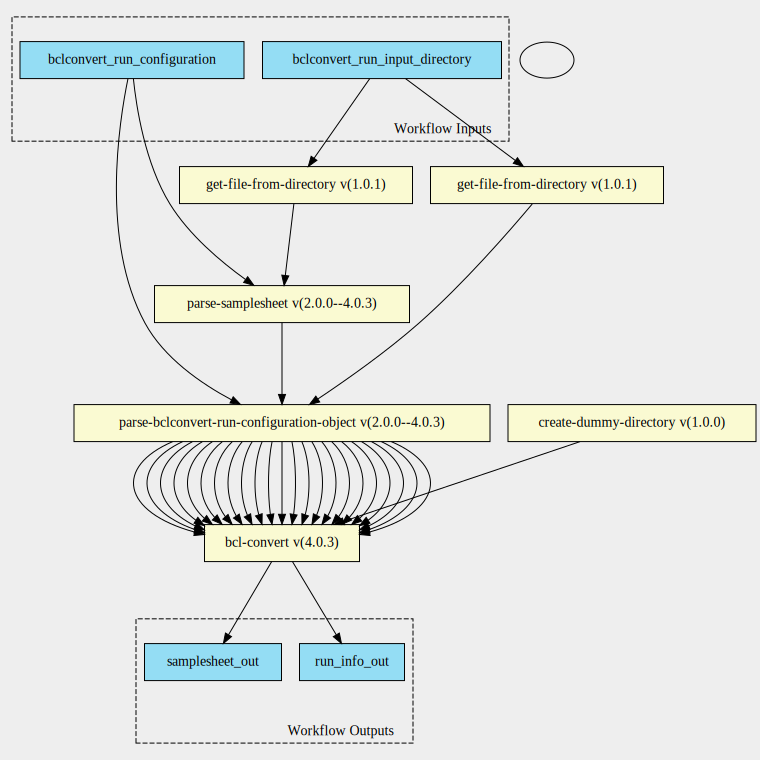

validate-bclconvert-samplesheet 4.0.3 workflow
==============================================

## Table of Contents
  
- [Overview](#validate-bclconvert-samplesheet-v403-overview)  
- [Visual](#visual-workflow-overview)  
- [Links](#related-links)  
- [Inputs](#validate-bclconvert-samplesheet-v403-inputs)  
- [Steps](#validate-bclconvert-samplesheet-v403-steps)  
- [Outputs](#validate-bclconvert-samplesheet-v403-outputs)  
- [ICA](#ica)  

## validate-bclconvert-samplesheet v(4.0.3) Overview

  
> ID: validate-bclconvert-samplesheet--4.0.3  
> md5sum: e7c8258844e007dcfd34d361bf54c13c

### validate-bclconvert-samplesheet v(4.0.3) documentation
  
Documentation for validate-bclconvert-samplesheet v4.0.3

### Categories
  

## Visual Workflow Overview
  

## Related Links
  
- [CWL File Path](../../../../../../workflows/validate-bclconvert-samplesheet/4.0.3/validate-bclconvert-samplesheet__4.0.3.cwl)  

### Uses
  
- [bcl-convert 4.0.3](../../../tools/bcl-convert/4.0.3/bcl-convert__4.0.3.md)  
- [create-dummy-directory 1.0.0 :construction:](../../../tools/create-dummy-directory/1.0.0/create-dummy-directory__1.0.0.md)  
- [parse-bclconvert-run-configuration-object 2.0.0--4.0.3 :construction:](../../../expressions/parse-bclconvert-run-configuration-object/2.0.0--4.0.3/parse-bclconvert-run-configuration-object__2.0.0--4.0.3.md)  
- [get-file-from-directory 1.0.1 :construction:](../../../expressions/get-file-from-directory/1.0.1/get-file-from-directory__1.0.1.md)  
- [get-file-from-directory 1.0.1 :construction:](../../../expressions/get-file-from-directory/1.0.1/get-file-from-directory__1.0.1.md)  
- [parse-samplesheet 2.0.0--4.0.3 :construction:](../../../expressions/parse-samplesheet/2.0.0--4.0.3/parse-samplesheet__2.0.0--4.0.3.md)  

### Used By
  
- [bclconvert-scatter 4.0.3](../../bclconvert-scatter/4.0.3/bclconvert-scatter__4.0.3.md)  

  

## validate-bclconvert-samplesheet v(4.0.3) Inputs

### bclconvert run configuration

  
> ID: bclconvert_run_configuration
  
**Optional:** `False`  
**Type:** `file:///home/runner/work/cwl-ica/cwl-ica/schemas/bclconvert-run-configuration/2.0.0--4.0.3/bclconvert-run-configuration__2.0.0--4.0.3.yaml#bclconvert-run-configuration`  
**Docs:**  
The BCLConvert run configuration

### bclconvert run input directory

  
> ID: bclconvert_run_input_directory
  
**Optional:** `False`  
**Type:** `Directory`  
**Docs:**  
The input directory for BCLConvert

  

## validate-bclconvert-samplesheet v(4.0.3) Steps

### bcl convert samplesheet check step

  
> ID: validate-bclconvert-samplesheet--4.0.3/bcl_convert_samplesheet_check_step
  
**Step Type:** tool  
**Docs:**
  
Run BCLConvert with the --bcl-validate-sample-sheet-only parameter set to true

#### Links
  
[CWL File Path](../../../../../../tools/bcl-convert/4.0.3/bcl-convert__4.0.3.cwl)  
[CWL File Help Page](../../../tools/bcl-convert/4.0.3/bcl-convert__4.0.3.md)  

### create dummy directory step

  
> ID: validate-bclconvert-samplesheet--4.0.3/create_dummy_directory_step
  
**Step Type:** tool  
**Docs:**
  
Create a fake directory for the bclconvert run input directory

#### Links
  
[CWL File Path](../../../../../../tools/create-dummy-directory/1.0.0/create-dummy-directory__1.0.0.cwl)  
[CWL File Help Page :construction:](../../../tools/create-dummy-directory/1.0.0/create-dummy-directory__1.0.0.md)  

### get bclconvert run configuration object step

  
> ID: validate-bclconvert-samplesheet--4.0.3/get_bcl_convert_run_configuration_object_step
  
**Step Type:** expression  
**Docs:**
  
Get bcl convert run configuration object step for samplesheet validation.  
This means that the bcl_validate_sample_sheet_only is set to true and we
have the run_info and samplesheet parameters set

#### Links
  
[CWL File Path](../../../../../../expressions/parse-bclconvert-run-configuration-object/2.0.0--4.0.3/parse-bclconvert-run-configuration-object__2.0.0--4.0.3.cwl)  
[CWL File Help Page :construction:](../../../expressions/parse-bclconvert-run-configuration-object/2.0.0--4.0.3/parse-bclconvert-run-configuration-object__2.0.0--4.0.3.md)  

### get run info file from directory expression step

  
> ID: validate-bclconvert-samplesheet--4.0.3/get_run_info_file_from_directory_expression_step
  
**Step Type:** expression  
**Docs:**
  
Get the run info file from the bclconvert run input directory

#### Links
  
[CWL File Path](../../../../../../expressions/get-file-from-directory/1.0.1/get-file-from-directory__1.0.1.cwl)  
[CWL File Help Page :construction:](../../../expressions/get-file-from-directory/1.0.1/get-file-from-directory__1.0.1.md)  

### get samplesheet file from directory expression step

  
> ID: validate-bclconvert-samplesheet--4.0.3/get_samplesheet_file_from_directory_expression_step
  
**Step Type:** expression  
**Docs:**
  
Samplesheet may be left blank, in which case we need to extract it from the bclconvert directory

#### Links
  
[CWL File Path](../../../../../../expressions/get-file-from-directory/1.0.1/get-file-from-directory__1.0.1.cwl)  
[CWL File Help Page :construction:](../../../expressions/get-file-from-directory/1.0.1/get-file-from-directory__1.0.1.md)  

### get samplesheet step

  
> ID: validate-bclconvert-samplesheet--4.0.3/get_samplesheet_step
  
**Step Type:** expression  
**Docs:**
  
Get samplesheet based on priority. If defined in bclconvert run configuration take that,
otherwise take the output from the previous step

#### Links
  
[CWL File Path](../../../../../../expressions/parse-samplesheet/2.0.0--4.0.3/parse-samplesheet__2.0.0--4.0.3.cwl)  
[CWL File Help Page :construction:](../../../expressions/parse-samplesheet/2.0.0--4.0.3/parse-samplesheet__2.0.0--4.0.3.md)  

## validate-bclconvert-samplesheet v(4.0.3) Outputs

### run info out

  
> ID: validate-bclconvert-samplesheet--4.0.3/run_info_out  

  
**Optional:** `False`  
**Output Type:** `File`  
**Docs:**  
Output runinfo file that's been validated
  

### samplesheet out

  
> ID: validate-bclconvert-samplesheet--4.0.3/samplesheet_out  

  
**Optional:** `False`  
**Output Type:** `File`  
**Docs:**  
Output samplesheet that's been validated
  

  

## ICA

### ToC
  
- [development_workflows](#project-development_workflows)  

### Project: development_workflows

> wfl id: wfl.ddee25fd0eff4b0c9954ccfd2e6c8499  

  
**workflow name:** validate-bclconvert-samplesheet_dev-wf  
**wfl version name:** 4.0.3  

  

